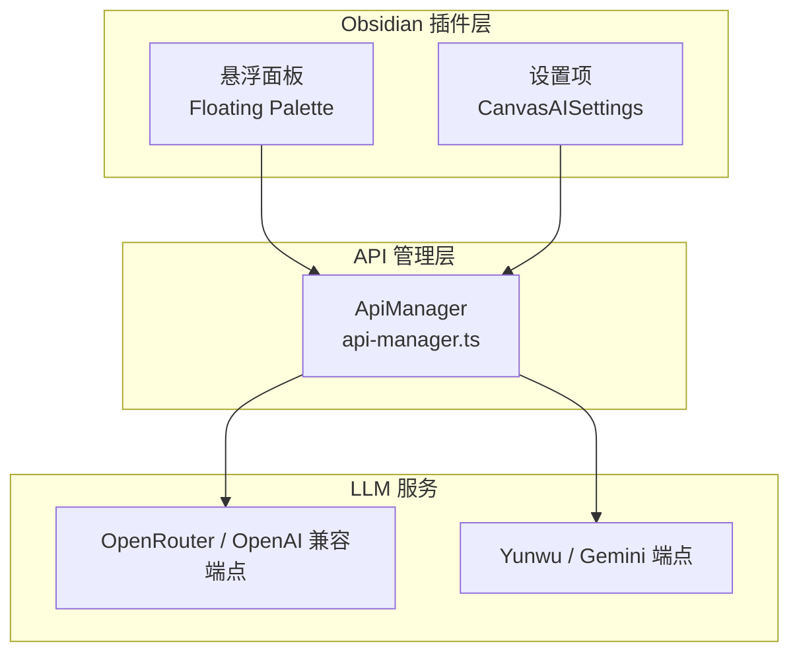
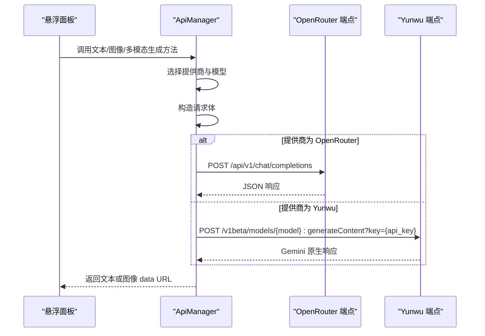
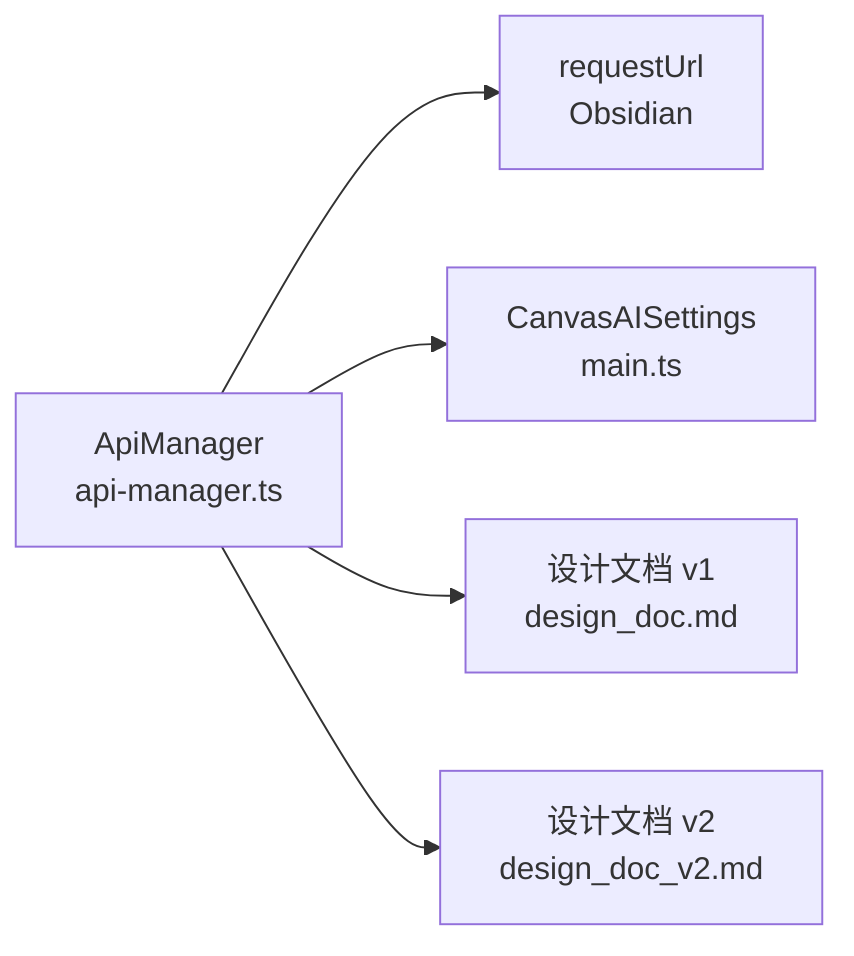

# API 参考

<cite>
**本文引用的文件**
- [api-manager.ts](file://api-manager.ts)
- [main.ts](file://main.ts)
- [docs/design_doc.md](file://docs/design_doc.md)
- [docs/design_doc_v2.md](file://docs/design_doc_v2.md)
- [docs/execution_guide.md](file://docs/execution_guide.md)
</cite>

## 目录
1. [简介](#简介)
2. [项目结构](#项目结构)
3. [核心组件](#核心组件)
4. [架构总览](#架构总览)
5. [详细组件分析](#详细组件分析)
6. [依赖分析](#依赖分析)
7. [性能考虑](#性能考虑)
8. [故障排查指南](#故障排查指南)
9. [结论](#结论)
10. [附录](#附录)

## 简介
本文件为 ObsidianCanvasAI 插件的 API 参考文档，聚焦于 api-manager.ts 模块对外暴露的公共接口，以及与 LLM 服务（OpenRouter 与 Yunwu）的 RESTful 集成方式。文档覆盖：
- HTTP 方法与端点
- 请求头与认证（API Key）
- 请求/响应 JSON Schema
- 多模态输入格式（尤其是 google/gemini-3-pro-image-preview 的 text 与 image_url）
- 错误码与处理策略（如 401、429）
- 场景化调用示例（文本生成、图像生成、多图组合）
- 性能优化与速率限制注意事项

## 项目结构
ObsidianCanvasAI 通过 ApiManager 统一封装与 LLM 服务的通信，支持 OpenRouter 与 Yunwu 两大提供商。主要文件与职责如下：
- api-manager.ts：对外暴露的 API 管理器，封装聊天、文本生成、图像生成、多模态聊天等方法，并负责 HTTP 请求发送与错误处理。
- main.ts：插件入口与设置项定义，包含 OpenRouter/Yunwu 的 API Key、Base URL、模型名称等配置。
- docs/design_doc.md 与 docs/design_doc_v2.md：设计文档，包含生图 Payload 示例与多模态输入规范。
- docs/execution_guide.md：执行指南，包含错误处理与日志建议。

图表来源
- [api-manager.ts](file://api-manager.ts#L136-L171)
- [main.ts](file://main.ts#L11-L83)

章节来源
- [api-manager.ts](file://api-manager.ts#L136-L171)
- [main.ts](file://main.ts#L11-L83)

## 核心组件
- ApiManager：统一的 API 管理器，负责：
  - 选择活跃提供商（OpenRouter 或 Yunwu）
  - 读取 API Key 与端点
  - 构造 OpenAI 兼容格式请求体
  - 发送 HTTP 请求（POST）
  - 解析响应并抛出错误
  - 提供文本生成、图像生成、多模态聊天等公共方法

章节来源
- [api-manager.ts](file://api-manager.ts#L71-L113)
- [api-manager.ts](file://api-manager.ts#L136-L171)
- [api-manager.ts](file://api-manager.ts#L149-L191)
- [api-manager.ts](file://api-manager.ts#L193-L275)
- [api-manager.ts](file://api-manager.ts#L277-L398)
- [api-manager.ts](file://api-manager.ts#L399-L571)
- [api-manager.ts](file://api-manager.ts#L573-L644)
- [api-manager.ts](file://api-manager.ts#L646-L678)

## 架构总览
ApiManager 的调用链路如下：
- 悬浮面板触发生成
- ApiManager 根据设置选择提供商与模型
- 构造 OpenAI 兼容请求体（或 Yunwu 原生格式）
- 发送 HTTP POST 请求
- 解析响应，返回文本或图像数据 URL

图表来源
- [api-manager.ts](file://api-manager.ts#L102-L112)
- [api-manager.ts](file://api-manager.ts#L646-L678)
- [api-manager.ts](file://api-manager.ts#L466-L495)

## 详细组件分析

### 1) 公共接口与方法
ApiManager 对外公开以下方法（按功能分类）：

- 文本生成
  - chatCompletion(prompt, systemPrompt?, temperature?): Promise<string>
  - 作用：发送聊天补全请求，返回助手回复文本
  - 关键点：支持可选 systemPrompt；温度参数可调

- 图像生成
  - generateImage(prompt, aspectRatio?, imageSize?, inputImages?): Promise<string>
  - 作用：基于文本与可选输入图片生成图像，返回 data URL
  - 关键点：支持多模态输入；可配置宽高比与分辨率

- 多图组合生图（角色标注）
  - generateImageWithRoles(instruction, imagesWithRoles, contextText?, aspectRatio?, resolution?): Promise<string>
  - 作用：按角色标注组织多张参考图，生成新图像
  - 关键点：OpenRouter 走 OpenAI 兼容格式；Yunwu 走 Gemini 原生格式

- 多模态聊天
  - multimodalChat(prompt, imageList, systemPrompt?, temperature?): Promise<string>
  - 作用：将文本与图片一起送入模型，返回文本回复

- 辅助
  - isConfigured(): boolean：检查 API Key 是否已配置
  - updateSettings(settings): void：更新运行时设置

章节来源
- [api-manager.ts](file://api-manager.ts#L149-L191)
- [api-manager.ts](file://api-manager.ts#L193-L275)
- [api-manager.ts](file://api-manager.ts#L277-L398)
- [api-manager.ts](file://api-manager.ts#L573-L644)
- [api-manager.ts](file://api-manager.ts#L136-L141)

### 2) HTTP 方法与端点
- OpenRouter
  - 端点：/api/v1/chat/completions
  - 方法：POST
  - 认证：Authorization: Bearer {api_key}
  - 请求体：OpenRouterRequest（见下节）

- Yunwu
  - 端点：/v1beta/models/{model}:generateContent?key={api_key}
  - 方法：POST
  - 认证：通过查询参数传入 API Key
  - 请求体：Gemini 原生 contents 数组与 generationConfig（见下节）

章节来源
- [api-manager.ts](file://api-manager.ts#L102-L112)
- [api-manager.ts](file://api-manager.ts#L466-L495)
- [api-manager.ts](file://api-manager.ts#L646-L678)

### 3) 请求头与认证
- OpenRouter
  - Authorization: Bearer {openRouterApiKey}
  - Content-Type: application/json
  - 其他头部：HTTP-Referer、X-Title（用于合规与标识）

- Yunwu
  - 通过查询参数传递 API Key
  - Content-Type: application/json

章节来源
- [api-manager.ts](file://api-manager.ts#L646-L678)
- [api-manager.ts](file://api-manager.ts#L466-L495)

### 4) 请求/响应 JSON Schema

- OpenRouterRequest（OpenAI 兼容）
  - 字段
    - model: string
    - messages: OpenRouterMessage[]
    - modalities?: ('text' | 'image')[]
    - image_config?: OpenRouterImageConfig
    - reasoning?: { enabled: boolean }
    - temperature?: number
  - OpenRouterMessage
    - role: 'user' | 'assistant' | 'system'
    - content: string | OpenRouterContentPart[]
  - OpenRouterContentPart
    - type: 'text' | 'image_url'
    - text?: string
    - image_url?: { url: string }
  - OpenRouterImageConfig
    - aspect_ratio?: '1:1' | '16:9' | '4:3' | '9:16'
    - image_size?: string

- OpenRouterResponse
  - id: string
  - model: string
  - choices: OpenRouterChoice[]
  - usage?: { prompt_tokens: number; completion_tokens: number; total_tokens: number }
  - error?: { message: string; type: string; code: string }
  - OpenRouterChoice
    - message: { role: string; content: string; images?: { image_url: { url: string } }[]; reasoning_details?: any }
    - finish_reason: string

- Yunwu（Gemini 原生）
  - 请求体要点
    - contents: [{ role: 'user', parts: [{ text?: string; inlineData?: { mimeType: string; data: string } }] }]
    - generationConfig.responseModalities: ['image']
    - generationConfig.imageConfig.aspectRatio/resolution（驼峰命名）
  - 响应体要点
    - candidates[0].content.parts[]：查找 inlineData 或 file_data.file_uri

章节来源
- [api-manager.ts](file://api-manager.ts#L11-L67)
- [api-manager.ts](file://api-manager.ts#L305-L374)
- [api-manager.ts](file://api-manager.ts#L400-L462)
- [api-manager.ts](file://api-manager.ts#L497-L536)
- [docs/design_doc.md](file://docs/design_doc.md#L150-L185)
- [docs/design_doc_v2.md](file://docs/design_doc_v2.md#L300-L336)

### 5) 多模态输入格式详解（google/gemini-3-pro-image-preview）
- OpenRouter/OpenAI 兼容格式
  - 使用 OpenRouterMessage.content 为数组，元素类型为 text 或 image_url
  - image_url.url 支持 data:image/...;base64,... 或外部 URL
  - 可通过 image_config 指定 aspect_ratio 与 image_size

- Gemini 原生格式（Yunwu）
  - contents[0].parts 交替包含 text 与 inlineData
  - generationConfig.imageConfig.aspectRatio/resolution（驼峰命名）

- 设计文档示例
  - 生图 Payload（OpenRouter 兼容）包含 text 与多个 image_url
  - 说明：具体字段名（image_url vs inline_data）取决于所用接口

章节来源
- [api-manager.ts](file://api-manager.ts#L193-L275)
- [api-manager.ts](file://api-manager.ts#L305-L398)
- [api-manager.ts](file://api-manager.ts#L400-L462)
- [docs/design_doc.md](file://docs/design_doc.md#L150-L185)
- [docs/design_doc_v2.md](file://docs/design_doc_v2.md#L300-L336)

### 6) 错误码与处理策略
- HTTP 状态码
  - 401 未授权：API Key 缺失或无效
  - 429 速率限制：请求过于频繁
  - 5xx 服务器错误：服务不可用

- 处理策略
  - ApiManager.sendRequest 与 Yunwu 分支均捕获 error.status 并抛出带状态码的错误
  - 插件侧建议：在 UI 中展示错误信息，提供重试按钮；必要时引导用户前往设置页补充 Key

章节来源
- [api-manager.ts](file://api-manager.ts#L487-L494)
- [api-manager.ts](file://api-manager.ts#L669-L676)
- [docs/execution_guide.md](file://docs/execution_guide.md#L227-L235)

### 7) 客户端调用示例（场景化）
以下为典型调用场景与建议流程（不包含具体代码，仅说明参数与顺序）：

- 文本生成（聊天）
  - 步骤：准备 prompt 与可选 systemPrompt；调用 chatCompletion；接收字符串回复
  - 关键参数：temperature（可选）

- 图像生成（文生图）
  - 步骤：准备 prompt；可选指定 aspectRatio 与 imageSize；调用 generateImage；接收 data URL
  - 注意：若模型拒绝生成，将抛出错误

- 图像生成（多图组合）
  - 步骤：准备 instruction；准备 imagesWithRoles（含 base64、mimeType、role）；可选 contextText；可选 aspectRatio/resolution；调用 generateImageWithRoles；接收 data URL
  - 注意：OpenRouter 走 OpenAI 兼容格式；Yunwu 走 Gemini 原生格式

- 多模态聊天（图文混合）
  - 步骤：准备 prompt；准备 imageList（base64、mimeType）；可选 systemPrompt；调用 multimodalChat；接收字符串回复

章节来源
- [api-manager.ts](file://api-manager.ts#L149-L191)
- [api-manager.ts](file://api-manager.ts#L193-L275)
- [api-manager.ts](file://api-manager.ts#L277-L398)
- [api-manager.ts](file://api-manager.ts#L573-L644)

### 8) 认证方法（API Key）
- OpenRouter
  - 在设置中配置 openRouterApiKey
  - ApiManager 从 settings 读取并注入 Authorization: Bearer

- Yunwu
  - 在设置中配置 yunwuApiKey
  - 通过查询参数传递 API Key

章节来源
- [main.ts](file://main.ts#L11-L83)
- [api-manager.ts](file://api-manager.ts#L92-L100)
- [api-manager.ts](file://api-manager.ts#L466-L470)

## 依赖分析
- ApiManager 依赖 Obsidian 的 requestUrl 发送 HTTP 请求
- ApiManager 依赖 CanvasAISettings 提供提供商、模型、Base URL、API Key 等配置
- 设计文档提供多模态输入规范与生图 Payload 示例

图表来源
- [api-manager.ts](file://api-manager.ts#L646-L678)
- [main.ts](file://main.ts#L11-L83)
- [docs/design_doc.md](file://docs/design_doc.md#L150-L185)
- [docs/design_doc_v2.md](file://docs/design_doc_v2.md#L300-L336)

章节来源
- [api-manager.ts](file://api-manager.ts#L646-L678)
- [main.ts](file://main.ts#L11-L83)

## 性能考虑
- 速率限制与重试
  - 遇到 429 时，建议在 UI 中提示用户稍后再试，并记录重试次数上限
  - 可在插件层增加指数退避重试策略（由调用方实现）

- 图像输入优化
  - 在本地对大图进行压缩，避免 Base64 过大导致请求失败或超时
  - 设计文档建议对 >4096px 的图片进行缩放

- 请求体精简
  - 仅包含必要的 text 与 image_url
  - 使用 image_config 指定宽高比与分辨率，减少模型额外推理成本

- 并发与队列
  - 插件侧建议使用任务队列管理并发请求，避免 UI 阻塞

章节来源
- [docs/design_doc_v2.md](file://docs/design_doc_v2.md#L244-L270)
- [docs/execution_guide.md](file://docs/execution_guide.md#L227-L235)

## 故障排查指南
- 401 未授权
  - 检查设置中的 API Key 是否正确配置
  - 确认提供商选择与 Base URL 是否匹配

- 429 速率限制
  - 降低请求频率，或增加重试间隔
  - 在 UI 中提示用户等待

- 5xx 服务器错误
  - 稍后重试；检查提供商端点可用性

- 图像生成失败
  - 检查输入图片数量与大小是否超出限制
  - 确认 instruction 与 role 标注是否清晰

章节来源
- [api-manager.ts](file://api-manager.ts#L487-L494)
- [api-manager.ts](file://api-manager.ts#L669-L676)
- [docs/design_doc_v2.md](file://docs/design_doc_v2.md#L244-L270)

## 结论
ApiManager 为 ObsidianCanvasAI 提供了统一、可扩展的 LLM 服务接入层，支持 OpenRouter 与 Yunwu，并兼容 OpenAI 兼容格式与 Gemini 原生格式。通过明确的 JSON Schema、完善的错误处理与性能建议，开发者可在不同场景下可靠地调用文本生成、图像生成与多模态聊天能力。

## 附录

### A. 设置项（CanvasAISettings）
- OpenRouter
  - openRouterApiKey、openRouterBaseUrl、openRouterTextModel、openRouterImageModel、openRouterUseCustomTextModel、openRouterUseCustomImageModel
- Yunwu
  - yunwuApiKey、yunwuBaseUrl、yunwuTextModel、yunwuImageModel、yunwuUseCustomTextModel、yunwuUseCustomImageModel
- 其他
  - imageCompressionQuality、imageMaxSize、defaultAspectRatio、defaultResolution、defaultChatTemperature、debugMode、imageSystemPrompt、chatPresets、imagePresets

章节来源
- [main.ts](file://main.ts#L11-L83)

### B. 设计文档要点索引
- 生图 Payload（OpenRouter 兼容）示例
- 多模态输入（text 与 image_url）
- 多图组合生图（角色标注）

章节来源
- [docs/design_doc.md](file://docs/design_doc.md#L150-L185)
- [docs/design_doc_v2.md](file://docs/design_doc_v2.md#L300-L336)