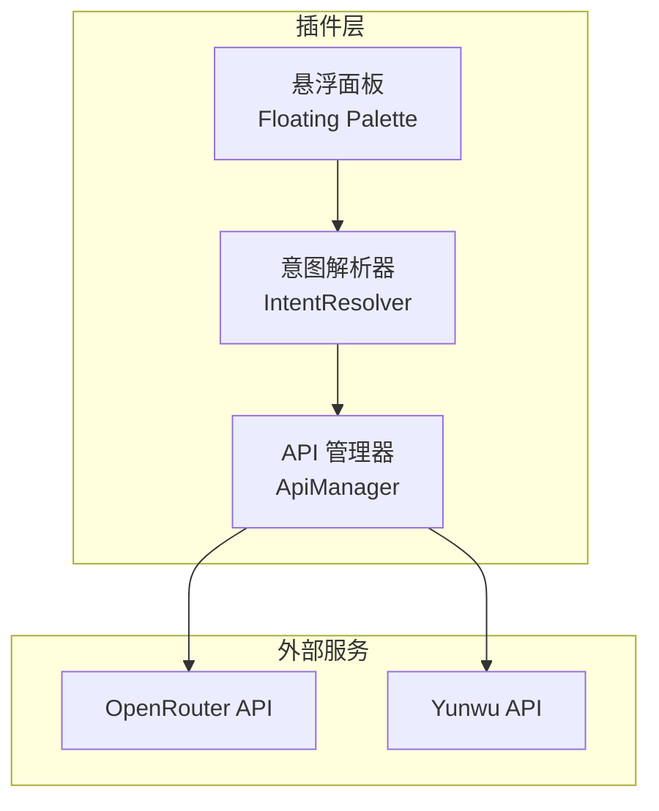
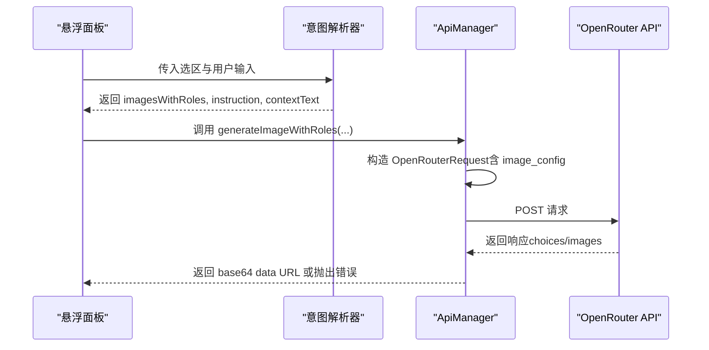
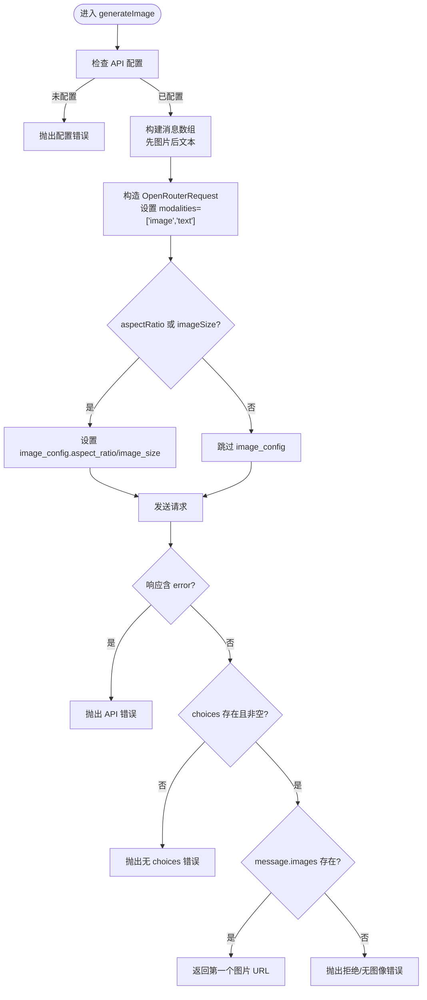
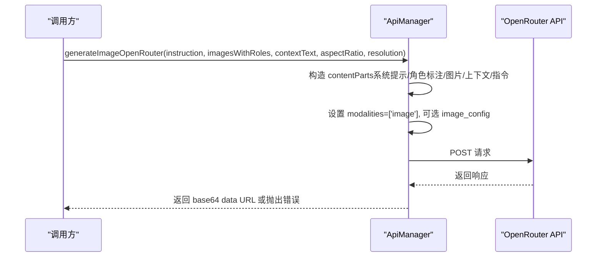
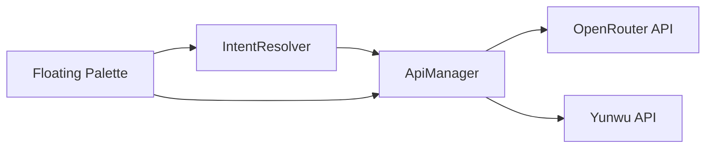

# OpenRouter 图像生成

<cite>
**本文引用的文件**
- [api-manager.ts](file://api-manager.ts)
- [design_doc_v2.md](file://docs/design_doc_v2.md)
- [design_doc.md](file://docs/design_doc.md)
- [intent-resolver.ts](file://intent-resolver.ts)
- [main.ts](file://main.ts)
</cite>

## 目录
1. [简介](#简介)
2. [项目结构](#项目结构)
3. [核心组件](#核心组件)
4. [架构总览](#架构总览)
5. [详细组件分析](#详细组件分析)
6. [依赖关系分析](#依赖关系分析)
7. [性能考量](#性能考量)
8. [故障排查指南](#故障排查指南)
9. [结论](#结论)
10. [附录](#附录)

## 简介
本文件面向 ObsidianCanvasAI 插件中基于 OpenRouter 兼容接口的图像生成功能，聚焦于 ApiManager 类中的 generateImage 与 generateImageOpenRouter 方法，系统性阐述其请求体构造机制、OpenRouterRequest 类型字段语义、aspect_ratio 与 image_size 的差异与应用、角色标注（[Ref: role_name]）在请求中的组织方式，以及如何通过 resolution 控制输出质量。同时结合设计文档示例，给出文生图、图生图与多图组合生成的客户端调用路径与最佳实践，并记录常见错误响应（如安全过滤器拦截）及其处理策略。

## 项目结构
围绕图像生成的关键文件与职责如下：
- api-manager.ts：封装 OpenRouter/Yunwu API 的请求与响应解析，提供 generateImage 与 generateImageOpenRouter 等方法。
- design_doc_v2.md：定义多模态上下文与角色标注的 Payload 结构与工作流。
- design_doc.md：提供早期示例与参数说明，包括 aspect_ratio 的使用建议。
- intent-resolver.ts：从 Canvas 选区解析出带角色的图片集合与指令，为生成请求提供上下文。
- main.ts：插件主流程，负责 UI 交互与调用 ApiManager 的生成方法。

**图表来源**
- [api-manager.ts](file://api-manager.ts#L1-L120)
- [intent-resolver.ts](file://intent-resolver.ts#L1-L120)
- [main.ts](file://main.ts#L1100-L1140)

**章节来源**
- [api-manager.ts](file://api-manager.ts#L1-L120)
- [intent-resolver.ts](file://intent-resolver.ts#L1-L120)
- [main.ts](file://main.ts#L1100-L1140)

## 核心组件
- OpenRouterRequest 类型与字段
  - model：指定模型名称（例如 google/gemini-2.0-flash-001 或 google/gemini-3-pro-image-preview）。
  - messages：消息数组，OpenRouterMessage[]，每条消息包含 role 与 content（支持 text 与 image_url 两种内容部件）。
  - modalities：输出模态，如 ['image'] 或 ['image','text']，用于明确期望输出类型。
  - image_config：图像配置对象，包含 aspect_ratio 与 image_size。
  - temperature：采样温度（聊天/文本类接口常用）。
- OpenRouterMessage 与 OpenRouterContentPart
  - OpenRouterMessage：role 为 user/system/assistant，content 可为字符串或 OpenRouterContentPart[]。
  - OpenRouterContentPart：type 为 text 或 image_url；image_url.url 支持 data URI（base64）或远程 URL。
- OpenRouterImageConfig
  - aspect_ratio：图像宽高比，如 '1:1'、'16:9'、'4:3'、'9:16' 等。
  - image_size：图像尺寸字符串，如 '1K'、'2K'、'4K'（不同提供商可能支持不同枚举）。

**章节来源**
- [api-manager.ts](file://api-manager.ts#L11-L67)

## 架构总览
图像生成的整体流程：
- UI 层收集用户输入与 Canvas 选区上下文。
- 意图解析器将选区转换为带角色的图片集合与指令文本。
- ApiManager 构造 OpenRouterRequest，按 provider 选择端点与模型，发送请求。
- 解析响应，返回 base64 data URL 或抛出错误。

**图表来源**
- [intent-resolver.ts](file://intent-resolver.ts#L63-L130)
- [api-manager.ts](file://api-manager.ts#L287-L398)
- [main.ts](file://main.ts#L1119-L1129)

**章节来源**
- [intent-resolver.ts](file://intent-resolver.ts#L63-L130)
- [api-manager.ts](file://api-manager.ts#L287-L398)
- [main.ts](file://main.ts#L1119-L1129)

## 详细组件分析

### OpenRouterRequest 类型与字段语义
- model：决定使用的模型与能力集。
- messages：用户输入内容以 OpenRouterContentPart[] 形式组织，支持 text 与 image_url 交替。
- modalities：当设置为 ['image'] 时，明确要求模型仅输出图像，有助于提升成功率与一致性。
- image_config：
  - aspect_ratio：用于约束输出宽高比。
  - image_size：用于控制输出分辨率等级（如 '1K'、'2K'、'4K'）。
- temperature：聊天/文本类接口的采样参数。

**章节来源**
- [api-manager.ts](file://api-manager.ts#L11-L67)

### generateImage 方法（文生图/图生图）
- 输入参数
  - prompt：文本提示词。
  - aspectRatio：可选，OpenRouter 标准接口限定枚举值（如 '1:1'、'16:9'、'4:3'、'9:16'）。
  - imageSize：可选，OpenRouter 标准接口的 image_size 字段（如 '1024x1024'）。
  - inputImages：可选，Base64 图像数组，用于图生图或多图组合。
- 请求体构造要点
  - 将 inputImages 顺序转换为 image_url 内容部件，再追加 text 内容部件（prompt）。
  - 设置 modalities 为 ['image','text']，表明期望图像+文本输出。
  - 若提供了 aspectRatio 或 imageSize，则填充 image_config。
- 响应解析
  - 优先检查 message.images 是否存在；若不存在，抛出错误并回退到 message.content 作为提示信息。

**图表来源**
- [api-manager.ts](file://api-manager.ts#L193-L275)

**章节来源**
- [api-manager.ts](file://api-manager.ts#L193-L275)

### generateImageOpenRouter 方法（多图组合与角色标注）
- 输入参数
  - instruction：主要指令文本。
  - imagesWithRoles：带角色的图片数组，元素包含 base64、mimeType、role。
  - contextText：可选的上下文文本。
  - aspectRatio：可选，支持扩展比例字符串。
  - resolution：可选，如 '1K'、'2K'、'4K'，映射到 image_config.image_size。
- 请求体构造要点
  - contentParts 顺序：系统提示（来自 settings.imageSystemPrompt）→ [Ref: role] 文本 → image_url → [Context] 文本（可选）→ INSTRUCTION 文本。
  - 设置 modalities 为 ['image']，明确仅请求图像输出。
  - 若提供了 aspectRatio 或 resolution，则填充 image_config。
- 响应解析
  - 优先检查 message.images；若不存在，抛出错误并回退到 message.content。

**图表来源**
- [api-manager.ts](file://api-manager.ts#L305-L398)

**章节来源**
- [api-manager.ts](file://api-manager.ts#L305-L398)

### 角色标注与多图组合（[Ref: role_name]）
- 角色标注以文本部件形式插入在对应图片之前，格式为 "[Ref: 角色名]"，用于向模型传达该图片的用途（如风格参考、构图参考等）。
- 设计文档示例展示了将多张参考图与角色标签组合为有效的请求内容，角色标签以 "[Ref: role_name]" 文本形式插入，随后紧跟该图片的 image_url 内容部件。
- 意图解析器会基于 Canvas 的连线与分组信息为每张图片分配角色，形成 imagesWithRoles 列表，供 generateImageOpenRouter 使用。

**章节来源**
- [design_doc_v2.md](file://docs/design_doc_v2.md#L300-L336)
- [intent-resolver.ts](file://intent-resolver.ts#L201-L280)

### aspect_ratio 与 image_size 的区别与应用
- aspect_ratio
  - 作用：约束输出图像的宽高比，如 '1:1'、'16:9'、'4:3'、'9:16' 等。
  - OpenRouter 标准接口中，aspect_ratio 由 OpenRouterImageConfig 提供。
  - 设计文档建议在 Prompt 中追加宽高比描述，但 OpenRouter 接口更推荐通过 image_config.aspect_ratio 显式传递。
- image_size
  - 作用：控制输出分辨率等级，如 '1K'、'2K'、'4K'。
  - OpenRouter 标准接口中，image_size 由 OpenRouterImageConfig 提供。
  - Yunwu/Gemini 原生接口使用 imageSize（驼峰命名），但 OpenRouter 兼容接口统一使用 image_config.image_size。
- 实践建议
  - 若仅需固定比例，优先设置 aspect_ratio。
  - 若需要控制分辨率等级，设置 resolution（映射到 image_config.image_size）。
  - 两者可同时设置，但需确认目标模型与提供商的支持情况。

**章节来源**
- [api-manager.ts](file://api-manager.ts#L240-L248)
- [api-manager.ts](file://api-manager.ts#L365-L373)
- [design_doc.md](file://docs/design_doc.md#L43-L45)

### 客户端调用示例（路径级说明）
- 文生图
  - 调用路径：悬浮面板 → IntentResolver.resolve → ApiManager.generateImage
  - 关键点：传入 prompt，可选 aspectRatio 与 imageSize；modalities 为 ['image','text']。
- 图生图
  - 调用路径：悬浮面板 → IntentResolver.resolve → ApiManager.generateImage
  - 关键点：传入 inputImages（Base64 数组）与 prompt；modalities 为 ['image','text']。
- 多图组合生成
  - 调用路径：悬浮面板 → IntentResolver.resolve → ApiManager.generateImageWithRoles
  - 关键点：imagesWithRoles 包含 role 与 Base64；contentParts 顺序为系统提示 → [Ref: role] → image_url → [Context] → INSTRUCTION；modalities 为 ['image']；可选 aspectRatio 与 resolution。

**章节来源**
- [main.ts](file://main.ts#L1119-L1129)
- [intent-resolver.ts](file://intent-resolver.ts#L63-L130)
- [api-manager.ts](file://api-manager.ts#L193-L275)
- [api-manager.ts](file://api-manager.ts#L287-L398)

## 依赖关系分析
- ApiManager 依赖
  - CanvasAISettings：提供 API Provider、模型名称、系统提示词、默认参数等。
  - Obsidian requestUrl：用于发送 HTTP 请求。
- IntentResolver 依赖
  - CanvasConverter：将 Canvas 节点转换为 Markdown/Mermaid/Base64。
  - Obsidian App：读取文件内容与图片。
- main.ts 依赖
  - Floating Palette UI：收集用户输入与参数。
  - ApiManager：发起图像生成请求。

**图表来源**
- [intent-resolver.ts](file://intent-resolver.ts#L1-L120)
- [api-manager.ts](file://api-manager.ts#L1-L120)
- [main.ts](file://main.ts#L1100-L1140)

**章节来源**
- [intent-resolver.ts](file://intent-resolver.ts#L1-L120)
- [api-manager.ts](file://api-manager.ts#L1-L120)
- [main.ts](file://main.ts#L1100-L1140)

## 性能考量
- 图片数量限制：IntentResolver 对图片数量进行上限控制（默认 14 张），避免超出模型限制导致失败。
- 图片压缩：在读取图片前进行压缩，降低 Base64 体积，提高请求成功率与速度。
- 并发与异步：插件使用异步任务队列管理请求，避免 UI 阻塞。

**章节来源**
- [intent-resolver.ts](file://intent-resolver.ts#L1-L40)
- [intent-resolver.ts](file://intent-resolver.ts#L103-L110)

## 故障排查指南
- 常见错误类型
  - API Key 未配置：在调用前检查 isConfigured，未配置时抛出错误。
  - HTTP 错误：sendRequest 捕获 HTTP 错误并抛出包含状态码与错误信息的异常。
  - 安全过滤器拦截：当模型因安全原因拒绝生成时，响应中可能无 images，ApiManager 抛出错误并回退到 message.content。
  - 无 choices：响应中 choices 为空时抛出错误。
- 处理策略
  - 对于安全拦截：提示用户修改提示词或调整角色标注，避免敏感内容。
  - 对于 API 错误：重试或检查网络与密钥配置。
  - 对于无图像：检查 modalities 与 image_config 设置，确认模型支持图像输出。

**章节来源**
- [api-manager.ts](file://api-manager.ts#L136-L141)
- [api-manager.ts](file://api-manager.ts#L178-L185)
- [api-manager.ts](file://api-manager.ts#L254-L261)
- [api-manager.ts](file://api-manager.ts#L379-L386)
- [design_doc_v2.md](file://docs/design_doc_v2.md#L287-L297)

## 结论
ObsidianCanvasAI 通过 ApiManager 的 OpenRouter 兼容接口实现了灵活的图像生成能力。generateImage 适用于文生图与图生图，generateImageOpenRouter 专为多图组合与角色标注场景设计。通过 image_config.aspect_ratio 与 image_config.image_size 的合理配置，可精确控制输出比例与分辨率。配合 IntentResolver 的角色解析与上下文构建，插件能够将 Canvas 的拓扑结构转化为模型可理解的多模态请求，从而实现高质量的图像生成与回写。

## 附录
- OpenRouterRequest 字段速查
  - model：模型名称
  - messages：消息数组（OpenRouterMessage[]）
  - modalities：输出模态（如 ['image']）
  - image_config：图像配置（aspect_ratio、image_size）
  - temperature：采样温度（聊天/文本类）

**章节来源**
- [api-manager.ts](file://api-manager.ts#L11-L67)