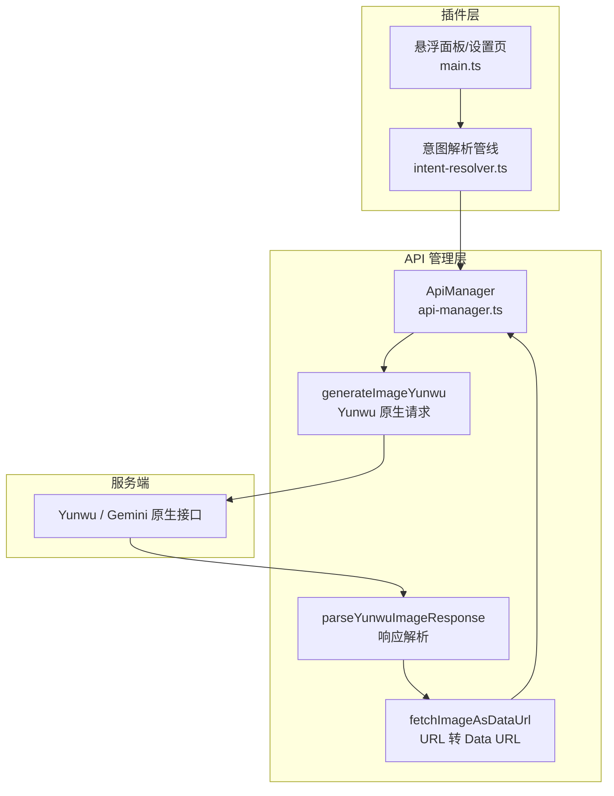
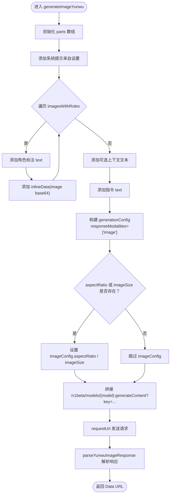
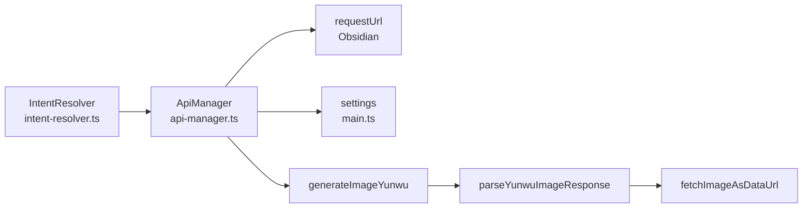

# Yunwu 原生图像生成

<cite>
**本文引用的文件**
- [api-manager.ts](file://api-manager.ts)
- [main.ts](file://main.ts)
- [intent-resolver.ts](file://intent-resolver.ts)
- [design_doc.md](file://docs/design_doc.md)
- [design_doc_v2.md](file://docs/design_doc_v2.md)
</cite>

## 目录
1. [简介](#简介)
2. [项目结构](#项目结构)
3. [核心组件](#核心组件)
4. [架构总览](#架构总览)
5. [详细组件分析](#详细组件分析)
6. [依赖关系分析](#依赖关系分析)
7. [性能考量](#性能考量)
8. [故障排查指南](#故障排查指南)
9. [结论](#结论)
10. [附录](#附录)

## 简介
本文件聚焦 ObsidianCanvasAI 插件中通过 Yunwu 平台调用 Gemini 原生 API 的图像生成功能，深入剖析 ApiManager 类中的私有方法 generateImageYunwu 的实现细节，阐明其如何构建 Gemini 原生格式的请求体（contents.parts 数组中 text 与 inlineData 的交替结构）、generationConfig 中 responseModalities、aspectRatio 与 imageSize 的语义与配置方式，并对比其与 OpenRouter 使用的 image_config 在命名与结构上的差异；同时说明 parseYunwuImageResponse 如何统一处理 base64 与外部 URL 返回值并通过 fetchImageAsDataUrl 转换为 Data URL；最后结合设计文档的理念，阐述该实现如何支持多图输入与角色标注的语义理解，并给出完整的调用流程示例与错误处理最佳实践（含 HTTP 429 限流）。

## 项目结构
围绕图像生成功能的关键文件与职责如下：
- api-manager.ts：提供统一的 API 管理器，封装 OpenRouter 与 Yunwu 的请求与响应解析，包含 generateImageYunwu、parseYunwuImageResponse、fetchImageAsDataUrl 等核心方法。
- main.ts：插件设置与配置项定义，包含 yunwuApiKey、yunwuBaseUrl、yunwuImageModel 等与 Yunwu 相关的配置字段。
- intent-resolver.ts：意图解析管线，负责从 Canvas 选区中提取图片与文本，分配语义角色（如“目标图片”、“风格参考”等），并产出最终指令与上下文文本，供 generateImageWithRoles 调用。
- design_doc.md 与 design_doc_v2.md：提供设计理念与多模态输入的 Payload 设计思路，强调 Gemini 原生 contents.parts 交替结构与角色标注的重要性。



图表来源
- [api-manager.ts](file://api-manager.ts#L400-L571)
- [main.ts](file://main.ts#L1-L120)
- [intent-resolver.ts](file://intent-resolver.ts#L56-L120)

章节来源
- [api-manager.ts](file://api-manager.ts#L400-L571)
- [main.ts](file://main.ts#L1-L120)
- [intent-resolver.ts](file://intent-resolver.ts#L56-L120)

## 核心组件
- ApiManager：统一管理不同提供商的 API 请求与响应解析，提供 generateImageWithRoles 入口，内部根据提供商路由到 generateImageYunwu 或 generateImageOpenRouter。
- generateImageYunwu：构建 Gemini 原生请求体（contents.parts 交替结构），设置 generationConfig.responseModalities 为 image，并按需配置 imageConfig.aspectRatio 与 imageConfig.imageSize。
- parseYunwuImageResponse：解析 candidates[0].content.parts，优先处理 inlineData（base64），其次处理 file_data（URL），并统一转换为 Data URL。
- fetchImageAsDataUrl：从 URL 获取图片并转换为 Data URL，自动推断 MIME 类型。
- IntentResolver：从 Canvas 选区中提取图片与文本，分配角色（如“目标图片”、“风格参考”），并产出最终指令与上下文文本，供 generateImageWithRoles 使用。

章节来源
- [api-manager.ts](file://api-manager.ts#L400-L571)
- [intent-resolver.ts](file://intent-resolver.ts#L56-L120)

## 架构总览
下图展示从 UI 到服务端的完整调用链路，突出 Yunwu 原生请求与响应解析的关键节点。

```mermaid
sequenceDiagram
participant UI as "悬浮面板/设置页"
participant IR as "意图解析管线"
participant AM as "ApiManager"
participant YG as "generateImageYunwu"
participant YW as "Yunwu / Gemini 原生接口"
participant PR as "parseYunwuImageResponse"
participant FD as "fetchImageAsDataUrl"
UI->>IR : 选区 + 用户输入
IR-->>UI : imagesWithRoles, instruction, contextText
UI->>AM : generateImageWithRoles(...)
AM->>YG : 构建 contents.parts 与 generationConfig
YG->>YW : POST /v1beta/models/{model} : generateContent?key=...
YW-->>YG : candidates[0].content.parts
YG->>PR : 解析响应
alt inlineData(base64)
PR-->>AM : data : image/...;base64,...
else file_data(URL)
PR->>FD : GET external URL
FD-->>PR : data : image/...;base64,...
PR-->>AM : data : image/...;base64,...
end
AM-->>UI : 返回 Data URL
```

图表来源
- [api-manager.ts](file://api-manager.ts#L400-L571)

## 详细组件分析

### generateImageYunwu：构建 Gemini 原生请求体与 generationConfig
- contents.parts 交替结构
  - 首先添加系统提示（来自设置项），随后按“角色标注 + 图片（inlineData）+ 可选上下文文本 + 指令”的顺序交替插入，形成 Gemini 原生 contents.parts 数组。
  - 这种结构与 OpenRouter 的 OpenAI 兼容格式不同，后者使用 messages[].content[] 中的 type: text/image_url 形式；而 Gemini 原生使用 contents[].parts[]，其中 inlineData 为原生字段。
- generationConfig 配置
  - responseModalities：仅请求 image 输出，避免多余文本内容干扰。
  - imageConfig.aspectRatio：Yunwu/Gemini 原生参数名（驼峰），用于指定宽高比。
  - imageConfig.imageSize：Yunwu/Gemini 原生参数名（驼峰），用于指定分辨率（如 1K、2K、4K）。
- 请求端点与鉴权
  - 使用 /v1beta/models/{model}:generateContent?key=... 端点，Content-Type 为 application/json。
  - 通过 ApiManager.getApiKey 与 settings.yunwuBaseUrl 获取密钥与基础地址。
- 错误处理
  - 捕获 requestUrl 抛出的错误，若包含 status 则解析错误体并抛出带 HTTP 状态码的错误信息。



图表来源
- [api-manager.ts](file://api-manager.ts#L400-L571)

章节来源
- [api-manager.ts](file://api-manager.ts#L400-L571)

### parseYunwuImageResponse：统一处理 base64 与 URL
- 解析 candidates[0].content.parts
  - 优先查找 inlineData（base64），直接拼接为 data URL。
  - 若为 file_data（URL），调用 fetchImageAsDataUrl 获取并转换为 data URL。
  - 若两者均不存在，尝试提取 text 部分作为错误信息或拒绝原因。
- 错误处理
  - 对空 candidates、空 parts、无图像且无文本等情况抛出明确错误。

章节来源
- [api-manager.ts](file://api-manager.ts#L497-L536)

### fetchImageAsDataUrl：URL 转 Data URL
- 从 URL 获取图片字节流，自动推断 MIME 类型（优先取响应头 content-type，其次根据 URL 后缀）。
- 将 ArrayBuffer 转为 base64，拼接为 data URL。
- 对网络错误进行捕获并抛出带错误信息的异常。

章节来源
- [api-manager.ts](file://api-manager.ts#L538-L571)

### 与 OpenRouter 的差异：image_config vs imageConfig
- OpenRouter（兼容 OpenAI）：generationConfig.modalities 与 image_config.aspect_ratio、image_config.image_size（蛇形命名）。
- Yunwu/Gemini 原生：generationConfig.responseModalities 与 imageConfig.aspectRatio、imageConfig.imageSize（驼峰命名）。
- 二者在结构与命名上存在显著差异，ApiManager 在不同提供商分支下分别构造请求体。

章节来源
- [api-manager.ts](file://api-manager.ts#L193-L275)
- [api-manager.ts](file://api-manager.ts#L400-L571)

### 多图输入与角色标注的语义理解
- 角色分配由 IntentResolver 完成，依据 Canvas 的连线标签、上游文本、分组标题等优先级确定每张图片的语义角色（如“目标图片”、“风格参考”等）。
- 生成 Payload 时，先插入系统提示，再按“角色标注 + 图片 + 可选上下文 + 指令”的顺序交替排列，使模型能够理解每张参考图的用途。
- 设计文档强调 Gemini 原生 contents.parts 的交替结构与角色标注的重要性，从而提升多图组合生图的效果。

章节来源
- [intent-resolver.ts](file://intent-resolver.ts#L56-L120)
- [design_doc.md](file://docs/design_doc.md#L146-L185)
- [design_doc_v2.md](file://docs/design_doc_v2.md#L300-L336)

## 依赖关系分析
- ApiManager 依赖 Obsidian 的 requestUrl 发起 HTTP 请求，并根据提供商动态选择端点与模型。
- generateImageYunwu 依赖 settings 中的 yunwuApiKey、yunwuBaseUrl、yunwuImageModel。
- parseYunwuImageResponse 依赖 response.candidates[0].content.parts 的结构约定。
- fetchImageAsDataUrl 依赖 response.headers['content-type'] 与 URL 后缀推断 MIME 类型。



图表来源
- [api-manager.ts](file://api-manager.ts#L400-L571)
- [main.ts](file://main.ts#L1-L120)
- [intent-resolver.ts](file://intent-resolver.ts#L56-L120)

章节来源
- [api-manager.ts](file://api-manager.ts#L400-L571)
- [main.ts](file://main.ts#L1-L120)
- [intent-resolver.ts](file://intent-resolver.ts#L56-L120)

## 性能考量
- 图片数量限制：设计文档建议最多 14 张参考图，IntentResolver 在解析阶段会进行截断与警告，避免超出模型限制。
- 自动压缩：当图片分辨率过高或体积过大时，应在本地进行缩放与压缩，降低 Base64 体积与请求时间。
- 响应解析：优先处理 inlineData（base64）可减少一次网络请求；若为 URL，fetchImageAsDataUrl 会带来额外网络开销，应尽量避免不必要的二次下载。
- 端点与模型：Yunwu 原生端点为 /v1beta/models/{model}:generateContent?key=...，相比 OpenRouter 的 /v1/chat/completions，更适合 Gemini 原生图像生成。

章节来源
- [design_doc_v2.md](file://docs/design_doc_v2.md#L244-L271)
- [api-manager.ts](file://api-manager.ts#L400-L571)

## 故障排查指南
- API 配置缺失
  - 现象：抛出“API Key 未配置”类错误。
  - 处理：在设置页填写 yunwuApiKey、yunwuBaseUrl，并确认 yunwuImageModel 正确。
- HTTP 错误
  - 现象：requestUrl 抛出带 status 的错误。
  - 处理：捕获错误并解析错误体，记录 HTTP 状态码与消息；必要时重试或提示用户检查配额。
- 429 限流
  - 现象：服务端返回 429 Too Many Requests。
  - 处理：指数退避重试（如 1s、2s、4s、8s），或在 UI 层提示用户稍后再试；必要时降级为较低分辨率或减少参考图数量。
- 响应无图像
  - 现象：candidates 为空、parts 为空，或无 inlineData/file_data。
  - 处理：解析 text 部分作为拒绝原因或错误信息，提示用户调整指令或参考图质量。
- URL 下载失败
  - 现象：fetchImageAsDataUrl 抛出网络错误。
  - 处理：检查 URL 可访问性与 MIME 类型推断逻辑，必要时改为直接使用 base64。

章节来源
- [api-manager.ts](file://api-manager.ts#L481-L571)

## 结论
通过 ApiManager 的 generateImageYunwu，ObsidianCanvasAI 能够以 Gemini 原生格式高效地构建多模态图像生成请求，利用 contents.parts 的交替结构与 generationConfig 的 imageConfig 参数实现对宽高比与分辨率的精细控制；parseYunwuImageResponse 与 fetchImageAsDataUrl 则保证了对 base64 与 URL 两种返回形式的统一处理。结合 IntentResolver 的角色标注与设计文档的理念，该实现能够支持多图输入与语义理解，满足复杂场景下的图像生成需求。

## 附录

### 调用流程示例（不含具体代码片段）
- 步骤 1：用户在悬浮面板输入指令，选择 Canvas 选区。
- 步骤 2：IntentResolver 解析选区，分配每张图片的角色，生成 instruction 与 contextText。
- 步骤 3：ApiManager.generateImageWithRoles 根据提供商选择 generateImageYunwu。
- 步骤 4：generateImageYunwu 构建 Gemini 原生请求体（contents.parts 交替结构），设置 generationConfig.responseModalities 与 imageConfig。
- 步骤 5：发送请求至 Yunwu / Gemini 原生端点，接收 candidates[0].content.parts。
- 步骤 6：parseYunwuImageResponse 优先处理 inlineData，否则下载 file_data 并转换为 Data URL。
- 步骤 7：返回 Data URL，插件将结果回写到 Canvas。

章节来源
- [api-manager.ts](file://api-manager.ts#L400-L571)
- [intent-resolver.ts](file://intent-resolver.ts#L56-L120)