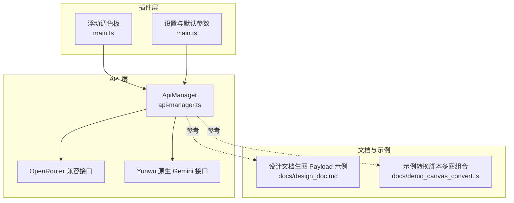
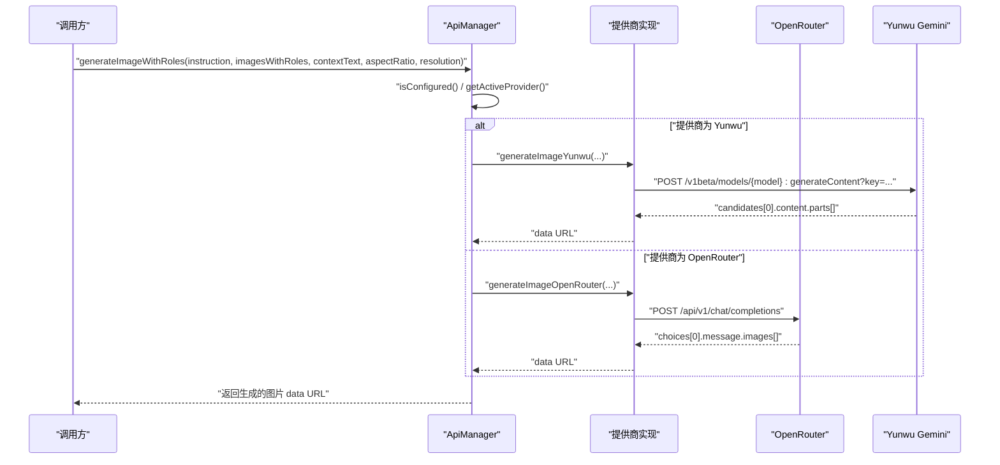
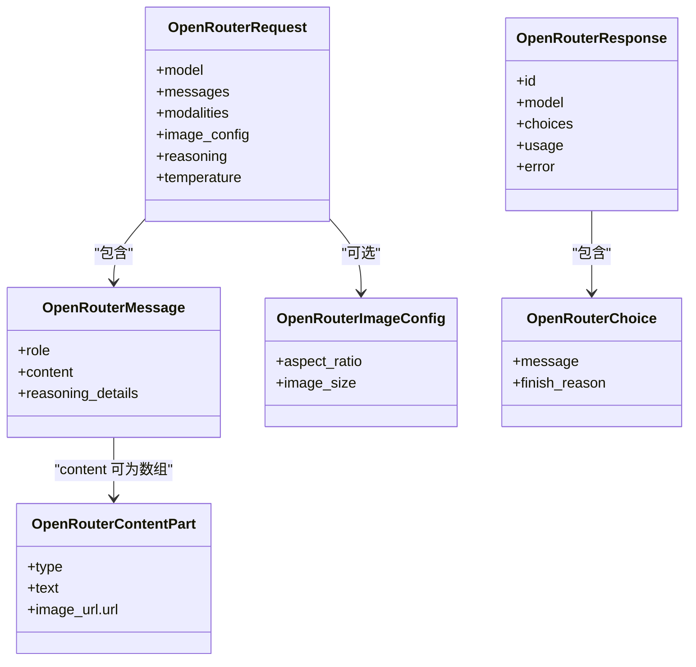
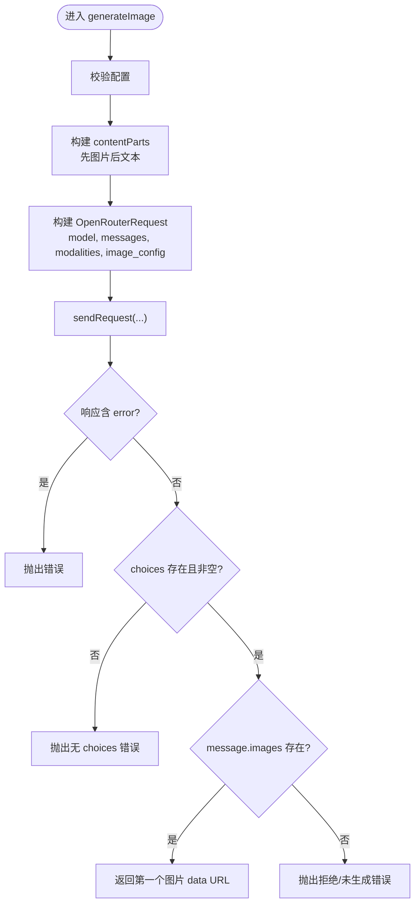
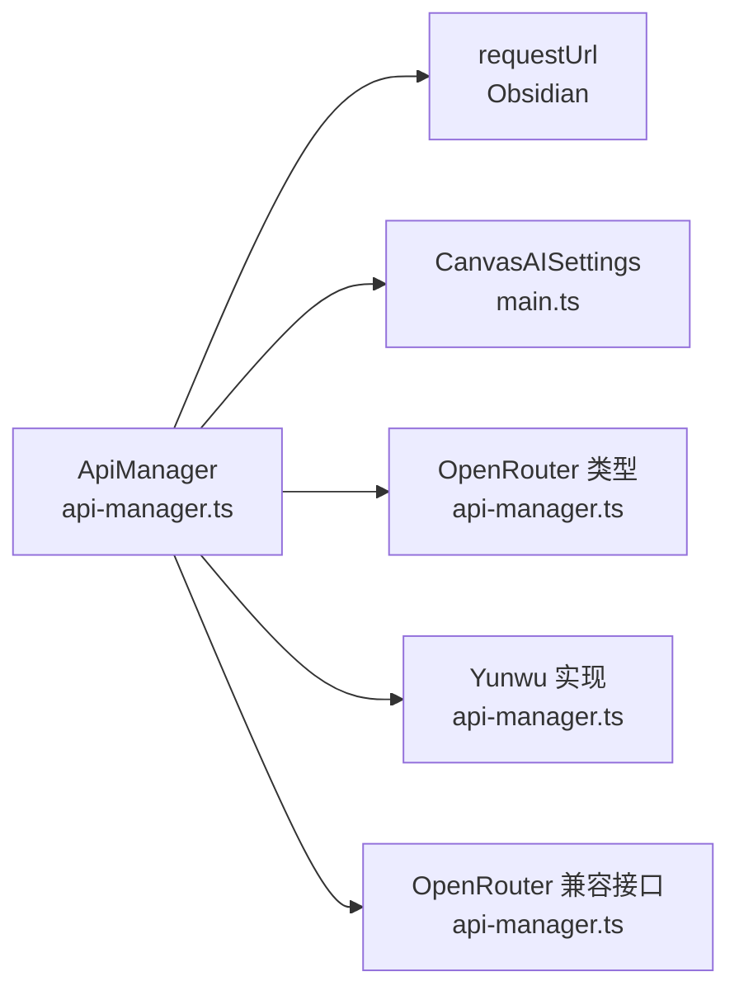

# 图像生成API

<cite>
**本文引用的文件列表**
- [api-manager.ts](file://api-manager.ts)
- [main.ts](file://main.ts)
- [docs/design_doc.md](file://docs/design_doc.md)
- [docs/demo_canvas_convert.ts](file://docs/demo_canvas_convert.ts)
</cite>

## 目录
1. [简介](#简介)
2. [项目结构](#项目结构)
3. [核心组件](#核心组件)
4. [架构总览](#架构总览)
5. [详细组件分析](#详细组件分析)
6. [依赖关系分析](#依赖关系分析)
7. [性能考量](#性能考量)
8. [故障排查指南](#故障排查指南)
9. [结论](#结论)
10. [附录](#附录)

## 简介
本文件面向 ObsidianCanvasAI 插件的图像生成功能，聚焦于 ApiManager 类中的图像生成相关方法，包括：
- generateImage：文生图与图生图（OpenRouter 兼容格式）
- generateImageWithRoles：多图组合生图（OpenRouter 兼容格式与 Yunwu 原生 Gemini 格式）
- 私有方法 generateImageOpenRouter 与 generateImageYunwu 的实现与差异
- OpenRouterImageConfig 与 OpenRouterContentPart 类型的使用
- 对比 OpenRouter 兼容格式（image_config、modalities）与 Yunwu 原生 Gemini 格式（generationConfig、imageSize/aspectRatio）
- 基于 design_doc.md 的生图 Payload 示例说明
- 客户端调用示例与 aspectRatio、resolution 参数配置方法

## 项目结构
围绕图像生成的核心文件与职责如下：
- api-manager.ts：图像生成 API 的统一入口与实现，负责构建请求体、路由到不同提供商、解析响应。
- main.ts：插件设置与 UI 状态（包含默认比例、分辨率等），以及调用 generateImageWithRoles 的流程。
- docs/design_doc.md：生图 Payload 示例与多图组合生图的设计说明。
- docs/demo_canvas_convert.ts：演示如何将 Canvas 节点转换为 Gemini Payload 的最佳实践。



图表来源
- [api-manager.ts](file://api-manager.ts#L193-L679)
- [main.ts](file://main.ts#L35-L234)
- [docs/design_doc.md](file://docs/design_doc.md#L146-L185)
- [docs/demo_canvas_convert.ts](file://docs/demo_canvas_convert.ts#L56-L149)

章节来源
- [api-manager.ts](file://api-manager.ts#L193-L679)
- [main.ts](file://main.ts#L35-L234)
- [docs/design_doc.md](file://docs/design_doc.md#L146-L185)
- [docs/demo_canvas_convert.ts](file://docs/demo_canvas_convert.ts#L56-L149)

## 核心组件
- ApiManager：封装 OpenRouter 与 Yunwu 的图像生成能力，提供统一的 API 调用入口。
- OpenRouter 类型体系：OpenRouterMessage、OpenRouterContentPart、OpenRouterImageConfig、OpenRouterRequest、OpenRouterChoice、OpenRouterResponse。
- 生成方法族：
  - generateImage：OpenRouter 兼容格式的文生图/图生图。
  - generateImageWithRoles：多图组合生图，内部根据提供商路由到 OpenRouter 或 Yunwu 实现。
  - generateImageOpenRouter：OpenRouter 兼容格式实现。
  - generateImageYunwu：Yunwu 原生 Gemini 格式实现。

章节来源
- [api-manager.ts](file://api-manager.ts#L11-L67)
- [api-manager.ts](file://api-manager.ts#L193-L679)

## 架构总览
图像生成的整体调用链路如下：
- 客户端（UI/调用方）调用 ApiManager.generateImageWithRoles。
- 根据当前提供商（OpenRouter 或 Yunwu）选择对应实现。
- OpenRouter 实现：构造 OpenRouterRequest，设置 modalities、image_config，发送请求并解析返回。
- Yunwu 实现：构造 Gemini 原生 contents + generationConfig，调用 v1beta/:generateContent，解析 candidates.parts 并返回 data URL。



图表来源
- [api-manager.ts](file://api-manager.ts#L277-L303)
- [api-manager.ts](file://api-manager.ts#L305-L398)
- [api-manager.ts](file://api-manager.ts#L400-L495)

## 详细组件分析

### ApiManager 类与类型体系
- OpenRouterMessage：消息结构，content 支持字符串或 OpenRouterContentPart[]。
- OpenRouterContentPart：内容片段，支持 text 与 image_url（data URL）。
- OpenRouterImageConfig：OpenRouter 兼容格式的图像参数，包含 aspect_ratio 与 image_size。
- OpenRouterRequest：请求体，包含 model、messages、modalities、image_config、temperature 等。
- OpenRouterChoice/OpenRouterResponse：响应结构，包含 choices 与可选的 usage/error。



图表来源
- [api-manager.ts](file://api-manager.ts#L11-L67)

章节来源
- [api-manager.ts](file://api-manager.ts#L11-L67)

### generateImage（文生图/图生图）
- 功能：将输入图片与文本提示组合为 OpenRouter 兼容格式的请求，发送至 OpenRouter，解析返回的图片 data URL。
- 关键点：
  - 构造 OpenRouterContentPart[]，先加入输入图片（image_url），再加入文本提示（text）。
  - 设置 modalities 为 ['image','text']，image_config 可选地包含 aspect_ratio 与 image_size。
  - 解析响应：优先从 message.images[0].image_url.url 返回；若无则抛出错误。



图表来源
- [api-manager.ts](file://api-manager.ts#L193-L275)

章节来源
- [api-manager.ts](file://api-manager.ts#L193-L275)

### generateImageWithRoles（多图组合生图）
- 功能：根据提供商选择 OpenRouter 或 Yunwu 的实现，支持角色标注（role annotation）与上下文文本。
- 关键点：
  - 路由逻辑：根据 getActiveProvider() 决定调用 generateImageOpenRouter 或 generateImageYunwu。
  - 参数：instruction（主指令）、imagesWithRoles（含 base64、mimeType、role）、contextText（可选）、aspectRatio（扩展比例）、resolution（1K/2K/4K 等）。

章节来源
- [api-manager.ts](file://api-manager.ts#L277-L303)

### generateImageOpenRouter（OpenRouter 兼容格式）
- 请求体要点：
  - model：来自 getImageModel()。
  - messages：包含一个用户消息，content 为 OpenRouterContentPart[]。
  - modalities：设置为 ['image']，确保模型输出图像。
  - image_config：可选，包含 aspect_ratio 与 image_size。
- Payload 构造规则：
  - 先添加系统提示（settings 中的 imageSystemPrompt）。
  - 依次添加每个参考图的 role 标注文本与 image_url。
  - 可选添加上下文文本 [Context] 区域。
  - 最后添加指令 [INSTRUCTION] 区域。
- 响应解析：从 choices[0].message.images[0].image_url.url 返回 data URL。

章节来源
- [api-manager.ts](file://api-manager.ts#L305-L398)

### generateImageYunwu（Yunwu 原生 Gemini 格式）
- 请求体要点：
  - contents：数组，每项包含 role 与 parts。
  - parts：数组，元素为 { text } 或 { inlineData: { mimeType, data } }。
  - generationConfig：包含 responseModalities: ['image']，imageConfig 可选，包含 aspectRatio 与 imageSize（驼峰命名）。
- Endpoint：/v1beta/models/{model}:generateContent?key={apiKey}
- 响应解析：
  - 优先解析 candidates[0].content.parts[] 中的 inlineData（base64）。
  - 若为 file_data（URL），则通过 fetchImageAsDataUrl 下载并转换为 data URL。
  - 若无图像，抛出错误并返回文本内容。

```mermaid
sequenceDiagram
participant AM as "ApiManager"
participant YW as "Yunwu Gemini"
AM->>YW : "POST /v1beta/models/{model} : generateContent?key=..."
YW-->>AM : "candidates[0].content.parts[]"
alt "parts.inlineData 存在"
AM-->>AM : "拼接 data : mime;base64,..."
AM-->>Caller : "返回 data URL"
else "parts.file_data 存在"
AM->>AM : "fetchImageAsDataUrl(url)"
AM-->>Caller : "返回 data URL"
else "无图像"
AM-->>Caller : "抛出错误可能包含文本内容"
end
```

图表来源
- [api-manager.ts](file://api-manager.ts#L400-L495)
- [api-manager.ts](file://api-manager.ts#L538-L571)

章节来源
- [api-manager.ts](file://api-manager.ts#L400-L495)
- [api-manager.ts](file://api-manager.ts#L538-L571)

### OpenRouter 与 Yunwu 请求体差异对比
- OpenRouter 兼容格式（OpenRouterRequest）
  - 结构：messages（数组），每项为 OpenRouterMessage。
  - 图像参数：image_config.aspect_ratio、image_config.image_size。
  - 输出控制：modalities。
- Yunwu 原生 Gemini 格式
  - 结构：contents（数组），每项为 { role, parts }。
  - 图像参数：generationConfig.imageConfig.aspectRatio、generationConfig.imageConfig.imageSize。
  - 输出控制：generationConfig.responseModalities。
- 关键差异
  - 字段命名：OpenRouter 使用 snake_case（aspect_ratio、image_size），Yunwu 使用 camelCase（aspectRatio、imageSize）。
  - 参数容器：OpenRouter 在 image_config 下，Yunwu 在 generationConfig.imageConfig 下。
  - 输出控制：OpenRouter 使用 modalities，Yunwu 使用 responseModalities。

章节来源
- [api-manager.ts](file://api-manager.ts#L234-L248)
- [api-manager.ts](file://api-manager.ts#L359-L373)
- [api-manager.ts](file://api-manager.ts#L441-L461)

### 设计文档中的生图 Payload 示例
- OpenRouter/OpenAI 兼容格式示例（messages + image_url）展示了如何将多张参考图与文本提示组合为请求体。
- 注意：具体字段名（image_url vs inline_data）取决于所用接口类型（OpenRouter vs 原生 Gemini）。
- 多图组合生图场景：gemini-3-pro-image-preview 支持直接接收 Base64 图片与文本的混合输入，适合组合生成。

章节来源
- [docs/design_doc.md](file://docs/design_doc.md#L146-L185)

### 客户端调用与参数配置
- 调用入口：generateImageWithRoles(instruction, imagesWithRoles, contextText?, aspectRatio?, resolution?)
- 参数说明：
  - instruction：主指令/提示词。
  - imagesWithRoles：数组，每项包含 base64、mimeType、role。
  - contextText：可选的上下文文本。
  - aspectRatio：可为标准比例（1:1、16:9、4:3、9:16）或扩展比例。
  - resolution：1K、2K、4K 等。
- UI 默认值：插件设置中包含 defaultAspectRatio 与 defaultResolution，默认值分别为 '1:1' 与 '1K'。
- UI 控件：浮动调色板中包含比例选择器与分辨率选择器，变更时通过回调更新内部状态。

章节来源
- [api-manager.ts](file://api-manager.ts#L277-L303)
- [api-manager.ts](file://api-manager.ts#L305-L398)
- [api-manager.ts](file://api-manager.ts#L400-L495)
- [main.ts](file://main.ts#L35-L234)
- [main.ts](file://main.ts#L370-L380)
- [main.ts](file://main.ts#L468-L477)

## 依赖关系分析
- ApiManager 依赖 Obsidian 的 requestUrl 发送 HTTP 请求。
- 依赖 CanvasAISettings 提供 API Key、提供商、模型、系统提示等配置。
- 依赖 main.ts 的设置与 UI 状态（默认比例、分辨率）。



图表来源
- [api-manager.ts](file://api-manager.ts#L646-L679)
- [main.ts](file://main.ts#L35-L234)

章节来源
- [api-manager.ts](file://api-manager.ts#L646-L679)
- [main.ts](file://main.ts#L35-L234)

## 性能考量
- 图片预处理：在调用前将图片压缩为 WebP 并限制最大尺寸，有助于降低 Token 消耗与传输开销。
- 请求体精简：仅在必要时添加 image_config，避免冗余参数。
- 错误早返回：当响应无 choices 或无图像时立即抛错，减少无效等待。

章节来源
- [canvas-converter.ts](file://canvas-converter.ts#L397-L447)
- [api-manager.ts](file://api-manager.ts#L234-L248)
- [api-manager.ts](file://api-manager.ts#L359-L373)
- [api-manager.ts](file://api-manager.ts#L441-L461)

## 故障排查指南
- API Key 未配置：isConfigured() 为假时抛出错误，请在设置中填写。
- HTTP 错误：sendRequest/sendRequestUrl 捕获 HTTP 错误并返回错误信息。
- 响应无 choices：抛出“返回无 choices”的错误。
- 无图像返回：OpenRouter 返回 message.images 为空时抛出错误；Yunwu 返回 candidates.parts 为空或无 inlineData/file_data 时抛出错误。
- URL 图片下载失败：parseYunwuImageResponse 中若 file_data 存在但下载失败，抛出“无法获取图片”的错误。

章节来源
- [api-manager.ts](file://api-manager.ts#L139-L141)
- [api-manager.ts](file://api-manager.ts#L646-L679)
- [api-manager.ts](file://api-manager.ts#L234-L248)
- [api-manager.ts](file://api-manager.ts#L359-L373)
- [api-manager.ts](file://api-manager.ts#L441-L461)
- [api-manager.ts](file://api-manager.ts#L498-L536)
- [api-manager.ts](file://api-manager.ts#L538-L571)

## 结论
- ApiManager 提供了统一的图像生成接口，兼容 OpenRouter 兼容格式与 Yunwu 原生 Gemini 格式。
- OpenRouter 与 Yunwu 在图像参数命名与容器结构上存在差异，需分别处理。
- 多图组合生图可通过 generateImageWithRoles 与角色标注实现，结合 aspectRatio 与 resolution 参数控制输出比例与分辨率。
- 建议在调用前进行图片预处理与参数校验，以提升成功率与性能。

## 附录

### 客户端调用示例（无代码，仅路径）
- 文生图/图生图（OpenRouter 兼容格式）
  - 调用路径：ApiManager.generateImage
  - 参数：prompt、aspectRatio、imageSize、inputImages（可选）
  - 参考实现：[api-manager.ts](file://api-manager.ts#L193-L275)
- 多图组合生图（OpenRouter 兼容格式）
  - 调用路径：ApiManager.generateImageOpenRouter
  - 参数：instruction、imagesWithRoles、contextText、aspectRatio、resolution
  - 参考实现：[api-manager.ts](file://api-manager.ts#L305-L398)
- 多图组合生图（Yunwu 原生 Gemini 格式）
  - 调用路径：ApiManager.generateImageYunwu
  - 参数：instruction、imagesWithRoles、contextText、aspectRatio、resolution
  - 参考实现：[api-manager.ts](file://api-manager.ts#L400-L495)
- UI 触发与参数传递
  - 调用路径：FloatingPalette -> ApiManager.generateImageWithRoles
  - 参数：instruction、imagesWithRoles、contextText、aspectRatio、resolution
  - 参考实现：[main.ts](file://main.ts#L1114-L1140)

### 参数配置方法
- aspectRatio
  - OpenRouter：image_config.aspect_ratio（支持标准比例与扩展比例）
  - Yunwu：generationConfig.imageConfig.aspectRatio（驼峰命名）
  - UI 默认值：'1:1'
  - 参考实现：[api-manager.ts](file://api-manager.ts#L240-L248)、[api-manager.ts](file://api-manager.ts#L365-L373)、[api-manager.ts](file://api-manager.ts#L453-L461)、[main.ts](file://main.ts#L370-L380)
- resolution
  - OpenRouter：image_config.image_size（如 1K/2K/4K）
  - Yunwu：generationConfig.imageConfig.imageSize（驼峰命名）
  - UI 默认值：'1K'
  - 参考实现：[api-manager.ts](file://api-manager.ts#L240-L248)、[api-manager.ts](file://api-manager.ts#L365-L373)、[api-manager.ts](file://api-manager.ts#L453-L461)、[main.ts](file://main.ts#L370-L380)

### 设计文档中的生图 Payload 示例说明
- OpenRouter 兼容格式示例展示了如何将多张参考图与文本提示组合为请求体。
- 多图组合生图场景：gemini-3-pro-image-preview 支持直接接收 Base64 图片与文本的混合输入。
- 参考实现：[docs/design_doc.md](file://docs/design_doc.md#L146-L185)