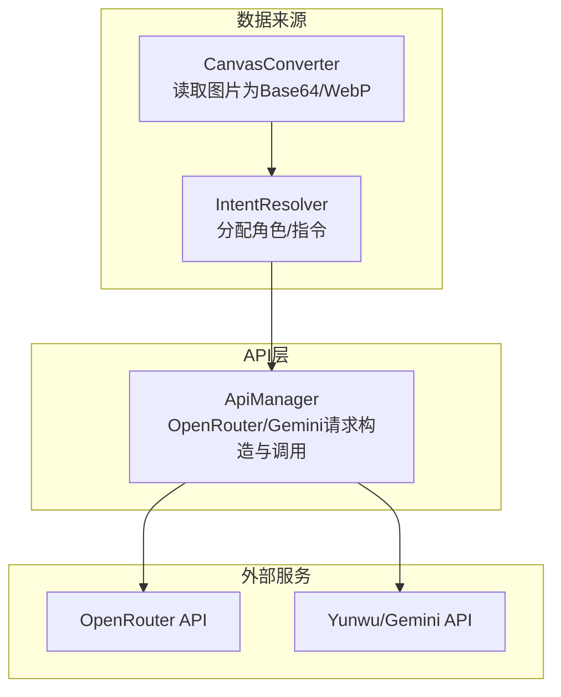
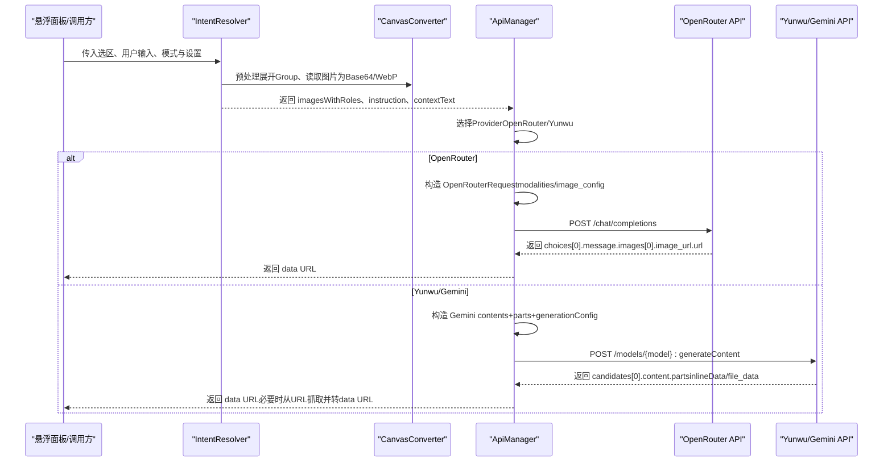
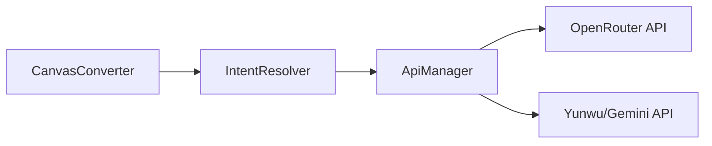

# 图像生成数据模型

<cite>
**本文引用的文件**
- [api-manager.ts](file://api-manager.ts)
- [design_doc.md](file://docs/design_doc.md)
- [design_doc_v2.md](file://docs/design_doc_v2.md)
- [canvas-converter.ts](file://canvas-converter.ts)
- [intent-resolver.ts](file://intent-resolver.ts)
</cite>

## 目录
1. [简介](#简介)
2. [项目结构](#项目结构)
3. [核心组件](#核心组件)
4. [架构总览](#架构总览)
5. [详细组件分析](#详细组件分析)
6. [依赖分析](#依赖分析)
7. [性能考虑](#性能考虑)
8. [故障排查指南](#故障排查指南)
9. [结论](#结论)
10. [附录](#附录)

## 简介
本文件聚焦 ObsidianCanvasAI 插件中图像生成功能所依赖的核心数据模型，系统梳理并对比两类多模态请求格式：
- OpenRouter 兼容格式（OpenAI 兼容消息结构）
- Yunwu/Gemini 原生格式（contents + parts + generationConfig）

重点定义并说明以下类型与结构在图像生成中的角色与约束：
- OpenRouterContentPart
- OpenRouterMessage
- OpenRouterRequest
- OpenRouterImageConfig
- Yunwu/Gemini 原生格式中的 parts 数组、inlineData 对象、generationConfig 结构

同时结合设计文档中的 Payload 示例，阐述如何将 Canvas 节点的 Base64 图像数据与角色元信息映射到这些模型中，并给出类型定义与使用示例的代码片段路径，帮助开发者理解数据流的转换过程。

## 项目结构
围绕图像生成的数据模型，相关文件与职责如下：
- api-manager.ts：定义 OpenRouter 类型与请求/响应结构；实现 OpenRouter 与 Yunwu/Gemini 的图像生成与多模态聊天调用；负责将 Canvas 数据映射为两类格式。
- docs/design_doc.md 与 docs/design_doc_v2.md：提供 OpenRouter 与 Gemini 原生格式的 Payload 示例与管线说明。
- canvas-converter.ts：将 Canvas 节点转换为 Markdown/Mermaid，并将图片节点读取为压缩后的 WebP Base64 与 MIME 类型。
- intent-resolver.ts：解析选区意图，为每张图片分配角色（role），并产出最终指令与上下文文本，供生成器使用。

图表来源
- [api-manager.ts](file://api-manager.ts#L1-L679)
- [canvas-converter.ts](file://canvas-converter.ts#L1-L556)
- [intent-resolver.ts](file://intent-resolver.ts#L1-L378)

章节来源
- [api-manager.ts](file://api-manager.ts#L1-L679)
- [canvas-converter.ts](file://canvas-converter.ts#L1-L556)
- [intent-resolver.ts](file://intent-resolver.ts#L1-L378)

## 核心组件
本节定义并解释图像生成相关的数据模型与约束。

- OpenRouterContentPart
  - 作用：OpenRouter 兼容格式的消息内容单元，支持文本与图像两种类型。
  - 关键字段与约束：
    - type：'text' | 'image_url'
    - text：当 type='text' 时必填
    - image_url.url：当 type='image_url' 时必填，支持 data URL（data:image/...;base64,...）
  - 使用场景：将 Canvas 图片节点转换为 data URL 并拼接到消息内容数组中；或将文本指令与角色标注文本按顺序排列。

- OpenRouterMessage
  - 作用：OpenRouter 兼容格式的消息对象。
  - 关键字段与约束：
    - role：'user' | 'assistant' | 'system'
    - content：字符串或 OpenRouterContentPart[]（多模态时）
    - reasoning_details：可选，推理详情
  - 使用场景：将系统提示、角色标注文本、图片（data URL）、用户指令等组织为消息数组。

- OpenRouterRequest
  - 作用：OpenRouter 兼容格式的请求体。
  - 关键字段与约束：
    - model：模型名称
    - messages：OpenRouterMessage[]
    - modalities：可选，如 ['image','text'] 或 ['image']
    - image_config：可选，OpenRouterImageConfig
    - reasoning：可选，启用推理
    - temperature：可选
  - 使用场景：图像生成时设置 modalities=['image']，并通过 image_config 控制长宽比与分辨率；多模态聊天时设置 modalities=['text','image']。

- OpenRouterImageConfig
  - 作用：OpenRouter 兼容格式的图像生成配置。
  - 关键字段与约束：
    - aspect_ratio：'1:1' | '16:9' | '4:3' | '9:16'（或扩展比例字符串）
    - image_size：字符串形式的分辨率（如 "1024x1024"）
  - 使用场景：在 generateImageWithRoles 与 generateImage 中根据用户参数设置。

- Yunwu/Gemini 原生格式要点
  - contents 数组：每个元素为 { role: 'user', parts: [...] }。
  - parts 数组：元素为 { text?: string } 或 { inlineData?: { mimeType: string; data: string } }。
  - generationConfig：
    - responseModalities：['image']（仅请求图像输出）
    - imageConfig：{ aspectRatio?: string; imageSize?: string }（Yunwu/Gemini 原生命名）

章节来源
- [api-manager.ts](file://api-manager.ts#L11-L67)
- [api-manager.ts](file://api-manager.ts#L30-L37)
- [api-manager.ts](file://api-manager.ts#L25-L28)
- [api-manager.ts](file://api-manager.ts#L400-L500)
- [api-manager.ts](file://api-manager.ts#L404-L461)
- [design_doc.md](file://docs/design_doc.md#L150-L185)
- [design_doc_v2.md](file://docs/design_doc_v2.md#L300-L337)

## 架构总览
图像生成的数据流从 Canvas 节点出发，经过本地预处理与角色解析，再映射到两类 API 请求格式，最终由服务端返回图像（data URL 或 base64）。

图表来源
- [intent-resolver.ts](file://intent-resolver.ts#L63-L130)
- [canvas-converter.ts](file://canvas-converter.ts#L350-L477)
- [api-manager.ts](file://api-manager.ts#L277-L398)
- [api-manager.ts](file://api-manager.ts#L400-L500)

## 详细组件分析

### OpenRouter 兼容格式数据模型
- 类型定义与约束
  - OpenRouterContentPart：支持 'text' 与 'image_url' 两种类型，image_url.url 必须为 data URL（data:image/...;base64,...）。
  - OpenRouterMessage：content 可为字符串或 OpenRouterContentPart[]，用于多模态。
  - OpenRouterRequest：model、messages 必填；modalities 与 image_config 可选；temperature 可选。
  - OpenRouterImageConfig：aspect_ratio 与 image_size 为可选配置项。

- 在图像生成中的使用
  - 将 Canvas 图片节点转换为 data URL 并作为 image_url 插入 content 数组；
  - 将系统提示、角色标注文本与用户指令也作为 text 类型插入；
  - 设置 modalities=['image'] 或 ['image','text']，并根据需要设置 image_config。

- 代码片段路径
  - OpenRouter 类型定义：[OpenRouterContentPart/Message/Request/ImageConfig](file://api-manager.ts#L11-L37)
  - 图像生成（OpenRouter）：[generateImageOpenRouter](file://api-manager.ts#L308-L398)
  - 多模态聊天（OpenRouter）：[multimodalChat](file://api-manager.ts#L573-L644)

章节来源
- [api-manager.ts](file://api-manager.ts#L11-L37)
- [api-manager.ts](file://api-manager.ts#L193-L275)
- [api-manager.ts](file://api-manager.ts#L308-L398)
- [api-manager.ts](file://api-manager.ts#L573-L644)

### Yunwu/Gemini 原生格式数据模型
- 结构要点
  - contents：数组，每个元素为 { role: 'user', parts: [...] }。
  - parts：数组，元素为 { text?: string } 或 { inlineData?: { mimeType: string; data: string } }。
  - generationConfig：
    - responseModalities：['image']（仅请求图像输出）
    - imageConfig：{ aspectRatio?: string; imageSize?: string }（Yunwu/Gemini 原生命名）

- 在图像生成中的使用
  - 将 Canvas 图片节点转换为 inlineData（mimeType 与 base64 data）；
  - 将系统提示、角色标注文本与用户指令作为 text 插入；
  - 设置 generationConfig.responseModalities=['image']，并按需设置 imageConfig.aspectRatio 与 imageConfig.imageSize。

- 代码片段路径
  - 原生格式请求构造与调用：[generateImageYunwu](file://api-manager.ts#L400-L495)
  - 响应解析（inlineData/file_data）：[parseYunwuImageResponse](file://api-manager.ts#L498-L536)
  - 从 URL 抓取并转 data URL：[fetchImageAsDataUrl](file://api-manager.ts#L538-L571)

章节来源
- [api-manager.ts](file://api-manager.ts#L400-L495)
- [api-manager.ts](file://api-manager.ts#L498-L536)
- [api-manager.ts](file://api-manager.ts#L538-L571)

### 多模态输入对比：image_url（data URL）与 inlineData（base64 + mimeType）
- 数据封装方式
  - image_url（OpenRouter 兼容）：content.parts 中的 image_url.url 为 data URL（data:image/...;base64,...）。
  - inlineData（Yunwu/Gemini 原生）：content.parts 中的 inlineData.mimeType 与 inlineData.data 分别表示媒体类型与 base64 数据。
- 一致性与差异
  - 两者均承载图像数据，但封装结构不同：前者嵌入在消息内容数组中，后者嵌入在 Gemini 的 contents.parts 中。
  - 两者均可携带分辨率与比例配置：OpenRouter 使用 image_config，Yunwu 使用 generationConfig.imageConfig。
- 映射关系
  - CanvasConverter 将图片读取为 base64 与 MIME 类型；
  - ApiManager 在 OpenRouter 路径中将 base64 与 MIME 组装为 data URL；在 Yunwu 路径中直接使用 base64 与 MIME 构造 inlineData。

章节来源
- [api-manager.ts](file://api-manager.ts#L200-L275)
- [api-manager.ts](file://api-manager.ts#L400-L495)
- [canvas-converter.ts](file://canvas-converter.ts#L350-L477)

### 角色元信息与上下文文本的映射
- 角色（role）解析
  - 依据连线标签（Label）> 上游文本 > Group 标题 > 默认角色的优先级为每张图片分配角色；
  - 角色文本以 [Ref: 角色] 的形式插入到消息内容数组中，作为视觉参考的语义标签。
- 上下文文本（contextText）
  - 从非图片节点中抽取未被用作标签的文本与文件内容，形成结构化上下文，辅助模型理解背景信息。
- 指令（instruction）
  - 优先使用用户显式输入；否则回退到选区内未被用作标签的文本；最后使用默认预设。

- 代码片段路径
  - 角色解析与指令策略：[assignRoles/resolveInstruction](file://intent-resolver.ts#L201-L319)
  - 上下文文本构建：[buildContextText](file://intent-resolver.ts#L321-L343)
  - 图像生成（含角色与上下文）：[generateImageWithRoles](file://api-manager.ts#L277-L398)

章节来源
- [intent-resolver.ts](file://intent-resolver.ts#L201-L343)
- [api-manager.ts](file://api-manager.ts#L277-L398)

### 设计文档中的 Payload 示例与映射
- OpenRouter 兼容 Payload 示例
  - 示例展示了 messages[].content[] 中包含 text 与 image_url 的结构，以及 image_config 的使用。
  - 该示例与 ApiManager 在 OpenRouter 路径下的构造一致：先插入系统提示，再插入角色标注文本与图片（data URL），最后插入用户指令。
- Gemini 原生 Payload 示例
  - 示例展示了 contents[].parts[] 中包含 text 与 inlineData 的结构，以及 generationConfig.responseModalities 与 imageConfig 的使用。
  - 该示例与 ApiManager 在 Yunwu 路径下的构造一致：先插入系统提示，再插入角色标注文本与图片（inlineData），最后插入用户指令。

- 代码片段路径
  - OpenRouter 示例（设计文档）：[design_doc.md](file://docs/design_doc.md#L150-L185)
  - Gemini 示例（设计文档 v2）：[design_doc_v2.md](file://docs/design_doc_v2.md#L300-L337)
  - 实际构造逻辑（OpenRouter）：[generateImageOpenRouter](file://api-manager.ts#L308-L398)
  - 实际构造逻辑（Yunwu）：[generateImageYunwu](file://api-manager.ts#L400-L495)

章节来源
- [design_doc.md](file://docs/design_doc.md#L150-L185)
- [design_doc_v2.md](file://docs/design_doc_v2.md#L300-L337)
- [api-manager.ts](file://api-manager.ts#L308-L398)
- [api-manager.ts](file://api-manager.ts#L400-L495)

## 依赖分析
- 组件耦合
  - ApiManager 依赖 CanvasConverter 与 IntentResolver 的输出（图片 Base64/MIME、角色、指令、上下文）。
  - CanvasConverter 负责将图片节点读取为压缩后的 WebP Base64 与 MIME 类型，保证请求体积与兼容性。
  - IntentResolver 负责角色与指令的解析，确保生成器获得清晰的语义结构。
- 外部依赖
  - OpenRouter API：使用 OpenAI 兼容的 chat/completions 接口。
  - Yunwu/Gemini API：使用 /models/{model}:generateContent 接口，返回 candidates[].content.parts。

图表来源
- [canvas-converter.ts](file://canvas-converter.ts#L350-L477)
- [intent-resolver.ts](file://intent-resolver.ts#L63-L130)
- [api-manager.ts](file://api-manager.ts#L277-L398)

章节来源
- [canvas-converter.ts](file://canvas-converter.ts#L350-L477)
- [intent-resolver.ts](file://intent-resolver.ts#L63-L130)
- [api-manager.ts](file://api-manager.ts#L277-L398)

## 性能考虑
- 图片压缩与尺寸限制
  - CanvasConverter 将图片压缩为 WebP，并限制最大尺寸，降低请求体积与 Token 消耗。
- 角色与指令的精简
  - 通过角色截断与上下文文本的结构化抽取，减少冗余信息，提升生成效率。
- Provider 选择
  - OpenRouter 适合 OpenAI 兼容生态；Yunwu/Gemini 原生格式在多模态输入方面具备更直接的 inlineData 能力。

[本节为通用指导，无需列出具体文件来源]

## 故障排查指南
- 常见问题与处理
  - API Key 未配置：检查 ApiManager.isConfigured 与 Provider 设置。
  - 无 choices 或无图像返回：检查 modalities 与 image_config 设置；确认服务端返回结构。
  - 无图像但有文本：服务端拒绝生成或安全过滤，需调整指令或检查安全策略。
  - Yunwu 返回 file_data：ApiManager 会自动抓取 URL 并转换为 data URL。
- 代码片段路径
  - 配置检查与错误抛出：[isConfigured/chatCompletion/generateImage](file://api-manager.ts#L136-L191)
  - OpenRouter 错误处理与校验：[sendRequest](file://api-manager.ts#L646-L679)
  - Yunwu 响应解析与 URL 抓取：[parseYunwuImageResponse/fetchImageAsDataUrl](file://api-manager.ts#L498-L571)

章节来源
- [api-manager.ts](file://api-manager.ts#L136-L191)
- [api-manager.ts](file://api-manager.ts#L646-L679)
- [api-manager.ts](file://api-manager.ts#L498-L571)

## 结论
- OpenRouter 兼容格式与 Yunwu/Gemini 原生格式在承载图像数据的方式上存在差异：前者使用 image_url（data URL），后者使用 inlineData（base64 + MIME）。二者均可通过各自配置对象控制输出比例与分辨率。
- 通过 CanvasConverter 与 IntentResolver 的协作，Canvas 节点的 Base64 图像数据与角色元信息被系统性地映射到两类格式中，确保生成器能够理解多模态上下文并稳定返回图像结果。
- ApiManager 在两类 Provider 之间提供统一的调用接口与错误处理，便于扩展与维护。

[本节为总结，无需列出具体文件来源]

## 附录
- 类型定义与使用示例的代码片段路径
  - OpenRouter 类型定义：[OpenRouterContentPart/Message/Request/ImageConfig](file://api-manager.ts#L11-L37)
  - OpenRouter 图像生成（含角色与上下文）：[generateImageOpenRouter](file://api-manager.ts#L308-L398)
  - Yunwu 原生格式请求构造与调用：[generateImageYunwu](file://api-manager.ts#L400-L495)
  - 响应解析与 URL 抓取：[parseYunwuImageResponse/fetchImageAsDataUrl](file://api-manager.ts#L498-L571)
  - 角色解析与指令策略：[assignRoles/resolveInstruction/buildContextText](file://intent-resolver.ts#L201-L343)
  - Canvas 图片读取与压缩：[readImageFileContents/compressImageToWebP](file://canvas-converter.ts#L350-L477)
  - 设计文档中的 Payload 示例（OpenRouter/Gemini）：[design_doc.md](file://docs/design_doc.md#L150-L185)、[design_doc_v2.md](file://docs/design_doc_v2.md#L300-L337)