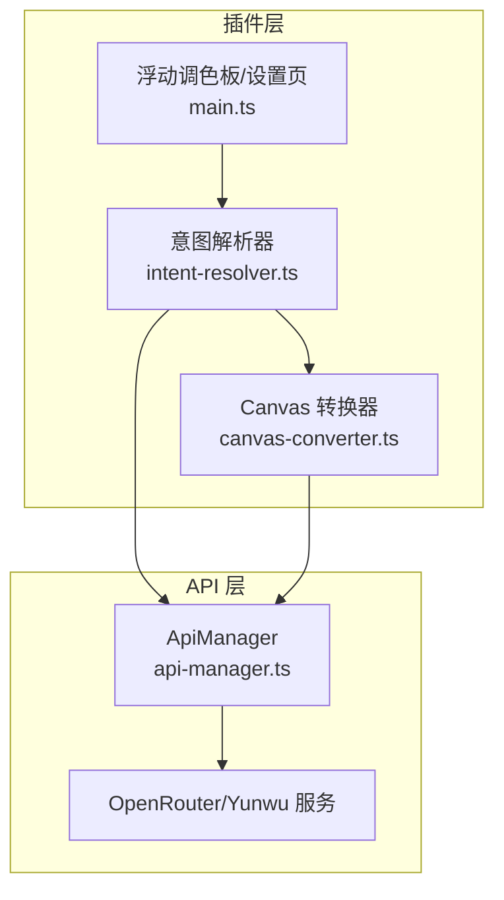
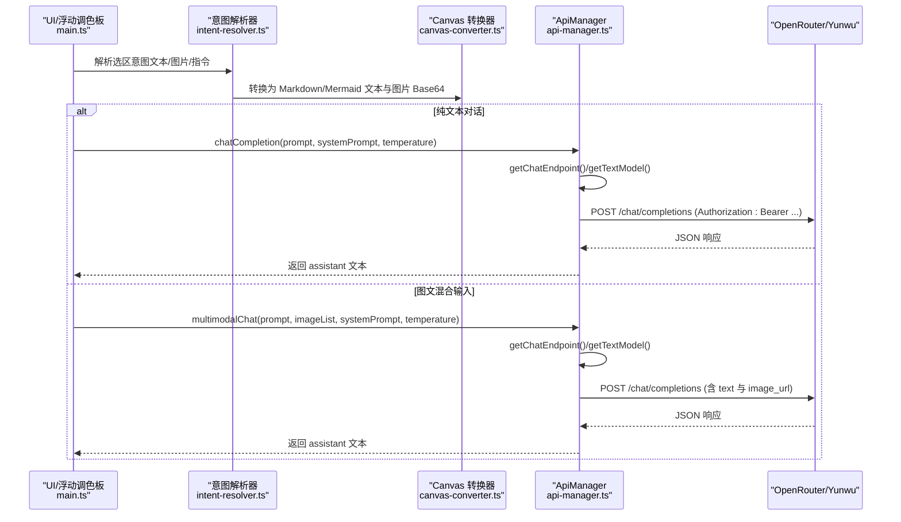
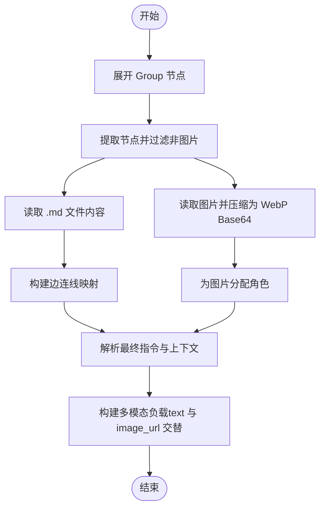
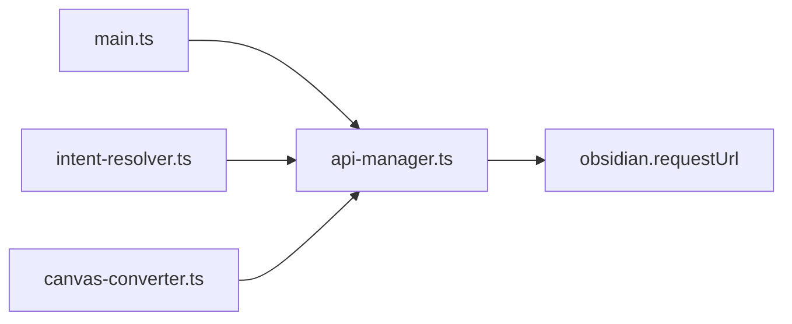

# 文本生成与聊天API

<cite>
**本文引用的文件**
- [api-manager.ts](file://api-manager.ts)
- [types.ts](file://types.ts)
- [canvas-converter.ts](file://canvas-converter.ts)
- [intent-resolver.ts](file://intent-resolver.ts)
- [main.ts](file://main.ts)
- [docs/design_doc.md](file://docs/design_doc.md)
- [docs/demo_canvas_convert.ts](file://docs/demo_canvas_convert.ts)
</cite>

## 目录
1. [简介](#简介)
2. [项目结构](#项目结构)
3. [核心组件](#核心组件)
4. [架构总览](#架构总览)
5. [详细组件分析](#详细组件分析)
6. [依赖分析](#依赖分析)
7. [性能考虑](#性能考虑)
8. [故障排查指南](#故障排查指南)
9. [结论](#结论)
10. [附录](#附录)

## 简介
本文件面向 ObsidianCanvasAI 插件的文本生成与聊天能力，聚焦于 ApiManager 类中的 chatCompletion 与 multimodalChat 方法，系统性说明：
- OpenRouterRequest 与 OpenRouterMessage 的类型结构与字段语义
- messages 数组中 text 与 image_url 的多模态内容组织方式
- getChatEndpoint 与 getTextModel 如何基于 openrouter/yunwu 供应商动态生成请求地址与模型名称
- 认证方式（Bearer Token）与请求头（HTTP-Referer、X-Title）的作用
- 纯文本对话与图文混合输入的调用流程与示例
- systemPrompt 在引导 AI 行为中的作用
- 结合 design_doc.md 的多模态总结场景，解释如何将 Canvas 节点转换为 API 输入

## 项目结构
围绕文本生成与聊天的核心文件与职责如下：
- api-manager.ts：统一的 API 管理器，封装 OpenRouter/Yunwu 的聊天与生图请求，负责端点选择、模型选择、认证与请求头设置
- types.ts：Obsidian Canvas 类型定义，为上下文转换与意图解析提供类型支撑
- canvas-converter.ts：将 Canvas 选区节点转换为 Markdown/Mermaid 文本与图片 Base64，为多模态输入提供数据源
- intent-resolver.ts：意图解析管线，将 Canvas 拓扑结构与节点内容转化为带角色的图片列表与指令文本
- main.ts：插件主入口，整合 UI、设置、调用 ApiManager 并处理返回结果
- docs/design_doc.md：设计文档，包含多模态生图与总结场景的 payload 设计要点
- docs/demo_canvas_convert.ts：演示如何将 Canvas 节点网络转换为 Gemini 多模态结构化负载



图表来源
- [api-manager.ts](file://api-manager.ts#L650-L679)
- [canvas-converter.ts](file://canvas-converter.ts#L474-L515)
- [intent-resolver.ts](file://intent-resolver.ts#L63-L130)
- [main.ts](file://main.ts#L1090-L1115)

章节来源
- [api-manager.ts](file://api-manager.ts#L650-L679)
- [canvas-converter.ts](file://canvas-converter.ts#L474-L515)
- [intent-resolver.ts](file://intent-resolver.ts#L63-L130)
- [main.ts](file://main.ts#L1090-L1115)

## 核心组件
- ApiManager：封装聊天与多模态生图的请求构建、端点选择、模型选择、认证与响应解析
- OpenRouterRequest/OpenRouterMessage/OpenRouterContentPart：OpenAI 兼容格式的请求体与消息结构
- CanvasConverter：将 Canvas 选区转换为 Markdown/Mermaid 文本与图片 Base64
- IntentResolver：从 Canvas 拓扑中解析图片角色、指令与上下文文本，形成结构化输入

章节来源
- [api-manager.ts](file://api-manager.ts#L11-L67)
- [canvas-converter.ts](file://canvas-converter.ts#L17-L48)
- [intent-resolver.ts](file://intent-resolver.ts#L23-L55)

## 架构总览
以下序列图展示从 UI 到 API 的典型调用链路，涵盖纯文本对话与图文混合输入两种路径。



图表来源
- [main.ts](file://main.ts#L1090-L1115)
- [intent-resolver.ts](file://intent-resolver.ts#L63-L130)
- [canvas-converter.ts](file://canvas-converter.ts#L474-L515)
- [api-manager.ts](file://api-manager.ts#L148-L191)
- [api-manager.ts](file://api-manager.ts#L579-L644)
- [api-manager.ts](file://api-manager.ts#L650-L679)

## 详细组件分析

### ApiManager 类与聊天API
- chatCompletion
  - 功能：发送纯文本聊天请求，支持可选 systemPrompt 与温度参数
  - 请求体：OpenRouterRequest，包含 model、messages（role/content）、temperature
  - 端点与模型：getChatEndpoint() 与 getTextModel() 基于当前提供商（openrouter/yunwu）动态决定
  - 认证与请求头：Authorization 使用 Bearer Token；附加 Content-Type、HTTP-Referer、X-Title
  - 错误处理：对 API 错误与无 choices 情况抛出异常
- multimodalChat
  - 功能：发送图文混合聊天请求，将 prompt 与多张图片（base64+mime）打包为 OpenRouterContentPart
  - 多模态组织：messages[0].content 为 OpenRouterContentPart[]，其中 type='text' 与 type='image_url' 交替出现
  - 端点与模型：与 chatCompletion 相同
  - 返回：assistant 的回复文本

```mermaid
classDiagram
class ApiManager {
-settings : CanvasAISettings
+updateSettings(settings) void
-getActiveProvider() "openrouter"|"yunwu"
-getApiKey() string
-getChatEndpoint() string
-getTextModel() string
+isConfigured() boolean
+chatCompletion(prompt, systemPrompt?, temperature?) Promise~string~
+multimodalChat(prompt, imageList, systemPrompt?, temperature?) Promise~string~
-sendRequest(body) Promise~OpenRouterResponse~
}
class OpenRouterRequest {
+string model
+OpenRouterMessage[] messages
+("text"|"image")[] modalities?
+OpenRouterImageConfig image_config?
+{ enabled : boolean } reasoning?
+number temperature?
}
class OpenRouterMessage {
+"user"|"assistant"|"system" role
+string|OpenRouterContentPart[] content
+any reasoning_details?
}
class OpenRouterContentPart {
+"text"|"image_url" type
+string text?
+{ url : string } image_url?
}
ApiManager --> OpenRouterRequest : "构建请求体"
ApiManager --> OpenRouterMessage : "构造消息"
OpenRouterMessage --> OpenRouterContentPart : "多模态内容"
```

图表来源
- [api-manager.ts](file://api-manager.ts#L11-L67)
- [api-manager.ts](file://api-manager.ts#L148-L191)
- [api-manager.ts](file://api-manager.ts#L579-L644)
- [api-manager.ts](file://api-manager.ts#L650-L679)

章节来源
- [api-manager.ts](file://api-manager.ts#L11-L67)
- [api-manager.ts](file://api-manager.ts#L148-L191)
- [api-manager.ts](file://api-manager.ts#L579-L644)
- [api-manager.ts](file://api-manager.ts#L650-L679)

### OpenRouterRequest 与 OpenRouterMessage 类型结构
- OpenRouterRequest
  - model：文本模型名称（由 getTextModel() 决定）
  - messages：OpenRouterMessage 数组
  - modalities：当请求生图时可指定 ['image','text'] 或仅 ['image']
  - image_config：可选，包含 aspect_ratio 与 image_size
  - temperature：采样温度
- OpenRouterMessage
  - role：'user' | 'assistant' | 'system'
  - content：字符串或 OpenRouterContentPart[]
  - reasoning_details：推理细节（可选）
- OpenRouterContentPart
  - type：'text' | 'image_url'
  - text：当 type='text' 时有效
  - image_url：当 type='image_url' 时有效，url 支持 data:image/...;base64,... 形式

章节来源
- [api-manager.ts](file://api-manager.ts#L11-L67)

### 多模态内容组织：messages 中 text 与 image_url
- 组织方式
  - 将用户输入的 prompt 作为 type='text' 的内容项
  - 将每张图片转换为 type='image_url' 的内容项，url 采用 data: 前缀的 base64 数据
  - 多张图片按顺序插入，形成 text 与 image_url 交错的数组
- 作用
  - 使模型同时接收文本指令与多张参考图片，实现图文混合理解与生成

章节来源
- [api-manager.ts](file://api-manager.ts#L579-L644)

### 动态端点与模型选择：getChatEndpoint 与 getTextModel
- 供应商判定
  - getActiveProvider() 依据 settings.apiProvider 返回 'openrouter' 或 'yunwu'
- 端点选择
  - openrouter：默认 https://openrouter.ai/api/v1/chat/completions
  - yunwu：默认 https://yunwu.ai/v1/chat/completions
- 模型选择
  - openrouter 文本模型默认 google/gemini-2.0-flash-001
  - yunwu 文本模型默认 gemini-2.0-flash
- 生图模型
  - openrouter 图像模型默认 google/gemini-2.0-flash-001
  - yunwu 图像模型默认 gemini-3-pro-image-preview

章节来源
- [api-manager.ts](file://api-manager.ts#L85-L134)
- [main.ts](file://main.ts#L11-L83)

### 认证与请求头
- 认证方式
  - Authorization: Bearer <API Key>
- 请求头
  - Content-Type: application/json
  - HTTP-Referer: https://obsidian.md
  - X-Title: Obsidian Canvas AI
- 作用
  - Bearer Token 用于鉴权
  - HTTP-Referer 与 X-Title 用于标识来源与插件名称，便于服务端统计与合规

章节来源
- [api-manager.ts](file://api-manager.ts#L650-L679)

### 纯文本对话调用示例
- 入口：chatCompletion(prompt, systemPrompt?, temperature?)
- 关键步骤
  - 构造 messages：若提供 systemPrompt，则加入 role='system' 的消息
  - 加入 role='user' 的消息，content 为 prompt
  - 设置 model 与 temperature
  - 发送请求并返回 assistant 文本
- systemPrompt 作用
  - 作为系统提示词，引导 AI 的角色与行为风格，适合在 Chat 模式中注入上下文

章节来源
- [api-manager.ts](file://api-manager.ts#L148-L191)
- [main.ts](file://main.ts#L1090-L1115)

### 图文混合输入调用示例
- 入口：multimodalChat(prompt, imageList, systemPrompt?, temperature?)
- 关键步骤
  - 若提供 systemPrompt，先加入 system 消息
  - 将 prompt 作为第一个 contentPart（type='text'）
  - 遍历 imageList，将每张图片转换为 data:image/...;base64,... 的 url，并作为 type='image_url' 的 contentPart 插入
  - 设置 model 与 temperature
  - 发送请求并返回 assistant 文本
- 适用场景
  - 多图组合生图、图文混合总结等

章节来源
- [api-manager.ts](file://api-manager.ts#L579-L644)
- [docs/design_doc.md](file://docs/design_doc.md#L146-L185)

### 从 Canvas 节点到 API 输入：设计文档与转换器
- 设计文档要点
  - 场景 1：多图组合生图（Direct Image Input）：将多张图片与文本指令一起发送给模型，实现“看图生图”
  - 场景 2：图文混合总结（Multimodal Summarization）：将 Markdown 文本与图片 Base64 交替排列，配合 systemPrompt
- Canvas 转换器
  - 将选中节点转换为 Markdown 与 Mermaid 文本，同时将图片文件读取为压缩后的 WebP Base64
  - 为多模态输入提供结构化文本与图片数据
- 意图解析器
  - 基于图谱（边与节点关系）为每张图片分配角色（如“风格参考”、“目标图片”等）
  - 生成最终 instruction 与 contextText，避免重复与冗余



图表来源
- [canvas-converter.ts](file://canvas-converter.ts#L474-L515)
- [intent-resolver.ts](file://intent-resolver.ts#L63-L130)
- [docs/design_doc.md](file://docs/design_doc.md#L146-L185)

章节来源
- [canvas-converter.ts](file://canvas-converter.ts#L17-L48)
- [canvas-converter.ts](file://canvas-converter.ts#L474-L515)
- [intent-resolver.ts](file://intent-resolver.ts#L63-L130)
- [docs/design_doc.md](file://docs/design_doc.md#L146-L185)

## 依赖分析
- ApiManager 依赖
  - settings（CanvasAISettings）：提供 apiProvider、openRouterApiKey/openRouterBaseUrl/openRouterTextModel/openRouterImageModel、yunwuApiKey/yunwuBaseUrl/yunwuTextModel/yunwuImageModel 等
  - obsidian.requestUrl：发起 HTTP 请求
- 调用链
  - main.ts 调用 ApiManager 的 chatCompletion/multimodalChat
  - intent-resolver.ts 与 canvas-converter.ts 为 ApiManager 提供结构化输入
- 外部依赖
  - OpenRouter/Yunwu 服务端（OpenAI 兼容格式）



图表来源
- [main.ts](file://main.ts#L1090-L1115)
- [api-manager.ts](file://api-manager.ts#L650-L679)
- [intent-resolver.ts](file://intent-resolver.ts#L63-L130)
- [canvas-converter.ts](file://canvas-converter.ts#L474-L515)

章节来源
- [main.ts](file://main.ts#L1090-L1115)
- [api-manager.ts](file://api-manager.ts#L650-L679)
- [intent-resolver.ts](file://intent-resolver.ts#L63-L130)
- [canvas-converter.ts](file://canvas-converter.ts#L474-L515)

## 性能考虑
- 图片压缩与尺寸限制
  - CanvasConverter 将图片压缩为 WebP，并限制最大尺寸，降低 Token 消耗与传输成本
- 模型选择
  - 文本模型与图像模型默认值已在 settings 中设定，可根据需求切换 openrouter/yunwu
- 请求头与端点
  - 使用统一的 OpenAI 兼容端点，减少协议差异带来的额外开销

章节来源
- [canvas-converter.ts](file://canvas-converter.ts#L350-L464)
- [main.ts](file://main.ts#L11-L83)

## 故障排查指南
- 未配置 API Key
  - 现象：抛出“API Key 未配置”的错误
  - 处理：在设置页填写 openrouter 或 yunwu 的 API Key
- HTTP 错误
  - 现象：sendRequest 捕获 HTTP 错误并抛出包含状态码与错误信息的异常
  - 处理：检查网络、端点与认证头；确认服务端可用
- 无 choices 返回
  - 现象：响应中 choices 为空
  - 处理：检查请求体字段与模型可用性；适当调整 temperature 或指令
- 图片生图失败
  - 现象：响应中无 images，仅返回文本
  - 处理：确认 image_config（aspect_ratio/image_size）合理；必要时改用纯文本描述尺寸

章节来源
- [api-manager.ts](file://api-manager.ts#L148-L191)
- [api-manager.ts](file://api-manager.ts#L579-L644)
- [api-manager.ts](file://api-manager.ts#L650-L679)

## 结论
- ApiManager 通过统一的 OpenRouterRequest 结构与 OpenAI 兼容端点，实现了跨供应商（openrouter/yunwu）的文本与多模态聊天能力
- OpenRouterMessage 与 OpenRouterContentPart 的设计清晰地表达了 text 与 image_url 的多模态组织方式
- systemPrompt 在 Chat 模式中扮演关键角色，用于引导 AI 的行为与风格
- 结合 CanvasConverter 与 IntentResolver，可将 Canvas 节点转换为高质量的多模态输入，满足多图组合生图与图文混合总结等复杂场景

## 附录

### API 定义与字段说明
- OpenRouterRequest
  - model：模型名称（文本/图像）
  - messages：消息数组
  - modalities：输出模态（图像生成时常用）
  - image_config：图像配置（长宽比、分辨率）
  - temperature：采样温度
- OpenRouterMessage
  - role：消息角色
  - content：文本或多模态内容数组
  - reasoning_details：推理细节
- OpenRouterContentPart
  - type：text 或 image_url
  - text：文本内容
  - image_url.url：data:image/...;base64,... 形式的图片数据

章节来源
- [api-manager.ts](file://api-manager.ts#L11-L67)

### 调用示例路径
- 纯文本对话
  - 路径：ApiManager.chatCompletion
  - 示例：见“纯文本对话调用示例”
- 图文混合输入
  - 路径：ApiManager.multimodalChat
  - 示例：见“图文混合输入调用示例”

章节来源
- [api-manager.ts](file://api-manager.ts#L148-L191)
- [api-manager.ts](file://api-manager.ts#L579-L644)