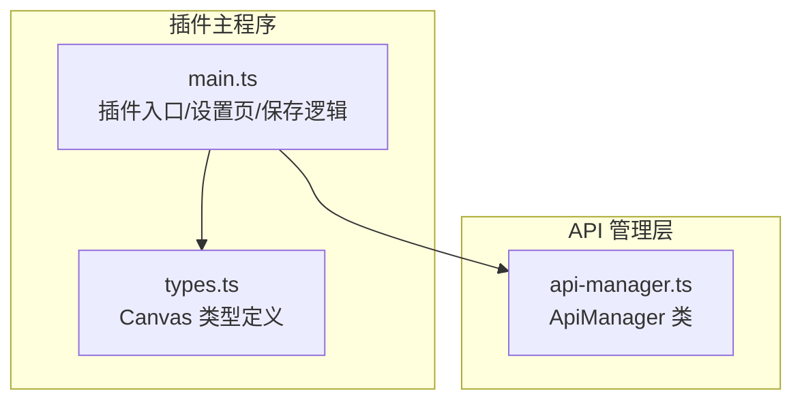
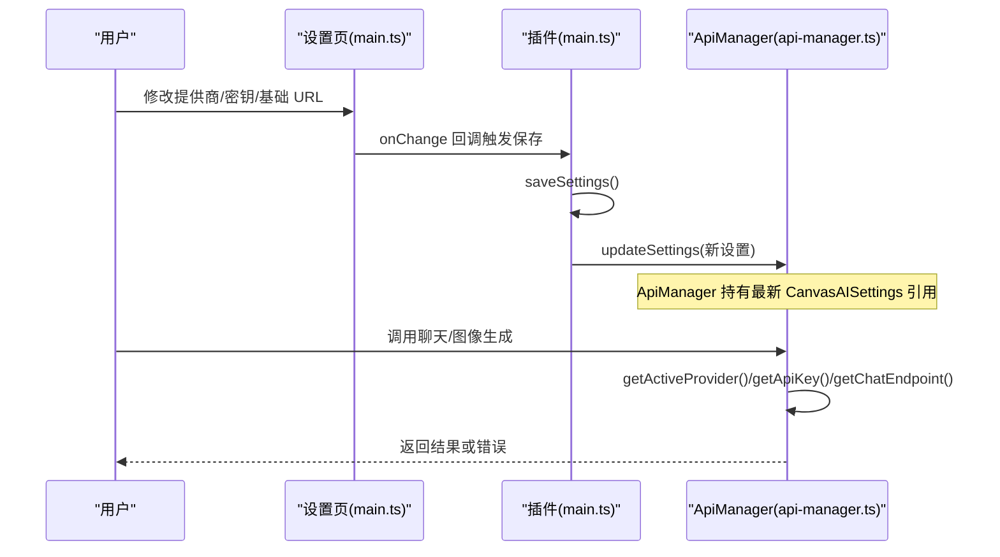
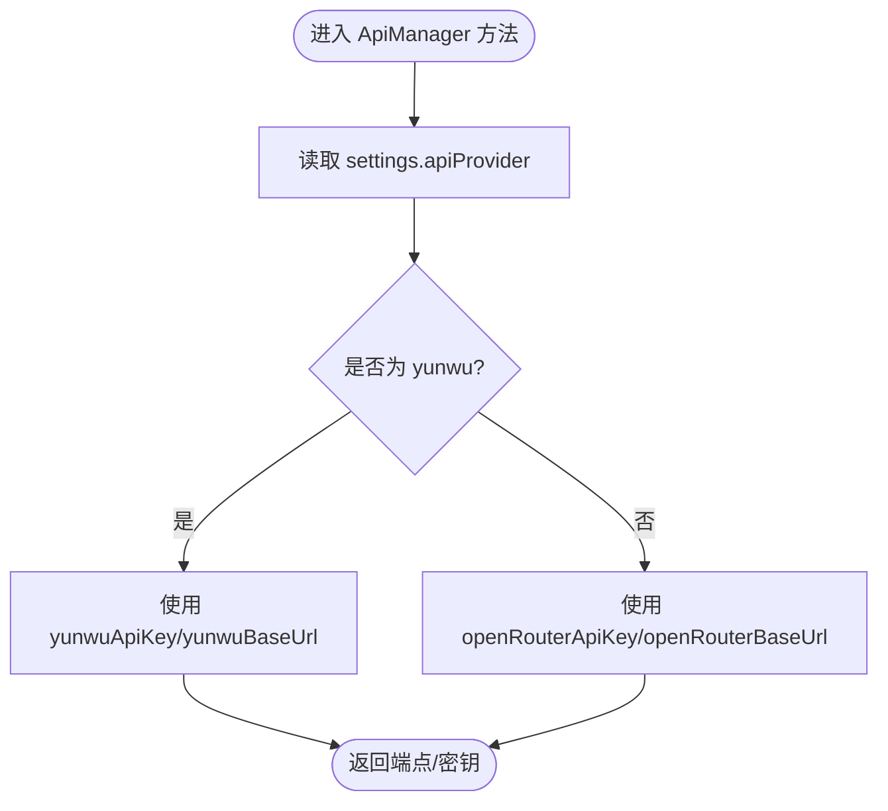
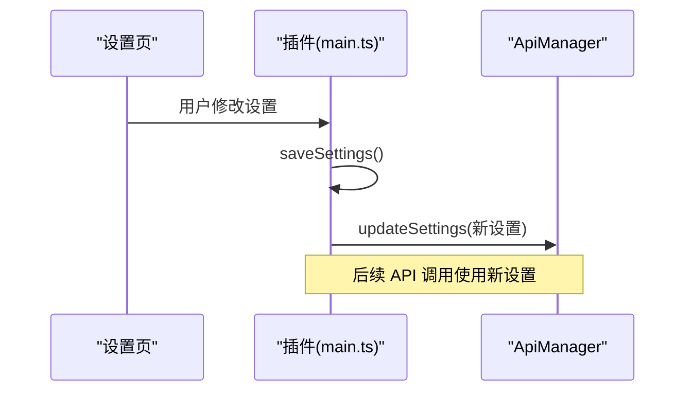

# 配置与认证API

<cite>
**本文引用的文件**
- [api-manager.ts](file://api-manager.ts)
- [main.ts](file://main.ts)
- [types.ts](file://types.ts)
</cite>

## 目录
1. [简介](#简介)
2. [项目结构](#项目结构)
3. [核心组件](#核心组件)
4. [架构总览](#架构总览)
5. [详细组件分析](#详细组件分析)
6. [依赖关系分析](#依赖关系分析)
7. [性能考量](#性能考量)
8. [故障排查指南](#故障排查指南)
9. [结论](#结论)
10. [附录](#附录)

## 简介
本参考文档聚焦于 Obsidian Canvas AI 插件中的 API 配置与认证机制，围绕以下目标展开：
- 解析 ApiManager 类中的关键方法：getActiveProvider、getApiKey、getChatEndpoint、isConfigured 的实现与行为
- 说明 CanvasAISettings 接口中各字段（如 openRouterApiKey、yunwuApiKey、openRouterBaseUrl、yunwuBaseUrl 等）如何被 ApiManager 读取与使用
- 指导开发者如何在插件设置中正确配置提供商（openrouter 或 yunwu），以确保 API 调用成功
- 解释 updateSettings 方法如何在运行时同步最新配置，以及设置变更对 ApiManager 的影响

## 项目结构
本节概览与 API 配置相关的核心文件及其职责：
- api-manager.ts：封装与 LLM 服务交互的 API 管理器，负责根据当前提供商动态选择端点、模型与密钥，并执行请求
- main.ts：插件主入口，定义 CanvasAISettings 接口、默认设置、设置页渲染与保存逻辑，负责将设置同步到 ApiManager
- types.ts：Canvas 类型定义，为 Canvas 视图与节点提供类型支撑

图表来源
- [api-manager.ts](file://api-manager.ts#L70-L141)
- [main.ts](file://main.ts#L915-L1030)
- [types.ts](file://types.ts#L1-L128)

章节来源
- [api-manager.ts](file://api-manager.ts#L70-L141)
- [main.ts](file://main.ts#L915-L1030)
- [types.ts](file://types.ts#L1-L128)

## 核心组件
- CanvasAISettings 接口：集中定义了 API 提供商选择、OpenRouter 与 Yunwu 的密钥与基础 URL、文本/图像模型、调试模式、系统提示词、预设等配置项
- ApiManager 类：持有 CanvasAISettings 引用，提供动态选择提供商、获取密钥与端点、检查配置、发送聊天/图像生成请求等能力
- 设置页与保存流程：在设置页中选择提供商、填写密钥与基础 URL，保存后通过 updateSettings 将最新配置同步给 ApiManager

章节来源
- [main.ts](file://main.ts#L10-L51)
- [api-manager.ts](file://api-manager.ts#L70-L141)
- [main.ts](file://main.ts#L1792-L1800)

## 架构总览
下图展示了从设置页到 ApiManager 的配置流转与调用链路：

图表来源
- [main.ts](file://main.ts#L1792-L1800)
- [api-manager.ts](file://api-manager.ts#L70-L141)

## 详细组件分析

### ApiManager 类与方法详解
- 构造函数与设置引用
  - 构造时接收 CanvasAISettings 并保存为内部私有字段
  - updateSettings 在设置变更时替换内部 settings 引用，确保后续调用使用最新配置
- getActiveProvider
  - 依据 settings.apiProvider 返回当前活跃提供商（默认 openrouter）
- getApiKey
  - 若活跃提供商为 yunwu，则返回 yunwuApiKey；否则返回 openRouterApiKey
- getChatEndpoint
  - 若活跃提供商为 yunwu，则基于 yunwuBaseUrl 拼接 /v1/chat/completions；否则使用 openRouterBaseUrl
- isConfigured
  - 仅需存在任一提供商的 API Key 即视为已配置

图表来源
- [api-manager.ts](file://api-manager.ts#L85-L112)

章节来源
- [api-manager.ts](file://api-manager.ts#L70-L141)

### CanvasAISettings 字段与使用方式
- 提供商选择
  - apiProvider：'openrouter' | 'yunwu'
- OpenRouter 配置
  - openRouterApiKey、openRouterBaseUrl、openRouterTextModel、openRouterImageModel、openRouterUseCustomTextModel、openRouterUseCustomImageModel
- Yunwu 配置
  - yunwuApiKey、yunwuBaseUrl、yunwuTextModel、yunwuImageModel、yunwuUseCustomTextModel、yunwuUseCustomImageModel
- 其他
  - imageCompressionQuality、imageMaxSize、defaultAspectRatio、defaultResolution、defaultChatTemperature、debugMode、imageSystemPrompt、chatPresets、imagePresets

ApiManager 在以下位置直接读取上述字段：
- 动态选择提供商与密钥：getActiveProvider、getApiKey
- 端点拼接：getChatEndpoint
- 文本/图像模型选择：getTextModel、getImageModel
- 图像生成系统提示：imageSystemPrompt
- 配置检查：isConfigured

章节来源
- [main.ts](file://main.ts#L10-L51)
- [api-manager.ts](file://api-manager.ts#L85-L141)

### 设置页与运行时同步
- 设置页渲染
  - 根据 apiProvider 显示对应提供商的密钥与基础 URL 输入框
  - 提供“测试连接”按钮，按当前提供商向对应模型列表端点发起请求
- 保存与同步
  - onChange 回调中调用 saveSettings，将设置持久化
  - saveSettings 内部调用 apiManager.updateSettings，使 ApiManager 使用最新配置
- 默认值
  - DEFAULT_SETTINGS 定义了初始值，包括默认提供商、默认模型与基础 URL

图表来源
- [main.ts](file://main.ts#L1792-L1800)
- [main.ts](file://main.ts#L1924-L2000)

章节来源
- [main.ts](file://main.ts#L1792-L1800)
- [main.ts](file://main.ts#L1924-L2000)

### 请求发送与错误处理
- 发送聊天/图像请求
  - sendRequest 统一封装 HTTP 请求，包含 Authorization、Content-Type、HTTP-Referer、X-Title 等头部
  - 根据活跃提供商选择端点与密钥
- 错误处理
  - 对 HTTP 错误进行捕获并抛出带状态码与错误体的消息
  - 对响应体中的 error 字段进行检查，统一抛出可读错误

章节来源
- [api-manager.ts](file://api-manager.ts#L646-L677)

## 依赖关系分析
- ApiManager 依赖 CanvasAISettings 接口提供的配置项
- 插件主程序负责渲染设置页、持久化设置，并通过 updateSettings 将最新配置注入 ApiManager
- types.ts 为 Canvas 视图与节点提供类型支撑，间接影响插件在 Canvas 上的交互与生成流程

图表来源
- [types.ts](file://types.ts#L1-L128)
- [main.ts](file://main.ts#L915-L1030)
- [api-manager.ts](file://api-manager.ts#L70-L141)

章节来源
- [types.ts](file://types.ts#L1-L128)
- [main.ts](file://main.ts#L915-L1030)
- [api-manager.ts](file://api-manager.ts#L70-L141)

## 性能考量
- 端点与模型选择均为常量时间操作，开销极低
- 请求发送采用 Obsidian 的 requestUrl，网络延迟为主要性能瓶颈
- 建议：
  - 在设置页中缓存模型列表，避免频繁请求
  - 合理设置默认模型与基础 URL，减少运行时分支判断
  - 对图像生成请求控制分辨率与尺寸，降低传输与解析成本

## 故障排查指南
- “未配置 API Key”
  - 现象：调用聊天/图像生成时报错
  - 排查：确认 settings.apiProvider 与对应密钥字段（openRouterApiKey 或 yunwuApiKey）均已填写
  - 参考：isConfigured 与 getApiKey 的实现
- “连接失败/HTTP 错误”
  - 现象：sendRequest 抛出 HTTP 状态码与错误体
  - 排查：检查 settings.openRouterBaseUrl 或 settings.yunwuBaseUrl 是否正确；确认网络可达；核对密钥权限
- “图像生成无返回”
  - 现象：响应中无图片内容
  - 排查：检查模型是否支持图像输出；确认 imageSystemPrompt 与输入图像格式；查看 parseYunwuImageResponse 的解析逻辑
- “设置未生效”
  - 现象：切换提供商或修改密钥后仍使用旧配置
  - 排查：确认 saveSettings 已调用且 updateSettings 已执行；检查设置页是否重新渲染

章节来源
- [api-manager.ts](file://api-manager.ts#L136-L141)
- [api-manager.ts](file://api-manager.ts#L646-L677)
- [main.ts](file://main.ts#L1792-L1800)

## 结论
- ApiManager 通过 CanvasAISettings 实现对多提供商的统一抽象，动态选择密钥、端点与模型
- 插件设置页负责配置与持久化，saveSettings 与 updateSettings 确保运行时配置实时同步
- 开发者只需在设置页正确填写提供商、密钥与基础 URL，即可无缝切换 openrouter 与 yunwu 的 API 调用

## 附录
- 配置字段速览（来自 CanvasAISettings）
  - 提供商：apiProvider
  - OpenRouter：openRouterApiKey、openRouterBaseUrl、openRouterTextModel、openRouterImageModel、openRouterUseCustomTextModel、openRouterUseCustomImageModel
  - Yunwu：yunwuApiKey、yunwuBaseUrl、yunwuTextModel、yunwuImageModel、yunwuUseCustomTextModel、yunwuUseCustomImageModel
  - 其他：imageCompressionQuality、imageMaxSize、defaultAspectRatio、defaultResolution、defaultChatTemperature、debugMode、imageSystemPrompt、chatPresets、imagePresets

章节来源
- [main.ts](file://main.ts#L10-L51)