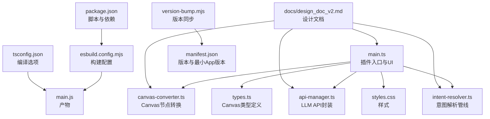
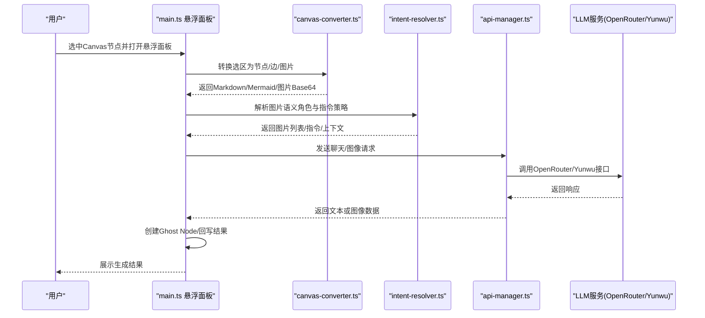
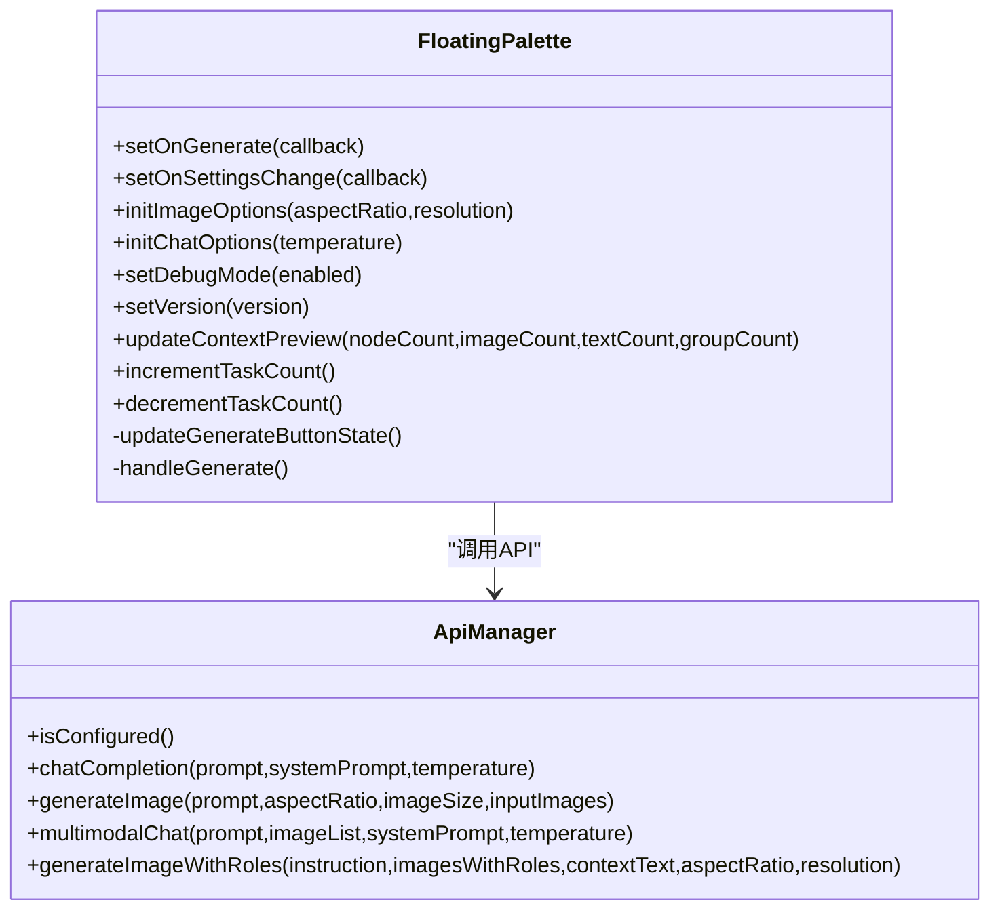
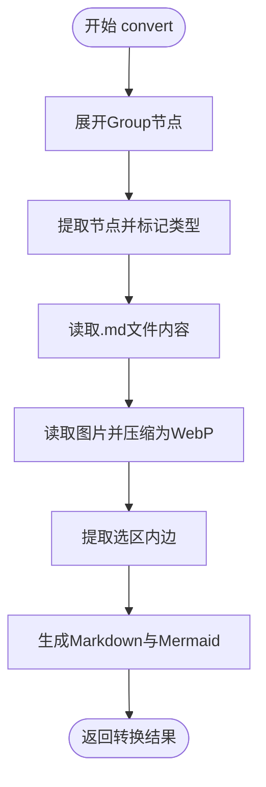
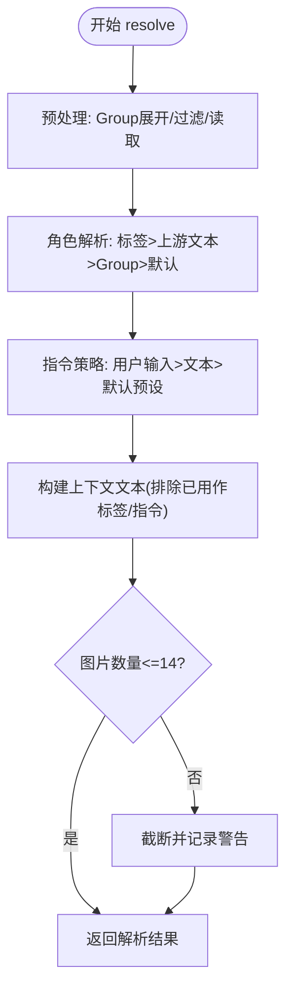
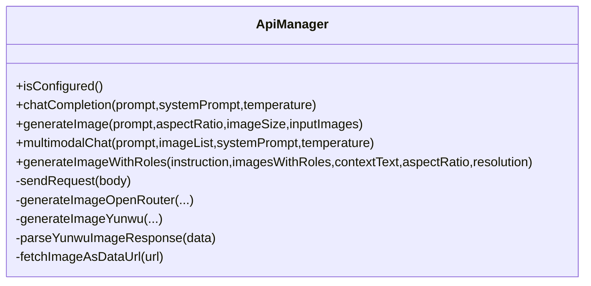
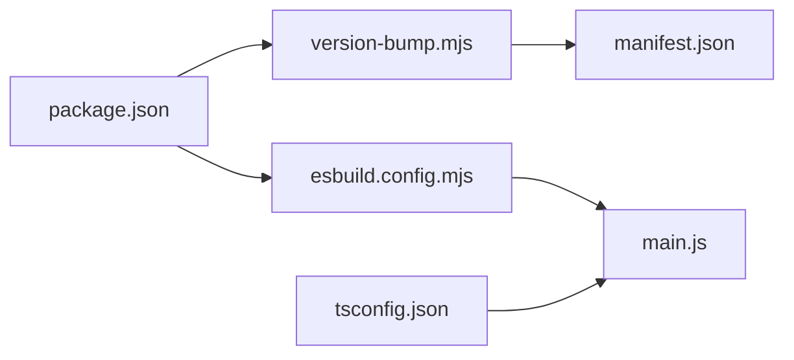

# 开发者指南

<cite>
**本文引用的文件**
- [main.ts](file://main.ts)
- [canvas-converter.ts](file://canvas-converter.ts)
- [api-manager.ts](file://api-manager.ts)
- [intent-resolver.ts](file://intent-resolver.ts)
- [types.ts](file://types.ts)
- [esbuild.config.mjs](file://esbuild.config.mjs)
- [package.json](file://package.json)
- [tsconfig.json](file://tsconfig.json)
- [version-bump.mjs](file://version-bump.mjs)
- [manifest.json](file://manifest.json)
- [README.md](file://README.md)
- [styles.css](file://styles.css)
- [docs/design_doc_v2.md](file://docs/design_doc_v2.md)
</cite>

## 目录
1. [简介](#简介)
2. [项目结构](#项目结构)
3. [核心组件](#核心组件)
4. [架构总览](#架构总览)
5. [详细组件分析](#详细组件分析)
6. [依赖分析](#依赖分析)
7. [性能考虑](#性能考虑)
8. [故障排查指南](#故障排查指南)
9. [结论](#结论)
10. [附录](#附录)

## 简介
本指南面向希望为 Obsidian Canvas AI 插件贡献代码或进行二次开发的开发者。文档将帮助你快速理解项目结构、掌握核心模块职责、完成本地开发与构建流程，并了解版本管理与发布流程。通过逐步讲解，你将能够：
- 理解 main.ts、canvas-converter.ts、api-manager.ts、intent-resolver.ts 等关键模块的职责与协作关系
- 使用 npm 脚本完成安装依赖、本地开发构建与生产构建
- 理解 esbuild 配置、TypeScript 编译选项与版本同步机制
- 设置开发环境、运行调试与提交代码

## 项目结构
该项目采用“按功能模块组织”的结构，核心模块围绕 Canvas 数据转换、意图解析、API 调用与 UI 悬浮面板展开，配合构建与版本管理脚本，形成完整的开发与发布工作流。

图表来源
- [main.ts](file://main.ts#L1-L120)
- [canvas-converter.ts](file://canvas-converter.ts#L1-L60)
- [api-manager.ts](file://api-manager.ts#L1-L120)
- [intent-resolver.ts](file://intent-resolver.ts#L1-L80)
- [types.ts](file://types.ts#L1-L60)
- [esbuild.config.mjs](file://esbuild.config.mjs#L1-L50)
- [package.json](file://package.json#L1-L29)
- [tsconfig.json](file://tsconfig.json#L1-L29)
- [version-bump.mjs](file://version-bump.mjs#L1-L47)
- [manifest.json](file://manifest.json#L1-L9)
- [docs/design_doc_v2.md](file://docs/design_doc_v2.md#L1-L120)

章节来源
- [package.json](file://package.json#L1-L29)
- [tsconfig.json](file://tsconfig.json#L1-L29)
- [esbuild.config.mjs](file://esbuild.config.mjs#L1-L50)
- [version-bump.mjs](file://version-bump.mjs#L1-L47)
- [manifest.json](file://manifest.json#L1-L9)
- [docs/design_doc_v2.md](file://docs/design_doc_v2.md#L1-L120)

## 核心组件
- 插件入口与UI（main.ts）
  - 负责插件生命周期、设置项、悬浮面板（Floating Palette）UI、预设管理、任务计数与生成回调等。
  - 与 Canvas API 交互，创建/更新节点，处理用户输入与模式切换。
- Canvas 转换器（canvas-converter.ts）
  - 将选中的 Canvas 节点转换为 Markdown、Mermaid 与图片 Base64，支持 Group 展开、文件内容读取、图片压缩与尺寸限制。
- 意图解析器（intent-resolver.ts）
  - 基于图谱（节点与边）解析图片语义角色，决定指令回退策略，构建上下文文本，控制并发与防呆。
- API 管理器（api-manager.ts）
  - 统一封装 OpenRouter/Yunwu 的聊天与图像生成接口，支持多模态消息、图像配置与响应解析。
- 类型定义（types.ts）
  - 定义 Canvas 节点、边、视图与坐标等接口，扩展 Obsidian 模块声明。
- 构建与版本（esbuild.config.mjs、package.json、tsconfig.json、version-bump.mjs、manifest.json）
  - 通过 esbuild 打包，TypeScript 编译，版本同步脚本与清单文件，确保产物与清单一致。

章节来源
- [main.ts](file://main.ts#L1-L120)
- [canvas-converter.ts](file://canvas-converter.ts#L1-L120)
- [intent-resolver.ts](file://intent-resolver.ts#L1-L120)
- [api-manager.ts](file://api-manager.ts#L1-L120)
- [types.ts](file://types.ts#L1-L128)
- [esbuild.config.mjs](file://esbuild.config.mjs#L1-L50)
- [package.json](file://package.json#L1-L29)
- [tsconfig.json](file://tsconfig.json#L1-L29)
- [version-bump.mjs](file://version-bump.mjs#L1-L47)
- [manifest.json](file://manifest.json#L1-L9)

## 架构总览
插件采用“UI 面板 + 数据转换 + 意图解析 + API 调用”的分层架构。用户在 Canvas 中选区后，通过悬浮面板触发生成；数据在本地完成转换与解析，再通过 API 管理器调用 LLM 服务，最后将结果回写到 Canvas。

图表来源
- [main.ts](file://main.ts#L200-L420)
- [canvas-converter.ts](file://canvas-converter.ts#L465-L556)
- [intent-resolver.ts](file://intent-resolver.ts#L60-L130)
- [api-manager.ts](file://api-manager.ts#L140-L275)

## 详细组件分析

### 插件入口与悬浮面板（main.ts）
- 设置项与默认值：定义 API 提供商、模型、压缩质量、最大尺寸、默认纵横比/分辨率/温度、调试模式与图像系统提示词等。
- 悬浮面板（FloatingPalette）：
  - 模式切换（文本/图像）、预设选择与增删改查、图像参数（纵横比/分辨率）、聊天温度、上下文预览、生成按钮与任务计数。
  - 与 ApiManager 配合，检查配置后异步发起任务，支持多任务并发。
- 与 Canvas 的交互：
  - 通过 Obsidian Canvas API 获取选区、节点与边，结合 CanvasConverter 与 IntentResolver 完成数据准备与意图解析。

图表来源
- [main.ts](file://main.ts#L200-L420)
- [api-manager.ts](file://api-manager.ts#L136-L275)

章节来源
- [main.ts](file://main.ts#L1-L2269)

### Canvas 转换器（canvas-converter.ts）
- 节点类型识别：文本、文件（含图片与非图片）、链接、群组。
- Group 展开：基于包围盒获取组内子节点，支持标记“通过组展开的成员节点”。
- 文件内容读取：.md 文件读取为文本内容；图片读取为二进制并压缩为 WebP，限制尺寸与质量。
- 输出格式：Markdown 与 Mermaid，便于在 UI 中展示与调试。
- 转换入口：convert（异步），串联展开、读取、提取边、格式化输出。

图表来源
- [canvas-converter.ts](file://canvas-converter.ts#L465-L556)

章节来源
- [canvas-converter.ts](file://canvas-converter.ts#L1-L556)

### 意图解析器（intent-resolver.ts）
- 预处理：Group 展开、过滤非图片文件、读取内容与图片、统计图片/文本数量。
- 角色解析：基于边标签、上游文本、Group 标题确定每张图片的语义角色，支持循环检测。
- 指令策略：用户输入优先，其次未被用作标签的文本节点，最后默认预设。
- 上下文构建：排除已用作标签或指令的节点，拼接文本与文件内容。
- 限制与安全：最多使用 14 张图片，自动截断并给出警告；空指令保护。

图表来源
- [intent-resolver.ts](file://intent-resolver.ts#L60-L130)
- [intent-resolver.ts](file://intent-resolver.ts#L132-L210)
- [intent-resolver.ts](file://intent-resolver.ts#L210-L378)

章节来源
- [intent-resolver.ts](file://intent-resolver.ts#L1-L378)

### API 管理器（api-manager.ts）
- 多提供商支持：OpenRouter 与 Yunwu，统一聊天与图像生成接口。
- 多模态消息：支持文本与图片混合输入，图像以 data URL 形式传输。
- 图像生成：支持纵横比与分辨率配置；Yunwu 使用 Gemini 原生格式与不同端点。
- 错误处理：HTTP 错误与 API 返回错误统一抛出，便于 UI 捕获与提示。

图表来源
- [api-manager.ts](file://api-manager.ts#L1-L200)
- [api-manager.ts](file://api-manager.ts#L277-L579)

章节来源
- [api-manager.ts](file://api-manager.ts#L1-L679)

### 类型定义（types.ts）
- Canvas 节点、边、菜单、视图与坐标接口，扩展 Obsidian 模块声明，确保编译期类型安全。
- 为 main.ts、canvas-converter.ts、intent-resolver.ts 提供统一的类型约束。

章节来源
- [types.ts](file://types.ts#L1-L128)

## 依赖分析
- 构建链路
  - package.json 的 scripts 调用 version-bump.mjs 同步版本，随后执行 esbuild.config.mjs 进行打包。
  - esbuild 将 main.ts 作为入口，bundle 为 cjs，treeShaking，按生产/开发模式控制 sourcemap 与 minify。
- TypeScript 编译
  - tsconfig.json 指定 ESNext 模块与 ES6 目标，开启严格空检查与隔离模块，包含所有 .ts 文件，排除 docs 与 node_modules。
- 版本同步
  - version-bump.mjs 读取 npm_package_version，更新 manifest.json 的 version 与 versions.json 的映射。
- 外部依赖
  - esbuild、obsidian、typescript、@types/node 等，均在 devDependencies 中声明。

图表来源
- [package.json](file://package.json#L1-L29)
- [version-bump.mjs](file://version-bump.mjs#L1-L47)
- [manifest.json](file://manifest.json#L1-L9)
- [esbuild.config.mjs](file://esbuild.config.mjs#L1-L50)
- [tsconfig.json](file://tsconfig.json#L1-L29)

章节来源
- [package.json](file://package.json#L1-L29)
- [tsconfig.json](file://tsconfig.json#L1-L29)
- [esbuild.config.mjs](file://esbuild.config.mjs#L1-L50)
- [version-bump.mjs](file://version-bump.mjs#L1-L47)
- [manifest.json](file://manifest.json#L1-L9)

## 性能考虑
- 图片压缩与尺寸限制：在转换阶段对图片进行 WebP 压缩与尺寸缩放，降低请求体积与时间。
- 并发与异步：悬浮面板支持多任务并发，不阻塞 UI；任务计数用于反馈生成状态。
- Tree Shaking 与外部依赖：esbuild 将 obsidian 与 Electron 等标记为 external，减小产物体积。
- 编译优化：TypeScript 启用严格空检查与隔离模块，提升类型安全性与构建稳定性。

章节来源
- [canvas-converter.ts](file://canvas-converter.ts#L350-L464)
- [main.ts](file://main.ts#L732-L800)
- [esbuild.config.mjs](file://esbuild.config.mjs#L1-L50)
- [tsconfig.json](file://tsconfig.json#L1-L29)

## 故障排查指南
- API Key 未配置
  - 现象：点击生成按钮无请求或弹出配置引导。
  - 处理：在设置中配置 OpenRouter/Yunwu 的 API Key 与模型。
- 图片数量超限
  - 现象：UI 警告“选中图片超过限制，将截断前N张”。
  - 处理：减少选区图片数量或调整图片质量/尺寸。
- 安全过滤拦截
  - 现象：生成节点变为灰色禁止图标，点击显示拦截提示。
  - 处理：修改提示词或检查内容合规性。
- 网络错误
  - 现象：生成节点变为红色警告图标，提供重试按钮。
  - 处理：检查网络、API Key 有效性与提供商端点可用性。
- 构建失败
  - 现象：npm run build/dev 报错。
  - 处理：确认 Node.js 与 npm 版本满足依赖要求；检查 tsconfig.json 与 esbuild 配置；运行 version-bump.mjs 同步版本。

章节来源
- [api-manager.ts](file://api-manager.ts#L136-L200)
- [intent-resolver.ts](file://intent-resolver.ts#L90-L130)
- [main.ts](file://main.ts#L732-L800)
- [version-bump.mjs](file://version-bump.mjs#L1-L47)

## 结论
本指南从项目结构、核心模块职责、构建与版本管理、性能与故障排查等方面，为贡献者提供了全面的开发指引。建议在本地先完成依赖安装与构建验证，再深入理解各模块的数据流与调用关系，逐步开展功能扩展与优化。

## 附录

### 开发环境搭建与构建说明
- 安装依赖
  - 使用 npm 安装项目依赖。
- 本地开发构建
  - 运行 npm run dev，脚本会先同步版本，再启动 esbuild watch 模式，实时打包 main.js。
- 生产构建
  - 运行 npm run build，脚本会先同步版本，执行 TypeScript 类型检查，然后以生产模式打包 main.js。
- TypeScript 编译选项
  - 目标 ES6，模块 ESNext，启用严格空检查与隔离模块，包含所有 .ts 文件，排除 docs 与 node_modules。
- 版本管理流程
  - version-bump.mjs 读取 npm_package_version，更新 manifest.json 的 version 与 versions.json 的映射。
- 插件清单
  - manifest.json 定义插件标识、名称、版本、最小 App 版本与描述。

章节来源
- [package.json](file://package.json#L1-L29)
- [tsconfig.json](file://tsconfig.json#L1-L29)
- [esbuild.config.mjs](file://esbuild.config.mjs#L1-L50)
- [version-bump.mjs](file://version-bump.mjs#L1-L47)
- [manifest.json](file://manifest.json#L1-L9)

### 代码贡献与提交建议
- 分支策略
  - 建议基于 main 分支创建功能分支，完成后发起 Pull Request。
- 提交规范
  - 提交信息清晰描述变更目的与影响范围；涉及构建或版本的改动需附带说明。
- 测试与验证
  - 在本地 Canvas 中验证 UI 交互、数据转换与 API 调用；关注图片压缩、并发任务与错误状态反馈。
- 文档与设计
  - 变更涉及 UI 或行为时，同步更新设计文档与 README 中的相关说明。

章节来源
- [README.md](file://README.md#L1-L101)
- [docs/design_doc_v2.md](file://docs/design_doc_v2.md#L1-L120)