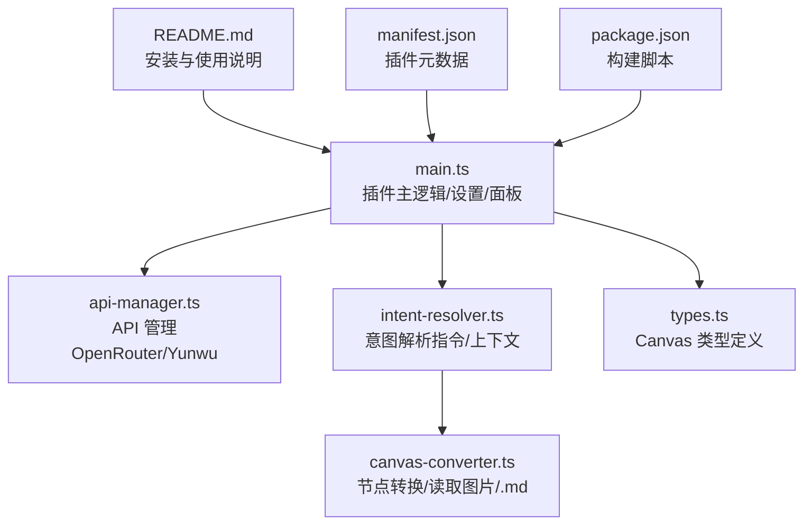
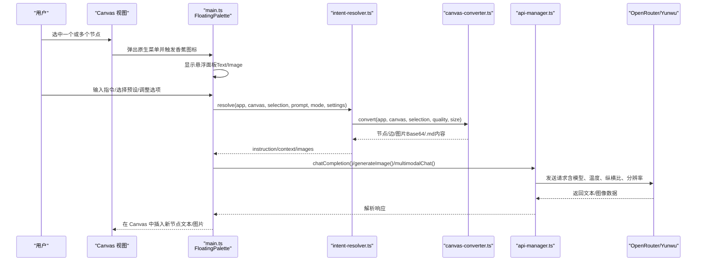
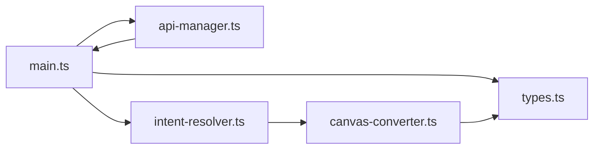

# 快速开始

<cite>
**本文引用的文件**
- [README.md](file://README.md)
- [main.ts](file://main.ts)
- [api-manager.ts](file://api-manager.ts)
- [intent-resolver.ts](file://intent-resolver.ts)
- [canvas-converter.ts](file://canvas-converter.ts)
- [types.ts](file://types.ts)
- [manifest.json](file://manifest.json)
- [package.json](file://package.json)
</cite>

## 目录
1. [简介](#简介)
2. [项目结构](#项目结构)
3. [核心组件](#核心组件)
4. [架构总览](#架构总览)
5. [详细组件分析](#详细组件分析)
6. [依赖分析](#依赖分析)
7. [性能考虑](#性能考虑)
8. [故障排查指南](#故障排查指南)
9. [结论](#结论)
10. [附录](#附录)

## 简介
本指南面向 Obsidian 新手，帮助你在 5 分钟内完成插件安装、配置 API Key，并成功运行第一个 AI 任务（在 Canvas 中选中节点、唤起悬浮面板、在 Text 模式生成文本摘要，在 Image 模式生成图像）。文中所有步骤均基于仓库提供的 README 与源码实现，配合图片链接便于对照操作。

## 项目结构
该插件为 Obsidian Canvas 增强插件，核心围绕 Canvas 选区上下文感知、AI 对话与图像生成展开。主要文件职责如下：
- README.md：安装与使用说明、功能概览与截图
- main.ts：插件主逻辑、设置项、浮动面板、提示词预设、任务并发与生成流程
- api-manager.ts：统一管理 OpenRouter/Yunwu API，封装聊天与图像生成请求
- intent-resolver.ts：意图解析管线，将 Canvas 选区转换为 AI 可理解的指令与上下文
- canvas-converter.ts：将 Canvas 节点转换为 Markdown/Mermaid 等结构化内容，并读取图片与 .md 文件内容
- types.ts：Canvas API 类型定义，扩展 Obsidian Canvas 相关接口
- manifest.json/package.json：插件元数据与构建脚本

图表来源
- [README.md](file://README.md#L41-L101)
- [main.ts](file://main.ts#L1-L120)
- [api-manager.ts](file://api-manager.ts#L1-L120)
- [intent-resolver.ts](file://intent-resolver.ts#L1-L60)
- [canvas-converter.ts](file://canvas-converter.ts#L1-L60)
- [types.ts](file://types.ts#L1-L40)
- [manifest.json](file://manifest.json#L1-L9)
- [package.json](file://package.json#L1-L20)

章节来源
- [README.md](file://README.md#L41-L101)
- [manifest.json](file://manifest.json#L1-L9)
- [package.json](file://package.json#L1-L20)

## 核心组件
- 插件设置与面板
  - 设置项包含 API 提供商（OpenRouter/Yunwu）、API Key、文本/图像模型、默认纵横比/分辨率、温度、调试模式、图像系统提示、提示词预设等。
  - 浮动面板支持 Text 与 Image 两个标签页，内置预设管理、上下文预览、生成按钮与选项切换。
- API 管理器
  - 统一处理聊天与图像生成请求，兼容 OpenRouter 与 Yunwu 的不同端点与参数风格。
- 意图解析器
  - 将 Canvas 选区转换为 AI 指令与上下文，自动分配图片语义角色，构建文本上下文，支持默认回退策略。
- Canvas 转换器
  - 读取图片为压缩 WebP Base64，读取 .md 文件内容，输出 Markdown/Mermaid，支持群组展开与边提取。

章节来源
- [main.ts](file://main.ts#L1-L120)
- [api-manager.ts](file://api-manager.ts#L1-L120)
- [intent-resolver.ts](file://intent-resolver.ts#L1-L120)
- [canvas-converter.ts](file://canvas-converter.ts#L1-L120)

## 架构总览
下图展示从用户在 Canvas 中选中节点到生成结果的关键流程与模块交互。

图表来源
- [main.ts](file://main.ts#L200-L320)
- [intent-resolver.ts](file://intent-resolver.ts#L60-L140)
- [canvas-converter.ts](file://canvas-converter.ts#L320-L420)
- [api-manager.ts](file://api-manager.ts#L140-L220)

## 详细组件分析

### 安装与启用（5 分钟）
- 手动安装步骤
  1) 访问 README 中的下载链接，获取插件 ZIP 包。
  2) 打开你的 Obsidian 仓库目录，进入 .obsidian/plugins/，将 ZIP 解压到该目录。
  3) 重启 Obsidian，进入“设置”->“第三方插件”，关闭“安全模式”，找到“Canvas Banana”并启用。
- 参考截图
  - 插件下载与解压位置说明
  - 启用插件界面示意

章节来源
- [README.md](file://README.md#L41-L63)

### 配置 API Key（选择 OpenRouter 或 Yunwu）
- 打开“设置”->“Canvas Banana”
- 选择 API Provider（默认 OpenRouter）
- 填写 API Key（OpenRouter 或 Yunwu）
- （可选）选择或自定义 Text/Image 模型
- 参考链接
  - 获取 API 注册地址（Yunwu、GPTGod）

章节来源
- [README.md](file://README.md#L64-L74)
- [main.ts](file://main.ts#L1-L120)
- [api-manager.ts](file://api-manager.ts#L85-L140)

### 基本使用示例

#### 在 Canvas 中选中节点并唤起面板
- 打开一个 Canvas 文件，使用鼠标框选或点击选中一个或多个节点
- 在节点上方出现的原生菜单中，点击“香蕉图标”
- 悬浮面板会出现在选中框右侧

章节来源
- [README.md](file://README.md#L75-L81)
- [main.ts](file://main.ts#L200-L320)

#### 在 Text 模式生成文本摘要
- 切换到“Text”标签页
- 输入你的指令或问题；可选地选择一个预设快速填入 Prompt
- 点击“Generate”
- AI 回复将以新卡片节点形式插入 Canvas

章节来源
- [README.md](file://README.md#L82-L87)
- [main.ts](file://main.ts#L320-L420)
- [api-manager.ts](file://api-manager.ts#L140-L220)

#### 在 Image 模式生成图像
- 切换到“Image”标签页
- 在输入框描述画面（留空则默认使用选中节点的文本）
- 调整分辨率（1K/2K/4K）与纵横比（1:1、16:9、4:3、9:16 等）
- 点击“Generate”
- 生成的图片以图片节点插入 Canvas

章节来源
- [README.md](file://README.md#L88-L94)
- [main.ts](file://main.ts#L320-L420)
- [api-manager.ts](file://api-manager.ts#L190-L275)

### 提示词预设管理
- 在面板输入框上方有一排工具按钮：
  - “+ (Add)”：将当前输入保存为新预设
  - “💾 (Save)”：更新当前选中的预设内容
  - “❌ (Delete)”：删除当前选中的预设
  - “📖 (Rename)”：重命名当前预设

章节来源
- [README.md](file://README.md#L95-L101)
- [main.ts](file://main.ts#L420-L620)

## 依赖分析
- 模块耦合
  - main.ts 依赖 api-manager.ts、intent-resolver.ts、canvas-converter.ts、types.ts
  - intent-resolver.ts 依赖 canvas-converter.ts 与 types.ts
  - canvas-converter.ts 依赖 types.ts 与 Obsidian vault API
  - api-manager.ts 依赖 Obsidian requestUrl 与 main.ts 的设置项
- 外部依赖
  - Obsidian Canvas API（types.ts 扩展）
  - OpenRouter/Yunwu 第三方 API（api-manager.ts）
- 潜在循环依赖
  - 当前文件组织清晰，未见循环导入

图表来源
- [main.ts](file://main.ts#L1-L120)
- [api-manager.ts](file://api-manager.ts#L1-L120)
- [intent-resolver.ts](file://intent-resolver.ts#L1-L60)
- [canvas-converter.ts](file://canvas-converter.ts#L1-L60)
- [types.ts](file://types.ts#L1-L40)

章节来源
- [main.ts](file://main.ts#L1-L120)
- [api-manager.ts](file://api-manager.ts#L1-L120)
- [intent-resolver.ts](file://intent-resolver.ts#L1-L60)
- [canvas-converter.ts](file://canvas-converter.ts#L1-L60)
- [types.ts](file://types.ts#L1-L40)

## 性能考虑
- 多任务并发
  - 面板支持“发射后不管”，可同时发起多个生成任务，无需等待上一个完成，提升效率。
- 图片压缩与尺寸限制
  - Canvas 转换器将图片压缩为 WebP，并限制最大尺寸，减少传输体积与 API 费用。
- 温度与模型选择
  - 可通过设置调节 Temperature 控制创造性；根据需求选择合适的 Text/Image 模型。

章节来源
- [main.ts](file://main.ts#L320-L420)
- [canvas-converter.ts](file://canvas-converter.ts#L350-L420)
- [api-manager.ts](file://api-manager.ts#L140-L220)

## 故障排查指南
- 无法生成内容
  - 确认已在“设置”->“Canvas Banana”中配置 API Provider 与 API Key
  - 若为空白提示，插件会使用默认回退策略（例如在 Image 模式下生成图像的默认指令）
- 图像生成失败
  - 检查纵横比与分辨率设置是否合理
  - 确认所选图片数量未超过上限
- API 请求错误
  - 查看网络与 API Key 是否正确
  - 如遇 HTTP 错误，关注返回体中的错误信息

章节来源
- [main.ts](file://main.ts#L760-L820)
- [api-manager.ts](file://api-manager.ts#L640-L679)
- [intent-resolver.ts](file://intent-resolver.ts#L100-L140)

## 结论
通过本快速入门指南，你已掌握从安装、配置到运行第一个 AI 任务的完整流程。建议在日常使用中结合提示词预设与上下文感知能力，进一步提升创作效率与质量。

## 附录

### 快速对照清单
- 安装
  - 下载 ZIP 并解压到 .obsidian/plugins/
  - 重启 Obsidian，启用 Canvas Banana
- 配置
  - 设置 -> Canvas Banana -> 选择 OpenRouter/Yunwu -> 填写 API Key -> 可选设置模型
- 使用
  - Canvas 选中节点 -> 点击香蕉图标 -> Text 模式输入指令/预设 -> Generate
  - Image 模式输入画面描述/留空 -> 调整纵横比/分辨率 -> Generate

章节来源
- [README.md](file://README.md#L41-L101)
- [main.ts](file://main.ts#L200-L420)