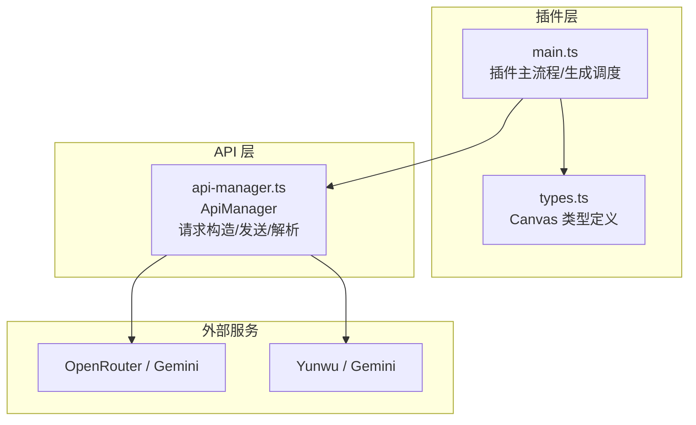
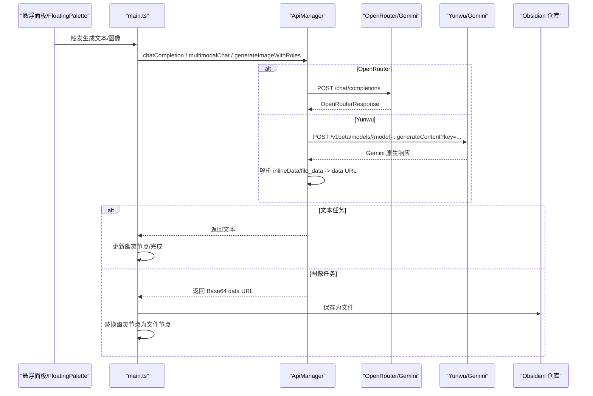
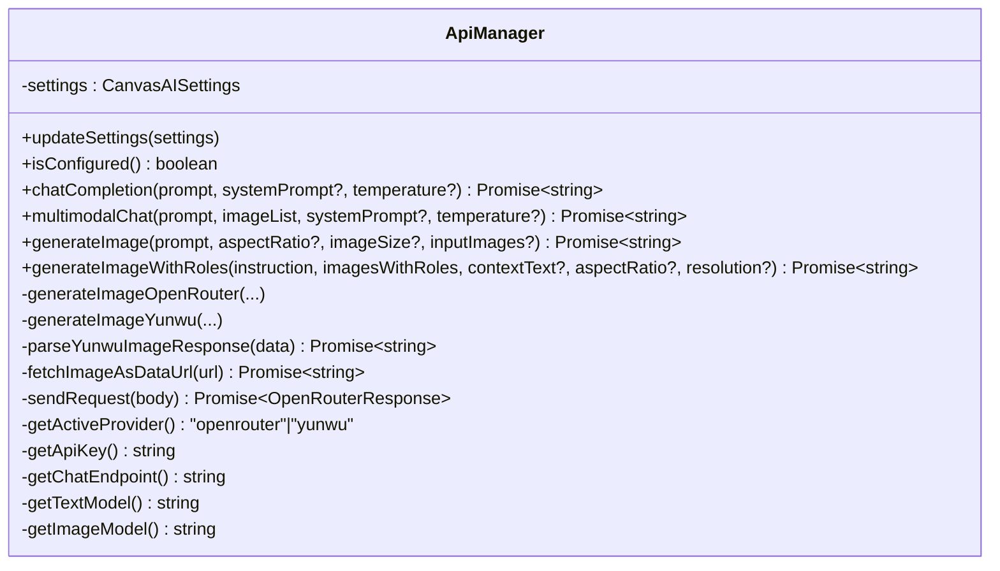
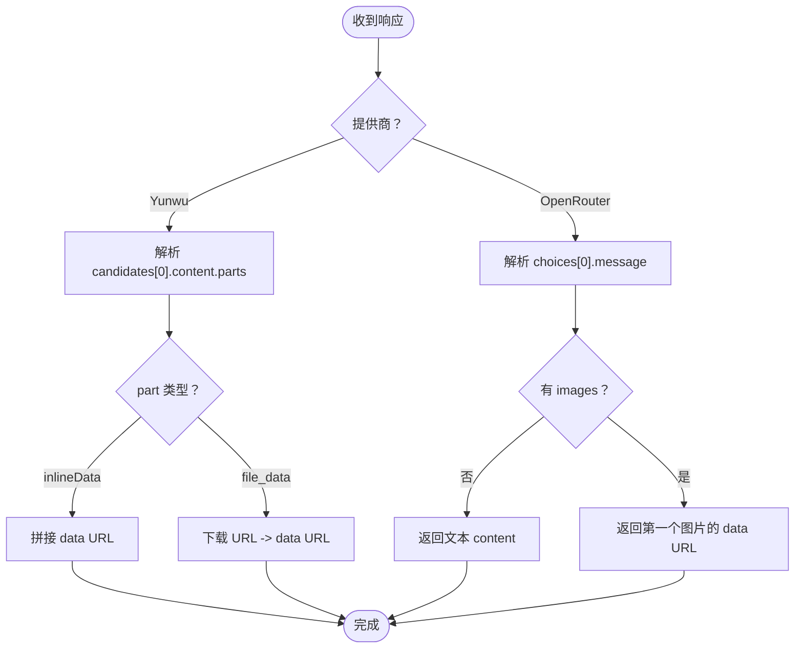
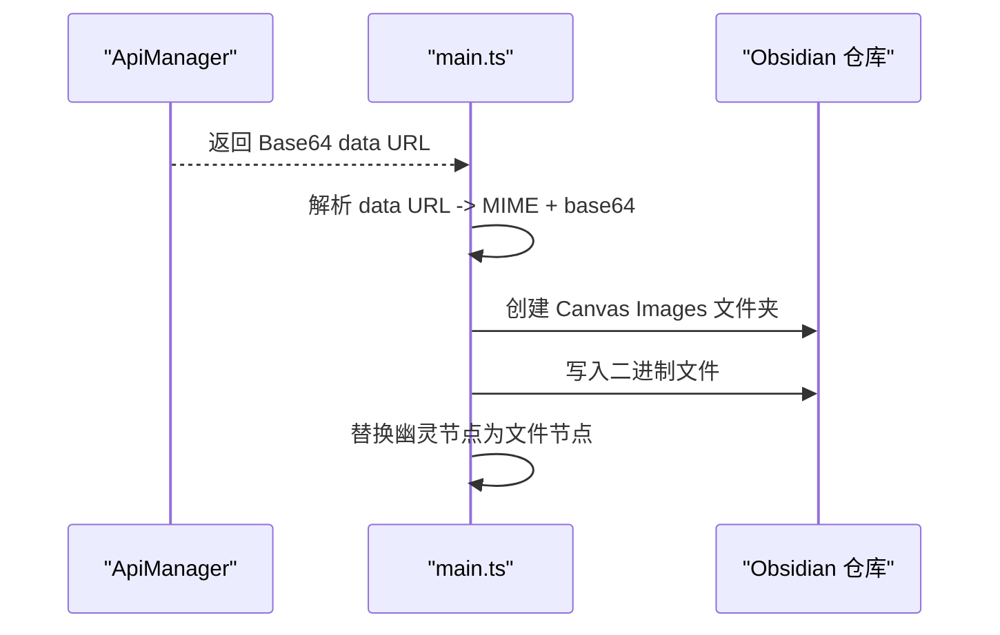
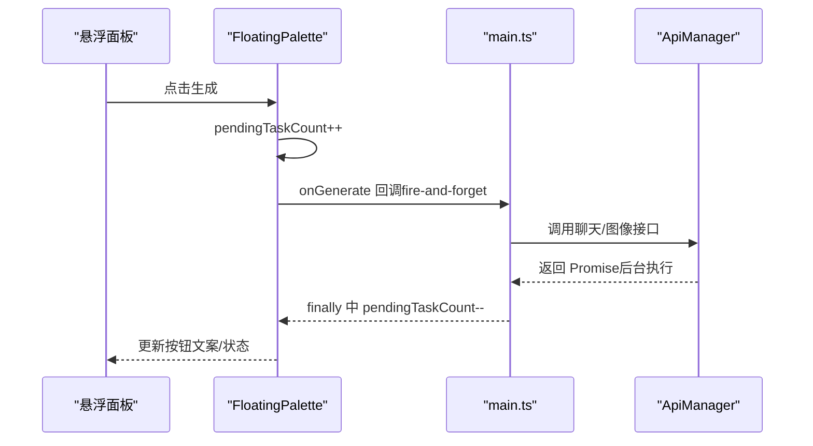
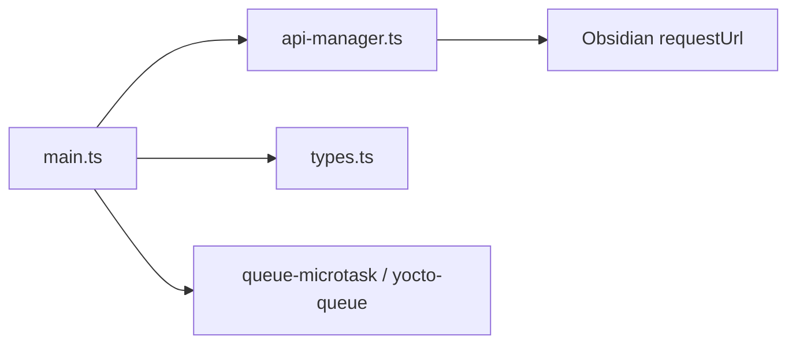

# API 管理器

<cite>
**本文引用的文件**
- [api-manager.ts](file://api-manager.ts)
- [main.ts](file://main.ts)
- [types.ts](file://types.ts)
- [manifest.json](file://manifest.json)
- [package.json](file://package.json)
- [docs/design_doc_v2.md](file://docs/design_doc_v2.md)
</cite>

## 目录
1. [简介](#简介)
2. [项目结构](#项目结构)
3. [核心组件](#核心组件)
4. [架构总览](#架构总览)
5. [详细组件分析](#详细组件分析)
6. [依赖关系分析](#依赖关系分析)
7. [性能考量](#性能考量)
8. [故障排查指南](#故障排查指南)
9. [结论](#结论)
10. [附录](#附录)

## 简介
本文件为 Obsidian Canvas 插件中的 API 管理器（ApiManager）提供全面的 API 文档。ApiManager 是与外部 LLM 服务（如 Gemini、OpenRouter、Yunwu）通信的中心枢纽，负责：
- 根据插件设置选择提供商与模型
- 构造符合 OpenRouter/Gemini 规范的请求体（包含 messages、model、modalities、image_config 等）
- 发送 HTTP 请求并解析响应
- 处理文本与图像两类响应，支持 Base64 数据 URL 与远程 URL 的统一处理
- 在设计文档约定的“图像输出路径”策略下，将生成的图像保存到 Obsidian 仓库
- 通过调用方的异步任务计数机制避免阻塞 UI 线程

## 项目结构
围绕 ApiManager 的关键文件与职责如下：
- api-manager.ts：定义请求类型、响应类型与核心 API 管理类，封装与外部服务的通信细节
- main.ts：插件主入口，负责初始化 ApiManager、触发生成流程、创建“幽灵节点”、保存图像到仓库
- types.ts：Canvas 类型定义，为生成流程提供上下文与节点信息
- docs/design_doc_v2.md：定义图像输出路径策略、异步队列与安全过滤等规范
- manifest.json、package.json：插件元数据与依赖声明

图表来源
- [api-manager.ts](file://api-manager.ts#L650-L679)
- [main.ts](file://main.ts#L1031-L1150)
- [types.ts](file://types.ts#L1-L128)

章节来源
- [api-manager.ts](file://api-manager.ts#L1-L120)
- [main.ts](file://main.ts#L913-L1030)
- [types.ts](file://types.ts#L1-L128)
- [manifest.json](file://manifest.json#L1-L9)
- [package.json](file://package.json#L1-L29)

## 核心组件
- ApiManager：提供聊天、多模态聊天、图像生成（含角色标注）等能力；内部封装 sendRequest 并区分 OpenRouter 与 Yunwu 的差异实现
- 请求与响应类型：
  - OpenRouterMessage/OpenRouterContentPart/OpenRouterRequest/OpenRouterChoice/OpenRouterResponse
  - 以及 Yunwu/Gemini 原生格式的解析与转换
- 插件设置（CanvasAISettings）：包含提供商、API Key、Base URL、文本/图像模型、默认温度、系统提示词、预设等

章节来源
- [api-manager.ts](file://api-manager.ts#L11-L67)
- [api-manager.ts](file://api-manager.ts#L143-L191)
- [api-manager.ts](file://api-manager.ts#L193-L275)
- [api-manager.ts](file://api-manager.ts#L277-L398)
- [api-manager.ts](file://api-manager.ts#L400-L571)
- [api-manager.ts](file://api-manager.ts#L573-L644)
- [api-manager.ts](file://api-manager.ts#L646-L679)
- [main.ts](file://main.ts#L9-L83)

## 架构总览
ApiManager 的职责边界清晰：面向上层（main.ts）暴露简洁的 API，内部根据提供商与模型动态选择端点与参数格式，统一返回文本或图像数据 URL。图像生成完成后由调用方负责保存到仓库并替换为文件节点。

图表来源
- [api-manager.ts](file://api-manager.ts#L646-L679)
- [api-manager.ts](file://api-manager.ts#L277-L398)
- [api-manager.ts](file://api-manager.ts#L400-L571)
- [main.ts](file://main.ts#L1031-L1150)
- [main.ts](file://main.ts#L1152-L1207)
- [main.ts](file://main.ts#L1222-L1243)

## 详细组件分析

### ApiManager 类与职责
- 提供者选择与配置
  - getActiveProvider/getApiKey/getChatEndpoint/getTextModel/getImageModel：根据设置动态选择 OpenRouter/Yunwu 与对应模型
- 文本对话
  - chatCompletion：构造 messages（可选 systemPrompt + user prompt），设置 temperature，调用 sendRequest，解析 choices[0].message.content
- 多模态聊天
  - multimodalChat：将用户输入与图片列表组合为 contentParts（text + image_url），调用 sendRequest，解析文本响应
- 图像生成（OpenRouter）
  - generateImage：按输入图片 + prompt 构造消息，设置 modalities 为 image/text，支持 image_config（aspect_ratio、image_size），返回第一个图片的 data URL
- 图像生成（角色标注，OpenRouter）
  - generateImageWithRoles/generateImageOpenRouter：按角色标注组织多张图片与上下文文本，强制 modalities 为 image，返回 data URL
- 图像生成（Yunwu/Gemini 原生）
  - generateImageYunwu：使用 contents + generationConfig + imageConfig（驼峰命名），endpoint 为 /v1beta/models/{model}:generateContent?key=...，解析 candidates[0].content.parts（inlineData 或 file_data）
- 内部发送与错误处理
  - sendRequest：统一的 HTTP 发送逻辑，设置 Authorization、Content-Type、X-Title、HTTP-Referer 等头，捕获 HTTP 错误并抛出带状态码与消息的错误

图表来源
- [api-manager.ts](file://api-manager.ts#L71-L141)
- [api-manager.ts](file://api-manager.ts#L143-L275)
- [api-manager.ts](file://api-manager.ts#L277-L398)
- [api-manager.ts](file://api-manager.ts#L400-L571)
- [api-manager.ts](file://api-manager.ts#L646-L679)

章节来源
- [api-manager.ts](file://api-manager.ts#L71-L141)
- [api-manager.ts](file://api-manager.ts#L143-L275)
- [api-manager.ts](file://api-manager.ts#L277-L398)
- [api-manager.ts](file://api-manager.ts#L400-L571)
- [api-manager.ts](file://api-manager.ts#L646-L679)

### 请求体构造与参数规范
- OpenRouter/Gemini 兼容格式
  - model：文本/图像模型名称
  - messages：数组，每个元素包含 role 与 content（text 或 image_url）
  - modalities：text/image（图像生成时建议仅 image）
  - image_config：可选，支持 aspect_ratio 与 image_size
  - temperature：可选，控制随机性
- Yunwu/Gemini 原生格式
  - contents：数组，元素为 { role: "user", parts: [...] }
  - generationConfig.responseModalities：["image"]
  - generationConfig.imageConfig：{ aspectRatio, imageSize }（驼峰命名）

章节来源
- [api-manager.ts](file://api-manager.ts#L30-L67)
- [api-manager.ts](file://api-manager.ts#L168-L173)
- [api-manager.ts](file://api-manager.ts#L234-L249)
- [api-manager.ts](file://api-manager.ts#L359-L374)
- [api-manager.ts](file://api-manager.ts#L442-L462)

### 响应解析与图像处理
- OpenRouter 响应
  - choices[0].message.content：文本内容
  - choices[0].message.images：数组，元素包含 image_url.url（Base64 data URL）
- Yunwu/Gemini 响应
  - candidates[0].content.parts：查找 inlineData（mimeType + data）或 file_data.file_uri
  - 若为 URL，通过 fetchImageAsDataUrl 下载并转换为 data URL
- 文本与图像的统一返回
  - 无论哪种提供商，ApiManager 均返回 data URL（或抛出错误），便于上层统一处理

图表来源
- [api-manager.ts](file://api-manager.ts#L399-L536)
- [api-manager.ts](file://api-manager.ts#L538-L571)

章节来源
- [api-manager.ts](file://api-manager.ts#L399-L536)
- [api-manager.ts](file://api-manager.ts#L538-L571)

### 图像输出路径与保存流程
- 设计文档约定
  - 图像输出路径策略：默认保存到“附件”目录（见设计文档“Image Output Path”）
- 插件实现
  - main.ts 中将 Base64 data URL 解析为二进制缓冲区，按 MIME 类型推断扩展名，生成时间戳文件名，创建“Canvas Images”文件夹并保存
  - 保存成功后，将“幽灵节点”替换为文件节点

图表来源
- [main.ts](file://main.ts#L1152-L1207)
- [main.ts](file://main.ts#L1222-L1243)
- [docs/design_doc_v2.md](file://docs/design_doc_v2.md#L351-L357)

章节来源
- [main.ts](file://main.ts#L1152-L1207)
- [main.ts](file://main.ts#L1222-L1243)
- [docs/design_doc_v2.md](file://docs/design_doc_v2.md#L351-L357)

### 错误处理机制
- HTTP 状态码与错误解析
  - sendRequest 捕获 error.status 与 error.json，统一抛出带状态码与消息的错误
  - Yunwu 解析失败时同样抛出带状态码与消息的错误
- 安全过滤器拦截
  - 设计文档定义“安全拦截”状态：幽灵节点变为灰色禁止图标，点击显示“被安全过滤器阻止”
- API 密钥无效
  - 未配置 API Key 时，上层会提示前往设置；ApiManager 在发送前也会进行 isConfigured 校验

章节来源
- [api-manager.ts](file://api-manager.ts#L646-L679)
- [api-manager.ts](file://api-manager.ts#L488-L495)
- [docs/design_doc_v2.md](file://docs/design_doc_v2.md#L287-L299)

### 异步任务管理与避免阻塞
- 任务计数与 UI 状态
  - FloatingPalette 维护 pendingTaskCount，点击生成按钮时立即递增，任务完成后递减，按钮文案动态更新为“生成中 N 个任务”
  - 生成按钮始终保持启用，允许多任务并发
- 队列与微任务
  - 设计文档明确“使用 TaskQueue 管理并发请求，不阻塞 UI 线程”，项目依赖中包含 queue-microtask 与 yocto-queue，用于微任务与轻量队列
  - main.ts 中 handleGeneration 采用 fire-and-forget 模式，不 await ApiManager 的异步调用，从而避免阻塞 UI

图表来源
- [main.ts](file://main.ts#L766-L801)
- [main.ts](file://main.ts#L1031-L1150)
- [docs/design_doc_v2.md](file://docs/design_doc_v2.md#L84-L86)

章节来源
- [main.ts](file://main.ts#L732-L765)
- [main.ts](file://main.ts#L766-L801)
- [docs/design_doc_v2.md](file://docs/design_doc_v2.md#L84-L86)

## 依赖关系分析
- 外部依赖
  - Obsidian 内置 requestUrl：用于发送 HTTP 请求与解析 JSON
  - queue-microtask、yocto-queue：微任务与轻量队列（用于异步任务管理）
- 内部耦合
  - main.ts 依赖 ApiManager 的聊天与图像接口，负责生成流程编排、幽灵节点与文件节点的创建与替换
  - types.ts 提供 Canvas 节点与边的类型，辅助生成流程中的上下文提取与布局

图表来源
- [api-manager.ts](file://api-manager.ts#L6-L10)
- [main.ts](file://main.ts#L1-L10)
- [package.json](file://package.json#L19-L29)

章节来源
- [api-manager.ts](file://api-manager.ts#L6-L10)
- [main.ts](file://main.ts#L1-L10)
- [package.json](file://package.json#L19-L29)

## 性能考量
- 图像压缩与尺寸限制
  - 设计文档建议在本地对超大图片进行压缩，避免 API 超时与体积限制
- 并发与微任务
  - 使用 fire-and-forget 与任务计数避免 UI 阻塞；结合 queue-microtask/yocto-queue 可进一步优化任务调度
- 请求头与鉴权
  - 统一设置 HTTP-Referer 与 X-Title，有助于服务端识别来源与标题

[本节为通用指导，无需特定文件引用]

## 故障排查指南
- API 密钥未配置
  - 现象：调用前 isConfigured 为 false，或发送请求时报错
  - 处理：在设置中配置 OpenRouter/Yunwu 的 API Key 与 Base URL
- 安全过滤器拦截
  - 现象：幽灵节点变为灰色禁止图标，点击显示“被安全过滤器阻止”
  - 处理：修改提示词，避免敏感内容
- HTTP 错误
  - 现象：sendRequest 捕获 error.status 与 error.json，抛出带状态码与消息的错误
  - 处理：检查网络、鉴权头、模型可用性与配额
- 图像未返回
  - 现象：Yunwu 返回 text 内容而非图片
  - 处理：检查 parts 中是否存在 inlineData/file_data；必要时改为 data URL 方案

章节来源
- [api-manager.ts](file://api-manager.ts#L646-L679)
- [api-manager.ts](file://api-manager.ts#L488-L495)
- [docs/design_doc_v2.md](file://docs/design_doc_v2.md#L287-L299)

## 结论
ApiManager 将多种外部 LLM 服务抽象为一致的接口，屏蔽了 OpenRouter 与 Yunwu 的差异，统一了请求体与响应解析流程。配合 main.ts 的异步任务计数与幽灵节点机制，实现了流畅的用户体验。图像生成后由调用方负责保存与节点替换，遵循设计文档的图像输出路径策略。

[本节为总结性内容，无需特定文件引用]

## 附录

### 请求/响应示例（路径指引）
- 文本聊天请求体（OpenRouter/Gemini 兼容）
  - [请求体字段定义](file://api-manager.ts#L30-L38)
  - [聊天接口调用](file://api-manager.ts#L143-L191)
- 多模态聊天请求体（含图片）
  - [多模态聊天实现](file://api-manager.ts#L573-L644)
- 图像生成请求体（OpenRouter）
  - [图像生成实现](file://api-manager.ts#L193-L275)
  - [角色标注图像生成（OpenRouter）](file://api-manager.ts#L277-L398)
- 图像生成请求体（Yunwu/Gemini 原生）
  - [Yunwu 图像生成实现](file://api-manager.ts#L400-L571)
- 响应解析（OpenRouter）
  - [choices/message/content](file://api-manager.ts#L39-L52)
- 响应解析（Yunwu/Gemini）
  - [candidates/parts/inlineData/file_data](file://api-manager.ts#L498-L536)

### 设置与模型映射
- 插件设置（CanvasAISettings）
  - [设置接口定义](file://main.ts#L9-L83)
- 模型与提供商映射
  - [OpenRouter 文本/图像模型](file://main.ts#L55-L83)
  - [Yunwu 文本/图像模型](file://main.ts#L55-L83)