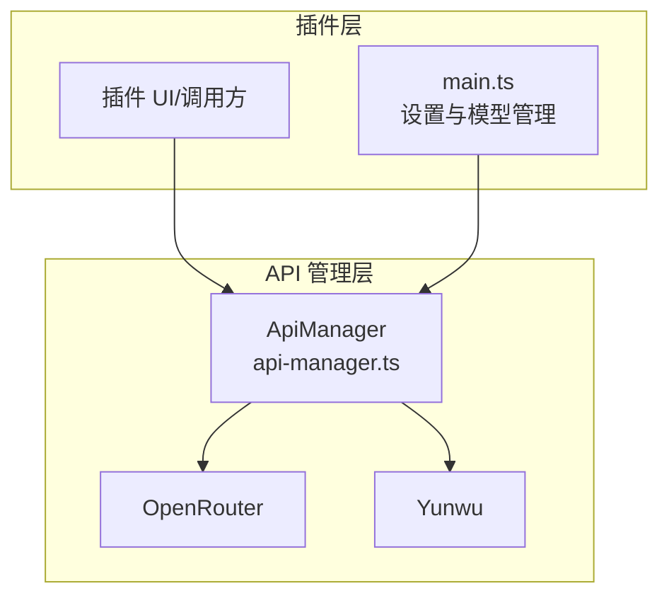
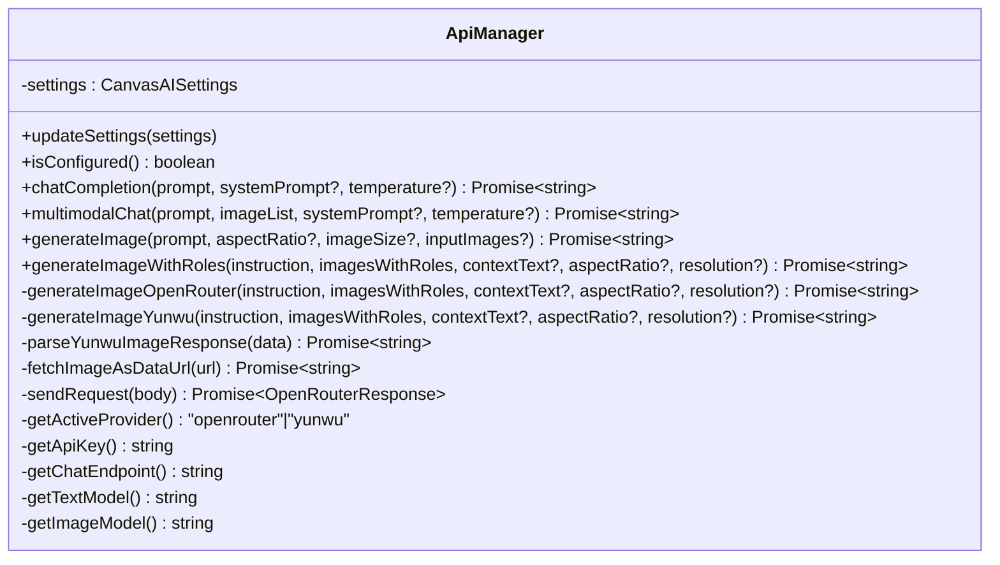
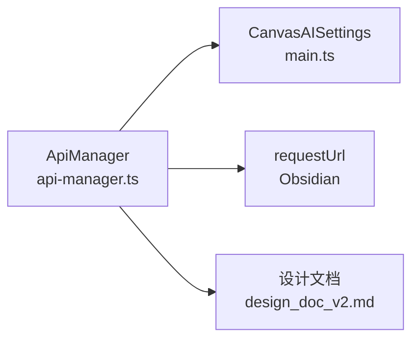

# API 通信协议

<cite>
**本文引用的文件**
- [api-manager.ts](file://api-manager.ts)
- [main.ts](file://main.ts)
- [design_doc_v2.md](file://docs/design_doc_v2.md)
</cite>

## 目录
1. [简介](#简介)
2. [项目结构](#项目结构)
3. [核心组件](#核心组件)
4. [架构总览](#架构总览)
5. [详细组件分析](#详细组件分析)
6. [依赖关系分析](#依赖关系分析)
7. [性能考量](#性能考量)
8. [故障排查指南](#故障排查指南)
9. [结论](#结论)

## 简介
本文面向 Obsidian Canvas AI 插件中的 API 管理模块，聚焦于 api-manager.ts 中实现的 API 通信机制，尤其是通过 sendRequest() 方法与外部 LLM 服务（OpenRouter 与 Yunwu）进行通信的方式。文档将详细说明：
- 请求体构造流程（OpenRouterRequest 类型、messages 数组组织、model 字段动态选择）
- 高级参数（modalities、image_config、generationConfig.responseModalities、imageConfig）的使用
- OpenRouter 与 Yunwu 在请求格式上的差异（特别是 generateImageYunwu 中的 Gemini 原生格式）
- HTTP 请求头设置逻辑（Authorization、HTTP-Referer、X-Title）
- 错误处理策略（HTTP 状态码解析、error.json 响应体提取）

## 项目结构
围绕 API 通信的关键文件与职责如下：
- api-manager.ts：定义请求类型、封装与 OpenRouter/Yunwu 的通信逻辑，暴露聊天、多模态聊天、图像生成等方法
- main.ts：定义 CanvasAISettings 接口及插件设置项，提供 OpenRouter/Yunwu 的 API Key、Base URL、模型等配置入口
- design_doc_v2.md：提供图像生成与角色标注的上下文组织思路，有助于理解 generateImageWithRoles 的调用背景



图表来源
- [api-manager.ts](file://api-manager.ts#L1-L679)
- [main.ts](file://main.ts#L1-L2269)

章节来源
- [api-manager.ts](file://api-manager.ts#L1-L679)
- [main.ts](file://main.ts#L1-L2269)

## 核心组件
- OpenRouterRequest 类型：用于 OpenAI 兼容格式的聊天与图像生成请求体，包含 model、messages、modalities、image_config、reasoning、temperature 等字段
- OpenRouterMessage/OpenRouterContentPart：消息与内容部件（文本/图片）的结构化表示
- ApiManager：统一的 API 管理类，负责根据 settings.apiProvider 动态选择提供商、拼装请求体、发送 HTTP 请求、解析响应与错误

章节来源
- [api-manager.ts](file://api-manager.ts#L11-L67)

## 架构总览
ApiManager 的对外接口围绕以下能力展开：
- 聊天补全（chatCompletion）
- 多模态聊天（multimodalChat）
- 图像生成（generateImage、generateImageOpenRouter、generateImageWithRoles）
- 与 Yunwu 的原生 Gemini 格式交互（generateImageYunwu、parseYunwuImageResponse、fetchImageAsDataUrl）



图表来源
- [api-manager.ts](file://api-manager.ts#L71-L679)

章节来源
- [api-manager.ts](file://api-manager.ts#L71-L679)

## 详细组件分析

### 请求体构造与消息组织（OpenRouterRequest）
- model 字段动态选择
  - 文本模型：根据当前提供商选择 openRouterTextModel 或 yunwuTextModel
  - 图像模型：根据当前提供商选择 openRouterImageModel 或 yunwuImageModel
- messages 数组组织
  - 聊天：可选添加 systemPrompt，随后追加用户消息
  - 多模态聊天：将 prompt 作为文本部件，再依次追加多张图片（data:image/...;base64,...）
  - 图像生成（OpenRouter）：将输入图片作为 image_url 部件，prompt 作为 text 部件，按顺序组织为用户消息
- 高级参数
  - modalities：在图像生成场景中可设置为 ["image","text"] 或 ["image"]，用于明确输出模态
  - image_config：包含 aspect_ratio 与 image_size，用于控制生成图像的宽高比与分辨率

章节来源
- [api-manager.ts](file://api-manager.ts#L117-L134)
- [api-manager.ts](file://api-manager.ts#L149-L191)
- [api-manager.ts](file://api-manager.ts#L193-L275)
- [api-manager.ts](file://api-manager.ts#L277-L398)

### OpenRouter 与 Yunwu 的请求格式差异
- OpenRouter（OpenAI 兼容）
  - 端点：/v1/chat/completions
  - 请求体：OpenRouterRequest（model、messages、modalities、image_config、temperature 等）
  - 发送：通过 sendRequest() 统一发送，内部设置 Authorization、Content-Type、HTTP-Referer、X-Title 等头部
- Yunwu（Gemini 原生）
  - 端点：/v1beta/models/{model}:generateContent?key={api_key}
  - 请求体：contents[0].parts[]（文本与 inlineData），generationConfig.responseModalities 限定输出模态；generationConfig.imageConfig 支持 aspectRatio 与 imageSize
  - 响应解析：candidates[0].content.parts[]，优先解析 inlineData（base64），其次解析 file_data.file_uri 并拉取为 data URL

章节来源
- [api-manager.ts](file://api-manager.ts#L102-L112)
- [api-manager.ts](file://api-manager.ts#L400-L495)
- [api-manager.ts](file://api-manager.ts#L497-L571)

### sendRequest() 方法与 HTTP 请求头
- 统一的 OpenAI 兼容聊天端点发送逻辑
- 请求头：
  - Authorization: Bearer {api_key}
  - Content-Type: application/json
  - HTTP-Referer: https://obsidian.md
  - X-Title: Obsidian Canvas AI
- 错误处理：
  - 捕获 requestUrl 返回的错误对象，若包含 status，则从 error.json 或 error.message 提取错误信息并抛出

章节来源
- [api-manager.ts](file://api-manager.ts#L646-L679)

### 图像生成工作流（OpenRouter 与 Yunwu）
- OpenRouter 流程
  - 组织 inputImages 为 image_url 部件，prompt 为 text 部件，形成用户消息
  - 设置 modalities 与 image_config（可选）
  - 调用 sendRequest()，解析响应中的 choices[0].message.images[0].image_url.url
- Yunwu 流程
  - 组织 contents.parts[]，使用 inlineData 传递图片（base64），文本与角色标注作为 text 部件
  - generationConfig.responseModalities 限定为 image 输出
  - generationConfig.imageConfig.aspectRatio 与 imageSize 控制生成参数
  - 解析 candidates[0].content.parts[]，优先返回 base64 data URL；若为 file_data，则拉取 URL 并转换为 data URL

```mermaid
sequenceDiagram
participant Caller as "调用方"
participant AM as "ApiManager"
participant OR as "OpenRouter"
participant YW as "Yunwu"
Caller->>AM : generateImageWithRoles(...)
alt provider == "yunwu"
AM->>AM : generateImageYunwu(...)
AM->>YW : POST /v1beta/models/{model} : generateContent?key=...
YW-->>AM : candidates[0].content.parts[]
AM->>AM : parseYunwuImageResponse()
AM-->>Caller : data : image/...;base64,...
else provider == "openrouter"
AM->>AM : generateImageOpenRouter(...)
AM->>OR : POST /v1/chat/completions
OR-->>AM : choices[0].message.images[0].image_url.url
AM-->>Caller : data : image/...;base64,...
end
```

图表来源
- [api-manager.ts](file://api-manager.ts#L277-L398)
- [api-manager.ts](file://api-manager.ts#L400-L495)
- [api-manager.ts](file://api-manager.ts#L497-L571)

章节来源
- [api-manager.ts](file://api-manager.ts#L277-L398)
- [api-manager.ts](file://api-manager.ts#L400-L495)
- [api-manager.ts](file://api-manager.ts#L497-L571)

### 请求/响应示例（结构化说明）
- OpenRouter 请求体（简化）
  - model: "google/gemini-2.0-flash-001" 或 "gemini-2.0-flash"
  - messages:
    - role: "user"
    - content: [
        { type: "image_url", image_url: { url: "data:image/...;base64,..." } },
        { type: "text", text: "..." }
      ]
  - modalities: ["image","text"] 或 ["image"]
  - image_config: { aspect_ratio: "...", image_size: "..." }
  - temperature: 0.5
- OpenRouter 响应体（简化）
  - id: "..."
  - model: "..."
  - choices:
    - message:
      - role: "assistant"
      - content: "..."
      - images: [{ image_url: { url: "data:image/...;base64,..." } }]
  - usage: { prompt_tokens, completion_tokens, total_tokens }
  - error: { message, type, code }
- Yunwu 请求体（简化）
  - contents:
    - role: "user"
    - parts:
      - { text: "..." }
      - { inlineData: { mimeType, data } }
  - generationConfig:
    - responseModalities: ["image"]
    - imageConfig:
      - aspectRatio: "..."
      - imageSize: "..."
- Yunwu 响应体（简化）
  - candidates:
    - content:
      - parts:
        - { inlineData: { mimeType, data } }  // 优先
        - { file_data: { file_uri: "..." } } // 次之
        - { text: "..." }                   // 无图像时可能返回文本

章节来源
- [api-manager.ts](file://api-manager.ts#L30-L67)
- [api-manager.ts](file://api-manager.ts#L193-L275)
- [api-manager.ts](file://api-manager.ts#L308-L398)
- [api-manager.ts](file://api-manager.ts#L400-L495)
- [api-manager.ts](file://api-manager.ts#L497-L571)

## 依赖关系分析
- ApiManager 依赖 CanvasAISettings（来自 main.ts），通过 settings.apiProvider、api keys、base URLs、模型名称等决定行为
- 与 Obsidian 的 requestUrl API 交互，负责网络请求与错误捕获
- 与设计文档中的角色标注与上下文组织理念配合，用于 generateImageWithRoles 的 payload 组织



图表来源
- [api-manager.ts](file://api-manager.ts#L71-L179)
- [main.ts](file://main.ts#L1-L120)
- [design_doc_v2.md](file://docs/design_doc_v2.md#L1-L200)

章节来源
- [api-manager.ts](file://api-manager.ts#L71-L179)
- [main.ts](file://main.ts#L1-L120)
- [design_doc_v2.md](file://docs/design_doc_v2.md#L1-L200)

## 性能考量
- 图像输入处理：将图片转换为 data URL（base64）会增加请求体体积，建议在本地进行必要的尺寸与质量控制，避免超大 Base64 导致请求失败或超时
- 并发与重试：插件整体采用异步队列管理任务，ApiManager 的方法为独立调用，建议在上层控制并发度，避免短时间内大量请求导致限流
- 模型选择：根据实际需求选择合适的文本/图像模型，避免不必要的高成本模型

## 故障排查指南
- API Key 未配置
  - 现象：调用前检查 isConfigured() 失败，抛出错误
  - 处理：在设置页配置 OpenRouter 或 Yunwu 的 API Key
- HTTP 状态错误
  - 现象：sendRequest() 捕获 error.status，从 error.json 或 error.message 提取错误信息
  - 处理：根据状态码与错误消息调整请求参数或凭据
- OpenRouter 响应异常
  - 现象：response.error 存在或 choices 为空
  - 处理：检查 model、messages、modalities、image_config 是否符合提供商要求
- Yunwu 响应异常
  - 现象：candidates 为空、parts 为空、既无 inlineData 也无 file_data
  - 处理：确认 generationConfig.responseModalities 为 ["image"]，检查 imageConfig.aspectRatio 与 imageSize 合法性；若返回文本，按文本内容定位问题
- 图像获取失败
  - 现象：parseYunwuImageResponse 无法找到图像，或 fetchImageAsDataUrl 拉取失败
  - 处理：检查 file_data.file_uri 是否可达，确认 MIME 类型推断是否正确

章节来源
- [api-manager.ts](file://api-manager.ts#L139-L179)
- [api-manager.ts](file://api-manager.ts#L483-L571)
- [api-manager.ts](file://api-manager.ts#L646-L679)

## 结论
ApiManager 通过统一的 OpenRouterRequest 结构与 sendRequest() 方法，实现了对 OpenRouter 与 Yunwu 的兼容通信。其关键优势在于：
- 动态模型选择与端点路由，适配不同提供商的模型命名与端点差异
- 高级参数（modalities、image_config、generationConfig）的灵活使用，满足图像生成的多样化需求
- 完整的错误处理链路，覆盖配置缺失、HTTP 状态码、响应体解析等常见问题
- 对 Yunwu Gemini 原生格式的完整支持，保证了更丰富的图像生成控制能力