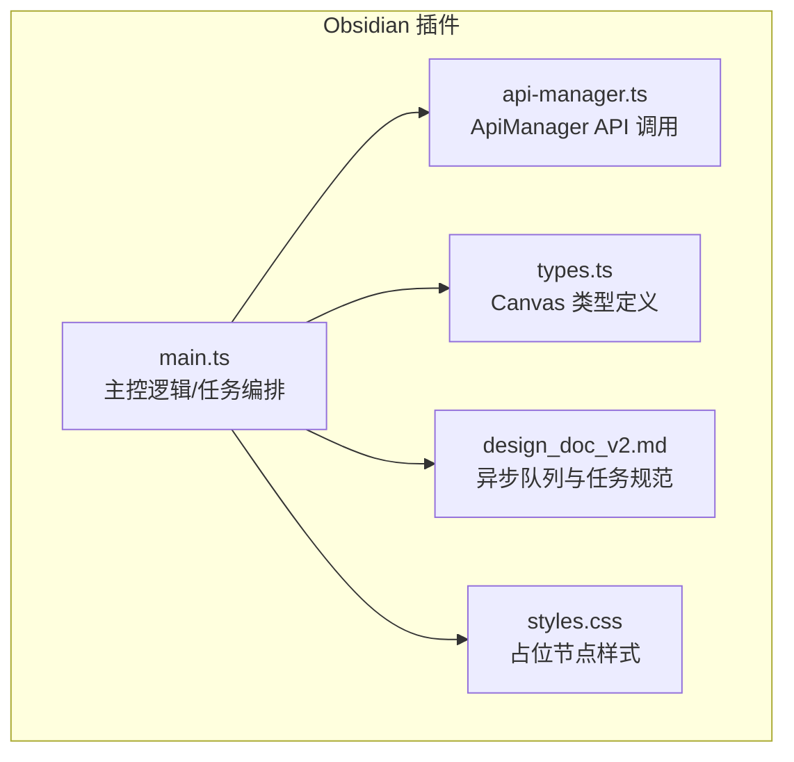
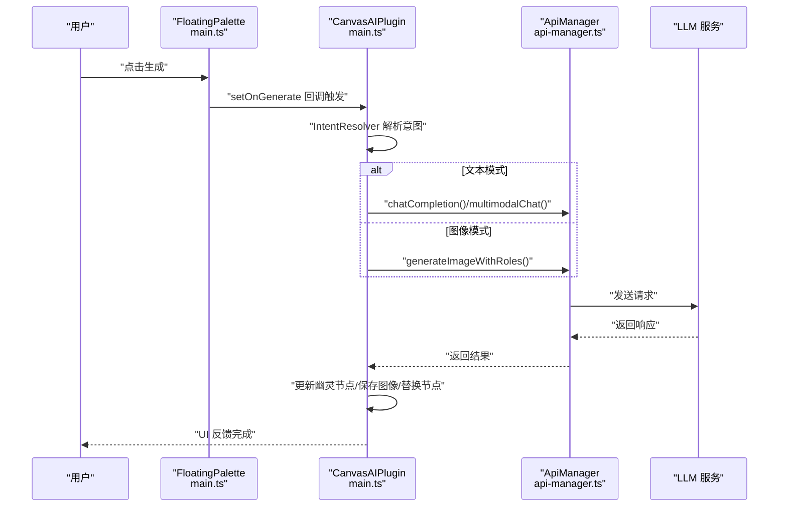
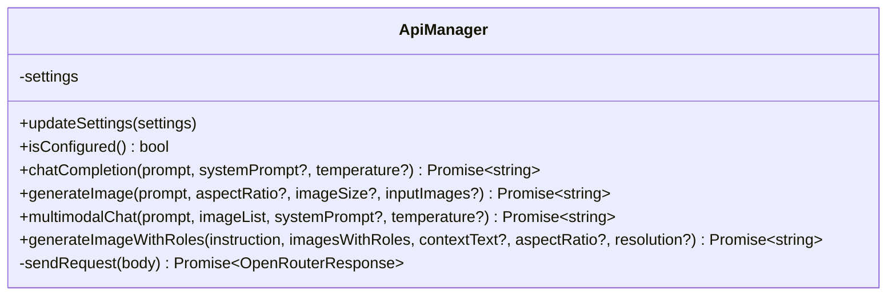
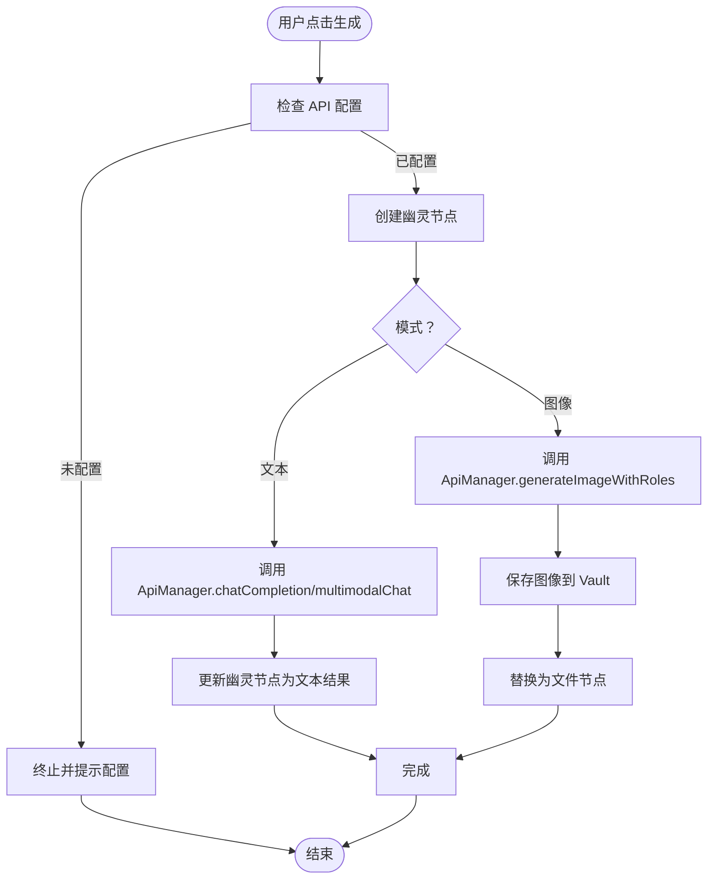
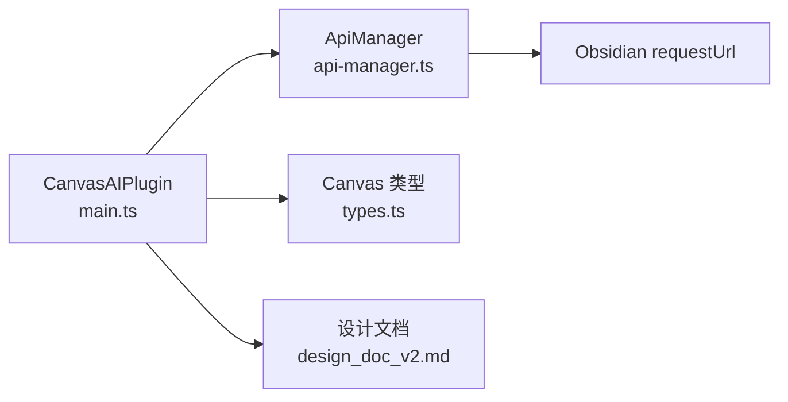

# 异步任务管理

<cite>
**本文引用的文件**
- [api-manager.ts](file://api-manager.ts)
- [main.ts](file://main.ts)
- [types.ts](file://types.ts)
- [design_doc_v2.md](file://docs/design_doc_v2.md)
- [styles.css](file://styles.css)
</cite>

## 目录
1. [简介](#简介)
2. [项目结构](#项目结构)
3. [核心组件](#核心组件)
4. [架构总览](#架构总览)
5. [详细组件分析](#详细组件分析)
6. [依赖关系分析](#依赖关系分析)
7. [性能考量](#性能考量)
8. [故障排查指南](#故障排查指南)
9. [结论](#结论)
10. [附录](#附录)

## 简介
本文聚焦于 api-manager.ts 与异步任务队列的集成方式，说明其所有 async 方法（如 chatCompletion、generateImage、multimodalChat 等）如何被主控逻辑在 main.ts 中调用，并通过“任务”封装避免阻塞 Obsidian 主线程。文档还阐述任务生命周期：从用户在画布上选择节点并触发操作，到 ApiManager 实例发送请求，再到结果返回并触发 UI 更新；并给出将 ApiManager.chatCompletion() 调用包装为可排队任务的实践建议，强调该设计模式对保持 UI 响应性与并发管理的重要性。

## 项目结构
- 插件主入口与主控逻辑集中在 main.ts，负责画布交互、意图解析、任务调度与 UI 更新。
- ApiManager 在 api-manager.ts 中提供统一的 API 调用能力，支持文本与图像两类多模态请求。
- types.ts 定义了 Canvas 相关类型，支撑主控逻辑对画布节点与边的操作。
- 设计文档 design_doc_v2.md 明确了“异步队列”“TaskQueue”的存在与作用，指导 UI 占位与并发管理。
- styles.css 提供占位节点样式，用于任务执行期间的视觉反馈。

图表来源
- [main.ts](file://main.ts#L913-L1060)
- [api-manager.ts](file://api-manager.ts#L71-L120)
- [types.ts](file://types.ts#L1-L128)
- [design_doc_v2.md](file://docs/design_doc_v2.md#L60-L102)
- [styles.css](file://styles.css#L448-L470)

章节来源
- [main.ts](file://main.ts#L913-L1060)
- [api-manager.ts](file://api-manager.ts#L71-L120)
- [types.ts](file://types.ts#L1-L128)
- [design_doc_v2.md](file://docs/design_doc_v2.md#L60-L102)
- [styles.css](file://styles.css#L448-L470)

## 核心组件
- ApiManager
  - 提供 chatCompletion、generateImage、multimodalChat、generateImageWithRoles 等异步方法，封装 OpenRouter/Yunwu 的请求与响应解析。
  - 通过内部 sendRequest 统一发送 HTTP 请求，处理错误与返回值。
- 主控逻辑（CanvasAIPlugin）
  - 在 handleGeneration 中根据模式（聊天/图像）调用 ApiManager 的对应方法。
  - 使用“幽灵节点（Ghost Node）”占位，执行期间 UI 不阻塞，完成后替换为真实节点或文件节点。
  - 通过 FloatingPalette 的任务计数与按钮状态，体现并发任务的可视化反馈。
- 类型系统（types.ts）
  - 定义 Canvas、CanvasNode、CanvasEdge 等接口，支撑主控逻辑对画布对象的访问与操作。
- 设计文档（design_doc_v2.md）
  - 明确“异步队列”“TaskQueue”的存在，指导并发请求管理与 UI 占位行为。

章节来源
- [api-manager.ts](file://api-manager.ts#L143-L191)
- [api-manager.ts](file://api-manager.ts#L193-L275)
- [api-manager.ts](file://api-manager.ts#L573-L644)
- [api-manager.ts](file://api-manager.ts#L646-L679)
- [main.ts](file://main.ts#L1031-L1150)
- [main.ts](file://main.ts#L1245-L1327)
- [types.ts](file://types.ts#L1-L128)
- [design_doc_v2.md](file://docs/design_doc_v2.md#L60-L102)

## 架构总览
下图展示了从用户触发到 API 返回与 UI 更新的端到端流程，以及 ApiManager 在其中的角色。

图表来源
- [main.ts](file://main.ts#L980-L1006)
- [main.ts](file://main.ts#L1031-L1150)
- [api-manager.ts](file://api-manager.ts#L143-L191)
- [api-manager.ts](file://api-manager.ts#L193-L275)
- [api-manager.ts](file://api-manager.ts#L573-L644)
- [api-manager.ts](file://api-manager.ts#L646-L679)

## 详细组件分析

### ApiManager 的异步方法与职责
- chatCompletion(prompt, systemPrompt?, temperature?)
  - 构造消息体，调用 sendRequest，解析响应，返回文本内容。
- generateImage(prompt, aspectRatio?, imageSize?, inputImages?)
  - 多模态图像生成，支持输入图片与文本组合，返回 base64 数据 URL。
- multimodalChat(prompt, imageList, systemPrompt?, temperature?)
  - 将图片与文本组合为多模态消息，调用 sendRequest 返回文本。
- generateImageWithRoles(instruction, imagesWithRoles, contextText?, aspectRatio?, resolution?)
  - 基于角色标注的图像生成，内部路由到 OpenRouter 或 Yunwu 实现。
- sendRequest(body)
  - 统一发送 HTTP 请求，处理错误与返回值。

图表来源
- [api-manager.ts](file://api-manager.ts#L71-L120)
- [api-manager.ts](file://api-manager.ts#L143-L191)
- [api-manager.ts](file://api-manager.ts#L193-L275)
- [api-manager.ts](file://api-manager.ts#L573-L644)
- [api-manager.ts](file://api-manager.ts#L646-L679)

章节来源
- [api-manager.ts](file://api-manager.ts#L143-L191)
- [api-manager.ts](file://api-manager.ts#L193-L275)
- [api-manager.ts](file://api-manager.ts#L573-L644)
- [api-manager.ts](file://api-manager.ts#L646-L679)

### 主控逻辑与任务封装
- FloatingPalette
  - 维护 pendingTaskCount，点击生成按钮时立即递增，隐藏面板后 fire-and-forget 执行 onGenerate，finally 中递减计数。
  - 通过按钮文案与样式反映并发任务数量，保证 UI 始终可用。
- CanvasAIPlugin.handleGeneration
  - 依据选区与意图解析结果，决定调用 chatCompletion/multimodalChat 或 generateImageWithRoles。
  - 创建幽灵节点占位，API 成功后更新节点内容或保存图像并替换为文件节点。
  - 异常时更新幽灵节点为错误状态，提供重试入口。

图表来源
- [main.ts](file://main.ts#L766-L801)
- [main.ts](file://main.ts#L980-L1006)
- [main.ts](file://main.ts#L1031-L1150)
- [main.ts](file://main.ts#L1245-L1327)
- [main.ts](file://main.ts#L1152-L1207)

章节来源
- [main.ts](file://main.ts#L766-L801)
- [main.ts](file://main.ts#L980-L1006)
- [main.ts](file://main.ts#L1031-L1150)
- [main.ts](file://main.ts#L1245-L1327)
- [main.ts](file://main.ts#L1152-L1207)

### 任务生命周期与 UI 反馈
- 生命周期阶段
  - 触发：FloatingPalette.handleGenerate 增加任务计数并隐藏面板。
  - 执行：CanvasAIPlugin.handleGeneration 调用 ApiManager 方法，期间 UI 不阻塞。
  - 回写：成功则更新幽灵节点为文本或替换为文件节点；失败则标记错误状态。
  - 结束：任务计数递减，按钮恢复可用。
- UI 反馈
  - 幽灵节点样式与类名用于加载/错误状态切换。
  - 生成按钮文案随任务数变化，直观反映并发情况。

章节来源
- [main.ts](file://main.ts#L766-L801)
- [main.ts](file://main.ts#L1245-L1327)
- [styles.css](file://styles.css#L448-L470)

### 将 ApiManager.chatCompletion() 包装为可排队任务的实践
- 设计要点
  - 将一次“节点选择 + 模型调用 + 结果回写”的完整流程抽象为一个“任务”，包含：
    - 输入：用户提示、选区上下文、温度、图像选项等。
    - 执行：调用 ApiManager.chatCompletion 或 multimodalChat。
    - 回写：更新幽灵节点或保存图像并替换节点。
    - 异常：捕获错误并更新幽灵节点为错误状态。
  - 并发与队列
    - 使用外部 TaskQueue（如 fastq）管理任务，限制并发度，避免 UI 阻塞。
    - 任务入队时增加任务计数，完成/失败时递减计数，驱动 UI 状态更新。
- 代码示例路径（不展示具体代码，仅提供路径）
  - 将 onGenerate 回调封装为队列任务：[main.ts](file://main.ts#L980-L1006)
  - 调用 ApiManager.chatCompletion：[main.ts](file://main.ts#L1102-L1116)
  - 更新幽灵节点与替换节点：[main.ts](file://main.ts#L1245-L1327)

章节来源
- [main.ts](file://main.ts#L980-L1006)
- [main.ts](file://main.ts#L1102-L1116)
- [main.ts](file://main.ts#L1245-L1327)

## 依赖关系分析
- ApiManager 依赖 Obsidian 的 requestUrl 发起网络请求，内部封装错误处理与响应解析。
- 主控逻辑依赖 Canvas 类型（types.ts）访问节点与边，结合 IntentResolver 产出的意图数据。
- 设计文档明确了“异步队列”“TaskQueue”的存在，指导并发与 UI 占位行为。

图表来源
- [api-manager.ts](file://api-manager.ts#L646-L679)
- [main.ts](file://main.ts#L1031-L1150)
- [types.ts](file://types.ts#L1-L128)
- [design_doc_v2.md](file://docs/design_doc_v2.md#L60-L102)

章节来源
- [api-manager.ts](file://api-manager.ts#L646-L679)
- [main.ts](file://main.ts#L1031-L1150)
- [types.ts](file://types.ts#L1-L128)
- [design_doc_v2.md](file://docs/design_doc_v2.md#L60-L102)

## 性能考量
- 非阻塞 UI
  - 通过 fire-and-forget 方式在 handleGenerate 中启动任务，避免阻塞 UI 线程。
  - 使用幽灵节点即时反馈，无需等待 API 完成。
- 并发控制
  - 使用 TaskQueue 控制并发度，避免同时发起过多请求导致资源争用与 UI 卡顿。
- 资源管理
  - 图像生成前进行压缩与清洗，降低请求体积与失败率。
  - 保存图像到 Vault 后及时替换节点，避免冗余内存占用。

[本节为通用性能建议，不直接分析具体文件]

## 故障排查指南
- API 配置缺失
  - 现象：点击生成无响应或提示配置。
  - 处理：在设置中配置 API Key 与模型参数。
  - 参考路径：[main.ts](file://main.ts#L778-L784)
- API 错误
  - 现象：幽灵节点变为红色，显示错误信息。
  - 处理：查看错误详情，修正提示词或重试。
  - 参考路径：[main.ts](file://main.ts#L1146-L1149)
- 安全拦截
  - 现象：幽灵节点变为灰色，提示安全过滤。
  - 处理：修改提示词，避开敏感内容。
  - 参考路径：[design_doc_v2.md](file://docs/design_doc_v2.md#L273-L299)
- UI 卡顿或按钮不可用
  - 现象：生成按钮长时间处于“生成中”状态。
  - 处理：检查并发任务数，必要时减少同时发起的任务数量。
  - 参考路径：[main.ts](file://main.ts#L766-L801)

章节来源
- [main.ts](file://main.ts#L778-L784)
- [main.ts](file://main.ts#L1146-L1149)
- [design_doc_v2.md](file://docs/design_doc_v2.md#L273-L299)
- [main.ts](file://main.ts#L766-L801)

## 结论
ApiManager 通过一组清晰的异步方法，为插件提供了稳定的 API 调用能力；主控逻辑在 main.ts 中以“幽灵节点 + 任务计数”的方式实现了非阻塞的 UI 体验。设计文档进一步明确了“异步队列”的存在与职责，使得并发管理与 UI 反馈得以规范化。将 ApiManager.chatCompletion() 等调用封装为可排队任务，是保持 UI 响应性与可靠性的关键实践。

[本节为总结性内容，不直接分析具体文件]

## 附录
- 相关类型定义
  - Canvas、CanvasNode、CanvasEdge 等接口，支撑主控逻辑对画布对象的访问与操作。
  - 参考路径：[types.ts](file://types.ts#L1-L128)

章节来源
- [types.ts](file://types.ts#L1-L128)