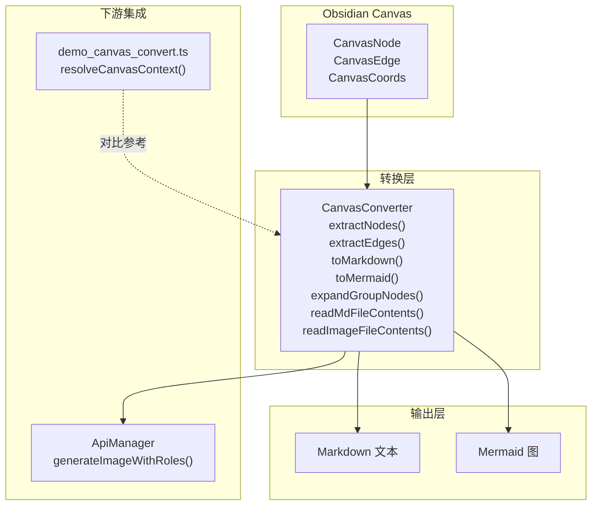
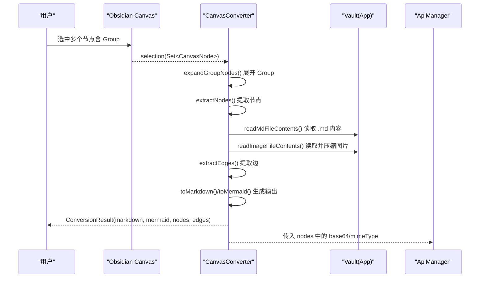
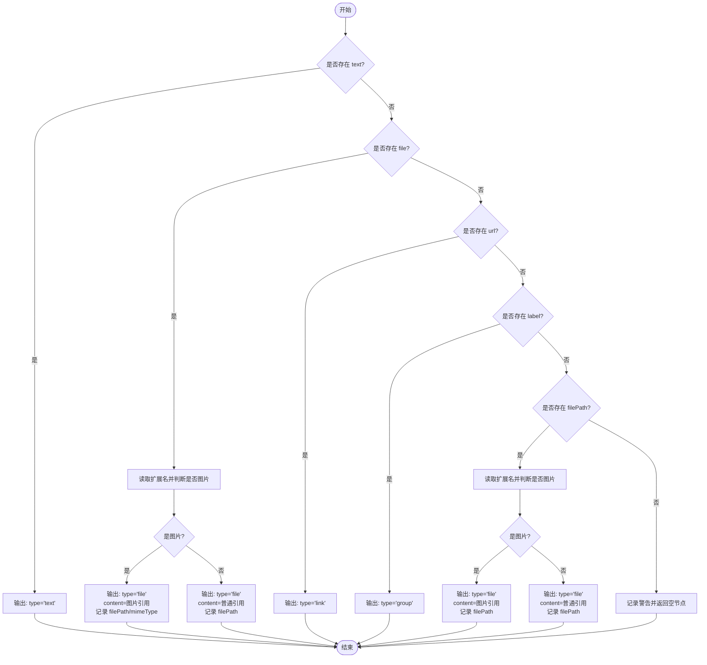
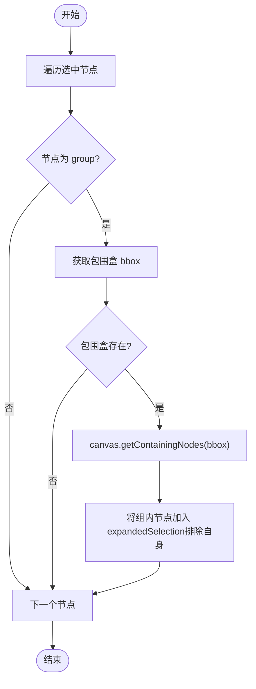
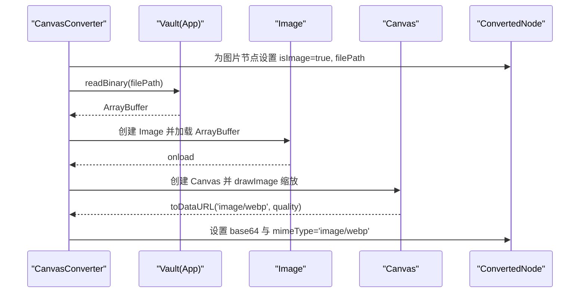
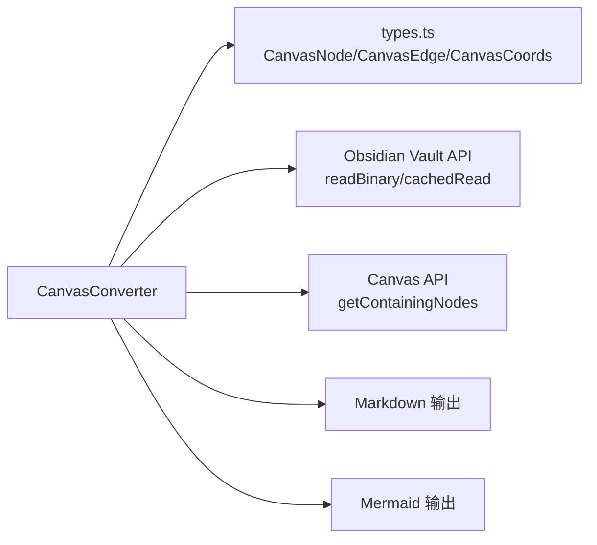

# Canvas 节点转换器

<cite>
**本文引用的文件**
- [canvas-converter.ts](file://canvas-converter.ts)
- [types.ts](file://types.ts)
- [docs/design_doc_v2.md](file://docs/design_doc_v2.md)
- [docs/demo_canvas_convert.ts](file://docs/demo_canvas_convert.ts)
- [api-manager.ts](file://api-manager.ts)
- [main.ts](file://main.ts)
</cite>

## 目录
1. [简介](#简介)
2. [项目结构](#项目结构)
3. [核心组件](#核心组件)
4. [架构总览](#架构总览)
5. [详细组件分析](#详细组件分析)
6. [依赖分析](#依赖分析)
7. [性能考虑](#性能考虑)
8. [故障排查指南](#故障排查指南)
9. [结论](#结论)
10. [附录](#附录)

## 简介
本文件面向 `canvas-converter.ts` 模块，系统化梳理其作为 Obsidian Canvas 多模态上下文转换引擎的角色与实现细节。该模块负责将用户选中的 Canvas 文本节点、图片节点、链接节点与群组节点，转换为两类人类可读格式（Markdown）与图形化格式（Mermaid），并保留节点的空间布局与连接关系。同时，模块还负责对图片节点进行读取与压缩，生成适合多模态 LLM 的数据结构，支撑后续的意图解析与 API 调用。

## 项目结构
- canvas-converter.ts：核心转换器，提供节点提取、边提取、格式化输出、图片读取与压缩、群组解包等能力。
- types.ts：定义 Canvas 节点、边、坐标等接口，为转换器提供类型约束。
- docs/design_doc_v2.md：设计文档，明确“选区标准化（Group 解包）”流程与管线策略。
- docs/demo_canvas_convert.ts：演示示例，展示如何将 Canvas 节点网络转换为多模态结构化内容。
- api-manager.ts：多模态 API 管理器，接收转换器产出的图片 Base64 数据，构造请求并调用外部模型。
- main.ts：插件入口，演示如何调用 CanvasConverter 并输出调试日志。

图表来源
- [canvas-converter.ts](file://canvas-converter.ts#L56-L556)
- [types.ts](file://types.ts#L14-L113)
- [docs/design_doc_v2.md](file://docs/design_doc_v2.md#L92-L177)
- [docs/demo_canvas_convert.ts](file://docs/demo_canvas_convert.ts#L1-L149)
- [api-manager.ts](file://api-manager.ts#L287-L398)

章节来源
- [canvas-converter.ts](file://canvas-converter.ts#L56-L556)
- [types.ts](file://types.ts#L14-L113)

## 核心组件
- 节点转换接口 ConvertedNode：统一承载 id、type、content、isImage、filePath、fileContent、base64、mimeType、isGroupMember 等字段，便于后续意图解析与 API 调用。
- 边转换接口 ConvertedEdge：统一承载边 id、fromId、toId、label，用于保留节点间语义关系。
- 转换结果 ConversionResult：聚合 nodes、edges、markdown、mermaid，作为一次转换的完整产物。
- CanvasConverter 类：提供 extractNodes、extractEdges、toMarkdown、toMermaid、expandGroupNodes、readMdFileContents、readImageFileContents、compressImageToWebP 等静态方法，完成从 Canvas 选区到多模态上下文的全链路转换。

章节来源
- [canvas-converter.ts](file://canvas-converter.ts#L17-L47)

## 架构总览
CanvasConverter 的工作流分为“选区标准化（Group 解包）—节点与边提取—内容读取—格式化输出”四个阶段，最终输出 Markdown 与 Mermaid 两种格式，并为后续的意图解析与 API 调用提供结构化数据。

图表来源
- [canvas-converter.ts](file://canvas-converter.ts#L293-L515)
- [api-manager.ts](file://api-manager.ts#L287-L398)

## 详细组件分析

### 节点转换与类型判定
- 文本节点：当节点具备 text 属性时，转换为 type='text'，content 为节点文本。
- 文件节点：当节点具备 file 属性时，依据扩展名判断是否为图片；非图片输出为普通文件引用，图片输出为带图片占位的引用；同时记录 filePath、mimeType（图片）。
- 链接节点：当节点具备 url 属性时，转换为 type='link'，content 为 URL。
- 群组节点：当节点具备 label 属性时，转换为 type='group'，content 为标签文本。
- 未知类型：当节点仅具备 filePath 时，依据扩展名推断类型并输出相应引用；无法识别则记录警告并返回空节点。

图表来源
- [canvas-converter.ts](file://canvas-converter.ts#L76-L153)

章节来源
- [canvas-converter.ts](file://canvas-converter.ts#L63-L153)

### 边提取与关系保留
- 遍历 Canvas.edges，筛选两端节点 id 均在选中集合中的边，构造 ConvertedEdge（fromId、toId、label）。
- 仅保留“选区内边”，避免跨选区的无关连线污染上下文。

章节来源
- [canvas-converter.ts](file://canvas-converter.ts#L156-L181)
- [types.ts](file://types.ts#L53-L65)

### Markdown 输出
- 节点输出：按类型分别输出文本、文件引用、链接、群组标签，并在文件节点处附加路径信息。
- 边输出：以“from --[label]--> to”的形式列出连线关系，使用节点 id 的短前缀标识，提升可读性。

章节来源
- [canvas-converter.ts](file://canvas-converter.ts#L183-L240)

### Mermaid 输出
- 节点定义：根据类型选择不同图形样式（群组使用双括号、图片使用菱形、链接使用平行四边形、文本/文件使用方括号）。
- 边定义：保留 label，必要时进行标签清理（替换引号、全角括号、移除尖括号与花括号等）。
- 内容截断：对长内容进行单行化与长度截断，避免渲染异常。

章节来源
- [canvas-converter.ts](file://canvas-converter.ts#L242-L291)
- [canvas-converter.ts](file://canvas-converter.ts#L529-L555)

### 选区标准化与 Group 解包
- expandGroupNodes：遍历选中节点，若节点为 group（label 存在），则计算其包围盒（优先使用 getBBox，否则使用 bbox），调用 canvas.getContainingNodes(bbox) 获取组内所有节点并加入扩展集合；排除自身，避免重复。
- 标记组成员：在 convert 流程中标记通过 group 展开新增的节点，便于后续 UI 或解析时区分“原始选中”与“展开成员”。

图表来源
- [canvas-converter.ts](file://canvas-converter.ts#L293-L321)
- [types.ts](file://types.ts#L22-L51)
- [docs/design_doc_v2.md](file://docs/design_doc_v2.md#L92-L177)

章节来源
- [canvas-converter.ts](file://canvas-converter.ts#L293-L321)
- [docs/design_doc_v2.md](file://docs/design_doc_v2.md#L92-L177)

### 文件内容读取与图片压缩
- readMdFileContents：对 type='file' 且非图片的节点，若路径以 .md 结尾，使用 vault.cachedRead 读取文件内容并覆盖 content 字段，便于后续作为上下文文本使用。
- readImageFileContents：对 type='file' 且 isImage=true 的节点，使用 vault.readBinary 读取二进制，随后调用 compressImageToWebP 压缩为 WebP，并设置 base64 与 mimeType。
- compressImageToWebP：基于浏览器 Canvas API，先按最大尺寸进行等比缩放，再以指定质量导出 WebP，最后提取 Base64（不含 data: 前缀），便于后续 API 请求。

图表来源
- [canvas-converter.ts](file://canvas-converter.ts#L323-L463)

章节来源
- [canvas-converter.ts](file://canvas-converter.ts#L323-L463)

### 一键转换入口 convert
- expandGroupNodes：先展开 Group，得到 expandedSelection。
- 标记组成员：对比 originalIds 与 expandedSelection，标记 isGroupMember=true 的节点。
- readMdFileContents：读取 .md 文件内容并注入 ConvertedNode。
- readImageFileContents：读取并压缩图片，生成 base64。
- extractEdges：仅保留选区内边。
- toMarkdown / toMermaid：生成最终输出。
- 返回 ConversionResult：nodes、edges、markdown、mermaid。

章节来源
- [canvas-converter.ts](file://canvas-converter.ts#L465-L515)

### 与设计文档的对齐
- 选区标准化（Group 解包）：与设计文档第 3.2 节“选区标准化（Pre-processing & Unwrapping）”完全一致，强调自动包含组内未被选中的子节点，形成扁平化的有效选区。
- 文件清洗与自动压缩：设计文档第 3.6 节提到“自动压缩（OffscreenCanvas 缩小）”，在当前实现中通过 Canvas API 进行等比缩放与 WebP 导出，达到近似效果；若需更严格的 OffscreenCanvas 控制，可在 compressImageToWebP 中进一步封装。

章节来源
- [docs/design_doc_v2.md](file://docs/design_doc_v2.md#L92-L177)
- [docs/design_doc_v2.md](file://docs/design_doc_v2.md#L244-L271)

### 与演示示例的对比
- demo_canvas_convert.ts 展示了“角色解析（Role Assignment）”与“指令策略（Instruction Strategy）”的思路：优先连线标签、上游文本、组标题，再回退到默认提示词。CanvasConverter 侧重“结构化数据提取”，二者互补，共同构成完整的多模态上下文管线。

章节来源
- [docs/demo_canvas_convert.ts](file://docs/demo_canvas_convert.ts#L1-L149)

## 依赖分析
- 类型依赖：CanvasNode、CanvasEdge、CanvasCoords 来源于 types.ts，保证节点、边、坐标结构的一致性。
- Obsidian API 依赖：vault.readBinary、vault.cachedRead、canvas.getContainingNodes 等，用于读取二进制与文本内容、扫描组内节点。
- 输出依赖：Markdown 与 Mermaid 的生成依赖于节点类型与内容长度控制，避免渲染异常。

图表来源
- [canvas-converter.ts](file://canvas-converter.ts#L6-L8)
- [types.ts](file://types.ts#L14-L113)

章节来源
- [canvas-converter.ts](file://canvas-converter.ts#L6-L8)
- [types.ts](file://types.ts#L14-L113)

## 性能考虑
- 图片压缩参数：compressImageToWebP 支持 compressionQuality 与 maxSize，默认质量 80、最大尺寸 2048，可在 convert 调用时传入自定义参数，平衡质量与体积。
- 缩放策略：按最大尺寸计算缩放比例，保持等比缩放，避免超大图片导致内存与网络压力。
- Base64 体积：压缩后仍可能较大，建议在后续 API 调用时结合服务端限制与网络状况进行二次裁剪或分批发送。
- OffscreenCanvas 建议：设计文档提及“OffscreenCanvas 缩小”，当前实现已通过 Canvas API 达到近似效果；若需更强的离屏控制与更稳定的性能，可在 compressImageToWebP 中引入 OffscreenCanvas 进一步优化。

章节来源
- [canvas-converter.ts](file://canvas-converter.ts#L350-L463)
- [docs/design_doc_v2.md](file://docs/design_doc_v2.md#L150-L153)

## 故障排查指南
- 无法识别节点类型：convertNode 会对未知节点输出警告日志，检查节点属性（text、file、url、label、filePath）是否正确设置。
- 文件读取失败：readMdFileContents 与 readImageFileContents 在读取失败时会输出警告日志，确认 filePath 是否存在、是否为 TFile、权限是否正常。
- 图片压缩失败：compressImageToWebP 在加载失败或 Canvas 上下文获取失败时会抛出错误，检查图片格式与浏览器兼容性。
- 边提取为空：确保选中节点集合与边两端节点 id 匹配，且选区标准化（Group 解包）已正确展开。

章节来源
- [canvas-converter.ts](file://canvas-converter.ts#L150-L153)
- [canvas-converter.ts](file://canvas-converter.ts#L336-L348)
- [canvas-converter.ts](file://canvas-converter.ts#L366-L382)
- [canvas-converter.ts](file://canvas-converter.ts#L412-L463)

## 结论
CanvasConverter 以“结构化数据提取 + 多模态准备”的方式，将 Obsidian Canvas 的选区转化为 LLM 友好的上下文。通过 Group 解包、文件内容读取、图片压缩与格式化输出，模块为后续的意图解析与 API 调用提供了坚实基础。结合设计文档的管线策略与演示示例的角色解析思路，可进一步完善多模态提示词工程与上下文组织。

## 附录

### 输入输出示例（概念性说明）
- 输入：选中若干 Canvas 节点（文本、文件、链接、群组），以及它们之间的连线。
- 输出：
  - nodes：包含 id、type、content、isImage、filePath、fileContent、base64、mimeType、isGroupMember 等字段。
  - edges：包含 id、fromId、toId、label。
  - markdown：按节点类型与边关系生成的人类可读文本。
  - mermaid：按节点类型与边关系生成的 Mermaid 图代码。

章节来源
- [canvas-converter.ts](file://canvas-converter.ts#L17-L47)
- [canvas-converter.ts](file://canvas-converter.ts#L183-L291)

### 与 API 管理器的对接
- ApiManager.generateImageWithRoles 接收 imagesWithRoles（包含 base64、mimeType、role），并按设计文档的 Payload 结构构造请求，支持角色标注与上下文文本。

章节来源
- [api-manager.ts](file://api-manager.ts#L287-L398)