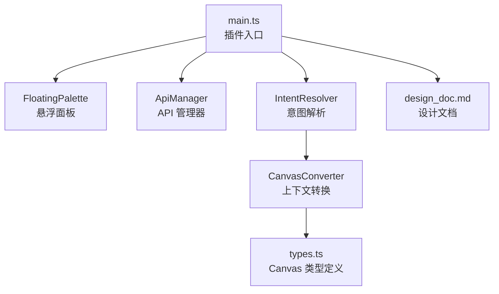
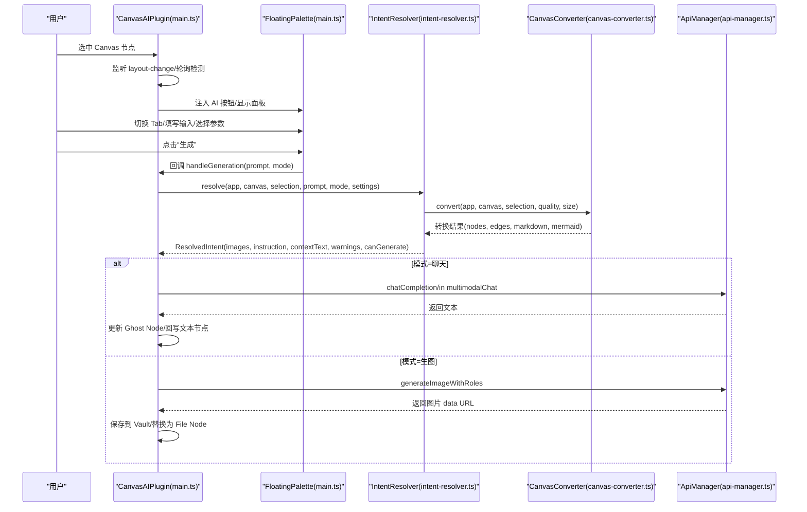
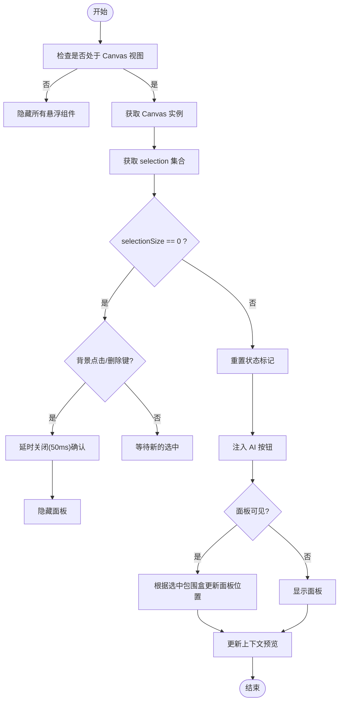
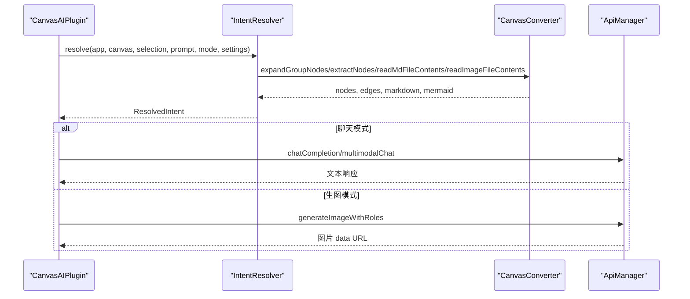
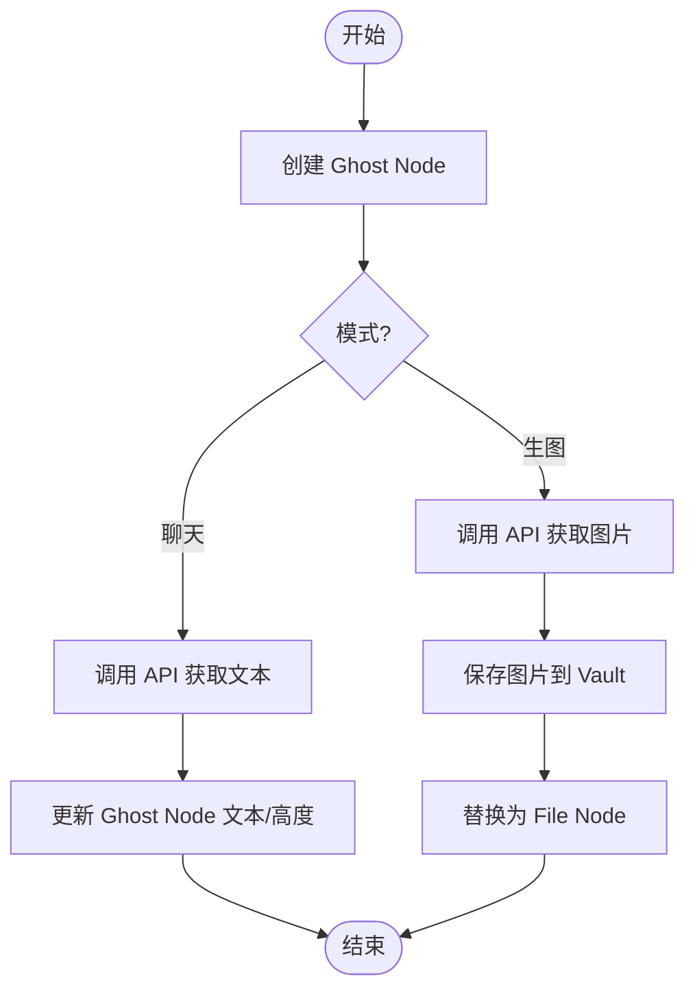
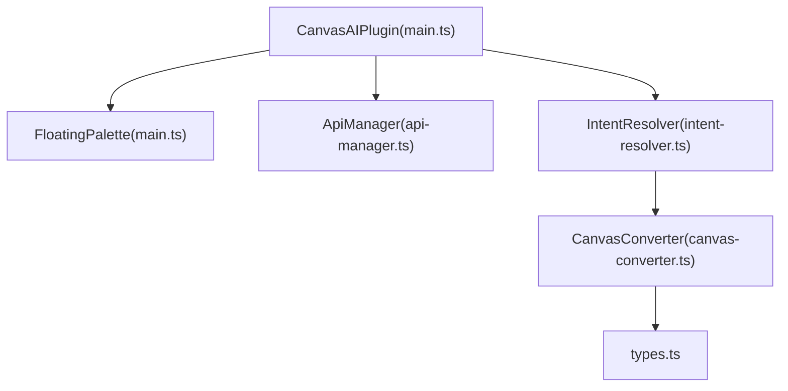

# 主入口模块

<cite>
**本文引用的文件**
- [main.ts](file://main.ts)
- [intent-resolver.ts](file://intent-resolver.ts)
- [canvas-converter.ts](file://canvas-converter.ts)
- [api-manager.ts](file://api-manager.ts)
- [types.ts](file://types.ts)
- [design_doc.md](file://docs/design_doc.md)
</cite>

## 目录
1. [简介](#简介)
2. [项目结构](#项目结构)
3. [核心组件](#核心组件)
4. [架构总览](#架构总览)
5. [详细组件分析](#详细组件分析)
6. [依赖分析](#依赖分析)
7. [性能考量](#性能考量)
8. [故障排查指南](#故障排查指南)
9. [结论](#结论)
10. [附录](#附录)

## 简介
本文件面向 ObsidianCanvasAI 插件的主入口模块 main.ts，系统性梳理其作为插件生命周期管理核心的职责与实现，重点覆盖：
- 插件生命周期：onload、onUnload 的初始化与清理流程
- Canvas 选中状态检测：通过监听 'layout-change' 与轮询机制，结合原生菜单注入，动态显示悬浮面板（Floating Palette）
- 悬浮面板 UI 构建：Tab 模式切换（聊天/生图）、输入区、参数控制区、预设管理与生成按钮交互
- 上下文转换与 API 协调：通过 IntentResolver 与 CanvasConverter 进行上下文解析与转换，再由 ApiManager 发起请求
- ‘Ghost Node’ 概念与任务执行：在 Canvas 上创建加载占位符，异步回写结果或错误状态
- 事件监听、DOM 操作与状态管理的最佳实践，以及潜在内存泄漏风险与治理建议

## 项目结构
main.ts 位于插件根目录，是插件的唯一入口，负责：
- 插件生命周期管理（onload/onUnload）
- Canvas 选中状态监听与悬浮面板注入
- 悬浮面板组件的初始化与交互回调绑定
- 任务调度与结果回写（含 Ghost Node）



图表来源
- [main.ts](file://main.ts#L914-L1030)
- [intent-resolver.ts](file://intent-resolver.ts#L63-L130)
- [canvas-converter.ts](file://canvas-converter.ts#L1-L120)
- [api-manager.ts](file://api-manager.ts#L71-L142)
- [types.ts](file://types.ts#L21-L119)
- [design_doc.md](file://docs/design_doc.md#L1-L70)

章节来源
- [main.ts](file://main.ts#L914-L1030)

## 核心组件
- 插件主类 CanvasAIPlugin：负责插件生命周期、悬浮面板初始化、Canvas 选中状态监听、任务调度与回写、设置持久化等
- FloatingPalette：悬浮面板 UI 组件，负责 Tab 模式切换、输入区、参数控制区、预设管理、生成按钮交互与任务计数
- ApiManager：统一管理 OpenRouter/Yunwu 的聊天与图像生成请求，封装多模态消息体与响应解析
- IntentResolver：将 Canvas 选区转换为结构化的意图（图片角色、指令、上下文文本），并进行回退策略与警告收集
- CanvasConverter：将 Canvas 节点转换为 Markdown/Mermaid 文本，读取图片为压缩后的 WebP Base64，支持 group 展开与边提取
- types.ts：Canvas 节点、边、视图等类型定义，为插件提供类型安全的 Canvas API 扩展

章节来源
- [main.ts](file://main.ts#L914-L1030)
- [api-manager.ts](file://api-manager.ts#L71-L142)
- [intent-resolver.ts](file://intent-resolver.ts#L63-L130)
- [canvas-converter.ts](file://canvas-converter.ts#L1-L120)
- [types.ts](file://types.ts#L21-L119)

## 架构总览
下图展示了插件从 Canvas 选中状态检测到任务执行与回写的端到端流程，以及各组件之间的依赖关系。



图表来源
- [main.ts](file://main.ts#L1031-L1150)
- [intent-resolver.ts](file://intent-resolver.ts#L63-L130)
- [canvas-converter.ts](file://canvas-converter.ts#L465-L516)
- [api-manager.ts](file://api-manager.ts#L143-L276)

## 详细组件分析

### 插件生命周期与设置管理
- onload：加载设置、迁移旧字段、注册设置页、初始化悬浮面板、注册 Canvas 选中监听
- onUnload：销毁悬浮面板 DOM，释放资源
- 设置持久化：loadSettings/saveSettings，变更后同步 ApiManager 的 settings 引用

章节来源
- [main.ts](file://main.ts#L961-L1006)
- [main.ts](file://main.ts#L1790-L1799)

### Canvas 选中状态检测与悬浮面板注入
- 事件监听：
  - layout-change：Canvas 布局变化（含选中状态变化）
  - mousedown：记录点击意图（背景点击/节点/连线/面板/菜单）
  - keydown(ESC/Delete/Backspace)：ESC 直接关闭面板；Delete/Backspace 标记删除意图
  - active-leaf-change/file-open：离开 Canvas 视图时隐藏面板
  - 轮询：每 200ms 检查一次选中状态，提升响应速度
- 面板注入：向 Canvas 原生菜单注入 AI 按钮，点击后显示悬浮面板
- 位置与预览：根据选中节点屏幕包围盒定位面板；实时更新上下文预览（节点数量与类型）



图表来源
- [main.ts](file://main.ts#L1353-L1599)

章节来源
- [main.ts](file://main.ts#L1353-L1599)

### 悬浮面板 UI 与交互逻辑
- DOM 结构：包含 Tab（聊天/生图）、预设下拉与动作按钮、输入区、参数控制区（分辨率/比例/温度）、上下文预览、生成按钮、调试按钮与版本信息
- Tab 切换：切换模式时更新占位符、显示/隐藏参数区、刷新预设下拉
- 预设管理：新增/删除/保存/重命名，支持聊天/生图两套预设集
- 参数控制：聊天温度范围校验与自动修正；生图比例/分辨率变更回调持久化
- 生成按钮：多任务并发计数，点击后立即隐藏面板并发起任务，完成后递减计数
- 键盘与焦点：输入框聚焦时推入 Scope，阻止事件冒泡，避免影响 Canvas 节点

```mermaid
classDiagram
class FloatingPalette {
-containerEl : HTMLElement
-currentMode : "chat"|"image"
-promptInput : HTMLTextAreaElement
-isVisible : boolean
-currentParent : HTMLElement
-onClose : Function
-onDebug : Function
-onGenerate : Function
-onSettingsChange : Function
-apiManager : ApiManager
-pendingTaskCount : number
-imageAspectRatio : string
-imageResolution : string
-chatTemperature : number
-presetSelect : HTMLSelectElement
-presetAddBtn : HTMLButtonElement
-presetDeleteBtn : HTMLButtonElement
-presetSaveBtn : HTMLButtonElement
-presetRenameBtn : HTMLButtonElement
+setOnGenerate(callback)
+setOnSettingsChange(callback)
+initImageOptions(aspectRatio, resolution)
+initChatOptions(temperature)
+setDebugMode(enabled)
+setVersion(version)
+initPresets(chatPresets, imagePresets)
+setOnPresetChange(callback)
+show(x,y,canvasContainer,onClose?)
+updatePosition(x,y,canvasContainer)
+hide()
+updateContextPreview(nodeCount,imageCount,textCount,groupCount?)
+incrementTaskCount()
+decrementTaskCount()
+getPrompt() : string
+clearPrompt()
+getImageOptions() : {aspectRatio,resolution}
+getChatOptions() : {temperature}
}
```

图表来源
- [main.ts](file://main.ts#L200-L911)

章节来源
- [main.ts](file://main.ts#L200-L911)

### 任务调度与上下文转换
- IntentResolver.resolve：预处理（展开 group、过滤非图片、读取 md 与图片）、角色分配（基于边标签/上游文本/Group 标题）、指令回退策略（用户输入 > 选区文本 > 默认预设）、构建上下文文本、统计可用性
- CanvasConverter.convert：展开 group、提取节点/边、读取 md 内容与图片为压缩 WebP、生成 Markdown/Mermaid
- ApiManager：统一聊天/图像生成接口，支持 OpenRouter/Yunwu，多模态消息体构造与响应解析



图表来源
- [intent-resolver.ts](file://intent-resolver.ts#L63-L130)
- [canvas-converter.ts](file://canvas-converter.ts#L465-L516)
- [api-manager.ts](file://api-manager.ts#L143-L276)

章节来源
- [intent-resolver.ts](file://intent-resolver.ts#L63-L130)
- [canvas-converter.ts](file://canvas-converter.ts#L465-L516)
- [api-manager.ts](file://api-manager.ts#L143-L276)

### ‘Ghost Node’ 与结果回写
- 创建 Ghost Node：在选中节点右侧创建文本节点，显示“✨ AI Generating...”，并添加样式类
- 聊天模式：更新 Ghost Node 文本内容，动态估算高度，保存节点
- 生图模式：更新为“💾 Saving image...”，保存图片到 Vault，替换为 File Node
- 错误处理：更新为错误样式与提示，便于用户重试



图表来源
- [main.ts](file://main.ts#L1246-L1327)
- [main.ts](file://main.ts#L1152-L1244)
- [design_doc.md](file://docs/design_doc.md#L55-L71)

章节来源
- [main.ts](file://main.ts#L1152-L1327)
- [design_doc.md](file://docs/design_doc.md#L55-L71)

## 依赖分析
- 插件主类依赖：
  - FloatingPalette：UI 交互与状态管理
  - ApiManager：API 请求封装
  - IntentResolver/CanvasConverter：上下文解析与转换
  - types.ts：Canvas 类型定义
- 事件耦合：
  - 通过 workspace 事件与 DOM 事件驱动 UI 行为
  - 通过轮询降低延迟，提高对快速切换的响应
- 外部依赖：
  - Obsidian App/workspace/ItemView/Modal/Notice 等原生 API
  - requestUrl 发起 HTTP 请求



图表来源
- [main.ts](file://main.ts#L914-L1030)
- [intent-resolver.ts](file://intent-resolver.ts#L63-L130)
- [canvas-converter.ts](file://canvas-converter.ts#L1-L120)
- [api-manager.ts](file://api-manager.ts#L71-L142)
- [types.ts](file://types.ts#L21-L119)

章节来源
- [main.ts](file://main.ts#L914-L1030)
- [intent-resolver.ts](file://intent-resolver.ts#L63-L130)
- [canvas-converter.ts](file://canvas-converter.ts#L1-L120)
- [api-manager.ts](file://api-manager.ts#L71-L142)
- [types.ts](file://types.ts#L21-L119)

## 性能考量
- 选中检测轮询：每 200ms 检查一次，平衡响应速度与性能；在非 Canvas 视图或无选中时可忽略
- 图片压缩：CanvasConverter 将图片压缩为 WebP 并限制尺寸，减少传输与 API Token 消耗
- 多任务并发：FloatingPalette 维护 pendingTaskCount，支持多任务并行，按钮保持启用
- DOM 操作最小化：面板位置与显示通过 requestAnimationFrame 控制，避免阻塞渲染
- 事件解绑：onUnload 销毁面板；键盘 ESC 使用捕获阶段，确保优先处理

[本节为通用指导，无需列出章节来源]

## 故障排查指南
- API 未配置：FloatingPalette 在生成前检查 ApiManager.isConfigured，若未配置则终止
- 选中状态异常：若 selectionSize 为 0，需确认是否为背景点击或 Delete/Backspace 导致的明确关闭意图
- 面板不显示：检查是否在 Canvas 视图、是否成功注入 AI 按钮、是否被其他视图遮挡
- 生成失败：查看控制台错误日志，确认网络、模型可用性与权限；错误节点会变为红色并提示重试
- 预设管理：确认预设集合按模式区分存储，保存/重命名/删除后会持久化到设置

章节来源
- [main.ts](file://main.ts#L778-L801)
- [main.ts](file://main.ts#L1450-L1528)
- [api-manager.ts](file://api-manager.ts#L136-L142)

## 结论
main.ts 作为 ObsidianCanvasAI 插件的核心入口，通过完善的生命周期管理、稳健的 Canvas 选中状态检测与悬浮面板注入、清晰的 UI 交互与状态管理、以及与 IntentResolver/CanvasConverter/ApiManager 的紧密协作，实现了从上下文解析到任务执行与回写的完整闭环。借助 ‘Ghost Node’ 概念，插件在 Canvas 上提供了即时、可回溯的任务反馈体验。建议在后续迭代中进一步完善错误重试与可视化反馈，并持续优化上下文转换与 API 调用的性能与稳定性。

[本节为总结性内容，无需列出章节来源]

## 附录

### 事件监听与 DOM 操作最佳实践
- 使用 workspace.on('layout-change') 与轮询相结合，兼顾实时性与性能
- 使用捕获阶段处理 ESC，确保优先关闭面板
- 通过 requestAnimationFrame 控制面板显示，避免布局抖动
- 事件解绑：onUnload 销毁 DOM，键盘事件使用 register 注销

章节来源
- [main.ts](file://main.ts#L1353-L1599)
- [main.ts](file://main.ts#L961-L968)

### 状态管理与内存治理
- 面板可见性与位置状态：FloatingPalette 内部维护 isVisible、currentParent、position 等状态
- 任务计数：pendingTaskCount 保证多任务并发下的 UI 一致性
- 内存风险：确保 onUnload 销毁 DOM；键盘事件与轮询定时器在插件卸载时清理；避免闭包持有长生命周期对象

章节来源
- [main.ts](file://main.ts#L838-L911)
- [main.ts](file://main.ts#L961-L968)