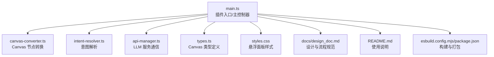
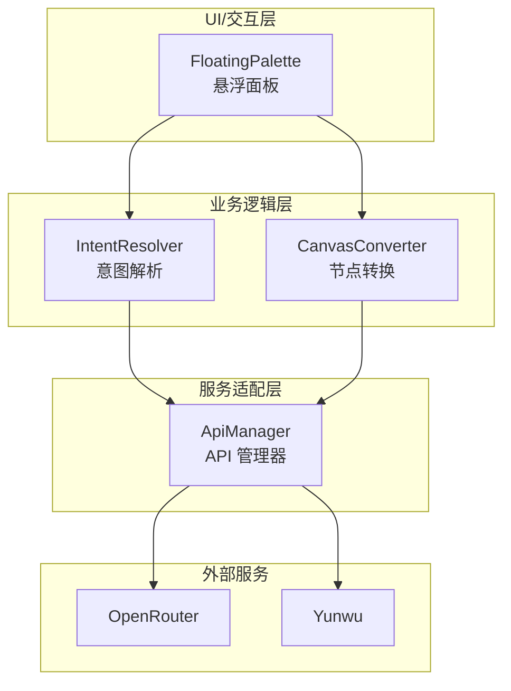
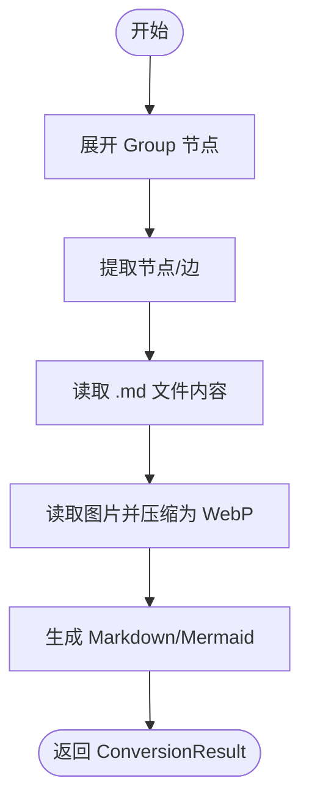
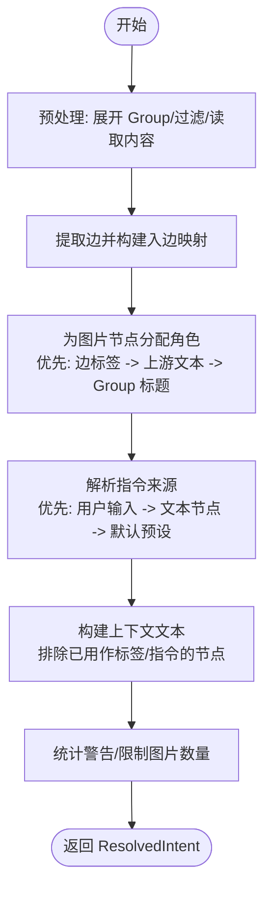
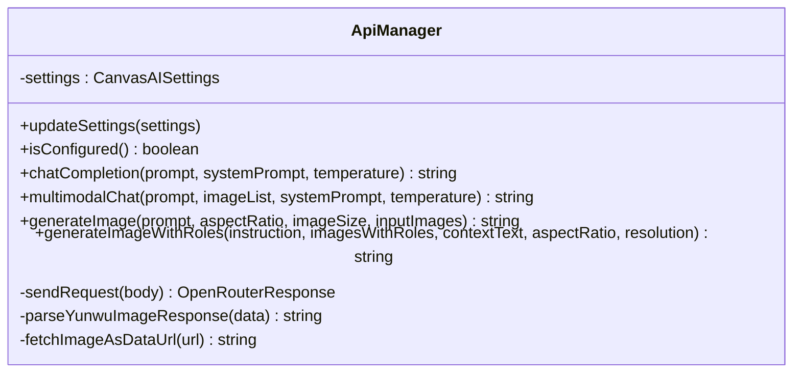
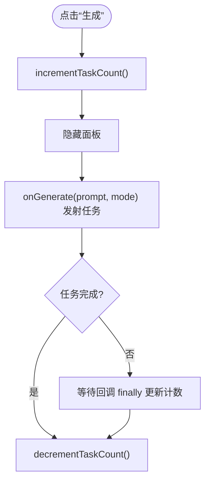
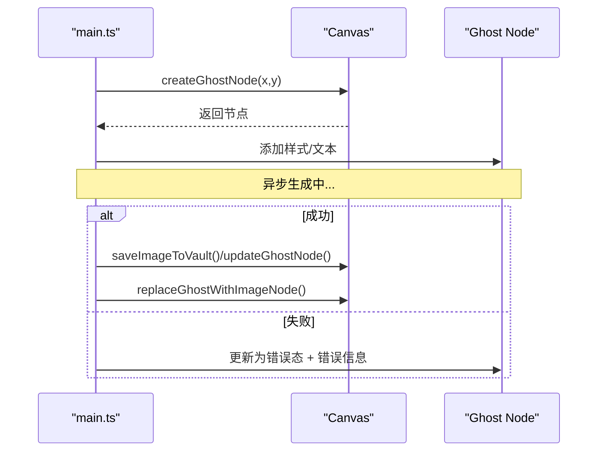
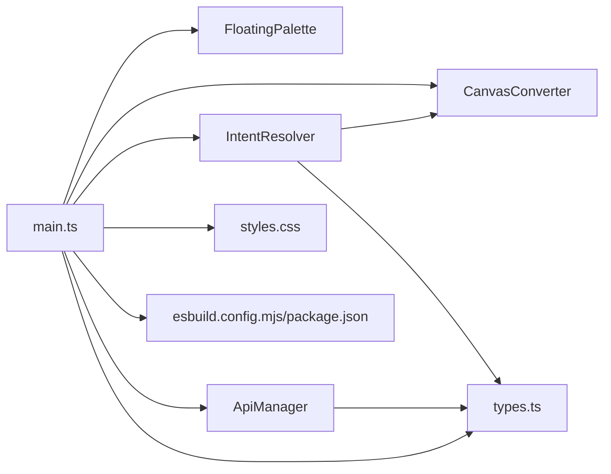

# 技术架构

<cite>
**本文引用的文件**
- [main.ts](file://main.ts)
- [api-manager.ts](file://api-manager.ts)
- [canvas-converter.ts](file://canvas-converter.ts)
- [intent-resolver.ts](file://intent-resolver.ts)
- [types.ts](file://types.ts)
- [esbuild.config.mjs](file://esbuild.config.mjs)
- [package.json](file://package.json)
- [styles.css](file://styles.css)
- [docs/design_doc.md](file://docs/design_doc.md)
- [README.md](file://README.md)
</cite>

## 目录
1. [简介](#简介)
2. [项目结构](#项目结构)
3. [核心组件](#核心组件)
4. [架构总览](#架构总览)
5. [详细组件分析](#详细组件分析)
6. [依赖关系分析](#依赖关系分析)
7. [性能考量](#性能考量)
8. [故障排查指南](#故障排查指南)
9. [结论](#结论)
10. [附录](#附录)

## 简介
本文件面向 ObsidianCanvasAI 插件的技术架构文档，聚焦模块化、事件驱动与异步处理的设计范式。围绕主入口 main.ts 如何初始化插件并协调 canvas-converter.ts（将 Canvas 节点转换为 Markdown/Mermaid/Base64）与 api-manager.ts（与 OpenRouter/Yunwu 等 LLM 服务通信），阐明 intent-resolver.ts 如何解析基于 Canvas 拓扑结构的用户意图；解释异步任务队列如何管理并发请求以避免阻塞 UI 线程；并结合 design_doc.md 中“悬浮面板”和“Ghost Node”的概念，说明从“用户选择 -> 转换上下文 -> 发送 API 请求 -> 结果回写”的完整数据流。最后讨论选择 TypeScript 与 esbuild 的技术决策及其对可维护性与性能的影响。

## 项目结构
- 插件入口与主控制器：main.ts
- 数据转换层：canvas-converter.ts
- 意图解析层：intent-resolver.ts
- API 管理层：api-manager.ts
- 类型定义：types.ts
- 构建与打包：esbuild.config.mjs、package.json
- UI 样式：styles.css
- 设计文档与使用说明：docs/design_doc.md、README.md



图表来源
- [main.ts](file://main.ts#L943-L1010)
- [canvas-converter.ts](file://canvas-converter.ts#L1-L120)
- [intent-resolver.ts](file://intent-resolver.ts#L1-L80)
- [api-manager.ts](file://api-manager.ts#L1-L120)
- [types.ts](file://types.ts#L1-L128)
- [styles.css](file://styles.css#L1-L120)
- [docs/design_doc.md](file://docs/design_doc.md#L1-L120)
- [README.md](file://README.md#L1-L60)
- [esbuild.config.mjs](file://esbuild.config.mjs#L1-L50)
- [package.json](file://package.json#L1-L29)

章节来源
- [main.ts](file://main.ts#L943-L1010)
- [package.json](file://package.json#L1-L29)

## 核心组件
- 悬浮面板（Floating Palette）
  - 位于 Canvas 选区附近，支持聊天与图像两种模式，提供预设管理、参数控制与上下文预览。
  - 通过 onGenerate 回调触发异步生成流程，支持多任务并发。
- Canvas 转换器（CanvasConverter）
  - 将选中节点转换为 Markdown/Mermaid，并将图片节点转换为压缩后的 WebP Base64。
  - 支持展开 Group 节点、读取 .md 文件内容、按需压缩图片尺寸与质量。
- 意图解析器（IntentResolver）
  - 基于 Canvas 拓扑结构解析用户意图，为图像生成构建“带角色的图片列表 + 指令 + 上下文文本”。
  - 采用优先级策略为图片节点分配语义角色，并决定最终指令来源。
- API 管理器（ApiManager）
  - 统一封装 OpenRouter/Yunwu 的聊天与图像生成接口，支持多模态消息体与响应解析。
  - 提供统一的请求发送、错误处理与 Provider 切换逻辑。
- 类型定义（types.ts）
  - 扩展 Obsidian Canvas 的节点、边、视图等接口，为编译期类型安全提供保障。

章节来源
- [main.ts](file://main.ts#L200-L520)
- [canvas-converter.ts](file://canvas-converter.ts#L1-L120)
- [intent-resolver.ts](file://intent-resolver.ts#L1-L120)
- [api-manager.ts](file://api-manager.ts#L1-L120)
- [types.ts](file://types.ts#L1-L128)

## 架构总览
ObsidianCanvasAI 采用“主入口协调 + 分层职责”的模块化架构：
- main.ts 作为主控制器，负责初始化悬浮面板、注册 Canvas 选区监听、创建 Ghost Node、调度意图解析与 API 请求，并回写结果。
- intent-resolver.ts 与 canvas-converter.ts 共同完成“上下文感知”的数据准备。
- api-manager.ts 作为统一的外部服务适配层，屏蔽 OpenRouter 与 Yunwu 的差异。
- 异步任务通过“发射后不管”的并发模式运行，悬浮面板通过任务计数器反馈 UI 状态。



图表来源
- [main.ts](file://main.ts#L970-L1010)
- [intent-resolver.ts](file://intent-resolver.ts#L60-L130)
- [canvas-converter.ts](file://canvas-converter.ts#L464-L516)
- [api-manager.ts](file://api-manager.ts#L136-L200)

## 详细组件分析

### 主入口与事件驱动
- 初始化与生命周期
  - 插件加载时初始化 API 管理器与悬浮面板，注册 Canvas 选区监听，挂载设置页。
  - 卸载时清理 DOM 组件，保证内存与事件不泄漏。
- 事件驱动的数据流
  - 用户在悬浮面板点击“生成”后，onGenerate 回调被触发，进入 handleGeneration 流程。
  - handleGeneration 调用 IntentResolver.resolve 完成意图解析，随后根据模式调用 ApiManager 的聊天或图像生成接口。
  - 生成成功后，创建 Ghost Node 作为占位符，异步完成后替换为真实节点并保存到 Canvas。

```mermaid
sequenceDiagram
participant U as "用户"
participant FP as "FloatingPalette"
participant M as "main.ts"
participant IR as "IntentResolver"
participant AM as "ApiManager"
participant OR as "OpenRouter/Yunwu"
U->>FP : 点击“生成”
FP->>M : onGenerate(prompt, mode)
M->>IR : resolve(app, canvas, selection, prompt, mode, settings)
IR-->>M : ResolvedIntent
alt 模式=聊天
M->>AM : chatCompletion(prompt, systemPrompt, temperature)
AM->>OR : POST /chat/completions
OR-->>AM : choices[0].message.content
AM-->>M : 返回文本
M->>M : 创建/更新文本节点
else 模式=图像
M->>AM : generateImageWithRoles(instruction, imagesWithRoles, contextText, aspectRatio, resolution)
AM->>OR : POST /generateContent 或兼容端点
OR-->>AM : data : image/webp;base64...
AM-->>M : 返回图片数据
M->>M : 保存到 Vault -> 替换为文件节点
end
M-->>FP : 更新任务计数/状态
```

图表来源
- [main.ts](file://main.ts#L970-L1010)
- [main.ts](file://main.ts#L1040-L1150)
- [intent-resolver.ts](file://intent-resolver.ts#L60-L130)
- [api-manager.ts](file://api-manager.ts#L277-L398)
- [api-manager.ts](file://api-manager.ts#L400-L495)

章节来源
- [main.ts](file://main.ts#L943-L1010)
- [main.ts](file://main.ts#L1040-L1150)

### Canvas 转换器（CanvasConverter）
- 职责
  - 将选中节点转换为 ConvertedNode/ConvertedEdge，支持文本、文件、链接、群组节点。
  - 生成 Markdown 与 Mermaid 文本，便于作为上下文或指令。
  - 读取 .md 文件内容并注入节点，读取图片并压缩为 WebP Base64，限制尺寸与质量。
  - 展开 Group 节点，标记 group 展开成员节点。
- 性能与复杂度
  - 节点遍历与边提取为 O(N+E)，图片压缩为 O(W×H)（受限于 Canvas API）。
  - 通过异步读取与压缩，避免阻塞主线程。



图表来源
- [canvas-converter.ts](file://canvas-converter.ts#L464-L516)
- [canvas-converter.ts](file://canvas-converter.ts#L323-L382)
- [canvas-converter.ts](file://canvas-converter.ts#L183-L291)

章节来源
- [canvas-converter.ts](file://canvas-converter.ts#L1-L120)
- [canvas-converter.ts](file://canvas-converter.ts#L323-L382)
- [canvas-converter.ts](file://canvas-converter.ts#L464-L516)

### 意图解析器（IntentResolver）
- 职责
  - 预处理：展开 Group、过滤非图片文件、读取图片与 .md 内容。
  - 角色分配：基于边标签、上游文本、Group 标题为图片节点分配语义角色。
  - 指令策略：优先使用用户输入，其次使用未被用作标签的文本节点内容，最后使用默认预设。
  - 上下文构建：排除已用作标签或指令的节点，生成结构化上下文文本。
  - 生成结果：返回 imagesWithRole、instruction、contextText、warnings、canGenerate。
- 复杂度
  - 角色分配与边遍历为 O(E)，指令与上下文构建为 O(N)。



图表来源
- [intent-resolver.ts](file://intent-resolver.ts#L132-L200)
- [intent-resolver.ts](file://intent-resolver.ts#L201-L280)
- [intent-resolver.ts](file://intent-resolver.ts#L282-L344)

章节来源
- [intent-resolver.ts](file://intent-resolver.ts#L1-L120)
- [intent-resolver.ts](file://intent-resolver.ts#L132-L200)
- [intent-resolver.ts](file://intent-resolver.ts#L201-L280)
- [intent-resolver.ts](file://intent-resolver.ts#L282-L344)

### API 管理器（ApiManager）
- 职责
  - Provider 切换：OpenRouter 与 Yunwu 的 API Key、Endpoint、模型选择与请求体差异。
  - 聊天接口：支持系统提示词与温度参数，返回文本响应。
  - 图像生成：支持多模态输入（文本 + 多张图片），支持 aspect_ratio 与 resolution。
  - 响应解析：统一解析 OpenRouter 格式与 Yunwu/Gemini 原生格式，支持 URL -> data URL 转换。
- 错误处理
  - 对 HTTP 错误与模型拒绝生成进行统一异常抛出，便于上层捕获与 UI 反馈。



图表来源
- [api-manager.ts](file://api-manager.ts#L70-L142)
- [api-manager.ts](file://api-manager.ts#L143-L276)
- [api-manager.ts](file://api-manager.ts#L277-L398)
- [api-manager.ts](file://api-manager.ts#L400-L495)
- [api-manager.ts](file://api-manager.ts#L573-L679)

章节来源
- [api-manager.ts](file://api-manager.ts#L1-L120)
- [api-manager.ts](file://api-manager.ts#L143-L276)
- [api-manager.ts](file://api-manager.ts#L277-L398)
- [api-manager.ts](file://api-manager.ts#L400-L495)
- [api-manager.ts](file://api-manager.ts#L573-L679)

### 悬浮面板与并发任务队列
- 悬浮面板
  - 提供模式切换、预设管理、参数控制与上下文预览。
  - 通过 onGenerate 回调触发异步任务，内部维护 pendingTaskCount，动态更新按钮状态。
- 并发与 UI 阻塞避免
  - handleGenerate 中“发射后不管”地调用 onGenerate，不 await，从而允许多任务并发执行。
  - 通过 incrementTaskCount/decrementTaskCount 控制按钮文案与状态，避免 UI 阻塞。



图表来源
- [main.ts](file://main.ts#L766-L800)
- [main.ts](file://main.ts#L732-L765)

章节来源
- [main.ts](file://main.ts#L200-L520)
- [main.ts](file://main.ts#L732-L800)

### Ghost Node 与结果回写
- Ghost Node
  - 生成前在 Canvas 中创建临时文本节点，带有呼吸动画与“生成中”提示。
  - 根据选区边界右侧定位，避免遮挡。
- 回写策略
  - 文本模式：更新 Ghost Node 文本内容，按内容长度估算高度并调整尺寸。
  - 图像模式：保存 Base64 到 Vault，创建文件节点替换 Ghost Node，并请求 Canvas 保存。
  - 错误处理：出现异常时将 Ghost Node 样式切换为错误态，展示错误信息。



图表来源
- [main.ts](file://main.ts#L1245-L1330)
- [main.ts](file://main.ts#L1152-L1208)
- [main.ts](file://main.ts#L1222-L1244)

章节来源
- [main.ts](file://main.ts#L1245-L1330)
- [main.ts](file://main.ts#L1152-L1208)
- [main.ts](file://main.ts#L1222-L1244)

## 依赖关系分析
- 模块耦合
  - main.ts 依赖 FloatingPalette、IntentResolver、ApiManager、CanvasConverter、types.ts。
  - IntentResolver 依赖 CanvasConverter 与 types.ts。
  - ApiManager 依赖 Obsidian requestUrl 与 settings。
- 外部依赖
  - Obsidian Canvas API（types.ts 扩展）、浏览器 Canvas API（图片压缩）、第三方 LLM 服务（OpenRouter/Yunwu）。
- 构建与打包
  - esbuild 将 TypeScript 编译为 ES2018，tree-shaking 与 external 优化产物体积，生产环境启用最小化。



图表来源
- [main.ts](file://main.ts#L943-L1010)
- [intent-resolver.ts](file://intent-resolver.ts#L1-L80)
- [canvas-converter.ts](file://canvas-converter.ts#L1-L60)
- [api-manager.ts](file://api-manager.ts#L1-L60)
- [types.ts](file://types.ts#L1-L60)
- [styles.css](file://styles.css#L1-L60)
- [esbuild.config.mjs](file://esbuild.config.mjs#L1-L50)
- [package.json](file://package.json#L1-L29)

章节来源
- [esbuild.config.mjs](file://esbuild.config.mjs#L1-L50)
- [package.json](file://package.json#L1-L29)

## 性能考量
- 并发与 UI 阻塞
  - 通过“发射后不管”的并发模式，悬浮面板任务计数器实时反映后台任务数量，避免 UI 阻塞。
- 图片处理
  - Canvas API 压缩与尺寸限制，降低 Token 消耗与传输成本；WebP 压缩质量与最大尺寸可配置。
- 构建优化
  - esbuild 生产构建启用最小化，tree-shaking 去除未使用代码，external 排除 Electron 与 Codemirror 等模块，减少体积。
- 类型安全
  - TypeScript 提升开发效率与可维护性，减少运行时错误。

章节来源
- [main.ts](file://main.ts#L732-L800)
- [canvas-converter.ts](file://canvas-converter.ts#L350-L464)
- [esbuild.config.mjs](file://esbuild.config.mjs#L1-L50)

## 故障排查指南
- API 配置问题
  - 确认 ApiManager.isConfigured() 返回 true，否则检查 API Key 与 Provider 设置。
- 图像生成失败
  - 检查 IntentResolver 返回的 warnings 与 canGenerate；确认图片数量未超过限制；查看 ApiManager 解析响应是否包含 images。
- Ghost Node 未更新
  - 确认 handleGeneration 中的异常捕获分支是否正确调用 updateGhostNode 并标记错误态。
- UI 不响应
  - 检查 FloatingPalette 的任务计数器是否递增/递减；确认 onGenerate 回调未被阻塞。

章节来源
- [api-manager.ts](file://api-manager.ts#L136-L142)
- [intent-resolver.ts](file://intent-resolver.ts#L103-L130)
- [main.ts](file://main.ts#L1146-L1150)
- [main.ts](file://main.ts#L732-L800)

## 结论
ObsidianCanvasAI 通过清晰的模块分层与事件驱动机制，实现了从 Canvas 选区到 LLM 服务再到 Canvas 回写的完整闭环。IntentResolver 将拓扑结构转化为语义角色与指令，ApiManager 统一适配多家服务，main.ts 以并发任务队列保障 UI 流畅。配合 TypeScript 与 esbuild 的工程化实践，提升了可维护性与性能表现。

## 附录
- 设计文档要点
  - “悬浮面板”与“Ghost Node”作为用户体验与结果回写的桥梁，贯穿数据流始终。
- 使用说明
  - README 提供安装、配置与基本操作指引，适合快速上手。

章节来源
- [docs/design_doc.md](file://docs/design_doc.md#L1-L120)
- [README.md](file://README.md#L1-L101)