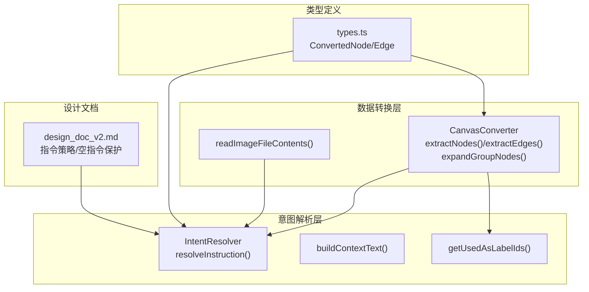
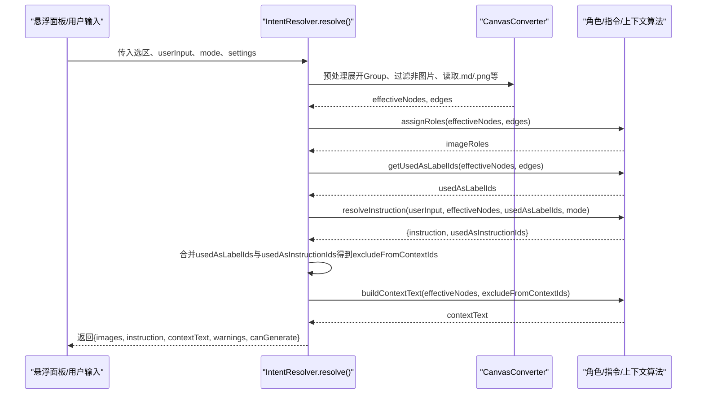
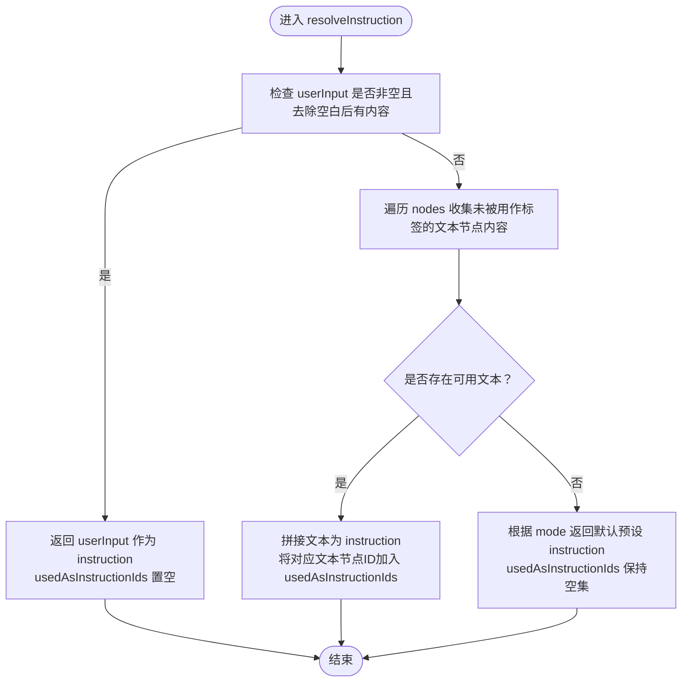
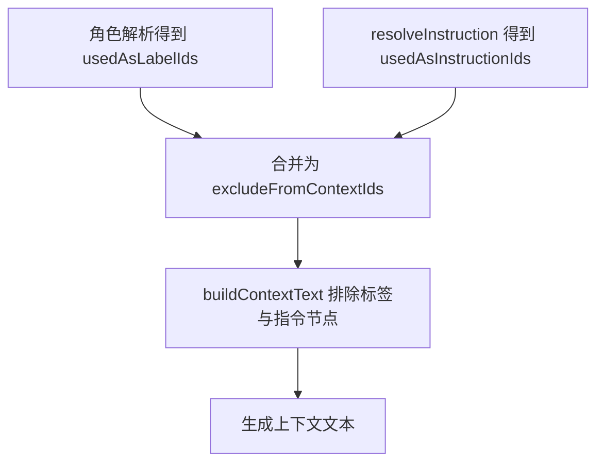
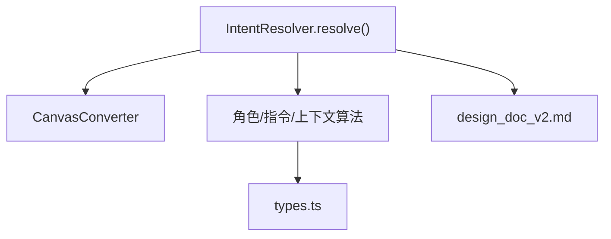

# 指令策略

<cite>
**本文引用的文件**
- [intent-resolver.ts](file://intent-resolver.ts)
- [design_doc_v2.md](file://docs/design_doc_v2.md)
- [canvas-converter.ts](file://canvas-converter.ts)
- [types.ts](file://types.ts)
</cite>

## 目录
1. [简介](#简介)
2. [项目结构](#项目结构)
3. [核心组件](#核心组件)
4. [架构总览](#架构总览)
5. [详细组件分析](#详细组件分析)
6. [依赖分析](#依赖分析)
7. [性能考量](#性能考量)
8. [故障排查指南](#故障排查指南)
9. [结论](#结论)
10. [附录](#附录)

## 简介
本文件围绕 `intent-resolver.ts` 中的 `resolveInstruction` 方法，系统阐述“指令回退策略”的实现与设计。该策略通过三级优先级确定最终发送给 AI 模型的文本指令：
- 最高优先级：用户在悬浮面板中的显式输入；
- 若为空：自动提取选区中“未被用作标签”的文本节点内容作为指令；
- 若仍为空：根据当前模式（chat 或 image）返回预设默认提示词。

同时结合设计文档中的“指令策略”和“空指令保护”，说明该机制如何实现“极简交互”，减少用户重复输入；并解释 `usedAsInstructionIds` 集合的构建与在 `buildContextText` 中的用途，避免上下文重复。

## 项目结构
本插件围绕 Canvas 选区进行多模态意图解析，关键文件与职责如下：
- intent-resolver.ts：意图解析主流程，包含指令回退策略与上下文构建；
- canvas-converter.ts：将 Canvas 节点转换为 LLM 友好的结构（含节点/边抽取、Group 展开、图片读取与压缩等）；
- types.ts：Canvas 节点与边的基础类型定义；
- docs/design_doc_v2.md：设计文档，明确指令策略与空指令保护等设计原则。

图表来源
- [intent-resolver.ts](file://intent-resolver.ts#L84-L111)
- [canvas-converter.ts](file://canvas-converter.ts#L155-L181)
- [types.ts](file://types.ts#L17-L38)
- [design_doc_v2.md](file://docs/design_doc_v2.md#L120-L205)

章节来源
- [intent-resolver.ts](file://intent-resolver.ts#L84-L111)
- [canvas-converter.ts](file://canvas-converter.ts#L155-L181)
- [types.ts](file://types.ts#L17-L38)
- [design_doc_v2.md](file://docs/design_doc_v2.md#L120-L205)

## 核心组件
- 意图解析器（IntentResolver）：负责完整解析流程，包括预处理、角色分配、指令回退、上下文构建与可生成性判断。
- CanvasConverter：负责将 Canvas 选区标准化为 ConvertedNode/Edge，并完成 Group 展开、图片读取与压缩等。
- 类型系统（types.ts）：定义 ConvertedNode/Edge 等结构，支撑解析与构建阶段的数据流转。

章节来源
- [intent-resolver.ts](file://intent-resolver.ts#L58-L130)
- [canvas-converter.ts](file://canvas-converter.ts#L155-L181)
- [types.ts](file://types.ts#L17-L38)

## 架构总览
下图展示了从选区到最终指令与上下文的关键调用链路，以及指令回退策略在整体流程中的位置。

图表来源
- [intent-resolver.ts](file://intent-resolver.ts#L63-L130)
- [canvas-converter.ts](file://canvas-converter.ts#L293-L321)
- [design_doc_v2.md](file://docs/design_doc_v2.md#L120-L205)

## 详细组件分析

### 指令回退策略：resolveInstruction
- 输入参数
  - userInput：用户在悬浮面板输入的显式指令；
  - nodes：预处理后的 ConvertedNode 列表；
  - usedAsLabelIds：被用作图片语义标签的文本节点 ID 集合；
  - mode：当前模式（chat 或 image）。
- 返回值
  - instruction：最终指令文本；
  - usedAsInstructionIds：本次被选为指令的文本节点 ID 集合，用于后续上下文去重。

- 三级优先级逻辑
  1) 用户显式输入优先：若 userInput 非空且去除空白后仍有内容，则直接返回该输入作为 instruction，并清空 usedAsInstructionIds；
  2) 选区文本回退：若 userInput 为空，则扫描 nodes 中类型为 text 且 content 非空、且不在 usedAsLabelIds 中的节点，收集其内容并拼接为 instruction，同时将这些文本节点 ID 记录到 usedAsInstructionIds；
  3) 默认预设兜底：若前两者均为空，则根据 mode 返回预设指令（chat 模式返回“总结所选内容”类提示，image 模式返回“基于这些参考生成图像”类提示），usedAsInstructionIds 保持空集。

- 关键行为
  - usedAsInstructionIds 的构建：仅记录被选为指令的文本节点 ID，便于后续上下文文本构建时排除这些节点，避免重复。
  - 与角色解析的衔接：usedAsLabelIds 由角色解析阶段的标签来源决定，resolveInstruction 仅使用该集合进行“未被用作标签”的过滤。

- 代码片段路径
  - [resolveInstruction 方法主体](file://intent-resolver.ts#L287-L319)
  - [usedAsLabelIds 的构建](file://intent-resolver.ts#L345-L365)
  - [上下文文本构建（排除标签与指令节点）](file://intent-resolver.ts#L324-L343)

图表来源
- [intent-resolver.ts](file://intent-resolver.ts#L287-L319)

章节来源
- [intent-resolver.ts](file://intent-resolver.ts#L287-L319)
- [design_doc_v2.md](file://docs/design_doc_v2.md#L120-L205)

### usedAsInstructionIds 的构建与用途
- 构建过程
  - 在 resolveInstruction 中，当 userInput 为空时，会遍历 nodes 中满足条件的文本节点，将它们的内容拼接为 instruction，并将这些文本节点的 ID 添加到 usedAsInstructionIds 集合。
- 在上下文构建中的用途
  - 在 IntentResolver.resolve 中，会将 usedAsLabelIds 与 usedAsInstructionIds 合并为 excludeFromContextIds，然后在 buildContextText 中排除这些节点，避免同一文本既出现在指令中又出现在上下文中，从而减少冗余与重复。

- 代码片段路径
  - [usedAsInstructionIds 的构建与返回](file://intent-resolver.ts#L287-L319)
  - [excludeFromContextIds 的合并与传递](file://intent-resolver.ts#L84-L89)
  - [buildContextText 的排除逻辑](file://intent-resolver.ts#L324-L343)

图表来源
- [intent-resolver.ts](file://intent-resolver.ts#L84-L89)
- [intent-resolver.ts](file://intent-resolver.ts#L324-L343)

章节来源
- [intent-resolver.ts](file://intent-resolver.ts#L84-L89)
- [intent-resolver.ts](file://intent-resolver.ts#L324-L343)

### 与设计文档的对照：指令策略与空指令保护
- 指令策略
  - 用户输入优先、自动回退（未用作标签的文本）、默认预设，与代码实现完全一致。
- 空指令保护
  - IntentResolver.resolve 最终通过 canGenerate 判断是否可生成：当 images 非空、instruction 非空或 contextText 非空时才允许生成。这一设计与设计文档中的“空指令保护”一致，避免无意义请求。

- 代码片段路径
  - [指令策略（设计文档）](file://docs/design_doc_v2.md#L120-L205)
  - [空指令保护与 canGenerate 判断](file://intent-resolver.ts#L112-L114)

章节来源
- [design_doc_v2.md](file://docs/design_doc_v2.md#L120-L205)
- [intent-resolver.ts](file://intent-resolver.ts#L112-L114)

### 数据结构与类型支撑
- ConvertedNode/ConvertedEdge
  - ConvertedNode：统一承载 text/file/link/group 节点的类型、内容、是否图片、文件路径、Base64、MIME 等信息；
  - ConvertedEdge：统一承载边的 fromId/toId/label 等信息，用于角色解析与指令来源筛选。
- 作用
  - 为 resolveInstruction 提供“文本节点内容”和“是否图片”的判断依据；
  - 为 getUsedAsLabelIds 提供“文本节点连向图片节点”的判定依据。

- 代码片段路径
  - [ConvertedNode/ConvertedEdge 定义](file://types.ts#L17-L38)
  - [CanvasConverter.extractNodes/extractEdges](file://canvas-converter.ts#L63-L123)
  - [CanvasConverter.extractEdges](file://canvas-converter.ts#L155-L181)

章节来源
- [types.ts](file://types.ts#L17-L38)
- [canvas-converter.ts](file://canvas-converter.ts#L63-L123)
- [canvas-converter.ts](file://canvas-converter.ts#L155-L181)

## 依赖分析
- 组件耦合
  - IntentResolver.resolve 依赖 CanvasConverter 的预处理能力（展开 Group、读取图片与 .md 内容）；
  - 角色解析与指令回退相互独立，但共享“选区有效节点”和“边集合”；
  - 上下文构建依赖“标签节点集合”和“指令节点集合”的并集，避免重复。
- 外部依赖
  - Obsidian Canvas API 类型（types.ts）；
  - 设计文档（design_doc_v2.md）提供策略约束与交互规范。

图表来源
- [intent-resolver.ts](file://intent-resolver.ts#L63-L130)
- [canvas-converter.ts](file://canvas-converter.ts#L155-L181)
- [types.ts](file://types.ts#L17-L38)
- [design_doc_v2.md](file://docs/design_doc_v2.md#L120-L205)

章节来源
- [intent-resolver.ts](file://intent-resolver.ts#L63-L130)
- [canvas-converter.ts](file://canvas-converter.ts#L155-L181)
- [types.ts](file://types.ts#L17-L38)
- [design_doc_v2.md](file://docs/design_doc_v2.md#L120-L205)

## 性能考量
- 时间复杂度
  - resolveInstruction：O(N)，N 为 nodes 数量，主要遍历一次节点并进行集合查询；
  - buildContextText：O(N)，同样为一次遍历；
  - 角色解析 assignRoles：O(E+V)，E 为边数，V 为节点数（含 visited 集合避免循环）。
- 空间复杂度
  - usedAsLabelIds、usedAsInstructionIds、excludeFromContextIds 均为 Set，最坏 O(V)；
  - 预处理阶段会缓存节点与边，整体 O(N)。
- 优化建议
  - 在大规模选区中，尽量减少不必要的文本节点（如大量 .md 文件内容）以降低上下文长度；
  - 控制图片数量（最多 14 张），避免超出模型限制；
  - 合理使用 Group 展开，避免过度扩大有效选区导致上下文膨胀。

[本节为一般性指导，不直接分析具体文件]

## 故障排查指南
- 症状：生成按钮不可用
  - 可能原因：images 为空、instruction 为空、contextText 为空，canGenerate 为 false；
  - 排查要点：确认选区中至少包含一张图片、一段文本或用户输入；检查 Group 展开是否正确；查看预处理阶段的警告信息。
- 症状：上下文重复或冗余
  - 可能原因：文本节点既被用作标签又被用作指令；
  - 排查要点：确认 usedAsLabelIds 与 usedAsInstructionIds 的并集是否正确传递给 buildContextText；检查 resolveInstruction 是否正确标记 usedAsInstructionIds。
- 症状：默认预设不符合预期
  - 可能原因：mode 选择错误或 userInput 为空；
  - 排查要点：确认 mode 参数（chat/image）与 UI 交互一致；检查 resolveInstruction 的分支逻辑。

章节来源
- [intent-resolver.ts](file://intent-resolver.ts#L112-L114)
- [intent-resolver.ts](file://intent-resolver.ts#L84-L89)
- [intent-resolver.ts](file://intent-resolver.ts#L287-L319)

## 结论
指令回退策略通过“用户输入优先、自动回退、默认预设”三层机制，显著降低了用户的重复输入成本，实现了“极简交互”。配合 usedAsLabelIds 与 usedAsInstructionIds 的协同，确保指令与上下文不重复，提升提示词质量与模型响应稳定性。设计文档中的“指令策略”和“空指令保护”为该策略提供了清晰的设计约束与交互保障。

[本节为总结性内容，不直接分析具体文件]

## 附录

### 实际代码示例（以路径代替代码）
- 用户显式输入优先
  - [resolveInstruction 分支：用户输入优先](file://intent-resolver.ts#L295-L298)
- 未被用作标签的文本节点回退
  - [resolveInstruction 分支：收集未用作标签的文本节点](file://intent-resolver.ts#L300-L311)
- 默认预设兜底
  - [resolveInstruction 分支：chat 模式默认预设](file://intent-resolver.ts#L314-L316)
  - [resolveInstruction 分支：image 模式默认预设](file://intent-resolver.ts#L316-L319)
- 上下文构建排除逻辑
  - [buildContextText 排除标签与指令节点](file://intent-resolver.ts#L324-L343)
- 角色解析与标签来源
  - [assignRoles 的标签来源优先级](file://intent-resolver.ts#L201-L279)
  - [getUsedAsLabelIds 的标签识别](file://intent-resolver.ts#L345-L365)
- 预处理与 Group 展开
  - [CanvasConverter.expandGroupNodes](file://canvas-converter.ts#L293-L321)
  - [CanvasConverter.extractEdges](file://canvas-converter.ts#L155-L181)