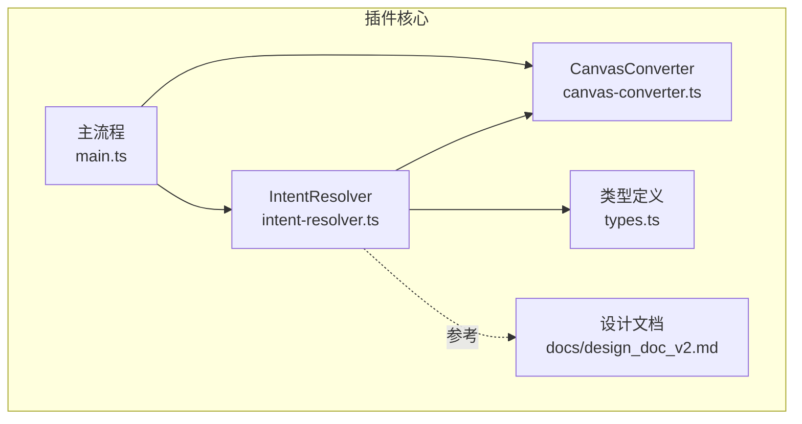
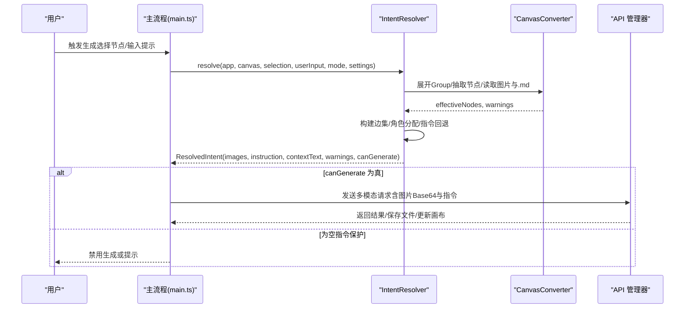
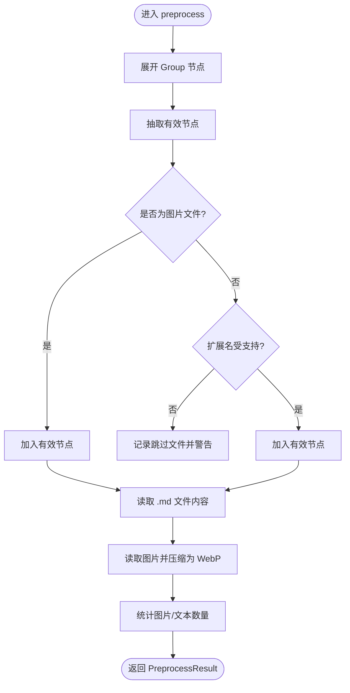
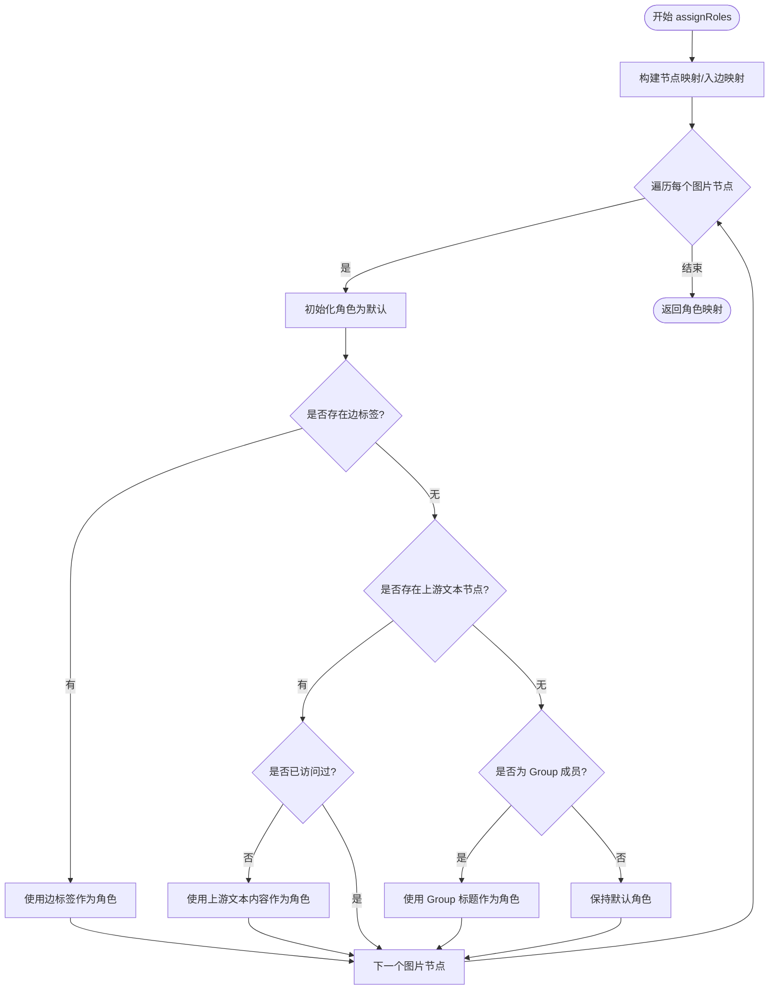
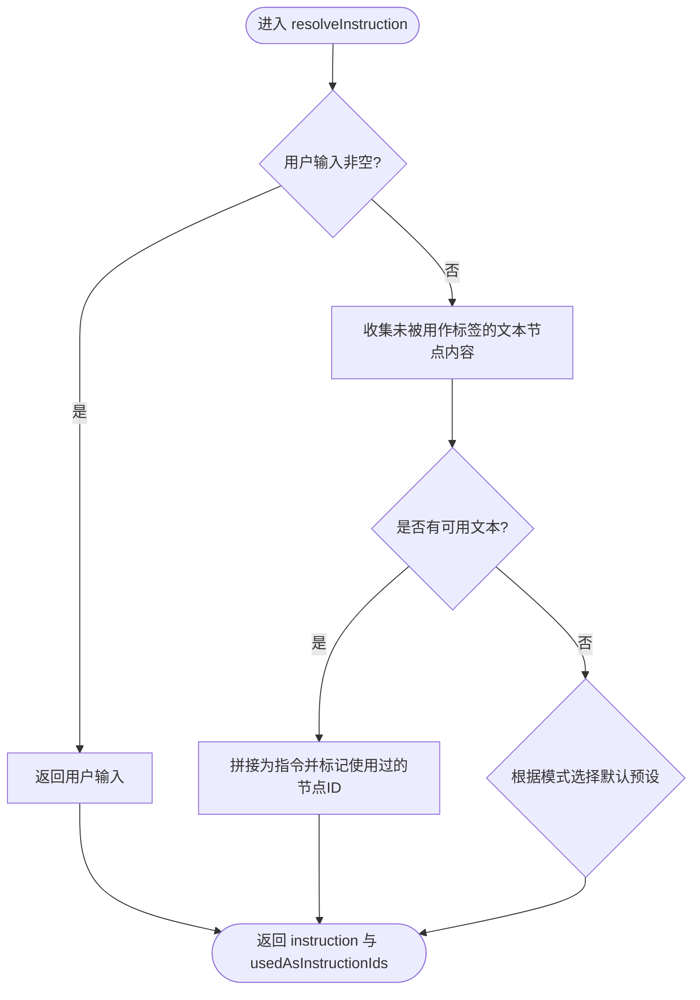
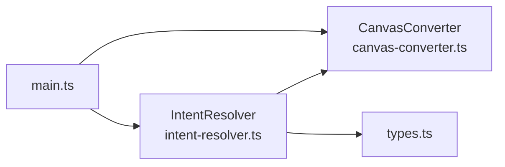

# 智能意图解析器

<cite>
**本文引用的文件**
- [intent-resolver.ts](file://intent-resolver.ts)
- [canvas-converter.ts](file://canvas-converter.ts)
- [types.ts](file://types.ts)
- [main.ts](file://main.ts)
- [docs/design_doc_v2.md](file://docs/design_doc_v2.md)
</cite>

## 目录
1. [简介](#简介)
2. [项目结构](#项目结构)
3. [核心组件](#核心组件)
4. [架构总览](#架构总览)
5. [详细组件分析](#详细组件分析)
6. [依赖分析](#依赖分析)
7. [性能考量](#性能考量)
8. [故障排查指南](#故障排查指南)
9. [结论](#结论)
10. [附录](#附录)

## 简介
本文件为 Obsidian Canvas 插件中“智能意图解析器”（Intent Resolver）的深度技术文档，聚焦其核心差异化能力：将 Canvas 的拓扑结构（节点与连线）翻译为 AI 能理解的多模态语义结构。解析管线分为三步：
- 选区标准化（Pre-processing & Unwrapping）：自动解包 Group 节点并清洗无效文件，统一为扁平化的有效节点集。
- 角色解析（Graph-based Role Assignment）：基于显式连线标签、上游文本节点或分组标题，为每张参考图片确定语义角色（如“风格参考”、“构图参考”）。
- 指令策略（Instruction Strategy）：通过优先级回退机制（用户输入 > 选中文本 > 默认预设）确定最终 Prompt 指令。

同时，结合设计文档中的示例，说明如何构建包含文本指令与多张图片 Base64 的混合内容数组，并讨论防呆设计（图片数量限制、循环连线检测、空指令保护）的实现细节。

## 项目结构
本模块位于插件根目录，与 Canvas 数据转换器、类型定义及主流程集成：
- intent-resolver.ts：智能意图解析器，负责三步解析与结果组装。
- canvas-converter.ts：Canvas 节点与边的抽取、Group 展开、图片压缩与 Base64 转换。
- types.ts：Canvas 节点、边、选区等类型定义。
- main.ts：插件主流程，调用 IntentResolver 并将解析结果转化为 API 请求负载。
- docs/design_doc_v2.md：设计文档，描述管线与防呆策略。



图表来源
- [intent-resolver.ts](file://intent-resolver.ts#L1-L130)
- [canvas-converter.ts](file://canvas-converter.ts#L1-L120)
- [types.ts](file://types.ts#L1-L128)
- [main.ts](file://main.ts#L1040-L1150)
- [docs/design_doc_v2.md](file://docs/design_doc_v2.md#L88-L153)

章节来源
- [intent-resolver.ts](file://intent-resolver.ts#L1-L130)
- [canvas-converter.ts](file://canvas-converter.ts#L1-L120)
- [types.ts](file://types.ts#L1-L128)
- [main.ts](file://main.ts#L1040-L1150)
- [docs/design_doc_v2.md](file://docs/design_doc_v2.md#L88-L153)

## 核心组件
- IntentResolver：解析器主体，提供 resolve 主入口与三步处理方法。
- CanvasConverter：提供节点/边抽取、Group 展开、图片读取与压缩、Markdown/Mermaid 输出等能力。
- 类型系统：CanvasNode、CanvasEdge、ConvertedNode、ConvertedEdge 等，支撑跨模块的数据契约。
- 主流程：在插件主流程中调用 IntentResolver，组装 API Payload 并发起请求。

章节来源
- [intent-resolver.ts](file://intent-resolver.ts#L56-L130)
- [canvas-converter.ts](file://canvas-converter.ts#L56-L120)
- [types.ts](file://types.ts#L21-L113)
- [main.ts](file://main.ts#L1040-L1150)

## 架构总览
IntentResolver 的解析流程如下：
- 步骤0：预处理（Group 展开、文件清洗、读取图片与 .md 内容）
- 步骤1：角色解析（基于边标签、上游文本、分组标题）
- 步骤2：指令策略（用户输入 > 选中文本 > 默认预设）
- 合成结果：图片（含角色）、指令、上下文文本、警告与可生成标志



图表来源
- [intent-resolver.ts](file://intent-resolver.ts#L63-L130)
- [canvas-converter.ts](file://canvas-converter.ts#L293-L321)
- [main.ts](file://main.ts#L1040-L1150)

## 详细组件分析

### 解析器类与接口
IntentResolver 提供静态方法，集中完成三步解析与结果组装。关键接口包括：
- ResolvedIntent：最终输出，包含图片（含角色）、指令、上下文文本、警告与可生成标志。
- ImageWithRole：图片携带角色信息，便于在 API Payload 中按角色组织。
- PreprocessResult：预处理阶段的统计与警告。

```mermaid
classDiagram
class IntentResolver {
+resolve(app, canvas, selection, userInput, mode, settings) ResolvedIntent
+preprocess(app, canvas, selection, compressionQuality, maxSize) PreprocessResult
+assignRoles(nodes, edges, canvas, originalSelection) Map~string,string~
+resolveInstruction(userInput, nodes, usedAsLabelIds, mode) {instruction, usedAsInstructionIds}
+buildContextText(nodes, usedAsLabelIds) string
-getUsedAsLabelIds(nodes, edges) Set~string~
-truncateRole(text) string
}
class ResolvedIntent {
+images : ImageWithRole[]
+instruction : string
+contextText : string
+warnings : string[]
+canGenerate : boolean
}
class ImageWithRole {
+base64 : string
+mimeType : string
+role : string
+nodeId : string
}
class PreprocessResult {
+effectiveNodes : ConvertedNode[]
+skippedFiles : string[]
+warnings : string[]
+imageCount : number
+textCount : number
}
IntentResolver --> ResolvedIntent : "返回"
IntentResolver --> ImageWithRole : "构建"
IntentResolver --> PreprocessResult : "返回"
```

图表来源
- [intent-resolver.ts](file://intent-resolver.ts#L23-L130)

章节来源
- [intent-resolver.ts](file://intent-resolver.ts#L23-L130)

### 步骤0：选区标准化（预处理与 Group 展开）
- Group 展开：使用 CanvasConverter.expandGroupNodes，基于 Group 的包围盒扫描 Canvas，将范围内未被选中的子节点加入有效选区。
- 节点过滤与清洗：保留文本节点、文件节点（含图片与非图片）、链接节点；对非图片文件记录跳过并产生警告。
- 内容读取：
  - .md 文件：读取缓存内容并填充到节点。
  - 图片文件：读取二进制并通过 CanvasConverter.compressImageToWebP 压缩为 WebP，限制尺寸与质量。
- 统计：统计图片与文本数量，便于后续上下文与指令构建。



图表来源
- [intent-resolver.ts](file://intent-resolver.ts#L138-L199)
- [canvas-converter.ts](file://canvas-converter.ts#L293-L321)
- [canvas-converter.ts](file://canvas-converter.ts#L328-L382)
- [canvas-converter.ts](file://canvas-converter.ts#L397-L463)

章节来源
- [intent-resolver.ts](file://intent-resolver.ts#L138-L199)
- [canvas-converter.ts](file://canvas-converter.ts#L293-L321)
- [canvas-converter.ts](file://canvas-converter.ts#L328-L382)
- [canvas-converter.ts](file://canvas-converter.ts#L397-L463)

### 步骤1：角色解析（基于图谱的角色分配）
- 边集构建：通过 CanvasConverter.extractEdges 仅保留选区内节点之间的边，形成 fromId/toId/label 的边集。
- 角色分配优先级：
  1) 显式连线标签：若存在边标签且非空，优先使用标签作为角色。
  2) 上游文本：若未分配角色，遍历指向该图片的上游文本节点，使用其内容作为角色（并做循环检测）。
  3) 分组标题：若节点为 Group 成员且仍未分配角色，使用所在 Group 的 label 作为角色。
  4) 默认角色：若仍无角色，使用默认角色。
- 循环检测：使用 visited 集合避免在上游文本遍历时陷入环路。



图表来源
- [intent-resolver.ts](file://intent-resolver.ts#L201-L280)

章节来源
- [intent-resolver.ts](file://intent-resolver.ts#L201-L280)

### 步骤2：指令策略（优先级回退）
- 优先级 A：用户显式输入（非空即用）。
- 优先级 B：未被用作标签的文本节点内容（拼接为最终指令）。
- 优先级 C：默认预设（根据模式选择不同默认提示词）。
- 标签节点去重：在指令回退前，先识别哪些文本节点被用作图片的语义标签，避免重复纳入指令。



图表来源
- [intent-resolver.ts](file://intent-resolver.ts#L282-L319)
- [intent-resolver.ts](file://intent-resolver.ts#L345-L365)

章节来源
- [intent-resolver.ts](file://intent-resolver.ts#L282-L319)
- [intent-resolver.ts](file://intent-resolver.ts#L345-L365)

### 上下文文本构建与图片角色注入
- 上下文文本：排除图片节点、已被用作标签的节点，保留文本节点内容与 .md 文件内容，并按约定格式拼接。
- 图片角色注入：将每张图片的 Base64 与 MIME 类型加入结果，并附带角色标签，便于在 API Payload 中按角色组织。

章节来源
- [intent-resolver.ts](file://intent-resolver.ts#L321-L344)
- [intent-resolver.ts](file://intent-resolver.ts#L83-L110)

### 防呆设计与边界保护
- 图片数量限制：超过上限时截断并产生警告，避免超出模型限制。
- 循环连线检测：在角色解析与指令回退过程中维护 visited 集合，防止遍历死循环。
- 空指令保护：若无图片、无文本、无用户输入，则 canGenerate 为假，阻止生成。
- 图片压缩与尺寸限制：在预处理阶段对图片进行压缩与尺寸限制，提升成功率与稳定性。

章节来源
- [intent-resolver.ts](file://intent-resolver.ts#L103-L114)
- [intent-resolver.ts](file://intent-resolver.ts#L212-L212)
- [intent-resolver.ts](file://intent-resolver.ts#L313-L319)
- [canvas-converter.ts](file://canvas-converter.ts#L350-L463)
- [docs/design_doc_v2.md](file://docs/design_doc_v2.md#L144-L153)

## 依赖分析
- IntentResolver 依赖 CanvasConverter（节点/边抽取、Group 展开、图片读取与压缩）。
- IntentResolver 依赖 types.ts 中的 CanvasNode、CanvasEdge 类型。
- 主流程 main.ts 调用 IntentResolver.resolve 并消费 ResolvedIntent，组装 API Payload。



图表来源
- [intent-resolver.ts](file://intent-resolver.ts#L1-L22)
- [canvas-converter.ts](file://canvas-converter.ts#L1-L55)
- [types.ts](file://types.ts#L1-L50)
- [main.ts](file://main.ts#L1-L12)

章节来源
- [intent-resolver.ts](file://intent-resolver.ts#L1-L22)
- [canvas-converter.ts](file://canvas-converter.ts#L1-L55)
- [types.ts](file://types.ts#L1-L50)
- [main.ts](file://main.ts#L1-L12)

## 性能考量
- 异步 I/O：图片读取与压缩、.md 内容读取均为异步，避免阻塞 UI。
- 边集与节点映射：在角色解析阶段构建入边映射与节点映射，降低查询复杂度。
- 截断与警告：在预处理阶段就进行数量限制与跳过文件记录，减少后续处理成本。
- 压缩策略：在读取图片前进行尺寸与质量控制，降低 Base64 长度与 API 负载。

章节来源
- [intent-resolver.ts](file://intent-resolver.ts#L138-L199)
- [canvas-converter.ts](file://canvas-converter.ts#L350-L463)

## 故障排查指南
- 无生成结果：检查 ResolvedIntent.canGenerate，若为假，确认是否选择了图片或提供了指令或上下文文本。
- 图片过多：查看 warnings 中关于图片数量限制的提示，必要时减少选区或拆分任务。
- 角色未按预期：检查连线标签是否正确设置，或上游文本是否可达且未被循环检测阻断。
- 指令为空：确认用户输入是否为空，若为空，检查选区中是否有未被用作标签的文本节点。
- API 错误：查看主流程中的错误处理与提示，确认 API Key 配置与网络状态。

章节来源
- [intent-resolver.ts](file://intent-resolver.ts#L103-L114)
- [intent-resolver.ts](file://intent-resolver.ts#L282-L319)
- [main.ts](file://main.ts#L1146-L1149)

## 结论
IntentResolver 将 Canvas 的拓扑结构转化为 AI 友好的多模态语义结构，通过“选区标准化—角色解析—指令策略”的三步法，实现了高鲁棒性的智能意图解析。配合设计文档中的防呆设计与主流程的集成，能够在保证用户体验的同时，最大化地发挥多模态模型的能力。

## 附录

### API Payload 构建要点（基于设计文档）
- 混合内容数组由系统提示、图片（带角色标签）与指令组成。
- 图片以 Base64 形式传输，角色标签用于区分用途（如风格参考、构图参考）。
- 若存在上下文文本，可在系统提示之后插入上下文片段。

章节来源
- [docs/design_doc_v2.md](file://docs/design_doc_v2.md#L300-L336)
- [main.ts](file://main.ts#L1094-L1145)