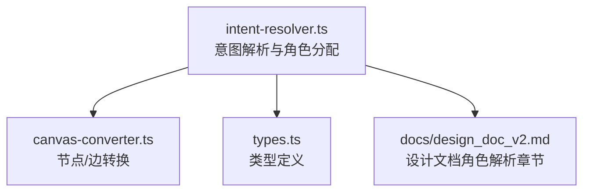
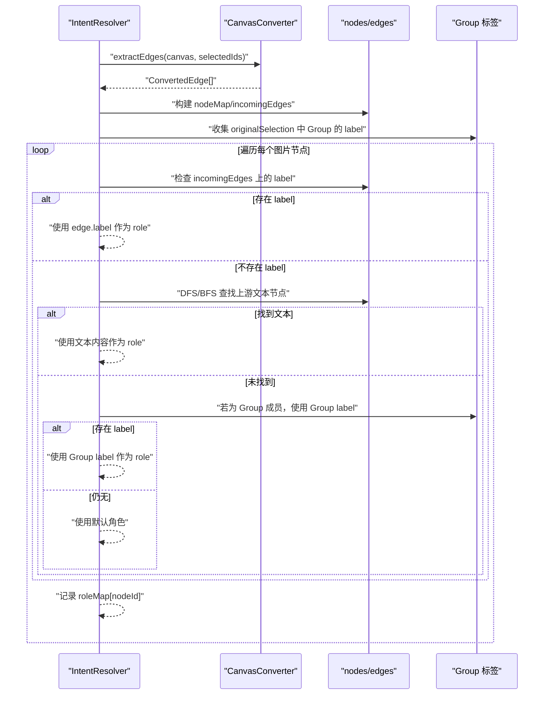
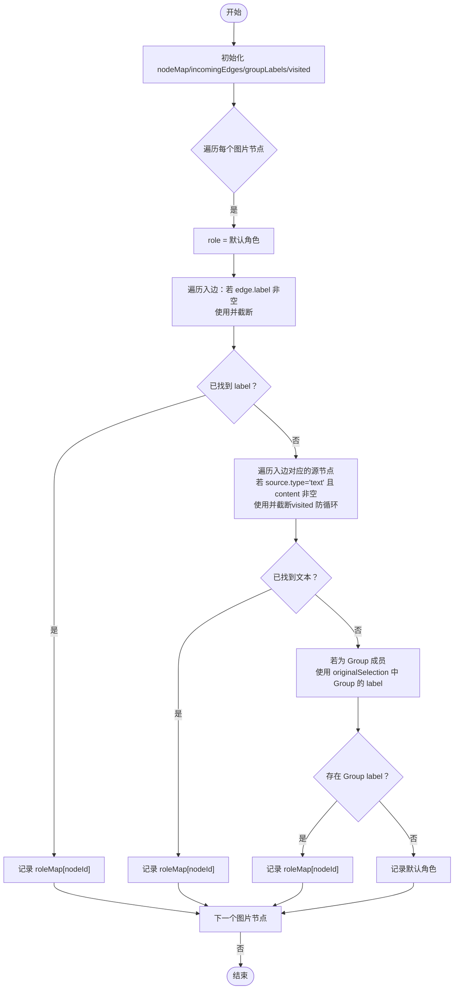
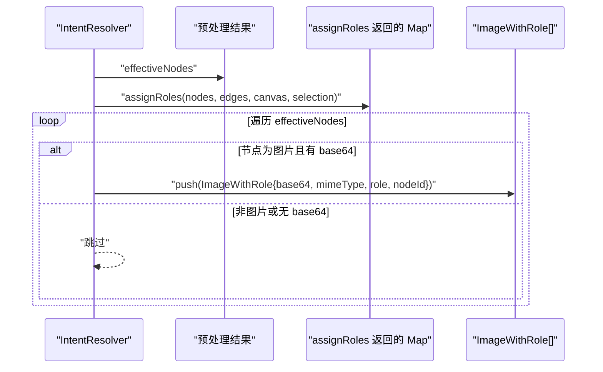
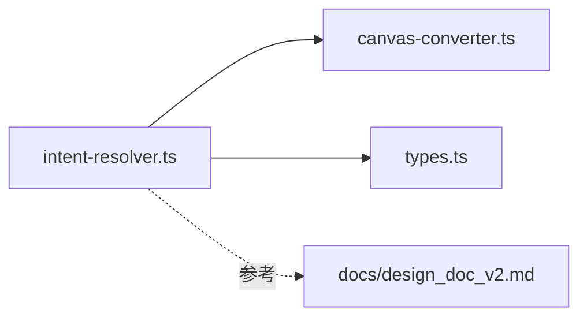

# 角色分配

<cite>
**本文引用的文件**
- [intent-resolver.ts](file://intent-resolver.ts)
- [canvas-converter.ts](file://canvas-converter.ts)
- [types.ts](file://types.ts)
- [docs/design_doc_v2.md](file://docs/design_doc_v2.md)
</cite>

## 目录
1. [简介](#简介)
2. [项目结构](#项目结构)
3. [核心组件](#核心组件)
4. [架构总览](#架构总览)
5. [详细组件分析](#详细组件分析)
6. [依赖关系分析](#依赖关系分析)
7. [性能考量](#性能考量)
8. [故障排查指南](#故障排查指南)
9. [结论](#结论)

## 简介
本节聚焦于智能意图解析管线中的“角色分配”阶段，即对 Canvas 选区内每张图片节点赋予语义角色（Role）。该角色用于指导下游模型如何使用该图片：是“风格参考”、“构图参考”，还是“视觉参考”。本文围绕 intent-resolver.ts 中的 assignRoles 方法，系统阐述其基于图谱的优先级回退机制，以及与设计文档中“角色解析”的一致性说明。同时解释 incomingEdges 与 nodeMap 的构建如何支撑高效图遍历，visited 集合如何防止循环依赖，并给出 ImageWithRole 对象生成流程与 truncateRole 截断策略的说明。

## 项目结构
本插件围绕 Canvas 数据在本地进行预处理与意图解析，关键文件如下：
- intent-resolver.ts：意图解析主流程与角色分配
- canvas-converter.ts：Canvas 节点/边转换为内部结构
- types.ts：Canvas 类型定义
- docs/design_doc_v2.md：设计文档，包含角色解析优先级与安全防护

图表来源
- [intent-resolver.ts](file://intent-resolver.ts#L1-L130)
- [canvas-converter.ts](file://canvas-converter.ts#L1-L120)
- [types.ts](file://types.ts#L1-L128)
- [docs/design_doc_v2.md](file://docs/design_doc_v2.md#L105-L118)

章节来源
- [intent-resolver.ts](file://intent-resolver.ts#L1-L130)
- [canvas-converter.ts](file://canvas-converter.ts#L1-L120)
- [types.ts](file://types.ts#L1-L128)
- [docs/design_doc_v2.md](file://docs/design_doc_v2.md#L105-L118)

## 核心组件
- ImageWithRole：带角色的图片数据结构，包含 base64、mimeType、role、nodeId
- ResolvedIntent：解析结果，包含 images、instruction、contextText、warnings、canGenerate
- ConvertedNode/ConvertedEdge：Canvas 转换后的节点与边，用于图遍历
- IntentResolver.assignRoles：基于图谱的语义角色分配

章节来源
- [intent-resolver.ts](file://intent-resolver.ts#L24-L55)
- [intent-resolver.ts](file://intent-resolver.ts#L201-L280)
- [canvas-converter.ts](file://canvas-converter.ts#L16-L38)

## 架构总览
角色分配是“智能意图解析管线”的第二阶段，紧随预处理之后。其输入为：
- nodes：预处理后的节点列表（含图片、文本、文件、链接、群组）
- edges：仅在选区内存在的边（fromId→toId，可能带 label）
- canvas：原始 Canvas 实例（用于 Group 展开时的上下文）
- originalSelection：用户最初选中的节点集合（用于提取 Group 的 label）

输出为 Map<nodeId, role>，随后在 resolve 步骤中组装为 ImageWithRole[]。

图表来源
- [intent-resolver.ts](file://intent-resolver.ts#L80-L101)
- [intent-resolver.ts](file://intent-resolver.ts#L205-L279)
- [canvas-converter.ts](file://canvas-converter.ts#L161-L181)

## 详细组件分析

### assignRoles 方法：基于图谱的语义角色分配
- 输入
  - nodes：预处理后的 ConvertedNode[]
  - edges：仅在选区内存在的 ConvertedEdge[]
  - canvas：原始 Canvas 实例（用于 Group 展开）
  - originalSelection：用户最初选中的节点集合
- 输出
  - Map<string, string>：nodeId → role
- 关键数据结构
  - nodeMap：string → ConvertedNode，加速节点查找
  - incomingEdges：string → ConvertedEdge[]，按 toId 聚合边，便于快速查询某节点的入边
  - visited：Set<string>，遍历上游文本时防止循环依赖
  - groupLabels：Map<string, string>，originalSelection 中 Group 的 label
- 优先级回退逻辑
  1) 显式连线 Label：遍历指向该图片节点的所有边，若边带 label 且非空，直接使用该 label 并截断
  2) 上游文本：若未找到显式 label，遍历入边对应的源节点，若源节点为文本节点且内容非空，使用其内容作为 role，并在访问前检查 visited 防止循环
  3) Group 标题：若仍未得到角色且该图片节点是 Group 成员，使用 originalSelection 中对应 Group 的 label 作为 role
  4) 默认角色：若以上均不可得，使用默认值
- 截断策略
  - truncateRole：去除换行、裁剪到最大长度，超出则以省略号结尾

图表来源
- [intent-resolver.ts](file://intent-resolver.ts#L205-L279)
- [intent-resolver.ts](file://intent-resolver.ts#L367-L378)

章节来源
- [intent-resolver.ts](file://intent-resolver.ts#L205-L279)
- [intent-resolver.ts](file://intent-resolver.ts#L367-L378)

### 图遍历与数据结构：incomingEdges 与 nodeMap
- incomingEdges：以 toId 为键，存储指向该节点的所有边，便于 O(1) 查询某节点的入边集合
- nodeMap：以 id 为键，存储节点对象，便于 O(1) 获取任意节点
- 作用
  - 快速定位图片节点的入边
  - 快速定位入边的源节点类型与内容
  - 降低整体时间复杂度，避免多次扫描

章节来源
- [intent-resolver.ts](file://intent-resolver.ts#L214-L225)

### 循环依赖防护：visited 集合
- 场景：用户在 Canvas 中创建循环连线（例如 A→B，B→A），在遍历上游文本时可能导致无限递归
- 处理：在访问上游文本节点前，先检查 visited 集合；若已访问过则跳过，从而避免循环
- 影响：保证 assignRoles 的稳定性与正确性

章节来源
- [intent-resolver.ts](file://intent-resolver.ts#L255-L261)
- [docs/design_doc_v2.md](file://docs/design_doc_v2.md#L148-L149)

### Group 标题作为上下文角色
- 逻辑：若图片节点是 Group 成员，且 originalSelection 中存在该 Group 的 label，则使用该 label 作为角色
- 作用：在用户未显式标注边 label 的情况下，仍能提供有意义的上下文角色

章节来源
- [intent-resolver.ts](file://intent-resolver.ts#L265-L274)

### 默认角色与回退策略
- 默认角色：Visual Reference
- 回退顺序：显式 label → 上游文本 → Group 标题 → 默认角色
- 与设计文档一致：设计文档明确列出优先级与默认值

章节来源
- [intent-resolver.ts](file://intent-resolver.ts#L15-L17)
- [intent-resolver.ts](file://intent-resolver.ts#L241-L274)
- [docs/design_doc_v2.md](file://docs/design_doc_v2.md#L109-L118)

### ImageWithRole 对象生成过程
- 在 resolve 步骤中，遍历预处理后的节点，对每个 isImage 且有 base64 的节点，构造 ImageWithRole
- role 来源于 assignRoles 返回的 Map；若未找到则使用默认角色
- 该对象随后参与后续的指令策略与上下文文本构建

图表来源
- [intent-resolver.ts](file://intent-resolver.ts#L80-L101)
- [intent-resolver.ts](file://intent-resolver.ts#L205-L279)

章节来源
- [intent-resolver.ts](file://intent-resolver.ts#L80-L101)
- [intent-resolver.ts](file://intent-resolver.ts#L205-L279)

### truncateRole 截断处理
- 目的：限制角色文本长度，避免过长文本影响模型理解与 Token 消耗
- 策略：去除换行、裁剪到最大长度，超出则以省略号结尾
- 常量：MAX_ROLE_TEXT_LENGTH

章节来源
- [intent-resolver.ts](file://intent-resolver.ts#L15-L17)
- [intent-resolver.ts](file://intent-resolver.ts#L367-L378)

## 依赖关系分析
- IntentResolver 依赖 CanvasConverter 提供的节点/边转换结果
- IntentResolver 依赖 types.ts 中的 CanvasNode/CanvasEdge 类型定义
- 设计文档为角色解析提供了高层约束与优先级规范

图表来源
- [intent-resolver.ts](file://intent-resolver.ts#L1-L130)
- [canvas-converter.ts](file://canvas-converter.ts#L1-L120)
- [types.ts](file://types.ts#L1-L128)
- [docs/design_doc_v2.md](file://docs/design_doc_v2.md#L105-L118)

章节来源
- [intent-resolver.ts](file://intent-resolver.ts#L1-L130)
- [canvas-converter.ts](file://canvas-converter.ts#L1-L120)
- [types.ts](file://types.ts#L1-L128)
- [docs/design_doc_v2.md](file://docs/design_doc_v2.md#L105-L118)

## 性能考量
- 时间复杂度
  - 构建 nodeMap/incomingEdges：O(E)，E 为边数
  - 遍历图片节点并逐个解析角色：O(V + E)，V 为节点数，E 为边数
  - 截断操作 O(L)，L 为文本长度（远小于 V+E）
- 空间复杂度
  - nodeMap/incomingEdges/groupLabels/visited：O(V + E)
- 优化点
  - 使用 Map 结构进行 O(1) 查找
  - 仅在必要时进行 DFS/BFS（上游文本）并配合 visited 防循环
  - 仅对图片节点进行角色解析，避免对文本/文件节点的无效遍历

[本节为一般性性能讨论，无需特定文件引用]

## 故障排查指南
- 症状：图片未获得角色，全部使用默认角色
  - 可能原因：未在边或上游文本中提供角色信息；图片不在 originalSelection 的 Group 内
  - 建议：在边 label 中明确标注角色；在上游文本中提供描述；将图片放入 Group 并为其设置 label
- 症状：角色文本过长导致 Token 压力
  - 处理：确认 truncateRole 生效；适当缩短上游文本或边 label
- 症状：循环连线导致解析卡顿或异常
  - 处理：检查是否存在 A→B→A 的循环；删除或修正循环连线；visited 防护会阻止无限递归

章节来源
- [intent-resolver.ts](file://intent-resolver.ts#L241-L274)
- [intent-resolver.ts](file://intent-resolver.ts#L255-L261)
- [intent-resolver.ts](file://intent-resolver.ts#L367-L378)
- [docs/design_doc_v2.md](file://docs/design_doc_v2.md#L148-L149)

## 结论
assignRoles 通过“显式边 label → 上游文本 → Group 标题 → 默认角色”的优先级回退，将 Canvas 的拓扑结构转化为可被模型理解的语义角色。借助 incomingEdges 与 nodeMap 的高效索引，以及 visited 集合的循环防护，该方法在保证正确性的同时具备良好的性能表现。结合设计文档的角色解析章节，该实现与整体意图解析管线保持一致，能够稳定地为后续的指令策略与上下文构建提供高质量的语义角色。