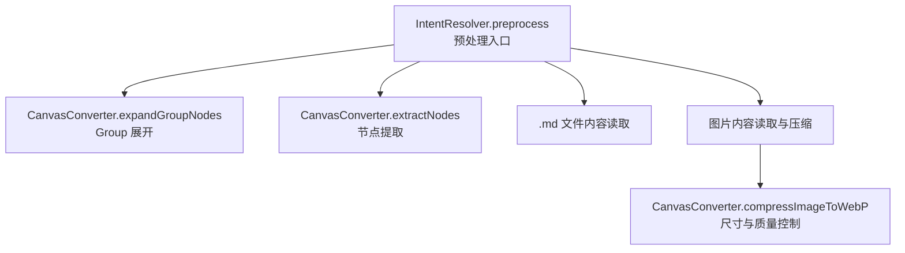
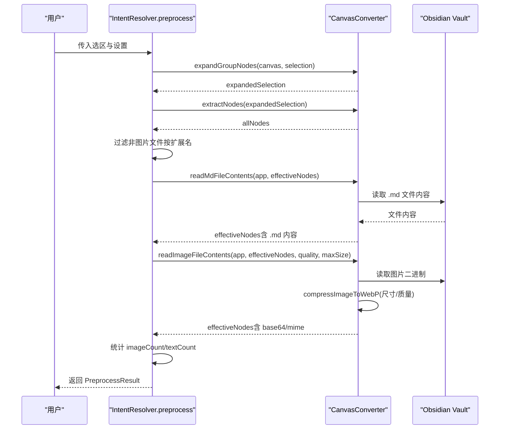
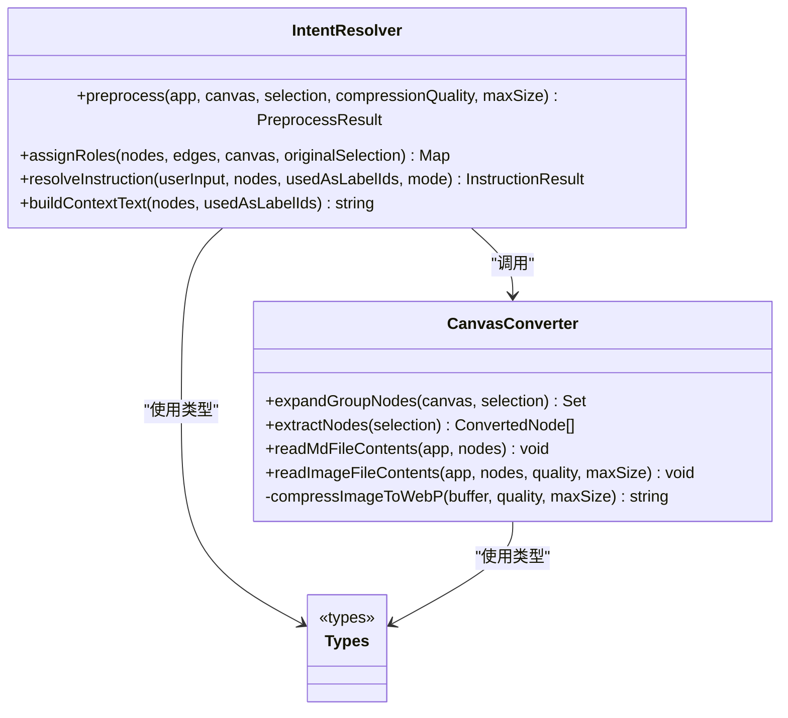

# 选区预处理

<cite>
**本文引用的文件**
- [intent-resolver.ts](file://intent-resolver.ts)
- [canvas-converter.ts](file://canvas-converter.ts)
- [types.ts](file://types.ts)
- [docs/design_doc_v2.md](file://docs/design_doc_v2.md)
</cite>

## 目录
1. [简介](#简介)
2. [项目结构](#项目结构)
3. [核心组件](#核心组件)
4. [架构总览](#架构总览)
5. [详细组件分析](#详细组件分析)
6. [依赖分析](#依赖分析)
7. [性能考量](#性能考量)
8. [故障排查指南](#故障排查指南)
9. [结论](#结论)

## 简介
本文件聚焦于 `intent-resolver.ts` 中的预处理阶段（Step 0：选区标准化），系统性阐述其如何完成“Group 自动解包”与“文件清洗”，并为后续的角色分配与指令解析提供统一、干净的输入数据。同时结合设计文档中的“Group Unwrapping”与“文件清洗”流程，说明预处理如何通过以下关键能力保障后续流程的稳定性与可用性：
- 自动解包 Group 节点，将嵌套结构展平为可处理的节点列表；
- 过滤非图片文件，仅保留受支持的图片扩展名；
- 读取本地文件内容：对图片进行压缩与编码，对 .md 文件读取为文本；
- 防呆机制：对超大图片自动压缩、对无效文件进行跳过并给出警告；
- 输出标准化的预处理结果，便于后续角色分配与指令策略使用。

## 项目结构
与本主题直接相关的文件与职责如下：
- intent-resolver.ts：意图解析主流程，包含预处理、角色分配、指令策略与上下文构建；
- canvas-converter.ts：负责节点转换、Group 展开、文件读取与图片压缩；
- types.ts：Canvas 节点与边的基础类型定义；
- docs/design_doc_v2.md：设计文档，明确 Group 展开与文件清洗的流程与约束。

图表来源
- [intent-resolver.ts](file://intent-resolver.ts#L138-L199)
- [canvas-converter.ts](file://canvas-converter.ts#L305-L321)
- [canvas-converter.ts](file://canvas-converter.ts#L328-L348)
- [canvas-converter.ts](file://canvas-converter.ts#L357-L463)

章节来源
- [intent-resolver.ts](file://intent-resolver.ts#L138-L199)
- [canvas-converter.ts](file://canvas-converter.ts#L305-L321)
- [canvas-converter.ts](file://canvas-converter.ts#L328-L348)
- [canvas-converter.ts](file://canvas-converter.ts#L357-L463)

## 核心组件
- 预处理结果类型 PreprocessResult：封装有效节点、跳过的文件、警告、图片与文本计数，供后续流程复用。
- 支持的图片扩展名常量：限定图片清洗范围。
- 预处理主流程：调用 Group 展开、节点提取与清洗、文件读取与图片压缩、统计计数并返回结果。

章节来源
- [intent-resolver.ts](file://intent-resolver.ts#L19-L44)
- [intent-resolver.ts](file://intent-resolver.ts#L138-L199)

## 架构总览
预处理阶段的端到端流程如下：

图表来源
- [intent-resolver.ts](file://intent-resolver.ts#L138-L199)
- [canvas-converter.ts](file://canvas-converter.ts#L328-L348)
- [canvas-converter.ts](file://canvas-converter.ts#L357-L463)

## 详细组件分析

### 预处理入口与职责
- 入口方法：IntentResolver.preprocess
- 关键职责：
  - 调用 CanvasConverter.expandGroupNodes 展开 Group；
  - 调用 CanvasConverter.extractNodes 提取节点；
  - 过滤非图片文件（依据 SUPPORTED_IMAGE_EXTENSIONS）；
  - 读取 .md 文件内容；
  - 读取图片内容并压缩为 WebP Base64；
  - 统计图片与文本数量，构建 PreprocessResult。

章节来源
- [intent-resolver.ts](file://intent-resolver.ts#L138-L199)

### Group 自动解包（Group Unwrapping）
- 实现位置：CanvasConverter.expandGroupNodes
- 行为要点：
  - 遍历选中节点，若为 group 类型，计算其包围盒；
  - 使用 canvas.getContainingNodes 获取组内所有未被选中的节点；
  - 将组内节点加入 expandedSelection，形成扁平化处理列表；
  - 保留 group 节点本身（用于语义标签），并标记 isGroupMember 以便后续角色解析。

章节来源
- [canvas-converter.ts](file://canvas-converter.ts#L305-L321)

### 文件清洗与过滤
- 清洗范围：
  - 仅保留图片文件（isImage 为真）；
  - 对于非图片文件，依据扩展名是否在 SUPPORTED_IMAGE_EXTENSIONS 中决定是否跳过；
  - 对于 .md 文件，读取其内容并填充到节点的 fileContent 与 content 字段；
  - 对于图片文件，读取二进制并压缩为 WebP Base64。
- 跳过策略：
  - 非图片文件会被记录到 skippedFiles 并生成警告；
  - 无效文件（无法读取）会捕获异常并继续处理其他节点。

章节来源
- [intent-resolver.ts](file://intent-resolver.ts#L152-L187)
- [canvas-converter.ts](file://canvas-converter.ts#L328-L348)

### 图片读取与压缩策略
- 读取与压缩流程：
  - CanvasConverter.readImageFileContents 读取图片二进制；
  - CanvasConverter.compressImageToWebP 使用 OffscreenCanvas 与 toDataURL 将图片缩放并编码为 WebP；
  - 通过 maxSize 控制宽高上限，通过 quality 控制压缩质量；
  - 将压缩后的 base64 与 mime 类型写回节点。
- 防呆机制：
  - 超大图片自动压缩，避免 API 请求超时或体积过大；
  - 异常捕获，不影响其他节点处理。

章节来源
- [canvas-converter.ts](file://canvas-converter.ts#L357-L463)

### 预处理结果构建（PreprocessResult）
- 字段说明：
  - effectiveNodes：经过清洗与读取后的节点列表；
  - skippedFiles：被跳过的非图片文件路径列表；
  - warnings：警告信息（如跳过文件数量与名称）；
  - imageCount、textCount：图片与文本节点计数。
- 作用：
  - 为后续角色分配与指令策略提供统一输入；
  - 为 UI 与日志展示提供统计信息。

章节来源
- [intent-resolver.ts](file://intent-resolver.ts#L19-L44)
- [intent-resolver.ts](file://intent-resolver.ts#L184-L199)

### 与设计文档的对应关系
- Group 展开：设计文档明确 Group Unwrapping 的目的与流程，预处理阶段严格遵循；
- 文件清洗：设计文档要求剔除非图片文件与自动压缩，预处理阶段通过扩展名过滤与压缩实现；
- 防呆机制：设计文档提出循环检测、图片数量限制、自动压缩与空指令保护，预处理阶段实现文件清洗与压缩，后续流程实现数量限制与空指令保护。

章节来源
- [docs/design_doc_v2.md](file://docs/design_doc_v2.md#L92-L103)
- [docs/design_doc_v2.md](file://docs/design_doc_v2.md#L158-L177)
- [docs/design_doc_v2.md](file://docs/design_doc_v2.md#L244-L272)

## 依赖分析
- IntentResolver.preprocess 依赖 CanvasConverter 的以下方法：
  - expandGroupNodes：Group 展开；
  - extractNodes：节点提取；
  - readMdFileContents：.md 文件内容读取；
  - readImageFileContents：图片读取与压缩。
- 类型依赖：
  - ConvertedNode/ConvertedEdge/Canvas 等类型由 types.ts 定义，预处理与后续流程均使用这些类型。

图表来源
- [intent-resolver.ts](file://intent-resolver.ts#L138-L199)
- [canvas-converter.ts](file://canvas-converter.ts#L305-L321)
- [canvas-converter.ts](file://canvas-converter.ts#L328-L348)
- [canvas-converter.ts](file://canvas-converter.ts#L357-L463)
- [types.ts](file://types.ts#L1-L128)

章节来源
- [intent-resolver.ts](file://intent-resolver.ts#L138-L199)
- [canvas-converter.ts](file://canvas-converter.ts#L305-L321)
- [canvas-converter.ts](file://canvas-converter.ts#L328-L348)
- [canvas-converter.ts](file://canvas-converter.ts#L357-L463)
- [types.ts](file://types.ts#L1-L128)

## 性能考量
- I/O 与 CPU 开销：
  - 预处理阶段涉及多次文件读取与图片压缩，建议在 UI 线程外进行批处理；
  - 对于大量图片的场景，优先使用较小的 maxSize 与合理的 quality，降低 Base64 体积；
- 并发与节流：
  - 可考虑对 .md 与图片读取进行分批处理，避免一次性读取过多文件导致卡顿；
  - 对于超大图片，优先进行尺寸缩放，再进行质量压缩，以平衡体积与清晰度。
- 统计与日志：
  - 预处理阶段已统计 imageCount 与 textCount，可用于 UI 提示与后续流程决策。

[本节为通用性能建议，不直接分析具体文件，故无章节来源]

## 故障排查指南
- 非图片文件被跳过：
  - 现象：预处理结果 warnings 中包含跳过文件数量与名称；
  - 处理：确认文件扩展名是否在 SUPPORTED_IMAGE_EXTENSIONS 中，必要时转换为受支持格式。
- 图片读取失败：
  - 现象：控制台警告或节点缺少 base64；
  - 处理：检查文件是否存在、权限是否正确；确认图片未损坏；尝试增大 maxSize 或调整 quality。
- 超大图片导致体积过大：
  - 现象：Base64 过长，请求失败或耗时过长；
  - 处理：降低 maxSize 或 quality；确认压缩流程正常执行。
- .md 文件内容未填充：
  - 现象：节点 content 仍为引用而非实际内容；
  - 处理：确认文件路径正确且为 .md；检查读取异常日志。

章节来源
- [intent-resolver.ts](file://intent-resolver.ts#L152-L187)
- [canvas-converter.ts](file://canvas-converter.ts#L328-L348)
- [canvas-converter.ts](file://canvas-converter.ts#L357-L463)

## 结论
预处理阶段通过“Group 自动解包 + 文件清洗 + 图片压缩”的组合策略，将复杂的 Canvas 选区转化为统一、干净、可处理的数据结构。该阶段不仅提升了后续角色分配与指令策略的准确性，还通过防呆机制（跳过无效文件、自动压缩）显著增强了系统的鲁棒性与用户体验。结合设计文档的规范与实现细节，预处理为整条意图解析管线打下了坚实基础。