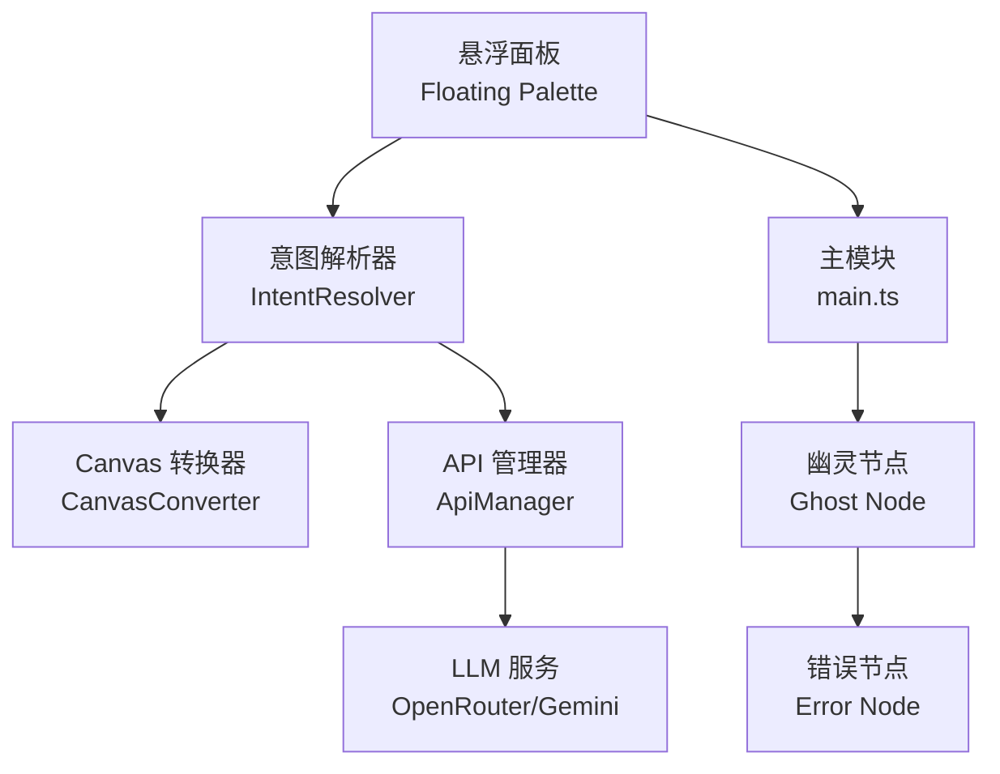
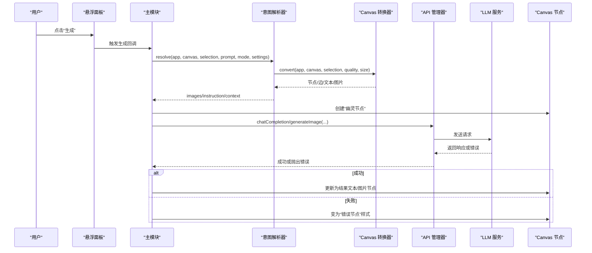
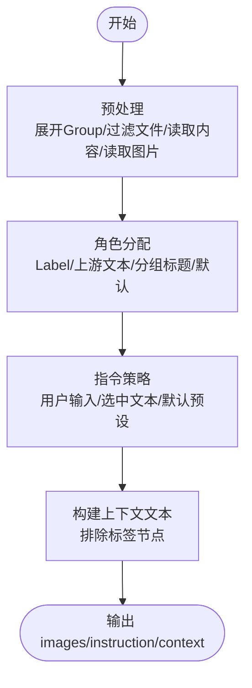
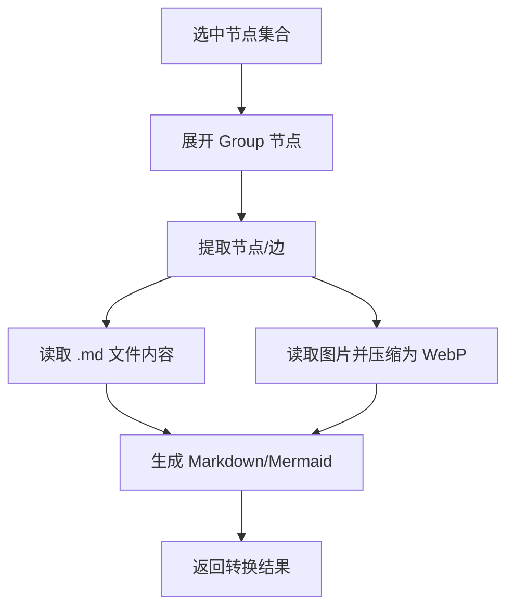
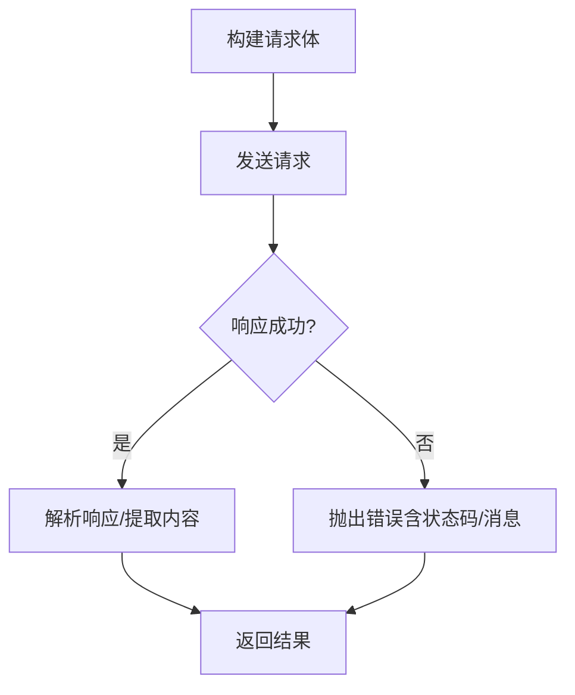
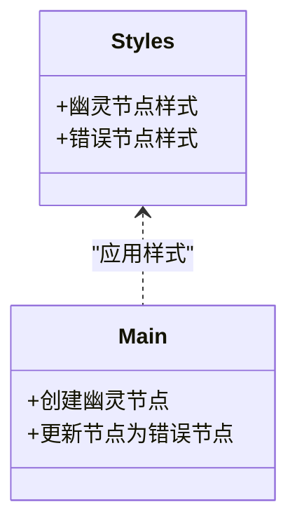
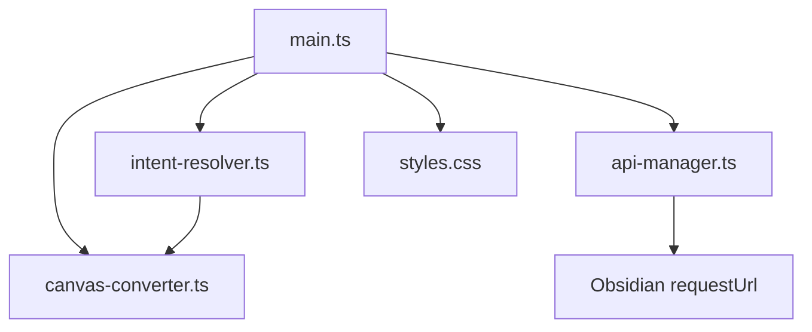

# 故障排除

<cite>
**本文引用的文件**
- [docs/execution_guide.md](file://docs/execution_guide.md)
- [docs/design_doc_v2.md](file://docs/design_doc_v2.md)
- [main.ts](file://main.ts)
- [api-manager.ts](file://api-manager.ts)
- [canvas-converter.ts](file://canvas-converter.ts)
- [intent-resolver.ts](file://intent-resolver.ts)
- [styles.css](file://styles.css)
- [types.ts](file://types.ts)
</cite>

## 目录
1. [简介](#简介)
2. [项目结构](#项目结构)
3. [核心组件](#核心组件)
4. [架构总览](#架构总览)
5. [详细组件分析](#详细组件分析)
6. [依赖分析](#依赖分析)
7. [性能考虑](#性能考虑)
8. [故障排除指南](#故障排除指南)
9. [结论](#结论)
10. [附录](#附录)

## 简介
本指南面向使用 Obsidian Canvas AI 插件的用户，聚焦常见问题与快速定位方法。结合执行指南与设计文档，帮助您在遇到 API 认证失败（401）、速率限制（429）、安全过滤器拦截（Safety Filter）以及网络超时等问题时，迅速找到根因并采取修复措施。同时，说明当任务失败时，“幽灵节点（Ghost Node）”如何变为红色“错误节点（Error Node）”，并提供重试思路；指导如何查看控制台日志以获取更详细信息；最后给出一个快速参考表，便于快速对照定位。

## 项目结构
- 插件主流程由主模块驱动，负责悬浮面板交互、意图解析、API 请求与节点更新。
- API 管理器封装 OpenRouter/Gemini 的请求细节，统一处理错误与响应。
- Canvas 转换器负责将选中节点转换为 Markdown/Mermaid 文本与图片 Base64。
- 意图解析器根据图谱结构为图片分配语义角色，生成最终提示词与上下文。
- 样式文件定义“幽灵节点”与“错误节点”的视觉表现。

图表来源
- [main.ts](file://main.ts#L1052-L1327)
- [intent-resolver.ts](file://intent-resolver.ts#L63-L130)
- [canvas-converter.ts](file://canvas-converter.ts#L474-L515)
- [api-manager.ts](file://api-manager.ts#L646-L679)
- [styles.css](file://styles.css#L448-L501)

章节来源
- [main.ts](file://main.ts#L1052-L1327)
- [api-manager.ts](file://api-manager.ts#L149-L191)
- [canvas-converter.ts](file://canvas-converter.ts#L474-L515)
- [intent-resolver.ts](file://intent-resolver.ts#L63-L130)
- [styles.css](file://styles.css#L448-L501)

## 核心组件
- 悬浮面板与生成流程：负责接收用户输入、触发意图解析与 API 请求，并创建/更新 Canvas 节点。
- 意图解析器：从选区中提取图片与文本，基于连线与分组为图片分配角色，生成最终指令与上下文。
- Canvas 转换器：将节点与边转换为 Markdown/Mermaid 文本，必要时读取图片并压缩为 WebP Base64。
- API 管理器：封装 OpenRouter/Gemini 请求，统一处理错误与响应。
- 样式与节点状态：定义“幽灵节点”加载态与“错误节点”样式，便于用户感知任务状态。

章节来源
- [main.ts](file://main.ts#L766-L800)
- [intent-resolver.ts](file://intent-resolver.ts#L63-L130)
- [canvas-converter.ts](file://canvas-converter.ts#L474-L515)
- [api-manager.ts](file://api-manager.ts#L149-L191)
- [styles.css](file://styles.css#L448-L501)

## 架构总览
下图展示从用户点击“生成”到任务结束的关键步骤，包括错误处理与节点状态变化。

图表来源
- [main.ts](file://main.ts#L1052-L1327)
- [intent-resolver.ts](file://intent-resolver.ts#L63-L130)
- [canvas-converter.ts](file://canvas-converter.ts#L474-L515)
- [api-manager.ts](file://api-manager.ts#L646-L679)
- [styles.css](file://styles.css#L448-L501)

## 详细组件分析

### 意图解析与上下文构建
- 预处理：展开 Group、过滤非图片文件、读取 .md 内容、读取图片并压缩为 WebP。
- 角色分配：优先使用显式连线 Label，其次上游文本，再分组标题，最后默认角色。
- 指令策略：用户输入优先，否则使用未被用作标签的文本节点内容，最后使用默认预设。
- 上下文文本：拼接非图片节点内容，排除已被用作标签的节点。

图表来源
- [intent-resolver.ts](file://intent-resolver.ts#L138-L200)
- [intent-resolver.ts](file://intent-resolver.ts#L201-L280)
- [intent-resolver.ts](file://intent-resolver.ts#L282-L344)

章节来源
- [intent-resolver.ts](file://intent-resolver.ts#L63-L130)
- [intent-resolver.ts](file://intent-resolver.ts#L138-L200)
- [intent-resolver.ts](file://intent-resolver.ts#L201-L280)
- [intent-resolver.ts](file://intent-resolver.ts#L282-L344)

### Canvas 转换器与图片处理
- 将选中节点转换为 Markdown/Mermaid 文本。
- 读取 .md 文件内容并替换节点内容。
- 读取图片文件并压缩为 WebP，限制尺寸与质量，便于后续多模态请求。

图表来源
- [canvas-converter.ts](file://canvas-converter.ts#L474-L515)
- [canvas-converter.ts](file://canvas-converter.ts#L323-L382)
- [canvas-converter.ts](file://canvas-converter.ts#L384-L464)

章节来源
- [canvas-converter.ts](file://canvas-converter.ts#L474-L515)
- [canvas-converter.ts](file://canvas-converter.ts#L323-L382)
- [canvas-converter.ts](file://canvas-converter.ts#L384-L464)

### API 管理器与错误处理
- 统一封装 OpenRouter/Gemini 请求，设置 Authorization、Content-Type 等头部。
- 统一处理 HTTP 错误（如 401、429、5xx），并将错误信息抛出供上层处理。
- 支持聊天与图像生成两种模式，分别返回文本或图片数据 URL。

图表来源
- [api-manager.ts](file://api-manager.ts#L646-L679)
- [api-manager.ts](file://api-manager.ts#L149-L191)
- [api-manager.ts](file://api-manager.ts#L193-L275)

章节来源
- [api-manager.ts](file://api-manager.ts#L149-L191)
- [api-manager.ts](file://api-manager.ts#L193-L275)
- [api-manager.ts](file://api-manager.ts#L646-L679)

### 节点状态与样式
- 幽灵节点：创建时添加“幽灵节点”样式，显示加载动画。
- 错误节点：捕获异常后将节点样式切换为“错误节点”，并更新文本内容。

图表来源
- [styles.css](file://styles.css#L448-L501)
- [main.ts](file://main.ts#L1245-L1264)
- [main.ts](file://main.ts#L1266-L1327)

章节来源
- [styles.css](file://styles.css#L448-L501)
- [main.ts](file://main.ts#L1245-L1264)
- [main.ts](file://main.ts#L1266-L1327)

## 依赖分析
- 主模块依赖意图解析器与 Canvas 转换器进行上下文构建，依赖 API 管理器发起请求。
- 意图解析器依赖 Canvas 转换器进行节点/边提取与图片读取。
- API 管理器依赖 Obsidian 的 requestUrl 发送请求。
- 样式文件独立定义节点状态样式，与主模块交互更新节点类名。

图表来源
- [main.ts](file://main.ts#L1052-L1327)
- [intent-resolver.ts](file://intent-resolver.ts#L63-L130)
- [canvas-converter.ts](file://canvas-converter.ts#L474-L515)
- [api-manager.ts](file://api-manager.ts#L646-L679)
- [styles.css](file://styles.css#L448-L501)

章节来源
- [main.ts](file://main.ts#L1052-L1327)
- [intent-resolver.ts](file://intent-resolver.ts#L63-L130)
- [canvas-converter.ts](file://canvas-converter.ts#L474-L515)
- [api-manager.ts](file://api-manager.ts#L646-L679)
- [styles.css](file://styles.css#L448-L501)

## 性能考虑
- 图片压缩与尺寸限制：在本地将图片压缩为 WebP 并限制最大尺寸，降低请求体积与超时风险。
- 并发与队列：悬浮面板支持多任务并发，避免 UI 阻塞。
- 预处理与缓存：对选区进行 Group 展开与文件清洗，减少无效请求。

章节来源
- [canvas-converter.ts](file://canvas-converter.ts#L384-L464)
- [main.ts](file://main.ts#L766-L800)
- [intent-resolver.ts](file://intent-resolver.ts#L138-L200)

## 故障排除指南

### 常见错误与现象
- API 认证失败（401）
  - 现象：控制台打印 HTTP 401，或 API 返回认证错误；“幽灵节点”最终变为红色“错误节点”。
  - 可能原因：未配置 API Key、Key 无效或过期、未选择正确的 Provider。
  - 解决步骤：
    - 在设置页检查并填写正确的 API Key（OpenRouter 或 Yunwu）。
    - 确认所选 Provider 与 Key 匹配。
    - 重新打开悬浮面板，再次点击“生成”。

- 速率限制（429）
  - 现象：控制台打印 HTTP 429；请求被服务端拒绝。
  - 可能原因：短时间内频繁请求，超出服务端配额。
  - 解决步骤：
    - 减少请求频率，等待配额恢复后再试。
    - 调整提示词，避免重复相同请求。
    - 如可能，更换更高配额的账户或服务端。

- 安全过滤器拦截（Safety Filter）
  - 现象：设计文档中描述“幽灵节点”变为灰色禁止图标，并提示“被安全过滤器拦截”。当前代码实现中，错误节点样式为红色并显示错误信息，但未在 UI 中直接显示“被安全过滤器拦截”的文案。请以控制台日志与错误信息为准。
  - 可能原因：提示词包含敏感内容或违反服务端政策。
  - 解决步骤：
    - 修改提示词，避免涉及敏感话题或不当内容。
    - 使用更通用的指令，逐步细化需求。
    - 查看控制台日志，确认具体错误原因。

- 网络超时
  - 现象：请求长时间无响应，最终失败。
  - 可能原因：网络不稳定、请求体过大、图片未压缩或尺寸过大。
  - 解决步骤：
    - 确认网络连接正常。
    - 减少选中图片数量或降低图片质量与尺寸。
    - 简化提示词，避免过长上下文。
    - 重试请求。

- “幽灵节点”变为红色“错误节点”并提供“重试”按钮
  - 现象：任务失败后，节点样式从“幽灵节点”变为“错误节点”，显示错误信息。
  - 可能原因：API 返回错误、网络异常、提示词被拦截。
  - 解决步骤：
    - 查看控制台日志，定位具体错误。
    - 检查 API Key 与网络连接。
    - 修改提示词后重试。
    - 注意：当前实现中错误节点样式为红色并显示错误信息，未在节点内直接显示“重试”按钮；如需重试，请重新打开悬浮面板并再次点击“生成”。

### 快速参考表
- 现象：401 未授权
  - 可能原因：API Key 未配置或无效
  - 解决步骤：检查设置页 Key，确认 Provider 与 Key 匹配
- 现象：429 速率限制
  - 可能原因：请求过于频繁
  - 解决步骤：降低频率，等待配额恢复
- 现象：安全过滤器拦截
  - 可能原因：提示词敏感
  - 解决步骤：修改提示词，避免敏感内容
- 现象：网络超时
  - 可能原因：网络不稳定或请求体过大
  - 解决步骤：检查网络，减少图片数量或降低质量
- 现象：幽灵节点变红
  - 可能原因：API 错误或网络异常
  - 解决步骤：查看控制台日志，检查 Key 与网络，修改提示词后重试

章节来源
- [docs/execution_guide.md](file://docs/execution_guide.md#L227-L243)
- [docs/design_doc_v2.md](file://docs/design_doc_v2.md#L60-L76)
- [main.ts](file://main.ts#L1146-L1150)
- [main.ts](file://main.ts#L1266-L1327)
- [api-manager.ts](file://api-manager.ts#L646-L679)

### 如何查看控制台日志
- 在 Obsidian 中打开开发者工具（浏览器调试窗口），切换到 Console 标签页。
- 重现问题后，查看打印的错误信息（如 HTTP 状态码、错误消息）。
- 关注 API 请求与响应日志，有助于快速定位问题。

章节来源
- [api-manager.ts](file://api-manager.ts#L149-L191)
- [api-manager.ts](file://api-manager.ts#L646-L679)
- [main.ts](file://main.ts#L1146-L1150)

## 结论
通过结合执行指南与设计文档，本指南提供了从意图解析、上下文构建到 API 请求与节点状态更新的完整链路说明。针对常见错误（401、429、安全过滤器拦截、网络超时），给出了可操作的排查步骤与修复建议。当任务失败时，“幽灵节点”会变为“错误节点”，并通过控制台日志提供更详细的错误信息。建议在排查过程中优先检查 API Key、网络连接与提示词内容，并根据控制台日志进一步定位问题。

## 附录
- 相关类型定义：Canvas、CanvasNode、CanvasEdge 等类型，用于理解主模块与 Canvas API 的交互方式。

章节来源
- [types.ts](file://types.ts#L21-L112)