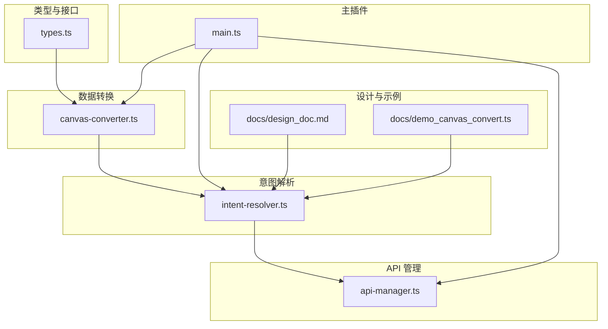
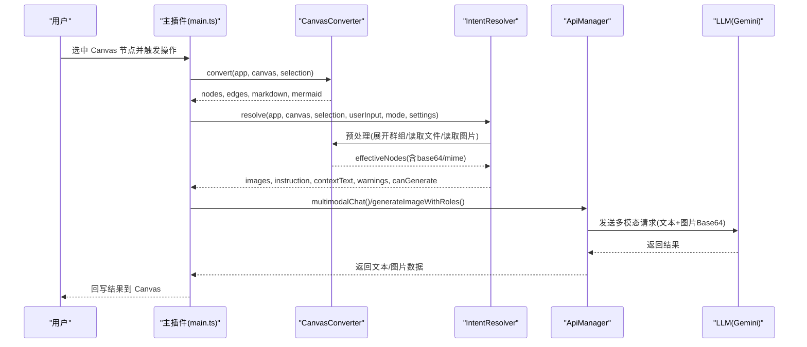
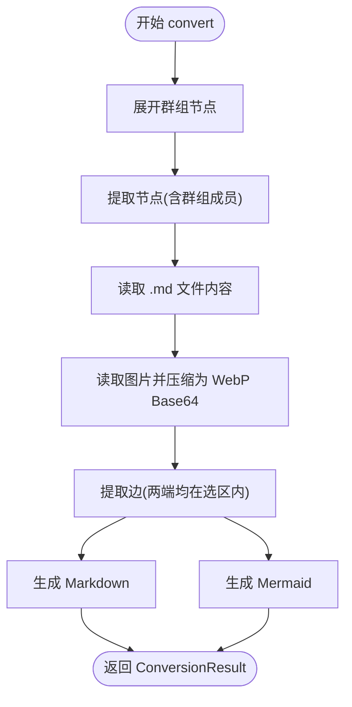
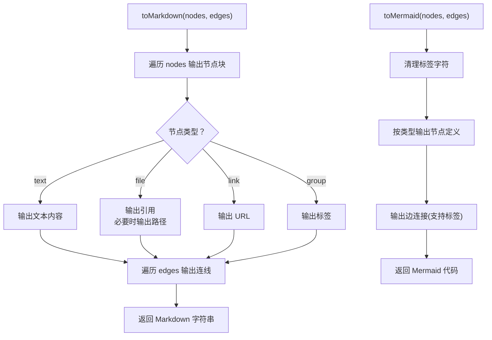
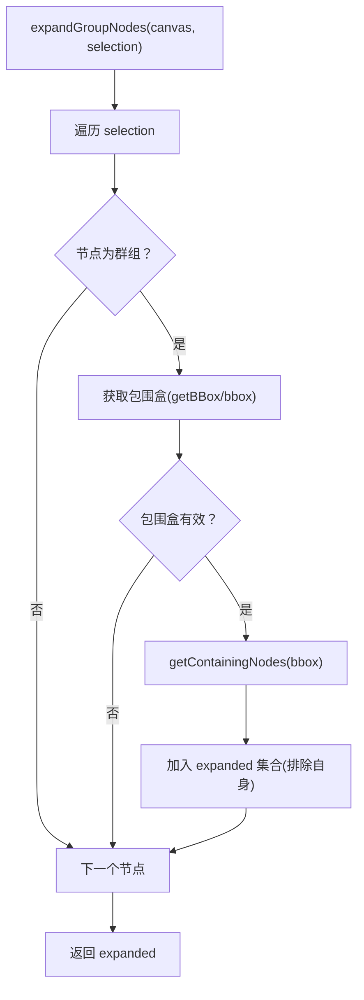
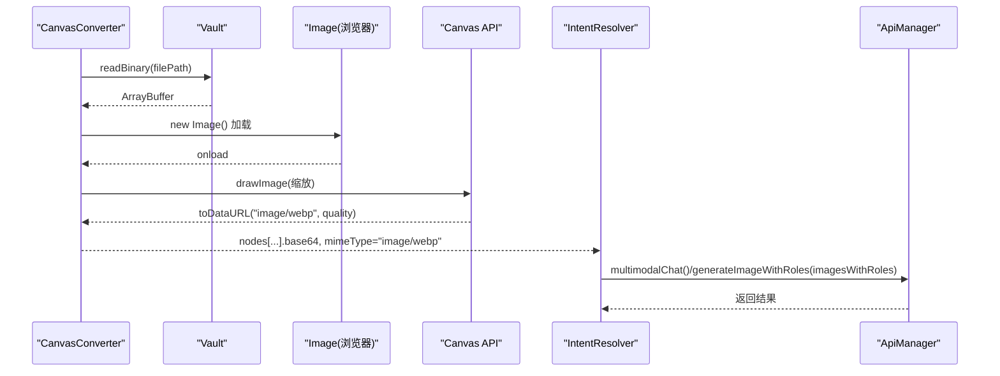
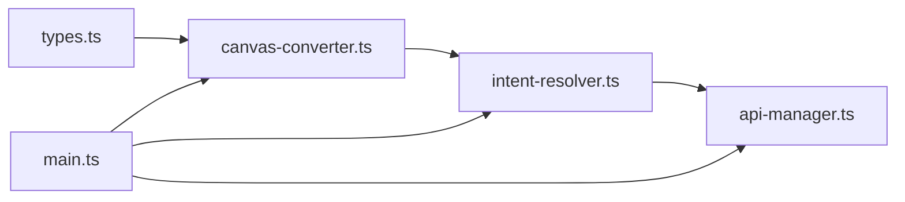

# 多模态上下文支持

<cite>
**本文引用的文件**
- [canvas-converter.ts](file://canvas-converter.ts)
- [api-manager.ts](file://api-manager.ts)
- [types.ts](file://types.ts)
- [intent-resolver.ts](file://intent-resolver.ts)
- [main.ts](file://main.ts)
- [docs/design_doc.md](file://docs/design_doc.md)
- [docs/demo_canvas_convert.ts](file://docs/demo_canvas_convert.ts)
</cite>

## 目录
1. [简介](#简介)
2. [项目结构](#项目结构)
3. [核心组件](#核心组件)
4. [架构总览](#架构总览)
5. [详细组件分析](#详细组件分析)
6. [依赖关系分析](#依赖关系分析)
7. [性能考量](#性能考量)
8. [故障排查指南](#故障排查指南)
9. [结论](#结论)
10. [附录](#附录)

## 简介
本文件围绕 Obsidian Canvas 多模态上下文支持进行系统化文档化，重点解释如何将 Canvas 节点（文本、图片、群组）结构化为 LLM 可理解的 Markdown 与 Mermaid 格式；结合设计文档中的“Direct Image Input”方案，说明图片节点如何通过 vault 读取并转换为压缩后的 WebP Base64，从而满足 Gemini 多模态输入需求。文档还提供节点数据提取与转换流程的实际示例路径、群组节点的递归展开逻辑、错误处理策略与性能优化建议，并阐明该模块与 API 管理器的数据传递关系。

## 项目结构
本仓库采用分层与职责分离的设计：
- 类型定义：统一 Canvas 节点、边、坐标等接口，确保跨模块一致性
- 数据转换：将 Canvas 选中节点转换为结构化文本与图表
- 意图解析：基于图谱与规则为图片分配角色、整合上下文与指令
- API 管理：封装 OpenRouter/Yunwu/Gemini 的请求与响应解析
- 主插件：集成 UI、任务调度、调试日志与与转换/解析链路的衔接

图表来源
- [types.ts](file://types.ts#L21-L113)
- [canvas-converter.ts](file://canvas-converter.ts#L11-L556)
- [intent-resolver.ts](file://intent-resolver.ts#L1-L378)
- [api-manager.ts](file://api-manager.ts#L1-L679)
- [main.ts](file://main.ts#L1-L2269)
- [docs/design_doc.md](file://docs/design_doc.md#L1-L232)
- [docs/demo_canvas_convert.ts](file://docs/demo_canvas_convert.ts#L1-L149)

章节来源
- [types.ts](file://types.ts#L21-L113)
- [canvas-converter.ts](file://canvas-converter.ts#L11-L556)
- [intent-resolver.ts](file://intent-resolver.ts#L1-L378)
- [api-manager.ts](file://api-manager.ts#L1-L679)
- [main.ts](file://main.ts#L1660-L1744)
- [docs/design_doc.md](file://docs/design_doc.md#L1-L232)
- [docs/demo_canvas_convert.ts](file://docs/demo_canvas_convert.ts#L1-L149)

## 核心组件
- CanvasConverter：负责节点提取、边提取、Markdown/Mermaid 输出、群组展开、图片与 Markdown 文件读取、Base64 压缩
- IntentResolver：在转换基础上进一步预处理、分配图片角色、构建指令与上下文文本
- ApiManager：封装多模态请求，支持 OpenRouter 与 Yunwu/Gemini，支持图片与文本混合输入
- 主插件：触发转换与解析，输出调试日志，驱动 UI 与任务流

章节来源
- [canvas-converter.ts](file://canvas-converter.ts#L11-L556)
- [intent-resolver.ts](file://intent-resolver.ts#L1-L378)
- [api-manager.ts](file://api-manager.ts#L1-L679)
- [main.ts](file://main.ts#L1660-L1744)

## 架构总览
下图展示了从 Canvas 选区到 LLM 请求的关键数据流与模块协作：

图表来源
- [main.ts](file://main.ts#L1660-L1744)
- [canvas-converter.ts](file://canvas-converter.ts#L465-L515)
- [intent-resolver.ts](file://intent-resolver.ts#L63-L129)
- [api-manager.ts](file://api-manager.ts#L574-L644)

## 详细组件分析

### CanvasConverter：节点提取、群组展开与多模态输出
- 节点类型识别与转换
  - 文本节点：直接输出内容
  - 文件节点：区分图片与非图片，非图片文件输出引用；图片文件输出引用并标记 isImage
  - 链接节点：输出 URL
  - 群组节点：输出标签
- 边提取：仅保留两端均在选区内边
- Markdown 输出：按节点类型格式化，包含连线关系
- Mermaid 输出：按节点类型选择形状，连线支持标签
- 群组展开：根据群组包围盒获取内部节点，标记 group 展开成员
- 文件内容读取：.md 文件读取并替换 content 字段
- 图片读取与压缩：通过 vault 读取二进制，Canvas 压缩为 WebP，返回 Base64 与 MIME

图表来源
- [canvas-converter.ts](file://canvas-converter.ts#L465-L515)
- [canvas-converter.ts](file://canvas-converter.ts#L293-L321)
- [canvas-converter.ts](file://canvas-converter.ts#L323-L348)
- [canvas-converter.ts](file://canvas-converter.ts#L350-L464)

章节来源
- [canvas-converter.ts](file://canvas-converter.ts#L63-L153)
- [canvas-converter.ts](file://canvas-converter.ts#L155-L181)
- [canvas-converter.ts](file://canvas-converter.ts#L183-L291)
- [canvas-converter.ts](file://canvas-converter.ts#L293-L348)
- [canvas-converter.ts](file://canvas-converter.ts#L350-L464)
- [canvas-converter.ts](file://canvas-converter.ts#L465-L515)

### toMarkdown() 与 toMermaid() 的实现机制
- toMarkdown()
  - 输出节点标题与类型标签
  - 文本节点：直接输出内容
  - 文件节点：输出引用；若为 .md 文件，补充路径
  - 链接节点：输出 URL
  - 群组节点：输出标签
  - 输出连线关系，支持带标签边
- toMermaid()
  - 节点形状选择：group 使用双括号，图片使用菱形，链接使用平行四边形，其余使用方括号
  - 标签清理：对引号、方括号、尖括号、花括号进行清理，避免语法冲突
  - 连线支持标签

图表来源
- [canvas-converter.ts](file://canvas-converter.ts#L183-L240)
- [canvas-converter.ts](file://canvas-converter.ts#L242-L291)
- [canvas-converter.ts](file://canvas-converter.ts#L517-L556)

章节来源
- [canvas-converter.ts](file://canvas-converter.ts#L183-L291)
- [canvas-converter.ts](file://canvas-converter.ts#L517-L556)

### 群组节点的递归处理逻辑
- expandGroupNodes：遍历选中节点，若为群组节点则获取其包围盒，调用 getContainingNodes 获取内部节点并加入扩展集合，排除自身
- 标记 isGroupMember：对非原始选中但被展开加入的节点标记，便于后续角色解析与上下文构建

图表来源
- [canvas-converter.ts](file://canvas-converter.ts#L293-L321)

章节来源
- [canvas-converter.ts](file://canvas-converter.ts#L293-L321)

### 图片节点的 Base64 转换与 Direct Image Input 支持
- 读取与压缩流程
  - 通过 vault 读取二进制
  - 使用 Canvas API 将图片缩放至不超过指定尺寸，按质量参数导出为 WebP
  - 返回 Base64 与 MIME(image/webp)
- Direct Image Input 方案
  - 在 IntentResolver 中，将图片节点转换为 { base64, mimeType, role } 列表
  - 通过 ApiManager.multimodalChat 或 generateImageWithRoles 发送混合内容
  - 设计文档明确支持直接接收 image(Base64)+text 的混合输入

图表来源
- [canvas-converter.ts](file://canvas-converter.ts#L350-L464)
- [intent-resolver.ts](file://intent-resolver.ts#L83-L109)
- [api-manager.ts](file://api-manager.ts#L574-L644)
- [docs/design_doc.md](file://docs/design_doc.md#L96-L122)

章节来源
- [canvas-converter.ts](file://canvas-converter.ts#L350-L464)
- [intent-resolver.ts](file://intent-resolver.ts#L83-L109)
- [api-manager.ts](file://api-manager.ts#L574-L644)
- [docs/design_doc.md](file://docs/design_doc.md#L96-L122)

### 节点数据提取与转换流程示例（代码路径）
- 选区预处理与转换
  - 主插件调用 CanvasConverter.convert，输出 nodes、edges、markdown、mermaid
  - 示例路径：[main.ts](file://main.ts#L1667-L1676)
- 预处理与角色分配
  - IntentResolver.preprocess 展开群组、读取文件与图片、统计数量
  - 示例路径：[intent-resolver.ts](file://intent-resolver.ts#L138-L183)
- 角色解析与指令构建
  - 分配图片角色、构建 instruction 与上下文文本
  - 示例路径：[intent-resolver.ts](file://intent-resolver.ts#L201-L343)
- 多模态请求
  - multimodalChat 与 generateImageWithRoles 构造混合内容
  - 示例路径：[api-manager.ts](file://api-manager.ts#L574-L644)

章节来源
- [main.ts](file://main.ts#L1667-L1676)
- [intent-resolver.ts](file://intent-resolver.ts#L138-L183)
- [intent-resolver.ts](file://intent-resolver.ts#L201-L343)
- [api-manager.ts](file://api-manager.ts#L574-L644)

## 依赖关系分析
- CanvasConverter 依赖 types.ts 中的 CanvasNode/CanvasEdge 接口
- IntentResolver 依赖 CanvasConverter 的节点提取、边提取与预处理能力
- ApiManager 依赖 OpenRouter/Gemini 的消息结构与响应格式
- 主插件在调试模式下调用 CanvasConverter.convert 并串联 IntentResolver 与 ApiManager

图表来源
- [types.ts](file://types.ts#L21-L113)
- [canvas-converter.ts](file://canvas-converter.ts#L11-L556)
- [intent-resolver.ts](file://intent-resolver.ts#L1-L378)
- [api-manager.ts](file://api-manager.ts#L1-L679)
- [main.ts](file://main.ts#L1660-L1744)

章节来源
- [types.ts](file://types.ts#L21-L113)
- [canvas-converter.ts](file://canvas-converter.ts#L11-L556)
- [intent-resolver.ts](file://intent-resolver.ts#L1-L378)
- [api-manager.ts](file://api-manager.ts#L1-L679)
- [main.ts](file://main.ts#L1660-L1744)

## 性能考量
- 图片压缩与尺寸限制
  - 通过 Canvas 缩放与 WebP 导出，限制最大尺寸与质量，显著降低 Base64 长度与传输成本
  - 可通过设置项调节压缩质量与最大尺寸
- Base64 缓存策略
  - 当前实现逐次读取与压缩，建议在 UI 层引入缓存（如内存缓存或持久化缓存），避免重复读取同一文件
- 并发与批量处理
  - 对大量图片节点，可考虑分批读取与压缩，避免阻塞主线程
- 日志与调试
  - 调试模式下输出详细日志，便于定位性能瓶颈与异常

章节来源
- [canvas-converter.ts](file://canvas-converter.ts#L350-L464)
- [main.ts](file://main.ts#L1660-L1744)

## 故障排查指南
- 文件读取失败
  - 现象：控制台警告“文件未找到或不是 TFile”
  - 处理：检查 filePath 是否正确、文件是否存在、权限是否允许读取
  - 参考路径：[canvas-converter.ts](file://canvas-converter.ts#L374-L376)
- 图片压缩失败
  - 现象：控制台警告“读取/压缩失败”或“无法加载图片”
  - 处理：确认文件可读、MIME 类型匹配、尺寸未超出限制
  - 参考路径：[canvas-converter.ts](file://canvas-converter.ts#L377-L381)
- API 配置缺失
  - 现象：抛出“API Key 未配置”错误
  - 处理：在设置中填写 OpenRouter 或 Yunwu 的密钥与基础地址
  - 参考路径：[api-manager.ts](file://api-manager.ts#L149-L152)
- LLM 返回无结果
  - 现象：choices 为空或返回文本而非图片
  - 处理：检查指令与角色标注、图片数量限制、模型可用性
  - 参考路径：[api-manager.ts](file://api-manager.ts#L183-L186)

章节来源
- [canvas-converter.ts](file://canvas-converter.ts#L374-L381)
- [api-manager.ts](file://api-manager.ts#L149-L152)
- [api-manager.ts](file://api-manager.ts#L183-L186)

## 结论
本模块通过 CanvasConverter 将 Canvas 节点结构化为 Markdown 与 Mermaid，借助 IntentResolver 进一步提炼图片角色与指令，配合 ApiManager 的多模态请求，实现了从 Canvas 选区到 Gemini 的端到端多模态工作流。设计文档中的“Direct Image Input”方案明确了图片节点应以 Base64 形式直接输入，本实现严格遵循该规范并通过 WebP 压缩与尺寸限制保障性能与兼容性。建议在 UI 层引入 Base64 缓存与分批处理，以进一步提升用户体验与稳定性。

## 附录
- 设计文档要点
  - Direct Image Input：直接发送 Base64 与文本的混合内容
  - 多图组合生图：为每张参考图分配角色，构造清晰的上下文
  - 结果回写：文本与图片分别回写到 Canvas
  - 参考路径：[docs/design_doc.md](file://docs/design_doc.md#L96-L122)
- 示例脚本
  - demo_canvas_convert.ts 展示了如何将 Canvas 节点网络转换为 Gemini 多模态结构化负载
  - 参考路径：[docs/demo_canvas_convert.ts](file://docs/demo_canvas_convert.ts#L1-L149)

章节来源
- [docs/design_doc.md](file://docs/design_doc.md#L96-L122)
- [docs/demo_canvas_convert.ts](file://docs/demo_canvas_convert.ts#L1-L149)