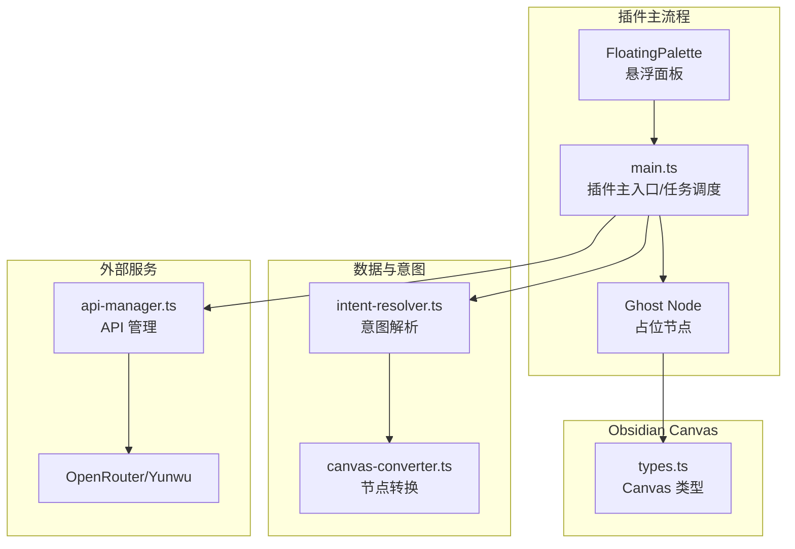
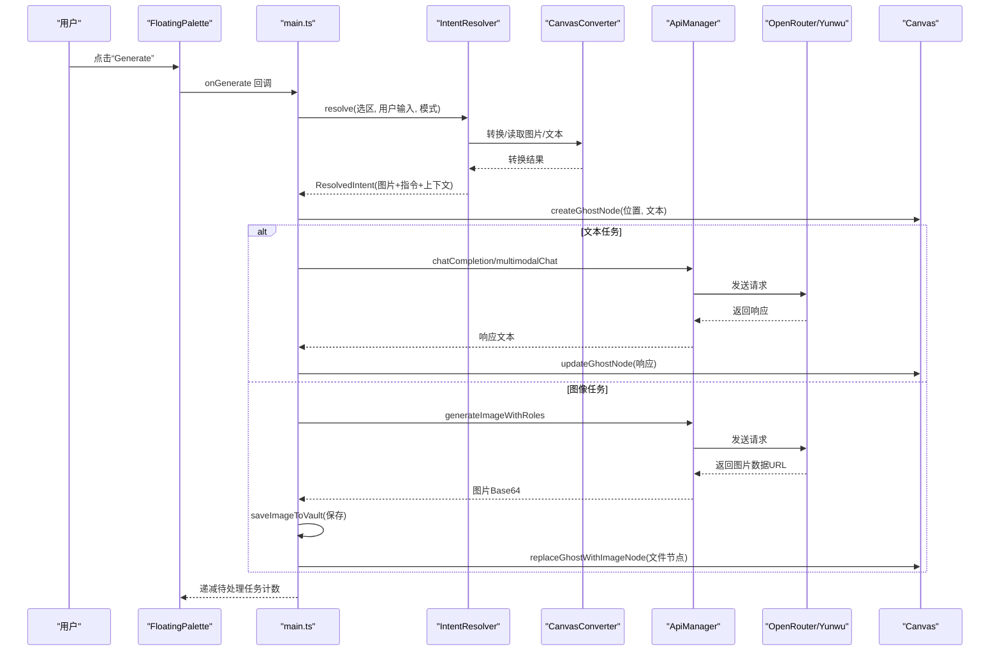
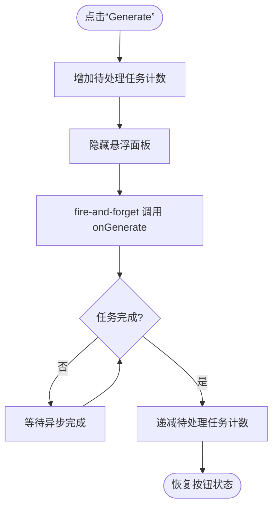
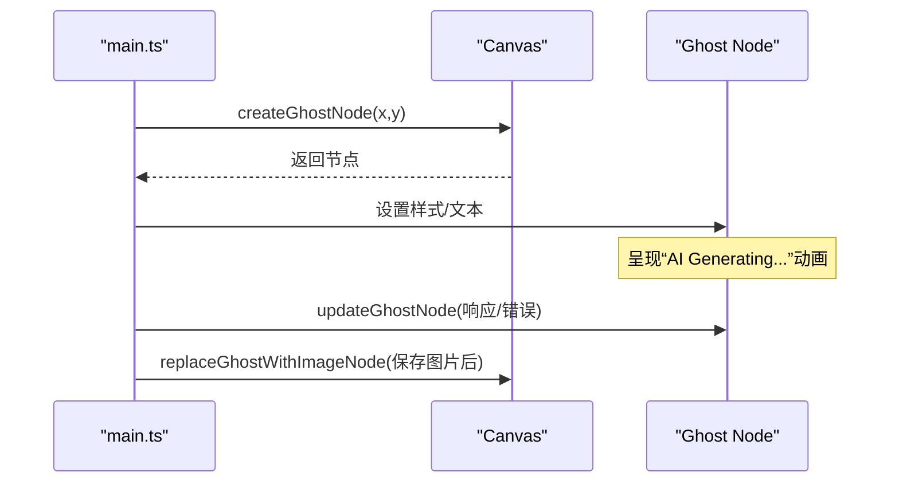
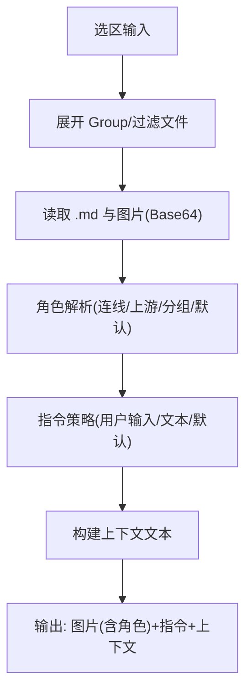
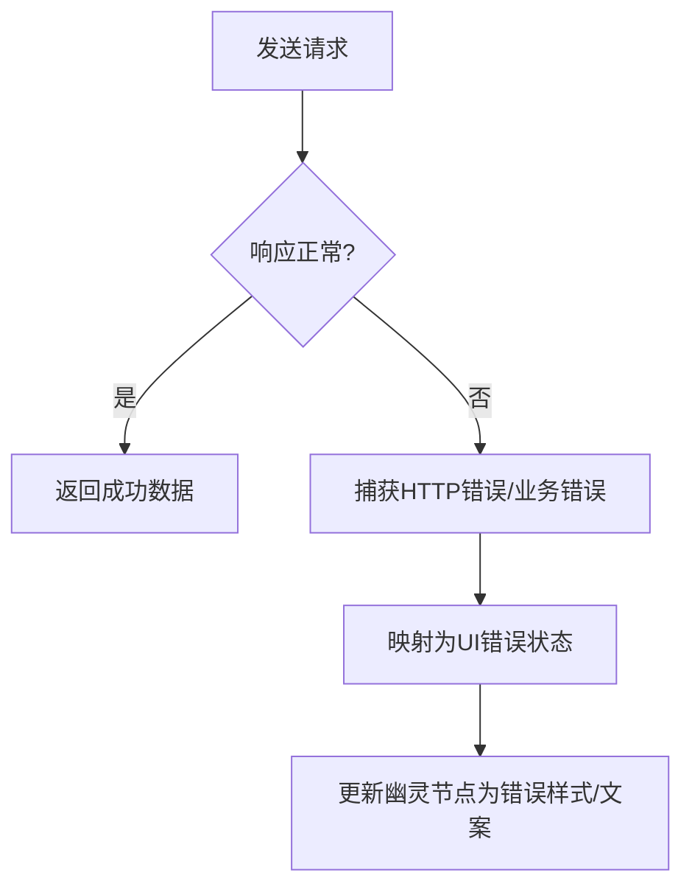
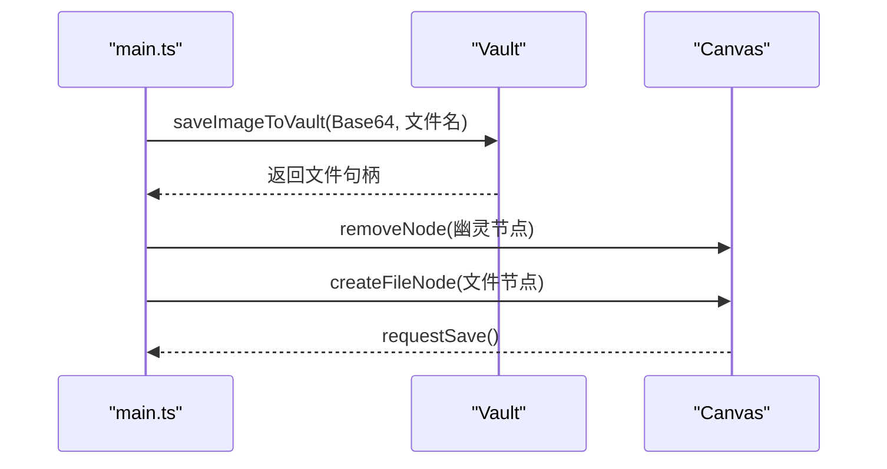
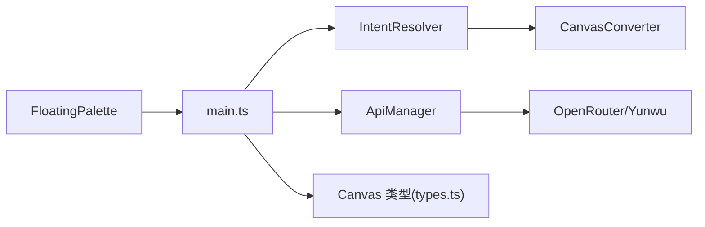

# 异步任务管理

<cite>
**本文引用的文件**
- [main.ts](file://main.ts)
- [api-manager.ts](file://api-manager.ts)
- [intent-resolver.ts](file://intent-resolver.ts)
- [canvas-converter.ts](file://canvas-converter.ts)
- [types.ts](file://types.ts)
- [docs/execution_guide.md](file://docs/execution_guide.md)
- [docs/design_doc_v2.md](file://docs/design_doc_v2.md)
</cite>

## 目录
1. [简介](#简介)
2. [项目结构](#项目结构)
3. [核心组件](#核心组件)
4. [架构总览](#架构总览)
5. [详细组件分析](#详细组件分析)
6. [依赖分析](#依赖分析)
7. [性能考量](#性能考量)
8. [故障排查指南](#故障排查指南)
9. [结论](#结论)

## 简介
本文件围绕 Obsidian Canvas AI 插件的“异步任务管理机制”进行系统化说明，重点阐述非阻塞 UI 的实现方式，包括任务队列的设计原理、任务创建与排队执行流程、以及与“幽灵节点（Ghost Node）”机制的协同工作。文档结合执行指南与设计文档，解释从用户点击“Generate”到 Canvas 上占位节点创建、任务状态反馈、以及错误处理与重试策略的完整链路，并给出并发控制与资源清理的实践建议。

## 项目结构
插件采用模块化组织，核心围绕以下文件协作：
- main.ts：插件主入口，负责浮动面板、任务调度、幽灵节点创建与更新、错误处理与重试、图片保存与替换。
- api-manager.ts：统一 API 管理，封装 OpenRouter/Yunwu 的聊天与图像生成接口，处理 HTTP 错误与响应解析。
- intent-resolver.ts：智能意图解析管线，将 Canvas 选区转换为带角色的图片与指令，支持多模态输入。
- canvas-converter.ts：Canvas 节点转换工具，提取节点、边、生成 Markdown/Mermaid，并读取图片/Base64。
- types.ts：Canvas API 类型定义，确保与 Obsidian Canvas 的交互类型安全。
- docs/execution_guide.md 与 docs/design_doc_v2.md：执行与设计文档，明确幽灵节点、异步队列、异常处理等规范。

图表来源
- [main.ts](file://main.ts#L980-L1150)
- [api-manager.ts](file://api-manager.ts#L149-L275)
- [intent-resolver.ts](file://intent-resolver.ts#L63-L130)
- [canvas-converter.ts](file://canvas-converter.ts#L474-L515)
- [types.ts](file://types.ts#L21-L112)

章节来源
- [main.ts](file://main.ts#L980-L1150)
- [api-manager.ts](file://api-manager.ts#L149-L275)
- [intent-resolver.ts](file://intent-resolver.ts#L63-L130)
- [canvas-converter.ts](file://canvas-converter.ts#L474-L515)
- [types.ts](file://types.ts#L21-L112)

## 核心组件
- 任务队列与并发控制
  - 通过浮动面板的“待处理任务计数”实现非阻塞并发：点击“Generate”即刻增加计数，隐藏面板后立即发起后台任务；任务结束回调中递减计数。该模式允许用户同时发起多个任务而不阻塞 UI。
- 幽灵节点（Ghost Node）
  - 用户点击“Generate”后，立即在 Canvas 上创建一个带呼吸灯动画的占位节点，内容显示“AI Generating...”，并将任务 ID 与该节点绑定，用于后续状态更新与回写。
- 意图解析与数据准备
  - 使用 IntentResolver 将选区标准化、角色解析与指令回退策略组合，形成最终的多模态输入（图片 Base64 + 文本指令 + 上下文），并保证图片数量上限与安全防护。
- API 调用与错误处理
  - ApiManager 统一封装聊天与图像生成接口，捕获 HTTP 错误并抛出可读异常；主流程在 catch 中将幽灵节点更新为错误状态并提供重试提示。
- 结果回写与资源清理
  - 文本任务：将幽灵节点内容更新为响应文本；图像任务：保存图片到 Vault，再将幽灵节点替换为文件节点；动态高度适配与节点尺寸更新，确保 UI 友好展示。

章节来源
- [main.ts](file://main.ts#L732-L800)
- [main.ts](file://main.ts#L1031-L1150)
- [main.ts](file://main.ts#L1245-L1300)
- [api-manager.ts](file://api-manager.ts#L149-L275)
- [intent-resolver.ts](file://intent-resolver.ts#L63-L130)
- [docs/execution_guide.md](file://docs/execution_guide.md#L115-L132)
- [docs/design_doc_v2.md](file://docs/design_doc_v2.md#L60-L76)

## 架构总览
异步任务管理的整体流程如下：
- 用户在悬浮面板点击“Generate”
- 主流程记录当前状态，隐藏面板，立即创建幽灵节点
- 通过 IntentResolver 生成多模态输入
- 调用 ApiManager 发起异步请求
- 请求成功：更新幽灵节点内容或保存图片并替换为文件节点
- 请求失败：将幽灵节点标记为错误状态，提供重试提示
- 任务结束：递减待处理任务计数，恢复按钮状态

图表来源
- [main.ts](file://main.ts#L980-L1150)
- [intent-resolver.ts](file://intent-resolver.ts#L63-L130)
- [canvas-converter.ts](file://canvas-converter.ts#L474-L515)
- [api-manager.ts](file://api-manager.ts#L149-L275)

## 详细组件分析

### 任务队列与并发控制
- 非阻塞 UI 的实现
  - 点击“Generate”后，立即增加待处理任务计数并隐藏面板，然后 fire-and-forget 地调用 onGenerate，不等待结果，从而保证 UI 响应流畅。
- 并发与状态管理
  - 通过“待处理任务计数”动态更新按钮文案与样式，支持多任务并发；任务结束回调中递减计数，确保 UI 状态与实际任务数一致。
- 与 UI 的解耦
  - 任务调度完全在主流程中完成，不依赖 Canvas 的同步返回，避免阻塞 Obsidian 的渲染线程。

图表来源
- [main.ts](file://main.ts#L732-L800)
- [main.ts](file://main.ts#L766-L800)

章节来源
- [main.ts](file://main.ts#L732-L800)

### 幽灵节点（Ghost Node）机制
- 创建时机与位置
  - 在 Canvas 上创建占位节点，内容为“AI Generating...”，并添加特定样式类，使其呈现呼吸灯动画效果；位置通常位于选区右侧，避免遮挡。
- 绑定任务 ID
  - 节点 ID 与任务生命周期绑定，用于后续状态更新与回写。
- 状态反馈
  - 成功：更新节点内容为响应文本；失败：移除占位样式，添加错误样式，显示错误信息；动态调整节点高度以适配长文本。
- 替换为真实节点
  - 图像任务完成后，将幽灵节点移除并创建文件节点，指向保存的图片文件。

图表来源
- [main.ts](file://main.ts#L1031-L1150)
- [main.ts](file://main.ts#L1245-L1300)

章节来源
- [main.ts](file://main.ts#L1031-L1150)
- [main.ts](file://main.ts#L1245-L1300)
- [docs/execution_guide.md](file://docs/execution_guide.md#L115-L132)

### 意图解析与数据准备（IntentResolver）
- 选区预处理
  - 展开 Group 节点，自动包含未被选中但位于 Group 范围内的节点；过滤非图片文件；读取 .md 文件内容；读取图片并压缩为 WebP。
- 角色解析
  - 基于连线 Label > 上游文本 > Group 标题 > 默认角色的优先级，为每张图片分配语义角色，用于多模态 Prompt。
- 指令策略
  - 用户输入优先；其次使用未被用作标签的文本节点内容；最后使用默认预设提示词。
- 上下文构建
  - 构造系统提示词，包含选区上下文文本，避免重复使用同一节点作为标签与指令。
- 图片数量限制
  - 限制最多 14 张图片，超过时截断并发出警告。

图表来源
- [intent-resolver.ts](file://intent-resolver.ts#L132-L200)
- [intent-resolver.ts](file://intent-resolver.ts#L201-L378)
- [canvas-converter.ts](file://canvas-converter.ts#L474-L515)
- [docs/design_doc_v2.md](file://docs/design_doc_v2.md#L144-L153)

章节来源
- [intent-resolver.ts](file://intent-resolver.ts#L132-L200)
- [intent-resolver.ts](file://intent-resolver.ts#L201-L378)
- [canvas-converter.ts](file://canvas-converter.ts#L474-L515)
- [docs/design_doc_v2.md](file://docs/design_doc_v2.md#L144-L153)

### API 调用与错误处理
- 聊天与图像接口
  - 支持普通聊天、多模态聊天（图片+文本）、图像生成（含角色标注与分辨率配置）。
- 错误处理
  - 捕获 HTTP 错误（如 401、429、500 等），抛出可读异常；主流程在 catch 中将幽灵节点更新为错误状态，显示错误信息。
- 与设计文档的对应
  - 设计文档明确：安全拦截时节点变为灰色并提示“被安全过滤器阻止”；API 错误时节点变为红色并提供“重试”按钮。

图表来源
- [api-manager.ts](file://api-manager.ts#L149-L275)
- [api-manager.ts](file://api-manager.ts#L646-L679)
- [docs/design_doc_v2.md](file://docs/design_doc_v2.md#L70-L76)

章节来源
- [api-manager.ts](file://api-manager.ts#L149-L275)
- [api-manager.ts](file://api-manager.ts#L646-L679)
- [docs/design_doc_v2.md](file://docs/design_doc_v2.md#L70-L76)

### 结果回写与资源清理
- 文本任务
  - 更新幽灵节点内容为响应文本；动态估算高度并调整节点尺寸，确保长文本可读。
- 图像任务
  - 保存图片到 Vault（自动创建“Canvas Images”文件夹），将幽灵节点替换为文件节点，指向保存的图片。
- 资源清理
  - 释放临时对象 URL、撤销图片压缩过程中的临时资源；Canvas 节点创建/删除后调用 requestSave，确保持久化。

图表来源
- [main.ts](file://main.ts#L1152-L1243)

章节来源
- [main.ts](file://main.ts#L1152-L1243)

## 依赖分析
- 模块耦合
  - main.ts 依赖 FloatingPalette、IntentResolver、ApiManager、Canvas 类型；IntentResolver 依赖 CanvasConverter；ApiManager 依赖 Obsidian 的 requestUrl。
- 关键依赖链
  - 生成按钮事件 → main.handleGeneration → IntentResolver.resolve → ApiManager.chatCompletion/generateImageWithRoles → 更新幽灵节点/保存图片 → 替换节点。
- 外部依赖
  - Obsidian Canvas API（节点创建、删除、尺寸调整、保存）；OpenRouter/Yunwu API（聊天/图像生成）。

图表来源
- [main.ts](file://main.ts#L980-L1150)
- [intent-resolver.ts](file://intent-resolver.ts#L63-L130)
- [canvas-converter.ts](file://canvas-converter.ts#L474-L515)
- [api-manager.ts](file://api-manager.ts#L149-L275)
- [types.ts](file://types.ts#L21-L112)

章节来源
- [main.ts](file://main.ts#L980-L1150)
- [intent-resolver.ts](file://intent-resolver.ts#L63-L130)
- [canvas-converter.ts](file://canvas-converter.ts#L474-L515)
- [api-manager.ts](file://api-manager.ts#L149-L275)
- [types.ts](file://types.ts#L21-L112)

## 性能考量
- 并发控制
  - 通过“待处理任务计数”实现非阻塞并发，避免 UI 阻塞；建议在 UI 层限制最大并发数，防止过多请求导致内存与网络压力。
- 图片处理
  - 在转换阶段对图片进行压缩与尺寸限制，减少传输体积与 API 调用时间；对超大图片使用离屏 Canvas 缩放，避免主线程卡顿。
- 节点渲染
  - 幽灵节点动态高度估算，避免一次性渲染超长文本导致的重排；必要时延迟更新或分段渲染。
- 资源清理
  - 及时撤销临时对象 URL，释放图片压缩过程中的中间资源；批量任务结束后统一触发保存，减少频繁 IO。

[本节为通用性能建议，无需具体文件引用]

## 故障排查指南
- 常见错误与处理
  - 401 未授权：检查设置页 API Key 是否配置；ApiManager 会抛出错误，主流程将幽灵节点标记为错误状态并提示重试。
  - 429 限流：ApiManager 捕获 HTTP 错误，主流程更新幽灵节点为错误状态；建议在 UI 层增加“重试”按钮与退避策略。
  - 安全过滤器触发：设计文档要求节点变为灰色并提示“被安全过滤器阻止”；主流程将幽灵节点标记为错误状态并提供重试。
- 日志与调试
  - 各模块均输出关键日志（请求体、响应、错误），便于定位问题；可启用调试模式查看更多上下文。
- 节点状态异常
  - 幽灵节点未更新：检查 updateGhostNode 的调用路径与节点文本更新逻辑；确认 Canvas 节点的 setText/render 是否可用。
  - 图片未保存：检查 saveImageToVault 的 MIME 类型解析与文件夹创建逻辑；确认 Vault 写权限与路径。

章节来源
- [api-manager.ts](file://api-manager.ts#L646-L679)
- [main.ts](file://main.ts#L1146-L1150)
- [docs/design_doc_v2.md](file://docs/design_doc_v2.md#L70-L76)

## 结论
本插件通过“幽灵节点 + 非阻塞并发 + 意图解析 + 统一 API 管理”的架构，实现了流畅的异步任务体验。用户点击“Generate”后，UI 立即得到响应，Canvas 上出现占位节点并显示加载状态；任务完成后，根据结果类型进行文本更新或图片回写。错误处理遵循设计文档约定，提供清晰的 UI 反馈与重试能力。配合图片压缩、动态高度估算与资源清理策略，整体性能与稳定性得到保障。