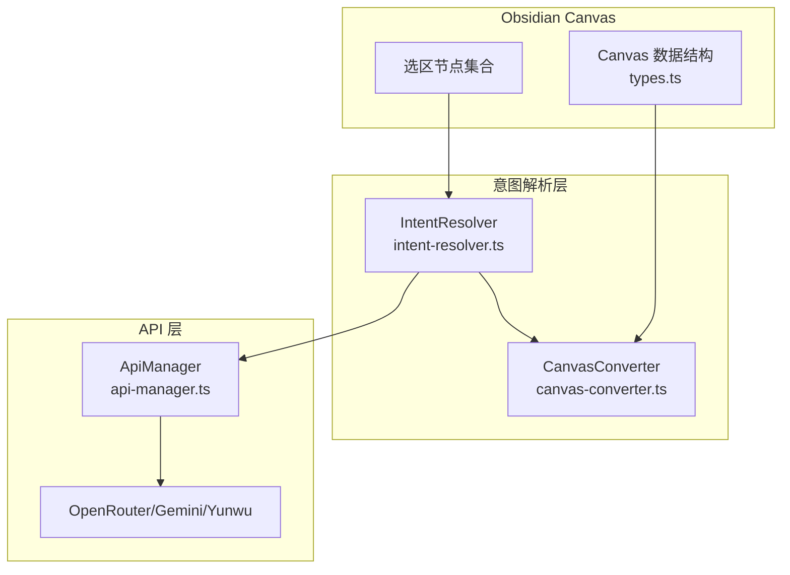
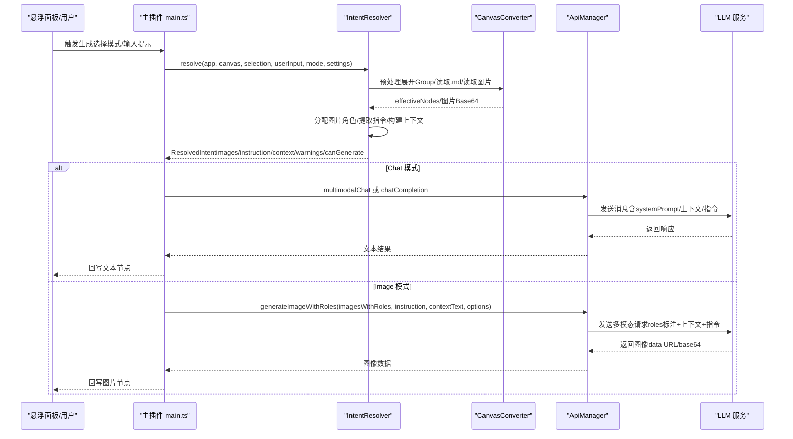
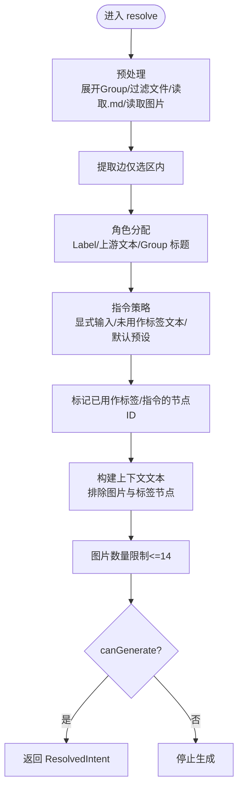
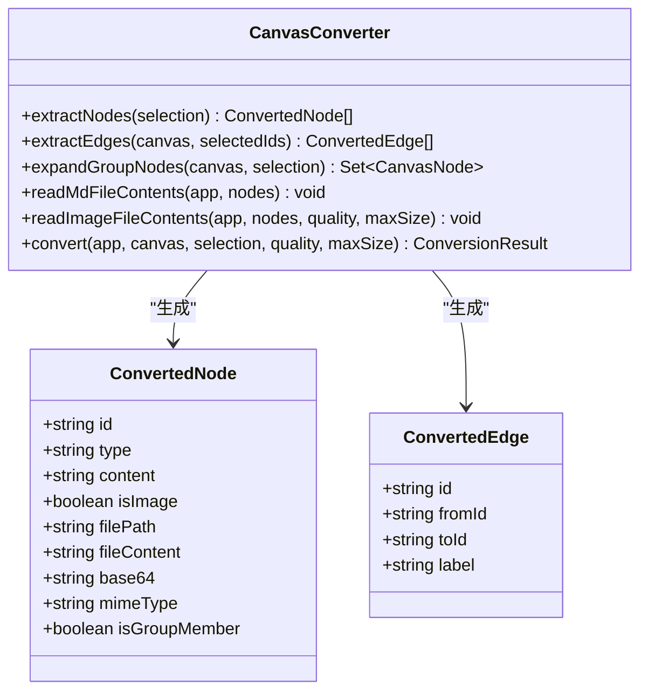
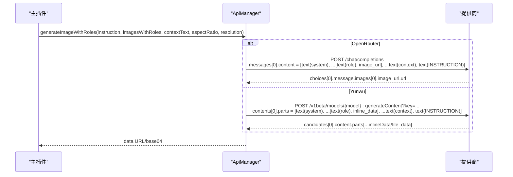
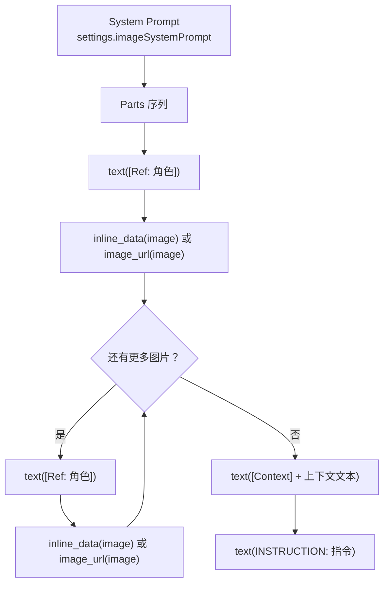
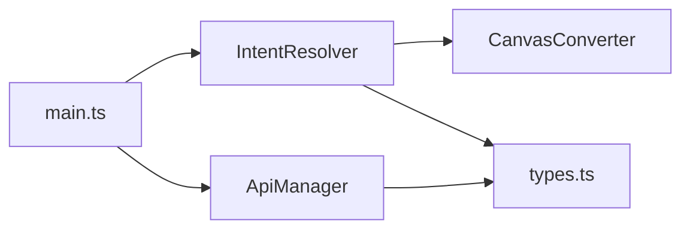

# 智能意图解析

<cite>
**本文引用的文件**
- [intent-resolver.ts](file://intent-resolver.ts)
- [api-manager.ts](file://api-manager.ts)
- [canvas-converter.ts](file://canvas-converter.ts)
- [types.ts](file://types.ts)
- [main.ts](file://main.ts)
- [docs/design_doc.md](file://docs/design_doc.md)
- [docs/design_doc_v2.md](file://docs/design_doc_v2.md)
</cite>

## 目录
1. [简介](#简介)
2. [项目结构](#项目结构)
3. [核心组件](#核心组件)
4. [架构总览](#架构总览)
5. [详细组件分析](#详细组件分析)
6. [依赖关系分析](#依赖关系分析)
7. [性能考量](#性能考量)
8. [故障排查指南](#故障排查指南)
9. [结论](#结论)
10. [附录](#附录)

## 简介
本文件围绕智能意图解析模块（IntentResolver）进行深度技术文档梳理，解释其如何将 Obsidian Canvas 的拓扑结构与用户指令转化为面向 Gemini 的多模态请求结构。文档重点覆盖：
- 基于 Canvas 图谱的角色分配策略（Label/上游文本/Group 标题）
- 指令策略（显式输入/上下文文本/默认预设）与回退机制
- 系统提示词（System Prompt）注入方式与在不同模式下的差异
- 多模态内容组织（图文混合总结场景）与 contents 数组的交替排列逻辑
- 与 ApiManager 的协同工作，生成最终请求 payload

## 项目结构
本插件采用分层设计：UI 交互由主插件负责，意图解析与数据转换由独立模块完成，最终通过 API 管理器对接 OpenRouter/Gemini/Yunwu。

图表来源
- [intent-resolver.ts](file://intent-resolver.ts#L63-L129)
- [canvas-converter.ts](file://canvas-converter.ts#L56-L120)
- [api-manager.ts](file://api-manager.ts#L71-L120)
- [types.ts](file://types.ts#L21-L112)

章节来源
- [intent-resolver.ts](file://intent-resolver.ts#L63-L129)
- [canvas-converter.ts](file://canvas-converter.ts#L56-L120)
- [api-manager.ts](file://api-manager.ts#L71-L120)
- [types.ts](file://types.ts#L21-L112)

## 核心组件
- 意图解析器（IntentResolver）：负责将 Canvas 选区转换为 AI 可消费的结构化输入，包括图片角色标注、指令提取、上下文文本组织与生成可行性判断。
- Canvas 转换器（CanvasConverter）：将 Canvas 节点转换为 ConvertedNode/ConvertedEdge，读取 .md 内容与图片 Base64，并支持 Group 展开。
- API 管理器（ApiManager）：封装 OpenRouter/Gemini/Yunwu 的调用，支持聊天、多模态聊天、图像生成与角色标注的参考图输入。
- 类型定义（types.ts）：提供 Canvas、节点、边等核心类型，支撑解析与转换过程。

章节来源
- [intent-resolver.ts](file://intent-resolver.ts#L23-L55)
- [canvas-converter.ts](file://canvas-converter.ts#L17-L55)
- [api-manager.ts](file://api-manager.ts#L11-L67)
- [types.ts](file://types.ts#L21-L112)

## 架构总览
IntentResolver 的主流程分为四步：
1) 预处理：展开 Group、过滤非图片文件、读取 .md 内容与图片 Base64
2) 角色解析：基于图谱为每张图片分配语义角色（Label > 上游文本 > Group 标题）
3) 指令策略：优先级回退（显式输入 > 未用作标签的文本 > 默认预设）
4) 上下文构建：排除已用作标签/指令的节点，拼接文本上下文

随后，主插件根据模式（chat/image）决定使用 ApiManager 的聊天或图像生成接口，并将解析结果（图片角色、指令、上下文）注入到最终请求 payload 中。

图表来源
- [intent-resolver.ts](file://intent-resolver.ts#L63-L129)
- [canvas-converter.ts](file://canvas-converter.ts#L328-L382)
- [api-manager.ts](file://api-manager.ts#L575-L644)
- [main.ts](file://main.ts#L1094-L1145)

章节来源
- [intent-resolver.ts](file://intent-resolver.ts#L63-L129)
- [canvas-converter.ts](file://canvas-converter.ts#L328-L382)
- [api-manager.ts](file://api-manager.ts#L575-L644)
- [main.ts](file://main.ts#L1094-L1145)

## 详细组件分析

### 意图解析器（IntentResolver）
- 主入口 resolve：串联预处理、角色分配、指令提取、上下文构建与生成可行性判断。
- 预处理 preprocess：
  - 展开 Group 节点，收集有效节点
  - 过滤非图片文件（保留 .md 与受支持图片扩展名）
  - 读取 .md 文件内容与图片 Base64（压缩为 WebP，限制尺寸）
  - 统计图片/文本数量，记录跳过的文件与警告
- 角色分配 assignRoles：
  - 优先级：显式连线 Label（边上的标签）> 上游文本节点内容（DFS/BFS，循环检测）> Group 标题（若节点为 Group 成员）
  - 默认角色为“Visual Reference”，并对角色文本长度截断
- 指令策略 resolveInstruction：
  - 优先级回退：用户显式输入 > 未被用作标签的文本节点内容（合并） > 模式默认预设（chat: 总结；image: 基于参考图生成）
- 上下文构建 buildContextText：
  - 排除图片节点与已被用作标签的节点，按文本节点/文件内容/链接节点组织为分隔文本
- 生成可行性 canGenerate：
  - 当存在图片、指令或上下文时返回 true

图表来源
- [intent-resolver.ts](file://intent-resolver.ts#L138-L199)
- [intent-resolver.ts](file://intent-resolver.ts#L201-L279)
- [intent-resolver.ts](file://intent-resolver.ts#L282-L319)
- [intent-resolver.ts](file://intent-resolver.ts#L321-L343)
- [intent-resolver.ts](file://intent-resolver.ts#L103-L114)

章节来源
- [intent-resolver.ts](file://intent-resolver.ts#L63-L129)
- [intent-resolver.ts](file://intent-resolver.ts#L138-L199)
- [intent-resolver.ts](file://intent-resolver.ts#L201-L279)
- [intent-resolver.ts](file://intent-resolver.ts#L282-L319)
- [intent-resolver.ts](file://intent-resolver.ts#L321-L343)
- [intent-resolver.ts](file://intent-resolver.ts#L103-L114)

### Canvas 转换器（CanvasConverter）
- 节点转换：将 CanvasNode 转为 ConvertedNode，识别文本/文件/链接/群组类型，记录是否为图片、文件路径、MIME 类型等
- 边提取：仅保留两端均在选区内的边，附带标签
- Group 展开：根据群组包围盒获取内部节点，加入有效节点集
- 文件内容读取：对 .md 文件读取内容并替换 content 字段
- 图片读取与压缩：读取二进制，使用 Canvas API 压缩为 WebP，限制最大尺寸，返回 Base64 与 MIME

图表来源
- [canvas-converter.ts](file://canvas-converter.ts#L17-L55)
- [canvas-converter.ts](file://canvas-converter.ts#L56-L120)
- [canvas-converter.ts](file://canvas-converter.ts#L156-L181)
- [canvas-converter.ts](file://canvas-converter.ts#L293-L321)
- [canvas-converter.ts](file://canvas-converter.ts#L323-L382)

章节来源
- [canvas-converter.ts](file://canvas-converter.ts#L17-L55)
- [canvas-converter.ts](file://canvas-converter.ts#L56-L120)
- [canvas-converter.ts](file://canvas-converter.ts#L156-L181)
- [canvas-converter.ts](file://canvas-converter.ts#L293-L382)

### API 管理器（ApiManager）
- 聊天接口 chatCompletion：支持可选 systemPrompt，构造 OpenRouter/OpenAI 兼容的消息结构
- 多模态聊天 multimodalChat：将图片 Base64 转为 data URL，与文本一起组成 content parts
- 图像生成 generateImageWithRoles：支持两种模式
  - OpenRouter：按 OpenAI 兼容格式，content.parts 中交替 text 与 image_url，支持 image_config（宽高比/分辨率）
  - Yunwu/Gemini 原生：使用 contents 数组，parts 为 inline_data 形式，generationConfig.imageConfig 控制输出
- 系统提示词注入：图像生成默认使用 settings.imageSystemPrompt，可覆盖

图表来源
- [api-manager.ts](file://api-manager.ts#L277-L398)
- [api-manager.ts](file://api-manager.ts#L400-L495)
- [api-manager.ts](file://api-manager.ts#L573-L644)

章节来源
- [api-manager.ts](file://api-manager.ts#L143-L191)
- [api-manager.ts](file://api-manager.ts#L193-L276)
- [api-manager.ts](file://api-manager.ts#L277-L398)
- [api-manager.ts](file://api-manager.ts#L400-L495)
- [api-manager.ts](file://api-manager.ts#L573-L644)

### 系统提示词注入与模式差异
- Chat 模式：主插件在发送聊天请求前，将上下文文本拼接到 systemPrompt 中，形成“系统提示词 + 选区上下文”的复合提示词，再调用 chatCompletion 或 multimodalChat
- Image 模式：ApiManager 在 generateImageWithRoles 中将 settings.imageSystemPrompt 作为首条 text part 注入，随后按角色标注与图片、上下文、指令的顺序组织内容

章节来源
- [main.ts](file://main.ts#L1094-L1118)
- [api-manager.ts](file://api-manager.ts#L308-L358)
- [api-manager.ts](file://api-manager.ts#L400-L462)

### 角色分配策略与指令策略实现
- 角色分配 assignRoles：
  - 优先使用边标签 label 作为角色
  - 若无标签，向上游文本节点追溯（DFS/BFS，维护 visited 集合避免循环）
  - 若仍无，使用 Group 标题（当节点为 Group 成员）
  - 默认角色“Visual Reference”，并截断角色文本长度
- 指令策略 resolveInstruction：
  - 优先使用用户显式输入
  - 若为空，合并未被用作标签的文本节点内容作为指令
  - 若仍为空，按模式回退到默认预设（chat: 总结；image: 基于参考图生成）

章节来源
- [intent-resolver.ts](file://intent-resolver.ts#L201-L279)
- [intent-resolver.ts](file://intent-resolver.ts#L282-L319)

### 场景2：图文混合总结（contents 数组交替排列）
依据设计文档，图文混合总结应将文本与图片在 contents 数组中交替排列，系统提示词注入在 OpenRouter/Gemini 的兼容格式中体现为首条 text part。结合本仓库实现：
- contents 数组（Yunwu/Gemini 原生）：首部 text 为 systemPrompt，随后按 [text(role), inline_data(image)] 的交替序列，最后附加 [text(context), text(instruction)]
- OpenRouter/OpenAI 兼容格式：messages[0].content 为 parts 数组，顺序相同，但使用 image_url 形式

图表来源
- [api-manager.ts](file://api-manager.ts#L308-L358)
- [api-manager.ts](file://api-manager.ts#L400-L462)
- [docs/design_doc.md](file://docs/design_doc.md#L106-L122)

章节来源
- [api-manager.ts](file://api-manager.ts#L308-L358)
- [api-manager.ts](file://api-manager.ts#L400-L462)
- [docs/design_doc.md](file://docs/design_doc.md#L106-L122)

### 与主插件的协同流程
- 主插件在用户点击生成后，调用 IntentResolver.resolve 获取 ResolvedIntent
- Chat 模式：将 ResolvedIntent.contextText 拼接到 systemPrompt，随后调用 chatCompletion/multimodalChat
- Image 模式：调用 generateImageWithRoles，传入 ResolvedIntent.images（含角色）、instruction、contextText 与用户选择的宽高比/分辨率

章节来源
- [main.ts](file://main.ts#L1040-L1145)
- [main.ts](file://main.ts#L1670-L1744)

## 依赖关系分析
- IntentResolver 依赖 CanvasConverter（节点/边提取、Group 展开、文件与图片读取）
- IntentResolver 依赖 types.ts 中的 Canvas/CanvasNode/CanvasEdge 类型
- ApiManager 依赖 settings（提供商、模型、系统提示词、图像配置）
- 主插件 main.ts 依赖 IntentResolver 与 ApiManager，负责 UI 交互与结果回写

图表来源
- [intent-resolver.ts](file://intent-resolver.ts#L8-L12)
- [canvas-converter.ts](file://canvas-converter.ts#L1-L12)
- [types.ts](file://types.ts#L21-L112)
- [main.ts](file://main.ts#L1-L10)
- [api-manager.ts](file://api-manager.ts#L1-L12)

章节来源
- [intent-resolver.ts](file://intent-resolver.ts#L8-L12)
- [canvas-converter.ts](file://canvas-converter.ts#L1-L12)
- [types.ts](file://types.ts#L21-L112)
- [main.ts](file://main.ts#L1-L10)
- [api-manager.ts](file://api-manager.ts#L1-L12)

## 性能考量
- 图片压缩与尺寸限制：在 CanvasConverter 中将图片压缩为 WebP 并限制最大尺寸，减少 Base64 体积与 Token 消耗
- 图片数量上限：IntentResolver 对图片数量进行限制（最多 14 张），避免超出模型限制
- 预处理阶段一次性读取 .md 与图片，避免重复 IO
- 角色分配的循环检测：使用 visited 集合避免 DFS/BFS 死循环，提升稳定性

章节来源
- [canvas-converter.ts](file://canvas-converter.ts#L350-L463)
- [intent-resolver.ts](file://intent-resolver.ts#L15-L18)
- [intent-resolver.ts](file://intent-resolver.ts#L264-L274)

## 故障排查指南
- API Key 未配置：ApiManager 在发送请求前检查密钥，未配置时抛出错误
- 无生成内容：IntentResolver 返回 canGenerate=false 时，主插件直接停止生成
- 图片过多：超过限制时会截断并产生警告
- 安全过滤器拦截：图像生成失败时，ApiManager 抛出错误，主插件将 Ghost 节点标记为错误状态
- 网络异常：ApiManager 对 HTTP 错误进行捕获与日志输出

章节来源
- [api-manager.ts](file://api-manager.ts#L136-L142)
- [api-manager.ts](file://api-manager.ts#L646-L678)
- [intent-resolver.ts](file://intent-resolver.ts#L103-L114)
- [main.ts](file://main.ts#L1146-L1149)

## 结论
IntentResolver 将 Canvas 的拓扑结构与用户指令转化为面向 Gemini 的多模态请求，通过角色分配与指令回退策略，确保在复杂场景（如图文混合总结、多图组合生图）下仍能稳定产出高质量输入。配合 ApiManager 的系统提示词注入与 contents 数组的交替排列，实现了从画布到模型的端到端意图传递与结果回写。

## 附录
- 设计文档参考：
  - 场景2（图文混合总结）：系统提示词注入与 contents 数组交替排列
  - 场景1（多图组合生图）：直接使用 Gemini 3 Pro Image 的多模态输入能力
- 设置项要点：
  - imageSystemPrompt：图像生成默认系统提示词
  - defaultAspectRatio/defaultResolution：图像生成默认参数
  - chatPresets/imagePresets：预设指令（分别用于 chat/image 模式）

章节来源
- [docs/design_doc.md](file://docs/design_doc.md#L106-L122)
- [docs/design_doc_v2.md](file://docs/design_doc_v2.md#L180-L218)
- [docs/design_doc_v2.md](file://docs/design_doc_v2.md#L300-L336)
- [main.ts](file://main.ts#L54-L83)