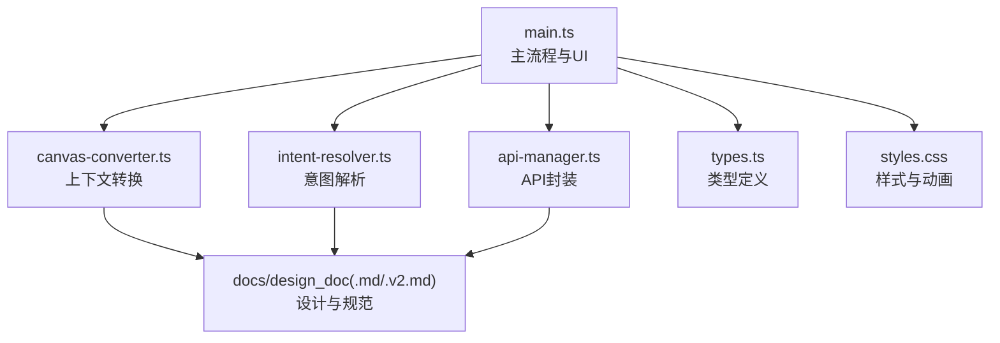
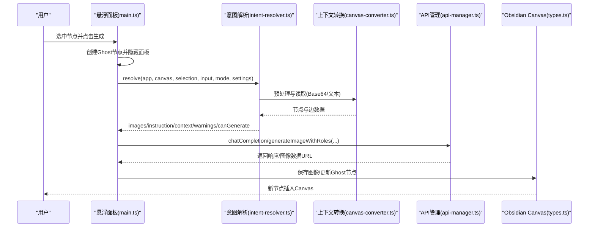
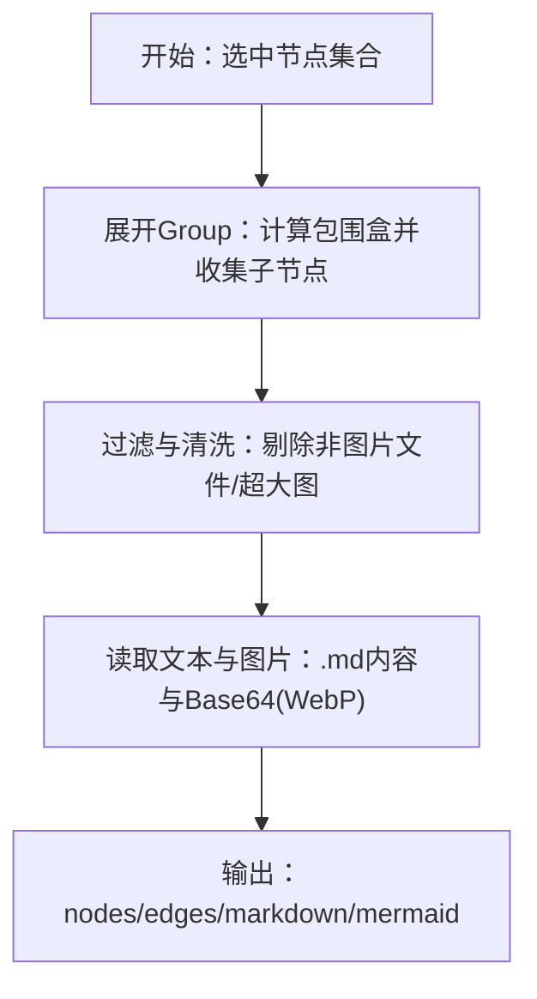
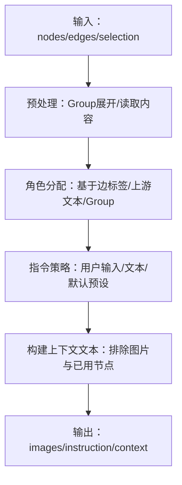
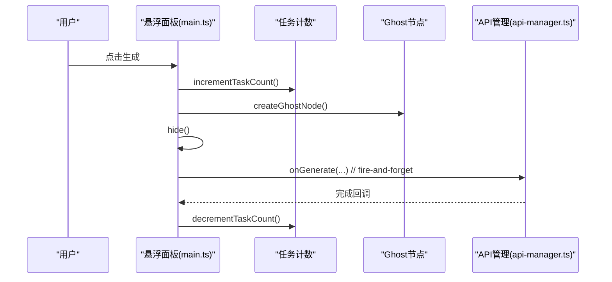
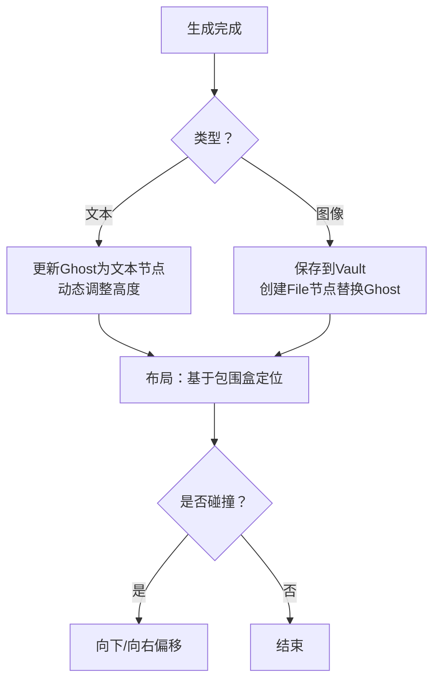
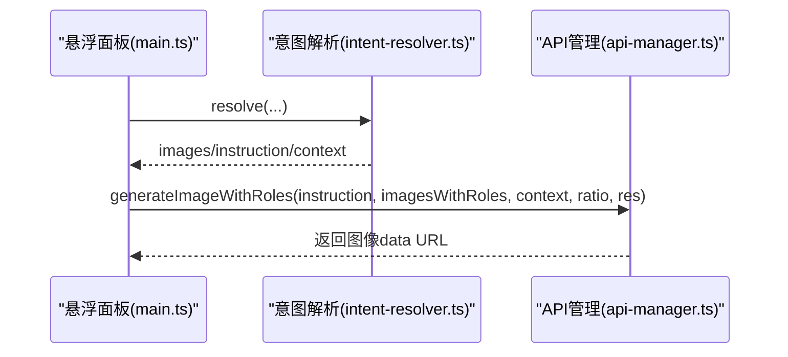
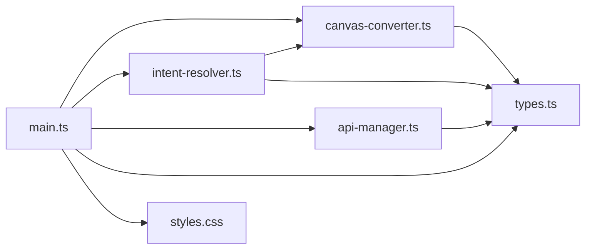

# 核心功能

<cite>
**本文引用的文件**
- [main.ts](file://main.ts)
- [canvas-converter.ts](file://canvas-converter.ts)
- [intent-resolver.ts](file://intent-resolver.ts)
- [api-manager.ts](file://api-manager.ts)
- [types.ts](file://types.ts)
- [styles.css](file://styles.css)
- [docs/design_doc.md](file://docs/design_doc.md)
- [docs/design_doc_v2.md](file://docs/design_doc_v2.md)
- [docs/execution_guide.md](file://docs/execution_guide.md)
- [README.md](file://README.md)
</cite>

## 目录
1. [简介](#简介)
2. [项目结构](#项目结构)
3. [核心组件](#核心组件)
4. [架构总览](#架构总览)
5. [详细组件分析](#详细组件分析)
6. [依赖关系分析](#依赖关系分析)
7. [性能考量](#性能考量)
8. [故障排查指南](#故障排查指南)
9. [结论](#结论)
10. [附录](#附录)

## 简介
本文件围绕 ObsidianCanvasAI 的核心功能进行系统化文档化，重点覆盖以下方面：
- 多模态上下文支持：如何处理文本、图片与群组节点，结合设计文档中的“直接图像输入（Direct Image Input）”方案。
- 智能意图解析：将 Canvas 的拓扑关系翻译为 AI 可理解的语义，明确角色标注与指令回退策略。
- 异步任务管理：任务队列与“发射后不管”的工作流，保证 UI 无阻塞与并发可控。
- 结果回写：文本与图像节点的生成、文件落盘与“避让算法”的定位策略。
- 用户视角的实现路径：结合执行指南，给出从选区到生成再到回写的完整用例，如“多图组合生图”和“图文混合总结”。

## 项目结构
插件采用模块化组织，核心文件职责如下：
- main.ts：插件主入口，负责悬浮面板、任务调度、Ghost 节点、布局与回写。
- canvas-converter.ts：将 Canvas 选区转换为 Markdown/Mermaid 与图片 Base64，支持群组展开与文件内容读取。
- intent-resolver.ts：意图解析管线，基于图谱分配图片语义角色、构建指令与上下文文本。
- api-manager.ts：统一 API 管理，适配 OpenRouter 与 Yunwu/Gemini 原生格式，支持多模态聊天与图像生成。
- types.ts：Canvas 类型定义，确保与 Obsidian Canvas API 的兼容。
- styles.css：悬浮面板与 Ghost 节点样式，提供加载动画与错误态。
- docs/design_doc(.md/.v2.md)：设计与执行指南，定义多模态输入、布局与安全防护等。
- README.md：面向用户的功能概览与操作指引。

图表来源
- [main.ts](file://main.ts#L1-L200)
- [canvas-converter.ts](file://canvas-converter.ts#L1-L120)
- [intent-resolver.ts](file://intent-resolver.ts#L1-L120)
- [api-manager.ts](file://api-manager.ts#L1-L120)
- [types.ts](file://types.ts#L1-L120)
- [styles.css](file://styles.css#L448-L541)
- [docs/design_doc_v2.md](file://docs/design_doc_v2.md#L1-L120)

章节来源
- [main.ts](file://main.ts#L1-L200)
- [README.md](file://README.md#L1-L101)

## 核心组件
- 悬浮面板（Floating Palette）
  - 模式切换（文本/图像）、预设管理、参数控制（温度、分辨率、比例）、上下文预览。
  - 生成按钮支持“发射后不管”，并发计数与按钮文案联动。
- Canvas 数据转换（CanvasConverter）
  - 节点类型识别（文本、文件、链接、群组），群组展开，文件内容读取，图片压缩为 WebP Base64。
  - 输出 Markdown 与 Mermaid，便于 Chat 模式与可视化展示。
- 意图解析（IntentResolver）
  - 预处理：Group 展开、文件清洗、读取图片与文本。
  - 角色分配：连线标签 > 上游文本 > Group 标题 > 默认角色。
  - 指令策略：用户输入 > 选区文本 > 默认预设；构建上下文文本，排除已用作标签或指令的节点。
- API 管理（ApiManager）
  - 统一聊天与图像生成接口，支持 OpenRouter 与 Yunwu/Gemini 原生格式。
  - 多模态消息构造：文本 + 图像 URL（data: URL）；图像生成支持 aspect_ratio 与分辨率配置。
- 结果回写与布局
  - 生成 Ghost 节点（加载动画），成功后替换为文本/图片节点；失败时错误态样式与提示。
  - 基于选区包围盒的智能定位与简单碰撞检测。

章节来源
- [main.ts](file://main.ts#L200-L800)
- [canvas-converter.ts](file://canvas-converter.ts#L1-L200)
- [intent-resolver.ts](file://intent-resolver.ts#L1-L200)
- [api-manager.ts](file://api-manager.ts#L1-L200)
- [styles.css](file://styles.css#L448-L541)

## 架构总览
下图展示了从用户选区到生成与回写的端到端流程，以及各组件之间的依赖关系。

图表来源
- [main.ts](file://main.ts#L1138-L1352)
- [intent-resolver.ts](file://intent-resolver.ts#L60-L130)
- [canvas-converter.ts](file://canvas-converter.ts#L464-L556)
- [api-manager.ts](file://api-manager.ts#L286-L398)
- [types.ts](file://types.ts#L75-L120)

## 详细组件分析

### 多模态上下文支持
- 文本节点：直接输出内容，用于 Chat 模式或作为上下文文本。
- 图片节点：读取文件为 Buffer，压缩为 WebP，转换为 Base64，限定最大尺寸与质量，便于多模态输入。
- 群组节点：通过包围盒扫描包含的子节点，自动纳入处理列表，同时保留 Group 标签作为语义上下文。
- 直接图像输入（Direct Image Input）：设计文档明确支持将多张图片与文本混合输入到模型，以实现“多图组合生图”等高级场景。

图表来源
- [canvas-converter.ts](file://canvas-converter.ts#L293-L356)
- [canvas-converter.ts](file://canvas-converter.ts#L464-L556)
- [docs/design_doc.md](file://docs/design_doc.md#L90-L121)

章节来源
- [canvas-converter.ts](file://canvas-converter.ts#L1-L200)
- [docs/design_doc.md](file://docs/design_doc.md#L90-L121)

### 智能意图解析
- 角色解析（Role Assignment）
  - 优先级：显式连线标签 > 上游文本 > Group 标题 > 默认角色。
  - 使用入边集合与节点映射，避免循环遍历，截断长角色文本。
- 指令策略（Instruction Strategy）
  - 用户输入优先；否则使用未被用作标签的文本节点内容；最后回退到默认预设。
- 上下文文本构建
  - 排除图片与已被用作标签/指令的节点，按类型拼接为系统提示词片段。

图表来源
- [intent-resolver.ts](file://intent-resolver.ts#L60-L130)
- [intent-resolver.ts](file://intent-resolver.ts#L132-L200)
- [intent-resolver.ts](file://intent-resolver.ts#L201-L378)

章节来源
- [intent-resolver.ts](file://intent-resolver.ts#L1-L200)
- [docs/design_doc_v2.md](file://docs/design_doc_v2.md#L154-L219)

### 异步任务管理与“发射后不管”
- 任务计数与按钮文案
  - 生成按钮在并发任务期间显示“正在生成 N 个任务”，始终可用，避免阻塞 UI。
- 任务生命周期
  - 点击生成后立即创建 Ghost 节点，隐藏面板，调用 onGenerate 回调（不等待），后台执行 API 请求，结束后递减计数。
- 并发策略
  - 支持多任务并发，适合用户同时发起多个生成任务，无需等待上一个完成。

图表来源
- [main.ts](file://main.ts#L766-L800)
- [main.ts](file://main.ts#L1246-L1264)
- [main.ts](file://main.ts#L1138-L1151)

章节来源
- [main.ts](file://main.ts#L732-L800)
- [README.md](file://README.md#L23-L31)

### 结果回写与避让算法
- 文本节点回写
  - Chat 模式直接更新 Ghost 节点为文本内容，动态估算高度并保存。
- 图像节点回写
  - 保存图像到 Vault（自动推断 MIME 与扩展名），创建文件节点并替换 Ghost。
- 避让算法
  - 计算选区包围盒，新节点默认放置在 maxX + 50、minY，简单碰撞检测（向下或向右偏移）。

图表来源
- [main.ts](file://main.ts#L1138-L1151)
- [main.ts](file://main.ts#L1156-L1244)
- [main.ts](file://main.ts#L1246-L1327)
- [main.ts](file://main.ts#L1329-L1347)
- [styles.css](file://styles.css#L448-L501)

章节来源
- [main.ts](file://main.ts#L1138-L1352)
- [styles.css](file://styles.css#L448-L501)
- [docs/design_doc.md](file://docs/design_doc.md#L122-L143)

### API 管道与多模态输入
- OpenRouter 与 Yunwu/Gemini 原生格式
  - Chat：OpenAI 兼容格式；图像生成：OpenRouter 使用 image_config，Yunwu 使用 Gemini native contents + generationConfig。
- 多模态消息构造
  - 文本 + 多张图片（data: URL），支持角色标注与上下文文本。
- 直接图像输入（Direct Image Input）
  - 将用户选中的多张图片与文本一起作为模型输入，实现“多图组合生图”。

图表来源
- [intent-resolver.ts](file://intent-resolver.ts#L282-L378)
- [api-manager.ts](file://api-manager.ts#L287-L398)
- [docs/design_doc.md](file://docs/design_doc.md#L150-L185)

章节来源
- [api-manager.ts](file://api-manager.ts#L286-L398)
- [docs/design_doc.md](file://docs/design_doc.md#L150-L185)

## 依赖关系分析
- main.ts 依赖
  - canvas-converter.ts：上下文转换与图片读取。
  - intent-resolver.ts：意图解析与角色分配。
  - api-manager.ts：统一 API 调用。
  - types.ts：Canvas 类型与节点接口。
  - styles.css：Ghost 节点动画与错误态样式。
- intent-resolver.ts 依赖
  - canvas-converter.ts：预处理与读取。
  - types.ts：Canvas 节点与边类型。
- api-manager.ts 依赖
  - types.ts：Canvas 类型（用于 Provider 与 Endpoint 选择）。
- canvas-converter.ts 依赖
  - types.ts：Canvas 节点与边接口。
  - Obsidian Vault API：读取文件与二进制数据。

图表来源
- [main.ts](file://main.ts#L1-L120)
- [canvas-converter.ts](file://canvas-converter.ts#L1-L60)
- [intent-resolver.ts](file://intent-resolver.ts#L1-L40)
- [api-manager.ts](file://api-manager.ts#L1-L40)
- [types.ts](file://types.ts#L1-L60)

章节来源
- [main.ts](file://main.ts#L1-L120)
- [canvas-converter.ts](file://canvas-converter.ts#L1-L60)
- [intent-resolver.ts](file://intent-resolver.ts#L1-L40)
- [api-manager.ts](file://api-manager.ts#L1-L40)
- [types.ts](file://types.ts#L1-L60)

## 性能考量
- 图片压缩与尺寸限制
  - 读取图片后按最大尺寸与质量压缩为 WebP，降低 Token 消耗与传输成本。
- 并发与 UI 无阻塞
  - “发射后不管”模式与任务计数，避免 UI 线程阻塞，提升交互流畅度。
- 预处理与缓存
  - 仅在必要时读取文件内容，避免重复 IO；Mermaid 输出用于可视化与调试。
- 错误早发现
  - 图片数量限制（14 张）、循环检测与自动压缩，减少无效请求与卡顿。

[本节为通用指导，无需特定文件引用]

## 故障排查指南
- API 未配置
  - 现象：点击生成无响应或报错。
  - 处理：在设置页配置 API Provider 与 Key。
- 安全拦截或 API 错误
  - 现象：Ghost 节点变为红色 ⚠️ 图标，点击显示错误信息。
  - 处理：查看错误提示，修改 Prompt 或重试。
- 图片过多或过大
  - 现象：提示图片数量超过限制或生成失败。
  - 处理：减少选中图片数量或降低分辨率；插件会自动压缩超大图片。
- Ghost 节点不消失
  - 现象：任务完成后未替换为结果节点。
  - 处理：检查 API 返回与错误日志；必要时重启 Obsidian 后重试。

章节来源
- [main.ts](file://main.ts#L1138-L1151)
- [styles.css](file://styles.css#L498-L501)
- [docs/design_doc_v2.md](file://docs/design_doc_v2.md#L244-L299)

## 结论
ObsidianCanvasAI 通过“多模态上下文 + 智能意图解析 + 异步任务管理 + 结果回写与避让算法”的完整链路，实现了从 Canvas 选区到 AI 生成与回写的高效闭环。设计文档明确了 Direct Image Input 与布局、安全防护等关键点，执行指南提供了可落地的开发路径。结合用户视角的用例（多图组合生图、图文混合总结），插件能够满足复杂创作场景下的多模态需求。

[本节为总结，无需特定文件引用]

## 附录

### 用户视角实现路径（结合执行指南）
- 阶段 1：骨架与 UI
  - 搭建设置页与悬浮面板，支持模式切换与预设管理。
- 阶段 2：Canvas 数据读取与转换
  - 实现上下文转换，支持文本、图片与群组；输出 Markdown/Mermaid。
- 阶段 3：API 对接与异步任务
  - 对接 OpenRouter/Yunwu，实现“发射后不管”的并发任务与 Ghost 节点反馈。
- 阶段 4：文本生成闭环
  - Chat 模式回写文本节点，动态调整高度。
- 阶段 5：图像处理与多模态
  - 读取图片 Base64，构造多模态输入，回写图片节点并保存到 Vault。
- 阶段 6：完善与发布
  - 错误处理、预设管理、发布准备。

章节来源
- [docs/execution_guide.md](file://docs/execution_guide.md#L1-L243)

### 用例实践
- 多图组合生图
  - 选中多张参考图（构图、配色、主体），在图像模式输入 Prompt，启用 Direct Image Input，生成融合效果的新图。
- 图文混合总结
  - 选中文本与图片节点，Chat 模式自动汇总为报告；或图像模式以选区文本为指令，生成总结性图片。

章节来源
- [docs/design_doc.md](file://docs/design_doc.md#L89-L121)
- [docs/design_doc_v2.md](file://docs/design_doc_v2.md#L206-L219)