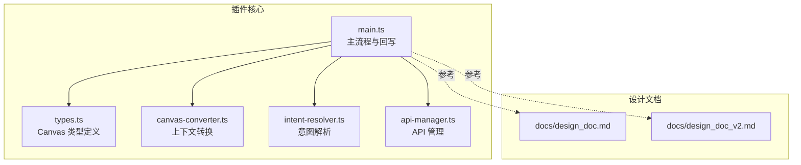
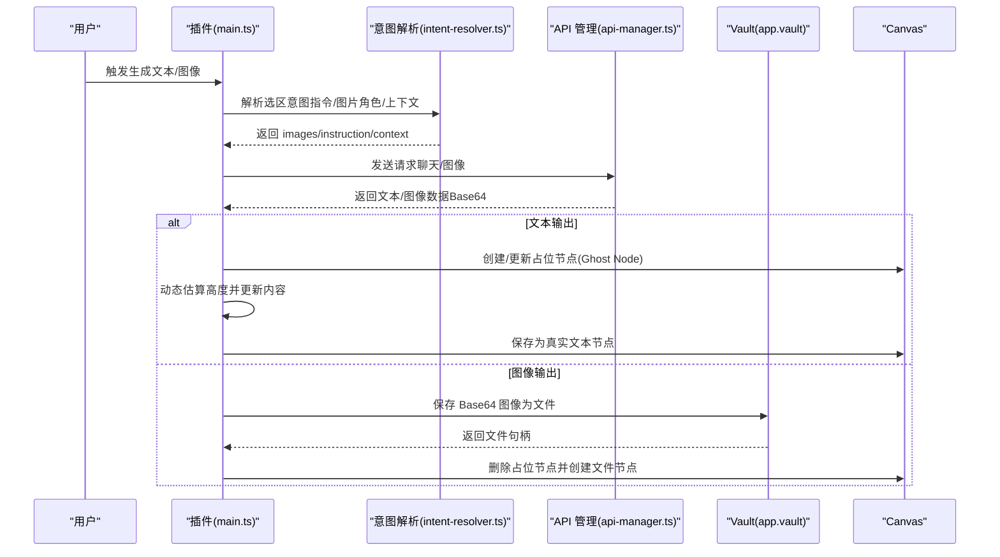
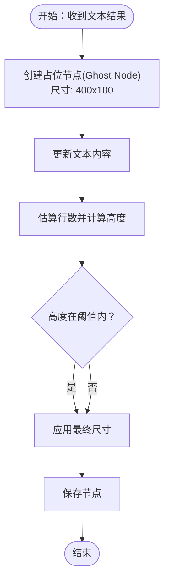
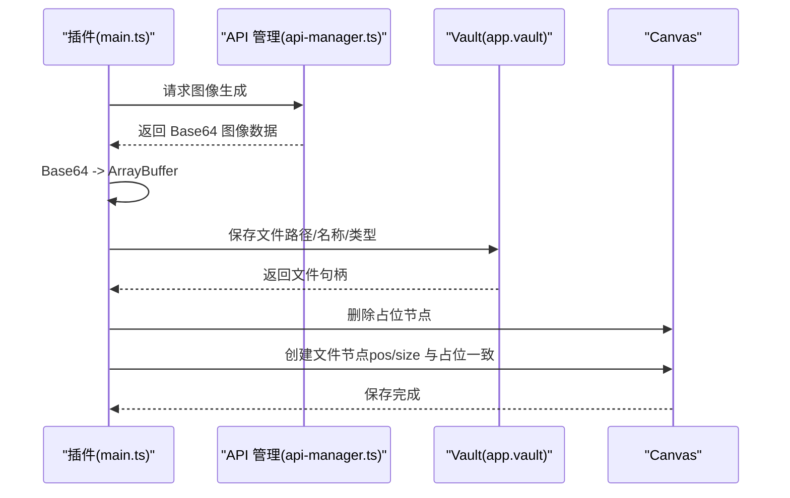
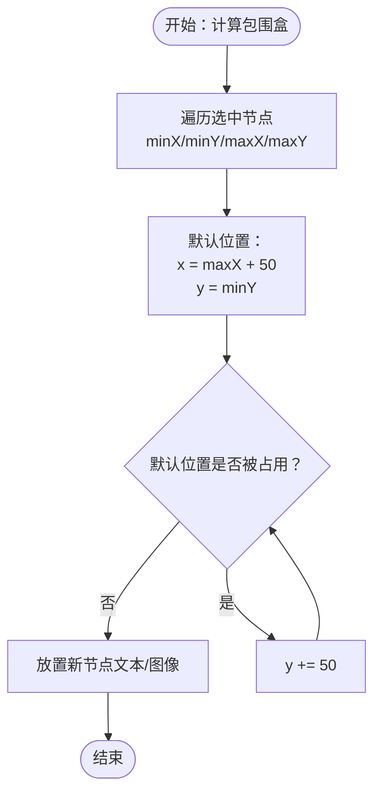
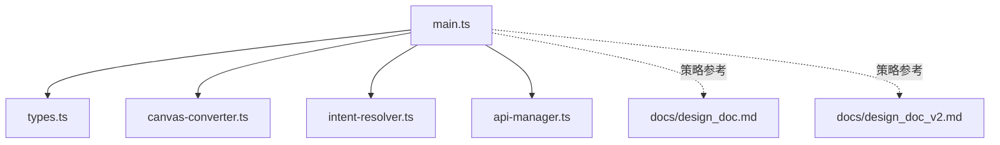

# 结果回写机制

<cite>
**本文引用的文件**
- [main.ts](file://main.ts)
- [types.ts](file://types.ts)
- [canvas-converter.ts](file://canvas-converter.ts)
- [intent-resolver.ts](file://intent-resolver.ts)
- [api-manager.ts](file://api-manager.ts)
- [docs/design_doc.md](file://docs/design_doc.md)
- [docs/design_doc_v2.md](file://docs/design_doc_v2.md)
- [README.md](file://README.md)
</cite>

## 目录
1. [简介](#简介)
2. [项目结构](#项目结构)
3. [核心组件](#核心组件)
4. [架构总览](#架构总览)
5. [详细组件分析](#详细组件分析)
6. [依赖关系分析](#依赖关系分析)
7. [性能考量](#性能考量)
8. [故障排查指南](#故障排查指南)
9. [结论](#结论)
10. [附录](#附录)

## 简介
本文件聚焦“结果回写机制”，系统性阐述两类输出类型的回写流程：
- 文本输出：将 AI 生成的文本写入新的 Canvas 文本节点。
- 图像输出：将生成的 Base64 图像数据通过 vault 接口保存为文件，并创建对应的 Canvas 文件节点。

文档还详细说明设计文档中提出的避让算法：如何计算选中节点的包围盒（minX, minY, maxX, maxY），并默认将新节点定位在 x = maxX + 50, y = minY，以避免遮挡；以及可选的碰撞检测优化：当默认位置被占用时向下偏移直至找到空位或向更右侧偏移。

## 项目结构
围绕“结果回写”的关键模块与职责如下：
- main.ts：插件主入口，负责生成占位节点（Ghost Node）、调用 API、保存图像、替换为真实节点、计算包围盒与节点定位、更新浮动面板上下文预览等。
- types.ts：Canvas 节点与坐标接口定义，提供 CanvasCoords、CanvasNode、Canvas 等类型支撑。
- canvas-converter.ts：将 Canvas 选区转换为 Markdown/Mermaid/图片 Base64 等，为回写提供上下文与媒体素材。
- intent-resolver.ts：解析用户意图，构建图像生成所需的“带角色图片列表 + 指令 + 上下文文本”，并进行预处理与安全限制。
- api-manager.ts：封装 OpenRouter/Yunwu 的聊天与图像生成接口，统一请求与响应解析，支持多模态输入与输出。
- docs/design_doc(.md/.v2.md)：明确布局与回写策略、尺寸预设、碰撞检测优化等设计约束。
- README.md：插件功能概览与使用说明，便于理解回写流程的用户视角。

图表来源
- [main.ts](file://main.ts#L1-L200)
- [types.ts](file://types.ts#L1-L128)
- [canvas-converter.ts](file://canvas-converter.ts#L1-L120)
- [intent-resolver.ts](file://intent-resolver.ts#L1-L120)
- [api-manager.ts](file://api-manager.ts#L1-L120)
- [docs/design_doc.md](file://docs/design_doc.md#L1-L120)
- [docs/design_doc_v2.md](file://docs/design_doc_v2.md#L1-L120)

章节来源
- [main.ts](file://main.ts#L1-L200)
- [types.ts](file://types.ts#L1-L128)
- [canvas-converter.ts](file://canvas-converter.ts#L1-L120)
- [intent-resolver.ts](file://intent-resolver.ts#L1-L120)
- [api-manager.ts](file://api-manager.ts#L1-L120)
- [docs/design_doc.md](file://docs/design_doc.md#L1-L120)
- [docs/design_doc_v2.md](file://docs/design_doc_v2.md#L1-L120)

## 核心组件
- 文本回写（文本节点）
  - 生成占位节点（Ghost Node）：在 Canvas 上创建一个初始文本节点，显示“生成中”状态。
  - 更新占位节点：根据返回文本动态调整高度，填充内容。
  - 替换为真实文本节点：将占位节点内容与尺寸更新为最终文本，保存到画布。
- 图像回写（文件节点）
  - 保存 Base64 图像为文件：将生成的 Base64 数据转换为 ArrayBuffer，调用 vault 接口保存到指定路径。
  - 创建文件节点：删除占位节点，创建新的 Canvas 文件节点，显示保存的图片文件。
- 避让算法与定位
  - 计算包围盒：遍历选中节点，得到 minX/minY/maxX/maxY。
  - 默认定位：x = maxX + 50, y = minY；尺寸预设：文本节点宽度 400px（高度自适应），图像节点默认 500x500px（按比例后续可调整）。
  - 碰撞检测优化：若默认位置被占用，向下偏移 y += 50 直到找到空位，或向更右侧偏移。

章节来源
- [main.ts](file://main.ts#L1246-L1352)
- [main.ts](file://main.ts#L1199-L1243)
- [docs/design_doc.md](file://docs/design_doc.md#L122-L143)
- [docs/design_doc_v2.md](file://docs/design_doc_v2.md#L221-L242)

## 架构总览
下图展示从“生成请求”到“结果回写”的端到端流程，包括文本与图像两条分支。

图表来源
- [main.ts](file://main.ts#L1246-L1352)
- [intent-resolver.ts](file://intent-resolver.ts#L60-L130)
- [api-manager.ts](file://api-manager.ts#L193-L275)
- [api-manager.ts](file://api-manager.ts#L277-L398)
- [api-manager.ts](file://api-manager.ts#L400-L536)

## 详细组件分析

### 文本回写流程
- 占位节点创建
  - 使用 Canvas 文本节点创建接口，初始尺寸为 400px 宽、100px 高，文本为“✨ AI Generating...”，并添加样式类。
  - 调用 Canvas 的保存接口，确保节点持久化。
- 内容更新与尺寸自适应
  - 根据返回文本长度估算行数与高度，将节点高度限制在合理区间（例如最小 100px，最大 600px）。
  - 更新节点文本内容，必要时通过内部方法设置文本。
- 替换为真实文本节点
  - 保持原节点位置与尺寸，将内容替换为最终文本，保存到画布。

图表来源
- [main.ts](file://main.ts#L1246-L1352)

章节来源
- [main.ts](file://main.ts#L1246-L1352)

### 图像回写流程
- Base64 到文件保存
  - 将 Base64 数据解码为 ArrayBuffer。
  - 选择保存路径（默认附件文件夹），调用 vault 接口保存二进制数据，返回文件句柄。
- 创建文件节点
  - 删除占位节点，创建新的 Canvas 文件节点，位置与尺寸与占位节点一致（默认正方形 500x500px，按比例后续可调整）。
  - 请求画布保存，完成回写。

图表来源
- [api-manager.ts](file://api-manager.ts#L193-L275)
- [main.ts](file://main.ts#L1199-L1243)

章节来源
- [api-manager.ts](file://api-manager.ts#L193-L275)
- [main.ts](file://main.ts#L1199-L1243)

### 避让算法与定位策略
- 包围盒计算
  - 遍历选中节点，分别取节点左上角与右下角坐标，得到 minX/minY/maxX/maxY。
- 默认定位
  - 新节点默认放置在 x = maxX + 50, y = minY，顶部对齐，避免遮挡。
- 尺寸预设
  - 文本节点：宽度固定 400px，高度自适应。
  - 图像节点：默认 500x500px（后续可根据比例调整）。
- 碰撞检测优化
  - 若默认位置已有节点，向下偏移 y += 50 直到找到空位；若仍冲突，向更右侧偏移。

图表来源
- [main.ts](file://main.ts#L1330-L1347)
- [docs/design_doc.md](file://docs/design_doc.md#L122-L143)
- [docs/design_doc_v2.md](file://docs/design_doc_v2.md#L221-L242)

章节来源
- [main.ts](file://main.ts#L1330-L1347)
- [docs/design_doc.md](file://docs/design_doc.md#L122-L143)
- [docs/design_doc_v2.md](file://docs/design_doc_v2.md#L221-L242)

### 数据结构与类型支撑
- Canvas 节点与坐标
  - CanvasNode：包含 x/y/width/height/zIndex/bbox 等字段，提供移动、渲染、编辑等方法。
  - CanvasCoords：包围盒坐标结构（minX/minY/maxX/maxY）。
  - Canvas：提供节点创建、保存、查询等接口。
- 作用
  - 为避让算法提供包围盒计算依据；
  - 为节点定位与尺寸设定提供类型约束；
  - 为占位节点与真实节点的创建/更新提供接口。

章节来源
- [types.ts](file://types.ts#L1-L128)

### 与上下文与意图解析的关系
- CanvasConverter
  - 将选区节点转换为 Markdown/Mermaid，读取图片为压缩后的 WebP Base64，供图像生成使用。
- IntentResolver
  - 从选区中提取“带角色的图片列表 + 指令 + 上下文文本”，并进行预处理与安全限制（如图片数量上限）。
- 二者共同为回写提供“输入素材”和“生成指令”。

章节来源
- [canvas-converter.ts](file://canvas-converter.ts#L350-L463)
- [intent-resolver.ts](file://intent-resolver.ts#L132-L200)

## 依赖关系分析
- main.ts 依赖
  - types.ts：Canvas 类型与坐标结构。
  - canvas-converter.ts：上下文转换与图片 Base64 读取。
  - intent-resolver.ts：意图解析与预处理。
  - api-manager.ts：聊天/图像生成请求。
- 设计文档
  - design_doc(.md/.v2.md)：定义避让算法、尺寸预设、碰撞检测优化等策略。

图表来源
- [main.ts](file://main.ts#L1-L200)
- [types.ts](file://types.ts#L1-L128)
- [canvas-converter.ts](file://canvas-converter.ts#L1-L120)
- [intent-resolver.ts](file://intent-resolver.ts#L1-L120)
- [api-manager.ts](file://api-manager.ts#L1-L120)
- [docs/design_doc.md](file://docs/design_doc.md#L1-L120)
- [docs/design_doc_v2.md](file://docs/design_doc_v2.md#L1-L120)

章节来源
- [main.ts](file://main.ts#L1-L200)
- [types.ts](file://types.ts#L1-L128)
- [canvas-converter.ts](file://canvas-converter.ts#L1-L120)
- [intent-resolver.ts](file://intent-resolver.ts#L1-L120)
- [api-manager.ts](file://api-manager.ts#L1-L120)
- [docs/design_doc.md](file://docs/design_doc.md#L1-L120)
- [docs/design_doc_v2.md](file://docs/design_doc_v2.md#L1-L120)

## 性能考量
- 图像压缩与尺寸限制
  - 在读取图片时进行压缩与尺寸限制，降低 Base64 长度与 API 调用成本，提升成功率与速度。
- 多任务并发
  - 支持“发射后不管”，多个生成任务并发执行，避免 UI 阻塞。
- 占位节点动态尺寸
  - 文本节点高度按内容估算，避免过大或过小，提升阅读体验与渲染效率。

章节来源
- [canvas-converter.ts](file://canvas-converter.ts#L350-L463)
- [README.md](file://README.md#L23-L31)
- [main.ts](file://main.ts#L1266-L1327)

## 故障排查指南
- API 未配置
  - 现象：调用失败或弹出错误。
  - 处理：在设置中配置 API Key 与模型，使用“测试连接”按钮验证。
- 图像生成失败
  - 现象：返回文本而非图片或安全拦截。
  - 处理：检查提示词是否合规，适当降低分辨率或比例；查看错误状态节点的提示信息。
- 占位节点无法替换
  - 现象：节点停留在“生成中”状态。
  - 处理：确认 API 返回成功；检查节点尺寸更新逻辑与保存请求。
- 节点遮挡
  - 现象：新节点覆盖旧内容。
  - 处理：使用避让算法默认定位；若仍遮挡，手动微调或启用碰撞检测优化。

章节来源
- [api-manager.ts](file://api-manager.ts#L143-L191)
- [main.ts](file://main.ts#L1246-L1352)
- [docs/design_doc.md](file://docs/design_doc.md#L60-L71)

## 结论
本插件通过清晰的“占位节点—结果回写”流程，实现了文本与图像两类输出的无缝回写。避让算法与尺寸预设确保新节点自然融入画布布局，碰撞检测优化进一步提升可用性。结合上下文转换与意图解析，插件在多模态场景下提供了稳定、高效的回写体验。

## 附录
- 术语
  - 占位节点（Ghost Node）：生成过程中的临时占位文本节点，完成后被替换为真实节点。
  - 包围盒（Bounding Box）：选中节点的整体矩形范围，用于定位新节点。
- 参考路径
  - 文本回写相关实现：[main.ts](file://main.ts#L1246-L1352)
  - 图像回写相关实现：[main.ts](file://main.ts#L1199-L1243)
  - 包围盒计算与定位：[main.ts](file://main.ts#L1330-L1347)
  - 设计文档策略：[docs/design_doc.md](file://docs/design_doc.md#L122-L143)、[docs/design_doc_v2.md](file://docs/design_doc_v2.md#L221-L242)