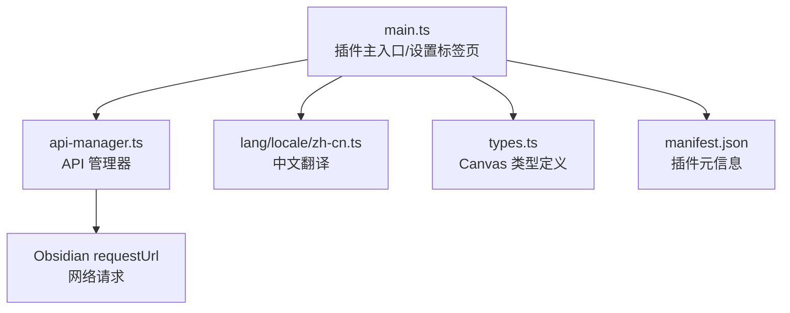
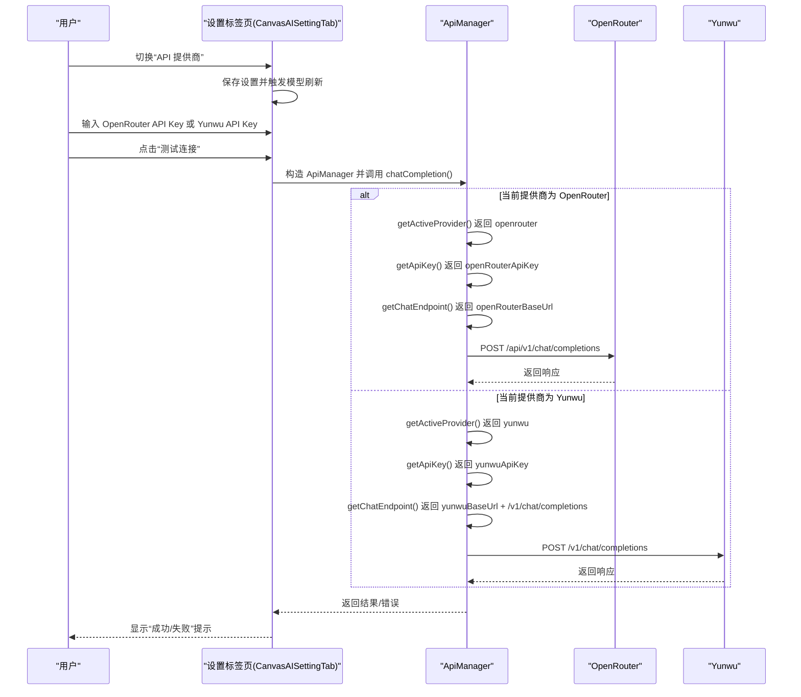
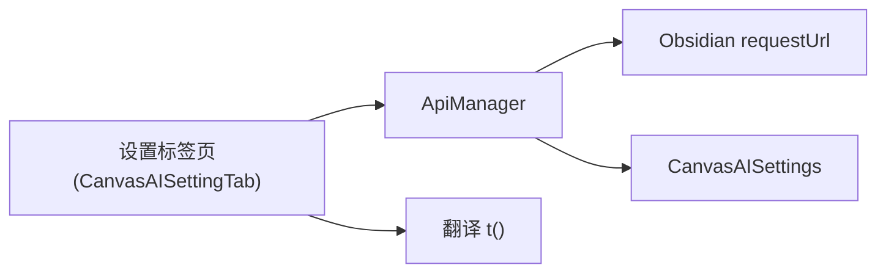

# API 配置

<cite>
**本文引用的文件**
- [main.ts](file://main.ts)
- [api-manager.ts](file://api-manager.ts)
- [lang/locale/zh-cn.ts](file://lang/locale/zh-cn.ts)
- [manifest.json](file://manifest.json)
- [types.ts](file://types.ts)
</cite>

## 目录
1. [简介](#简介)
2. [项目结构](#项目结构)
3. [核心组件](#核心组件)
4. [架构总览](#架构总览)
5. [详细组件分析](#详细组件分析)
6. [依赖关系分析](#依赖关系分析)
7. [性能考虑](#性能考虑)
8. [故障排查指南](#故障排查指南)
9. [结论](#结论)
10. [附录](#附录)

## 简介
本文件面向 Obsidian Canvas Banana 插件的“API 配置”主题，聚焦于如何在 OpenRouter 与 Yunwu 两大 API 提供商之间进行切换与配置。内容涵盖：
- apiProvider 字段的作用与切换方式
- openRouterApiKey 与 yunwuApiKey 的设置要点与安全说明
- openRouterBaseUrl 与 yunwuBaseUrl 的默认值及自定义用途
- 结合 lang/locale/zh-cn.ts 的中文界面标签，帮助用户识别配置项
- 常见配置错误的排查方法与“测试连接”功能的使用

## 项目结构
围绕 API 配置的关键文件与职责如下：
- main.ts：插件主入口，包含 CanvasAISettings 接口、默认配置、设置标签页（CanvasAISettingTab）、以及与 ApiManager 的交互逻辑
- api-manager.ts：统一的 API 管理器，负责根据当前提供商动态选择端点、模型与鉴权头，并封装聊天与图像生成请求
- lang/locale/zh-cn.ts：中文翻译键值，包含“API 提供商”“OpenRouter API Key”等界面文案
- manifest.json：插件元信息（版本、名称等）
- types.ts：Canvas 类型定义（与 API 配置无直接耦合，但对理解上下文有用）

图表来源
- [main.ts](file://main.ts#L1-L120)
- [api-manager.ts](file://api-manager.ts#L1-L120)
- [lang/locale/zh-cn.ts](file://lang/locale/zh-cn.ts#L1-L40)
- [manifest.json](file://manifest.json#L1-L9)
- [types.ts](file://types.ts#L1-L40)

章节来源
- [main.ts](file://main.ts#L1-L120)
- [api-manager.ts](file://api-manager.ts#L1-L120)
- [lang/locale/zh-cn.ts](file://lang/locale/zh-cn.ts#L1-L40)
- [manifest.json](file://manifest.json#L1-L9)
- [types.ts](file://types.ts#L1-L40)

## 核心组件
- CanvasAISettings 接口：定义了 apiProvider、各提供商的 API Key、Base URL、模型配置、图像优化参数、提示词设置、调试开关等字段
- 默认配置 DEFAULT_SETTINGS：初始化时为各字段提供默认值，其中 apiProvider 默认为 openrouter；OpenRouter 的默认 Base URL 与模型已设定；Yunwu 的默认 Base URL 与模型也已设定
- ApiManager：根据当前 apiProvider 动态选择 API Key、端点与模型，封装 chatCompletion、multimodalChat、generateImageWithRoles 等方法，并在请求头中携带必要的 HTTP-Referer 与 X-Title
- CanvasAISettingTab：Obsidian 设置页面，提供“API 提供商”切换、“OpenRouter API Key”“Yunwu API Key”“API Base URL”“Yunwu Base URL”的输入控件，以及“测试连接”按钮

章节来源
- [main.ts](file://main.ts#L9-L83)
- [main.ts](file://main.ts#L54-L83)
- [api-manager.ts](file://api-manager.ts#L71-L142)
- [api-manager.ts](file://api-manager.ts#L102-L112)
- [api-manager.ts](file://api-manager.ts#L114-L135)
- [main.ts](file://main.ts#L1920-L2188)

## 架构总览
下图展示了设置界面与 API 管理器之间的交互流程，以及不同提供商的端点选择逻辑。

图表来源
- [main.ts](file://main.ts#L1920-L2188)
- [api-manager.ts](file://api-manager.ts#L85-L112)
- [api-manager.ts](file://api-manager.ts#L646-L679)

章节来源
- [main.ts](file://main.ts#L1920-L2188)
- [api-manager.ts](file://api-manager.ts#L85-L112)
- [api-manager.ts](file://api-manager.ts#L646-L679)

## 详细组件分析

### 1) apiProvider 字段与切换机制
- 作用：决定当前使用的 API 提供商，取值为 'openrouter' 或 'yunwu'
- 切换方式：设置标签页中通过下拉菜单选择“OpenRouter”或“Yunwu”，变更后立即保存并触发模型列表刷新
- 影响范围：ApiManager 会基于该字段动态选择 API Key、端点与模型

章节来源
- [main.ts](file://main.ts#L9-L18)
- [main.ts](file://main.ts#L1927-L1944)
- [api-manager.ts](file://api-manager.ts#L85-L101)

### 2) OpenRouter 配置项
- openRouterApiKey：OpenRouter 的 API Key，设置标签页提供“测试连接”按钮，输入占位符为 sk-or-v1-...
- openRouterBaseUrl：OpenRouter 的基础 URL，默认值为 https://openrouter.ai/api/v1/chat/completions，可自定义
- openRouterTextModel/openRouterImageModel：文本/图像生成模型 ID，支持手动输入或从模型列表中选择
- openRouterUseCustomTextModel/openRouterUseCustomImageModel：是否启用“手动输入模型名称”

章节来源
- [main.ts](file://main.ts#L11-L28)
- [main.ts](file://main.ts#L54-L83)
- [main.ts](file://main.ts#L1950-L1974)
- [main.ts](file://main.ts#L2042-L2061)
- [api-manager.ts](file://api-manager.ts#L102-L112)

### 3) Yunwu 配置项
- yunwuApiKey：Yunwu 的 API Key，设置标签页提供“测试连接”按钮，输入占位符为 sk-...
- yunwuBaseUrl：Yunwu 的基础 URL，默认值为 https://yunwu.ai，可自定义
- yunwuTextModel/yunwuImageModel：文本/图像生成模型 ID，支持手动输入或从模型列表中选择
- yunwuUseCustomTextModel/yunwuUseCustomImageModel：是否启用“手动输入模型名称”

章节来源
- [main.ts](file://main.ts#L22-L29)
- [main.ts](file://main.ts#L64-L69)
- [main.ts](file://main.ts#L1975-L1999)
- [main.ts](file://main.ts#L2042-L2061)
- [api-manager.ts](file://api-manager.ts#L102-L112)

### 4) 模型列表与“测试连接”
- 模型列表：根据当前提供商访问对应模型端点，解析返回的模型列表，筛选出文本/图像模型并缓存
- “测试连接”：点击后构造临时 ApiManager，调用 chatCompletion 发送一条简短提示，成功则显示“连接成功”，失败则显示具体错误

章节来源
- [main.ts](file://main.ts#L1821-L1880)
- [main.ts](file://main.ts#L2001-L2061)
- [main.ts](file://main.ts#L2137-L2188)
- [api-manager.ts](file://api-manager.ts#L646-L679)

### 5) 界面中文标签对照
以下为设置界面中与 API 配置相关的中文标签，便于用户识别：
- API 配置、API 提供商、选择 API 提供商
- OpenRouter API Key、输入你的 OpenRouter API Key
- API 基础 URL
- 云雾 API Key、输入你的云雾 API Key
- 云雾基础 URL
- 测试连接、正在测试、成功、失败、连接成功、连接失败

章节来源
- [lang/locale/zh-cn.ts](file://lang/locale/zh-cn.ts#L1-L41)
- [main.ts](file://main.ts#L1920-L2188)

### 6) 数据存储与安全性说明
- 插件将设置持久化存储在插件数据文件中（路径在“关于”部分给出），API Key 仅存储在本地
- 由于密钥存储在本地，建议用户：
  - 在受信任设备上使用
  - 定期轮换密钥
  - 不在共享或不受信任的环境中暴露配置

章节来源
- [lang/locale/zh-cn.ts](file://lang/locale/zh-cn.ts#L28-L31)
- [main.ts](file://main.ts#L2126-L2135)

## 依赖关系分析
- 设置标签页依赖 ApiManager 的 isConfigured 与 chatCompletion 方法进行“测试连接”
- ApiManager 依赖 Obsidian 的 requestUrl 发起网络请求，并根据 apiProvider 动态选择端点与鉴权头
- 设置标签页依赖翻译模块 t() 输出中文文案

图表来源
- [main.ts](file://main.ts#L1920-L2188)
- [api-manager.ts](file://api-manager.ts#L646-L679)
- [lang/locale/zh-cn.ts](file://lang/locale/zh-cn.ts#L1-L41)

章节来源
- [main.ts](file://main.ts#L1920-L2188)
- [api-manager.ts](file://api-manager.ts#L646-L679)
- [lang/locale/zh-cn.ts](file://lang/locale/zh-cn.ts#L1-L41)

## 性能考虑
- 模型列表获取采用非阻塞方式，避免阻塞设置界面渲染
- “测试连接”按钮在请求过程中禁用，避免重复点击造成资源浪费
- ApiManager 的请求头包含 HTTP-Referer 与 X-Title，有助于服务端识别来源

章节来源
- [main.ts](file://main.ts#L2005-L2040)
- [main.ts](file://main.ts#L2140-L2188)
- [api-manager.ts](file://api-manager.ts#L646-L679)

## 故障排查指南
- 密钥格式错误
  - 症状：测试连接失败或调用 API 报错
  - 排查：确认输入的 API Key 是否与提供商要求的格式一致（OpenRouter 与 Yunwu 的占位符分别为 sk-or-v1-... 与 sk-...）
  - 建议：在设置界面中重新粘贴密钥并再次点击“测试连接”
- 网络连接问题
  - 症状：测试连接超时或返回 HTTP 错误
  - 排查：检查本地网络连通性，确认未被防火墙拦截；必要时更换 Base URL（OpenRouter 默认为 https://openrouter.ai/api/v1/chat/completions，Yunwu 默认为 https://yunwu.ai）
- 未配置密钥
  - 症状：调用 ApiManager.isConfigured() 返回 false，无法发起请求
  - 排查：在设置界面中填写对应提供商的 API Key
- 模型不可用
  - 症状：模型列表为空或筛选结果为空
  - 排查：点击“刷新模型列表”，若仍为空，可启用“手动输入模型名称”并自行填写模型 ID

章节来源
- [main.ts](file://main.ts#L1950-L1974)
- [main.ts](file://main.ts#L1975-L1999)
- [main.ts](file://main.ts#L2001-L2061)
- [main.ts](file://main.ts#L2137-L2188)
- [api-manager.ts](file://api-manager.ts#L136-L141)

## 结论
- 通过 apiProvider 字段可在 OpenRouter 与 Yunwu 之间无缝切换
- openRouterApiKey 与 yunwuApiKey 仅存储在本地，符合用户隐私与数据安全要求
- openRouterBaseUrl 与 yunwuBaseUrl 提供默认值，用户可根据需要自定义
- 设置界面提供直观的中文标签与“测试连接”功能，便于快速验证配置有效性

## 附录
- 版本信息：参见 manifest.json 中的版本号
- Canvas 类型定义：参见 types.ts，用于理解插件在 Canvas 环境中的运行上下文

章节来源
- [manifest.json](file://manifest.json#L1-L9)
- [types.ts](file://types.ts#L1-L40)