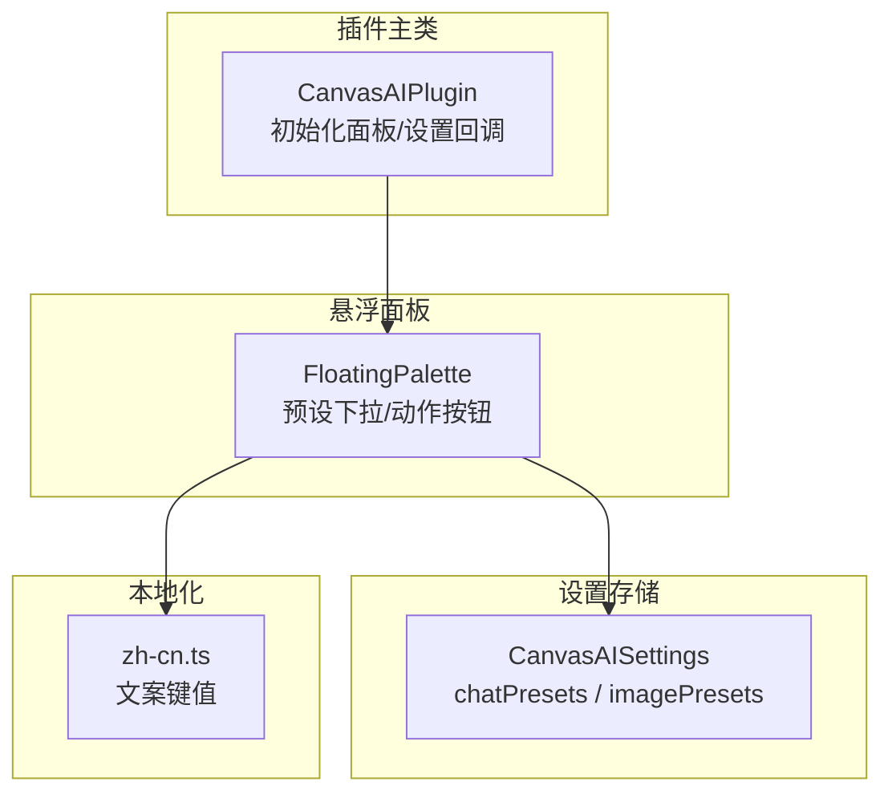
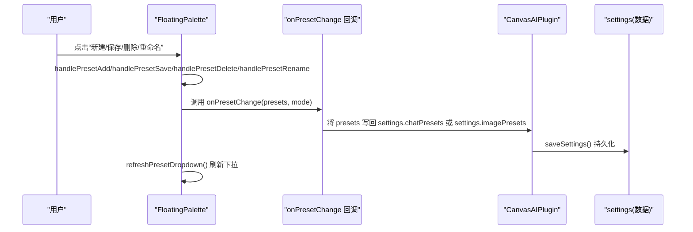
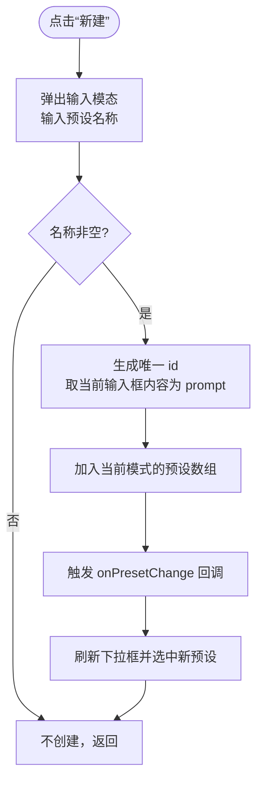
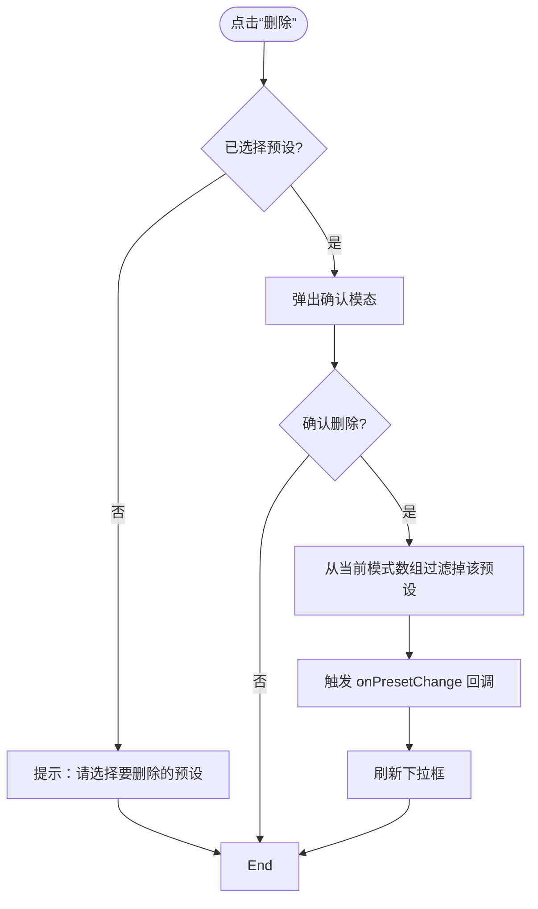
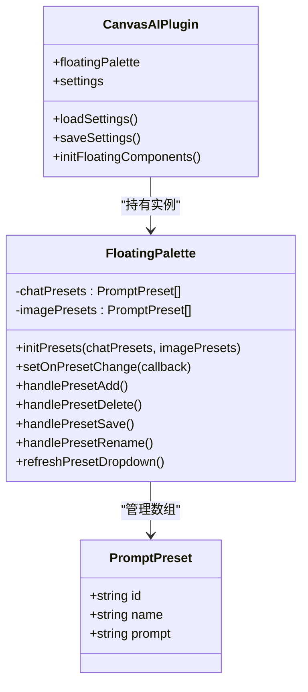

# 提示词预设

<cite>
**本文引用的文件**
- [main.ts](file://main.ts)
- [zh-cn.ts](file://lang/locale/zh-cn.ts)
- [types.ts](file://types.ts)
</cite>

## 目录
1. [简介](#简介)
2. [项目结构](#项目结构)
3. [核心组件](#核心组件)
4. [架构总览](#架构总览)
5. [详细组件分析](#详细组件分析)
6. [依赖关系分析](#依赖关系分析)
7. [性能考量](#性能考量)
8. [故障排查指南](#故障排查指南)
9. [结论](#结论)
10. [附录](#附录)

## 简介
本篇文档围绕“提示词预设”功能展开，系统性说明：
- 预设数据结构：chatPresets 与 imagePresets 数组字段，每个预设包含 id、name、prompt 三要素。
- 用户交互：通过悬浮面板中的“新建”“保存”“删除”“重命名”等按钮进行管理。
- 内部实现：结合 FloatingPalette 类的 handlePresetSave、handlePresetDelete 等方法，解释其行为与持久化流程。
- 翻译一致性：引用 lang/locale/zh-cn.ts 中的“保存”“删除”“重命名预设”等文案，确保界面与实现一致。
- 使用示例：给出创建“头脑风暴”预设的实践建议，帮助高效组织与复用提示词。

## 项目结构
与提示词预设相关的核心位置如下：
- 数据结构与默认值：CanvasAISettings 接口中的 chatPresets 与 imagePresets 字段，以及 DEFAULT_SETTINGS 初始化为空数组。
- 面板与交互：FloatingPalette 类负责渲染悬浮面板、绑定预设下拉与动作按钮、处理新增/删除/保存/重命名。
- 翻译资源：zh-cn.ts 中包含“新建预设”“删除”“保存”“重命名预设”等文案键值。
- 插件集成：CanvasAIPlugin 在初始化时将预设数组与面板联动，并在 onPresetChange 回调中写回设置并持久化。

图表来源
- [main.ts](file://main.ts#L914-L1029)
- [main.ts](file://main.ts#L200-L420)
- [main.ts](file://main.ts#L49-L83)
- [zh-cn.ts](file://lang/locale/zh-cn.ts#L42-L71)

章节来源
- [main.ts](file://main.ts#L49-L83)
- [main.ts](file://main.ts#L200-L420)
- [main.ts](file://main.ts#L914-L1029)
- [zh-cn.ts](file://lang/locale/zh-cn.ts#L42-L71)

## 核心组件
- 预设数据结构
  - PromptPreset 接口：包含 id（字符串）、name（字符串）、prompt（字符串）。
  - CanvasAISettings：包含 chatPresets 与 imagePresets 两个数组字段，默认为空数组。
- 悬浮面板组件
  - FloatingPalette：维护当前模式（chat/image），维护独立的 chatPresets 与 imagePresets 内存副本；提供预设下拉、动作按钮绑定、新增/删除/保存/重命名、初始化与持久化回调。
- 插件集成
  - CanvasAIPlugin：在初始化时设置 onPresetChange 回调，将面板中的预设变更写回 settings 并保存；同时在面板初始化时从 settings 加载预设。

章节来源
- [main.ts](file://main.ts#L86-L92)
- [main.ts](file://main.ts#L49-L83)
- [main.ts](file://main.ts#L232-L236)
- [main.ts](file://main.ts#L998-L1006)
- [main.ts](file://main.ts#L1018-L1022)

## 架构总览
提示词预设在插件中的流转路径如下：
- 面板初始化：从 settings.chatPresets 与 settings.imagePresets 加载到内存副本。
- 用户操作：在面板上对预设进行“新建/保存/删除/重命名”，触发对应方法。
- 持久化：onPresetChange 回调将当前模式下的预设数组写回 settings，并保存至数据文件。
- 界面同步：每次操作后刷新预设下拉框，保持 UI 与数据一致。

图表来源
- [main.ts](file://main.ts#L998-L1006)
- [main.ts](file://main.ts#L1018-L1022)
- [main.ts](file://main.ts#L553-L678)

章节来源
- [main.ts](file://main.ts#L998-L1006)
- [main.ts](file://main.ts#L1018-L1022)
- [main.ts](file://main.ts#L553-L678)

## 详细组件分析

### 预设数据结构与默认值
- PromptPreset
  - id：唯一标识符（字符串）
  - name：显示名称（字符串）
  - prompt：提示词内容（字符串）
- 默认设置
  - chatPresets 与 imagePresets 默认为空数组，首次使用时由用户创建。

章节来源
- [main.ts](file://main.ts#L86-L92)
- [main.ts](file://main.ts#L54-L83)

### 悬浮面板与预设交互
- DOM 与按钮
  - 面板包含预设下拉框与四个动作按钮：“新建”“删除”“保存”“重命名”，图标通过 setIcon 设置。
- 事件绑定
  - 下拉框 change：选中某预设后，将该预设的 prompt 填充到输入框。
  - 动作按钮 click：分别调用 handlePresetAdd、handlePresetDelete、handlePresetSave、handlePresetRename。
- 预设下拉刷新
  - 根据当前模式（chat/image）从对应数组生成下拉项，保持 UI 与内存状态一致。

章节来源
- [main.ts](file://main.ts#L341-L403)
- [main.ts](file://main.ts#L436-L466)
- [main.ts](file://main.ts#L533-L551)

### 新建预设（handlePresetAdd）
- 流程
  - 弹出输入模态，要求输入预设名称。
  - 生成唯一 id（简单生成策略），以当前输入框内容作为初始 prompt。
  - 将新预设推入当前模式对应的内存数组，并触发 onPresetChange 回调。
  - 刷新下拉框并选中新预设。
- 注意
  - 若未输入名称，模态会阻止提交；若输入为空，也不会创建。

图表来源
- [main.ts](file://main.ts#L553-L584)

章节来源
- [main.ts](file://main.ts#L553-L584)

### 删除预设（handlePresetDelete）
- 流程
  - 若未选择预设，提示“请选择要删除的预设”。
  - 弹出确认模态，确认后从当前模式数组中移除该预设，并触发 onPresetChange。
  - 刷新下拉框。
- 注意
  - 仅在当前模式下生效；删除后无法撤销。

图表来源
- [main.ts](file://main.ts#L586-L615)

章节来源
- [main.ts](file://main.ts#L586-L615)

### 保存预设（handlePresetSave）
- 流程
  - 若未选择预设，提示“请选择要保存的预设”。
  - 将当前输入框内容覆盖到所选预设的 prompt 字段。
  - 触发 onPresetChange 回调，并通知“预设已保存”。

章节来源
- [main.ts](file://main.ts#L617-L641)

### 重命名预设（handlePresetRename）
- 流程
  - 若未选择预设，提示“请选择要重命名的预设”。
  - 弹出输入模态，输入新名称并更新预设 name。
  - 触发 onPresetChange 回调，并刷新下拉框，保持选中状态。

章节来源
- [main.ts](file://main.ts#L643-L678)

### 预设初始化与持久化
- 初始化
  - 插件在启动时调用 FloatingPalette.initPresets，将 settings.chatPresets 与 settings.imagePresets 拷贝到面板内存数组，并刷新下拉框。
- 持久化
  - 插件设置 onPresetChange 回调，将面板当前模式的预设数组写回 settings 对应字段，并调用 saveSettings 持久化。

章节来源
- [main.ts](file://main.ts#L1018-L1022)
- [main.ts](file://main.ts#L998-L1006)

### 翻译与界面一致性
- “新建预设”“删除”“保存”“重命名预设”等文案来自 zh-cn.ts，面板按钮标题与模态标题均使用 t() 获取翻译。
- 保证用户界面与实际行为一致，避免文案漂移。

章节来源
- [zh-cn.ts](file://lang/locale/zh-cn.ts#L42-L71)
- [main.ts](file://main.ts#L341-L403)

## 依赖关系分析
- 组件耦合
  - FloatingPalette 与 CanvasAIPlugin 通过 onPresetChange 回调解耦：面板只负责 UI 与内存状态，插件负责持久化。
  - 面板内部维护 chatPresets 与 imagePresets 两套内存数组，避免与 settings 直接耦合。
- 外部依赖
  - 语言包 zh-cn.ts 提供文案键值。
  - Obsidian API（Modal、Notice、Scope 等）用于模态与通知。

图表来源
- [main.ts](file://main.ts#L914-L1029)
- [main.ts](file://main.ts#L232-L236)
- [main.ts](file://main.ts#L86-L92)

章节来源
- [main.ts](file://main.ts#L914-L1029)
- [main.ts](file://main.ts#L232-L236)
- [main.ts](file://main.ts#L86-L92)

## 性能考量
- 预设数组规模
  - 当前实现为简单数组，查找/过滤为 O(n)，适合小到中等规模预设集。
- UI 刷新
  - 每次操作后刷新下拉框，复杂度 O(n)；在预设数量较多时可考虑虚拟滚动或缓存 DOM。
- 生成 id
  - 当前采用时间戳与随机串拼接，冲突概率低；若需更强唯一性，可引入更稳健的 UUID 生成策略。

[本节为通用建议，无需特定文件来源]

## 故障排查指南
- 问题：点击“删除”无反应
  - 检查是否选择了预设；若未选择，面板会提示“请选择要删除的预设”。
- 问题：点击“保存”无效
  - 检查是否选择了预设；若未选择，面板会提示“请选择要保存的预设”。
- 问题：重命名后下拉未更新
  - 确认 onPresetChange 是否被触发；检查插件是否正确写回 settings 并保存。
- 问题：新建预设未出现
  - 确认 onPresetChange 是否被触发；检查面板是否刷新了下拉框并选中新预设。

章节来源
- [main.ts](file://main.ts#L586-L615)
- [main.ts](file://main.ts#L617-L641)
- [main.ts](file://main.ts#L643-L678)
- [main.ts](file://main.ts#L998-L1006)

## 结论
提示词预设功能通过简洁的数据结构与清晰的交互流程，实现了高效的提示词管理与复用。FloatingPalette 负责 UI 与内存状态，CanvasAIPlugin 负责持久化，二者通过回调解耦协作。配合 zh-cn.ts 的统一文案，确保用户体验一致。建议在大规模预设场景下关注 UI 刷新与 id 唯一性优化。

[本节为总结，无需特定文件来源]

## 附录

### 使用示例：创建“头脑风暴”预设
- 步骤
  - 在悬浮面板中切换到“文本”模式。
  - 在输入框中输入“请基于上下文提出5个创新想法”。
  - 点击“新建”，输入预设名称（如“头脑风暴”）。
  - 预设创建成功后，可在下拉中直接选择该预设，一键带入提示词。
- 最佳实践
  - 为不同工作流建立专用预设（如“创意写作”“技术评审”“知识整理”）。
  - 使用“保存”更新已有预设，避免重复创建。
  - 使用“重命名”规范命名，便于检索。
  - 使用“删除”清理不再使用的预设，保持列表整洁。

章节来源
- [main.ts](file://main.ts#L553-L584)
- [main.ts](file://main.ts#L617-L641)
- [main.ts](file://main.ts#L643-L678)