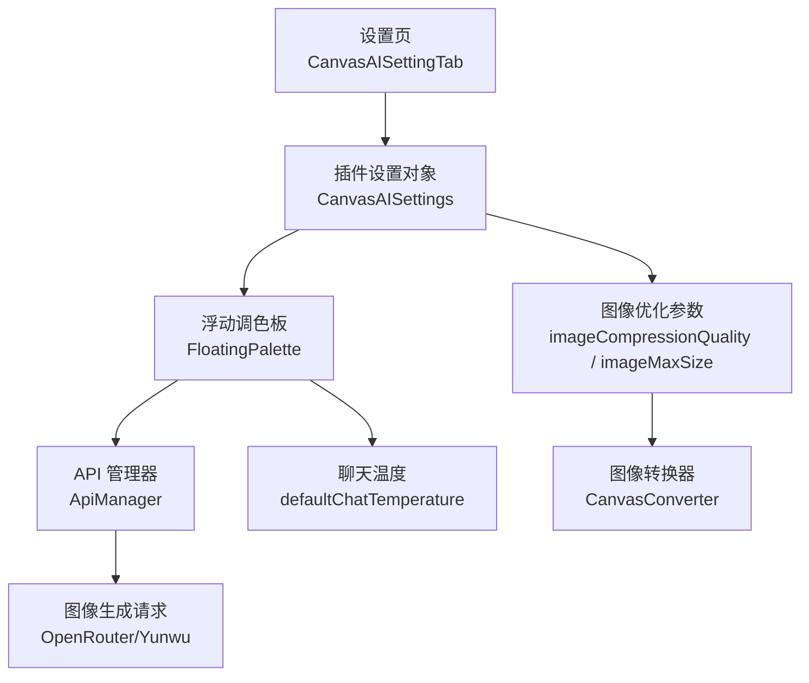
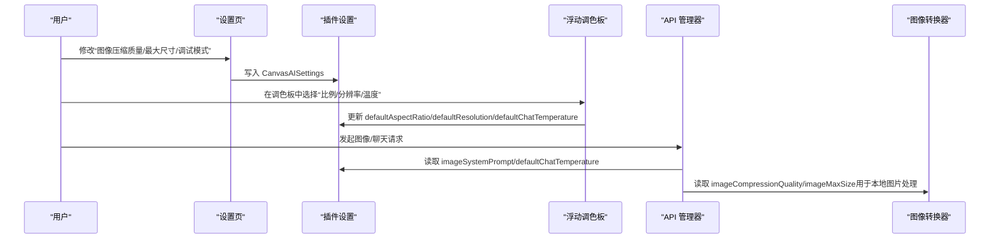
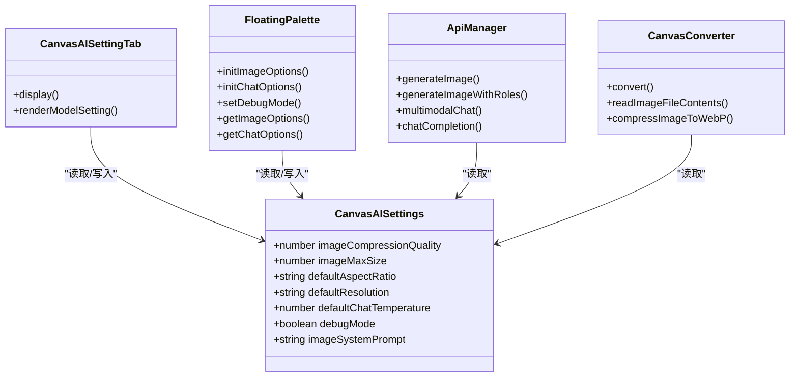

# 通用设置

<cite>
**本文引用的文件**
- [main.ts](file://main.ts)
- [api-manager.ts](file://api-manager.ts)
- [canvas-converter.ts](file://canvas-converter.ts)
- [lang/locale/zh-cn.ts](file://lang/locale/zh-cn.ts)
- [lang/locale/en.ts](file://lang/locale/en.ts)
</cite>

## 目录
1. [简介](#简介)
2. [项目结构](#项目结构)
3. [核心组件](#核心组件)
4. [架构总览](#架构总览)
5. [详细组件分析](#详细组件分析)
6. [依赖关系分析](#依赖关系分析)
7. [性能考量](#性能考量)
8. [故障排查指南](#故障排查指南)
9. [结论](#结论)
10. [附录](#附录)

## 简介
本章节聚焦“通用设置”部分，围绕图像输出与生成参数进行系统化说明，包括：
- 图像压缩质量与最大尺寸对输出图像质量与体积的影响
- 默认画布比例与分辨率如何影响图像生成的默认行为
- 默认聊天温度对 AI 回答创造性与随机性的影响及合理取值建议
- 调试模式开关的作用与使用方式
- 术语一致性与最佳实践建议

## 项目结构
通用设置位于插件主模块中，通过设置页提供可视化配置；同时在运行时由浮动调色板与 API 管理器共同消费这些设置，以控制图像生成与聊天行为。

图表来源
- [main.ts](file://main.ts#L1801-L2269)
- [api-manager.ts](file://api-manager.ts#L1-L679)
- [canvas-converter.ts](file://canvas-converter.ts#L350-L549)

章节来源
- [main.ts](file://main.ts#L1801-L2269)
- [api-manager.ts](file://api-manager.ts#L1-L679)
- [canvas-converter.ts](file://canvas-converter.ts#L350-L549)

## 核心组件
- 设置项定义与默认值
  - 图像压缩质量：数值型，范围 1-100，默认 80
  - 图像最大尺寸：数值型，单位像素，默认 2048
  - 默认画布比例：字符串，如 1:1、16:9、4:3、9:16 等
  - 默认分辨率：字符串，如 1K、2K、4K
  - 默认聊天温度：数值型，范围 0-2，默认 0.5
  - 调试模式：布尔值，默认 false
- 设置页 UI
  - 提供滑杆与文本框分别配置图像压缩质量与最大尺寸
  - 提供开关控制调试模式
- 运行时消费
  - 浮动调色板将用户在调色板中选择的比例与分辨率写回设置
  - API 管理器在图像生成时读取系统提示词与聊天温度
  - 图像转换器在读取本地图片时按设置进行 WebP 压缩与尺寸缩放

章节来源
- [main.ts](file://main.ts#L36-L83)
- [main.ts](file://main.ts#L2062-L2135)
- [main.ts](file://main.ts#L986-L1029)
- [api-manager.ts](file://api-manager.ts#L200-L275)
- [api-manager.ts](file://api-manager.ts#L287-L398)
- [canvas-converter.ts](file://canvas-converter.ts#L350-L463)

## 架构总览
通用设置贯穿“设置页 -> 插件设置 -> 浮动调色板 -> API 管理器”的链路，图像优化参数还被图像转换器用于本地图片处理。

图表来源
- [main.ts](file://main.ts#L2062-L2135)
- [main.ts](file://main.ts#L986-L1029)
- [api-manager.ts](file://api-manager.ts#L287-L398)
- [canvas-converter.ts](file://canvas-converter.ts#L350-L463)

## 详细组件分析

### 图像压缩质量（imageCompressionQuality）
- 数值范围与默认值
  - 范围：1-100
  - 默认：80
- 影响
  - 控制输出图像的压缩强度，直接影响体积与清晰度
  - 值越高，体积越小、清晰度越高；值越低，体积越大、清晰度越低
- 运行机制
  - 设置页提供滑杆，实时写入设置对象
  - 图像转换器在读取本地图片时按该质量进行 WebP 压缩
- 术语一致性
  - 界面词条：“图像压缩质量”

章节来源
- [main.ts](file://main.ts#L2062-L2075)
- [canvas-converter.ts](file://canvas-converter.ts#L350-L463)
- [lang/locale/zh-cn.ts](file://lang/locale/zh-cn.ts#L21-L23)

### 图像最大尺寸（imageMaxSize）
- 数值范围与默认值
  - 必须为正数
  - 默认：2048（像素）
- 影响
  - 控制输出图像的最大宽度/高度，保证不超过设定值
  - 超过设定值时会按比例缩放，维持纵横比
- 运行机制
  - 设置页提供文本框，输入校验后写入设置对象
  - 图像转换器在读取本地图片时按该尺寸上限进行缩放
- 术语一致性
  - 界面词条：“图像最大尺寸”

章节来源
- [main.ts](file://main.ts#L2077-L2090)
- [canvas-converter.ts](file://canvas-converter.ts#L404-L463)
- [lang/locale/zh-cn.ts](file://lang/locale/zh-cn.ts#L22-L24)

### 默认画布比例（defaultAspectRatio）
- 支持的比例
  - 1:1、2:3、3:2、3:4、4:3、4:5、5:4、9:16、16:9、21:9
- 影响
  - 作为图像生成的默认纵横比，影响生成图像的宽高比
  - 调色板中用户可随时覆盖该默认值
- 运行机制
  - 设置页初始化时读取默认值
  - 浮动调色板在图像模式下展示比例选择，并将用户选择写回设置
  - API 管理器在发送图像生成请求时携带该比例（OpenRouter/Yunwu）
- 术语一致性
  - 界面词条：“比例”

章节来源
- [main.ts](file://main.ts#L39-L40)
- [main.ts](file://main.ts#L1009-L1016)
- [main.ts](file://main.ts#L467-L477)
- [api-manager.ts](file://api-manager.ts#L200-L275)
- [api-manager.ts](file://api-manager.ts#L308-L398)
- [lang/locale/zh-cn.ts](file://lang/locale/zh-cn.ts#L48-L49)

### 默认分辨率（defaultResolution）
- 支持的分辨率
  - 1K、2K、4K
- 影响
  - 作为图像生成的默认分辨率，影响生成图像的像素规模
  - 调色板中用户可随时覆盖该默认值
- 运行机制
  - 设置页初始化时读取默认值
  - 浮动调色板在图像模式下展示分辨率选择，并将用户选择写回设置
  - API 管理器在发送图像生成请求时携带该分辨率
- 术语一致性
  - 界面词条：“分辨率”

章节来源
- [main.ts](file://main.ts#L40-L41)
- [main.ts](file://main.ts#L1009-L1016)
- [main.ts](file://main.ts#L467-L477)
- [api-manager.ts](file://api-manager.ts#L308-L398)
- [lang/locale/zh-cn.ts](file://lang/locale/zh-cn.ts#L48-L49)

### 默认聊天温度（defaultChatTemperature）
- 数值范围与默认值
  - 范围：0-2
  - 默认：0.5
- 影响
  - 控制聊天回答的随机性与创造性
  - 值越低，回答越保守、稳定；值越高，回答越发散、多变
- 运行机制
  - 设置页初始化时读取默认值
  - 浮动调色板在聊天模式下展示温度输入，并将用户输入写回设置
  - API 管理器在聊天与多模态对话时读取该温度
- 术语一致性
  - 界面词条：“温度”
- 合理取值建议
  - 平衡点：0.5
  - 需要稳定答案：0.3-0.4
  - 需要创意灵感：0.6-0.8
  - 需要探索性回答：0.8-1.0

章节来源
- [main.ts](file://main.ts#L41-L41)
- [main.ts](file://main.ts#L1014-L1016)
- [main.ts](file://main.ts#L416-L434)
- [api-manager.ts](file://api-manager.ts#L149-L191)
- [api-manager.ts](file://api-manager.ts#L580-L644)
- [lang/locale/zh-cn.ts](file://lang/locale/zh-cn.ts#L49-L50)

### 调试模式（debugMode）
- 行为
  - 开启后，浮动调色板显示“调试”按钮
  - 插件在关键流程打印调试日志（如请求体、响应、错误等）
- 运行机制
  - 设置页提供开关，写入设置对象
  - 插件启动时根据设置初始化调色板的调试按钮可见性
- 术语一致性
  - 界面词条：“调试模式”

章节来源
- [main.ts](file://main.ts#L43-L44)
- [main.ts](file://main.ts#L2116-L2124)
- [main.ts](file://main.ts#L1024-L1026)
- [api-manager.ts](file://api-manager.ts#L173-L187)
- [api-manager.ts](file://api-manager.ts#L212-L272)
- [api-manager.ts](file://api-manager.ts#L374-L395)
- [api-manager.ts](file://api-manager.ts#L462-L535)
- [lang/locale/zh-cn.ts](file://lang/locale/zh-cn.ts#L26-L28)

## 依赖关系分析
- 设置页与设置对象
  - 设置页负责渲染与持久化 CanvasAISettings
- 浮动调色板与设置对象
  - 调色板读取设置对象的默认值进行初始化
  - 用户交互变更写回设置对象并持久化
- API 管理器与设置对象
  - 图像生成请求携带比例与分辨率
  - 聊天请求携带系统提示词与温度
- 图像转换器与设置对象
  - 读取压缩质量与最大尺寸，对本地图片进行 WebP 压缩与尺寸缩放

图表来源
- [main.ts](file://main.ts#L36-L83)
- [main.ts](file://main.ts#L1801-L2269)
- [main.ts](file://main.ts#L986-L1029)
- [api-manager.ts](file://api-manager.ts#L1-L679)
- [canvas-converter.ts](file://canvas-converter.ts#L350-L549)

章节来源
- [main.ts](file://main.ts#L36-L83)
- [main.ts](file://main.ts#L1801-L2269)
- [api-manager.ts](file://api-manager.ts#L1-L679)
- [canvas-converter.ts](file://canvas-converter.ts#L350-L549)

## 性能考量
- 图像压缩质量与最大尺寸
  - 更高的压缩质量与更大的尺寸会增加网络传输与存储成本
  - 建议在保证可接受清晰度的前提下适度降低质量或尺寸
- 聊天温度
  - 更高的温度会增加模型生成的多样性，但也可能带来不稳定与更长的响应时间
- 调试模式
  - 开启调试模式会输出大量日志，建议仅在排查问题时开启

## 故障排查指南
- 调试模式启用后
  - 查看控制台输出，关注请求体、响应与错误信息
  - 若出现图像生成失败，检查比例与分辨率是否符合服务端要求
- 常见问题
  - API 未配置：检查设置页中的 API Key 与基础 URL
  - 图像尺寸异常：确认最大尺寸设置是否过大导致缩放不明显
  - 聊天回答过于随机：适当降低温度
- 术语一致性参考
  - “图像压缩质量”、“图像最大尺寸”、“温度”、“调试模式”

章节来源
- [main.ts](file://main.ts#L2116-L2124)
- [api-manager.ts](file://api-manager.ts#L149-L191)
- [api-manager.ts](file://api-manager.ts#L212-L272)
- [api-manager.ts](file://api-manager.ts#L374-L395)
- [api-manager.ts](file://api-manager.ts#L462-L535)
- [lang/locale/zh-cn.ts](file://lang/locale/zh-cn.ts#L21-L28)

## 结论
通用设置提供了对图像输出质量与尺寸、图像生成默认比例与分辨率、聊天温度以及调试模式的集中管理。通过合理的参数组合，可以在清晰度、体积、响应稳定性与创造性之间取得平衡。建议在需要高质量图像时提高压缩质量并在必要时提升分辨率；在追求稳定与可控时降低温度；在排查问题时开启调试模式。

## 附录
- 术语对照（简体中文）
  - 图像压缩质量：imageCompressionQuality
  - 图像最大尺寸：imageMaxSize
  - 比例：defaultAspectRatio
  - 分辨率：defaultResolution
  - 温度：defaultChatTemperature
  - 调试模式：debugMode
- 术语对照（英文）
  - Image Compression Quality、Image Max Size、Ratio、Resolution、Temperature、Debug Mode

章节来源
- [lang/locale/zh-cn.ts](file://lang/locale/zh-cn.ts#L21-L28)
- [lang/locale/en.ts](file://lang/locale/en.ts#L21-L28)