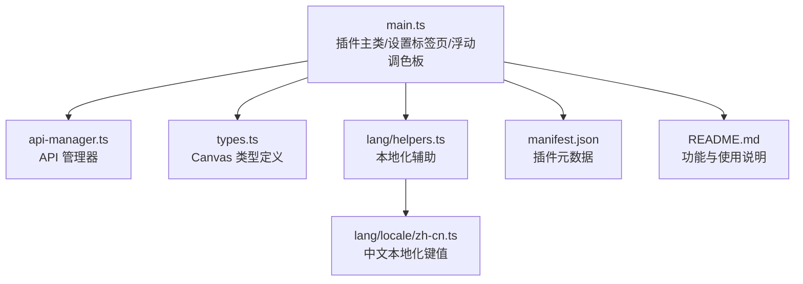
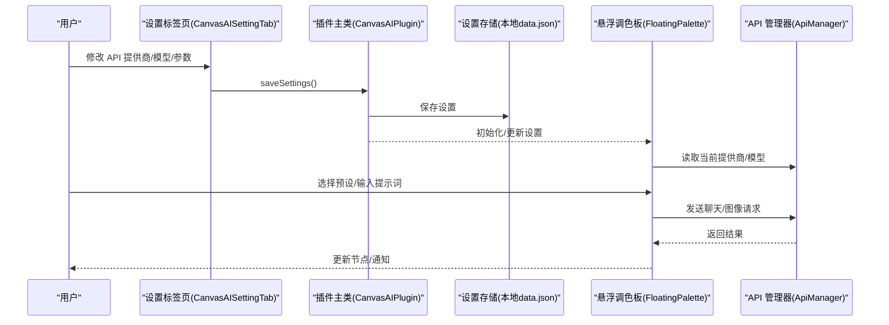
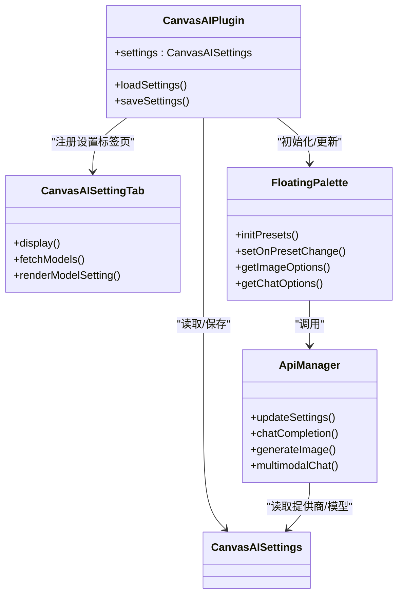
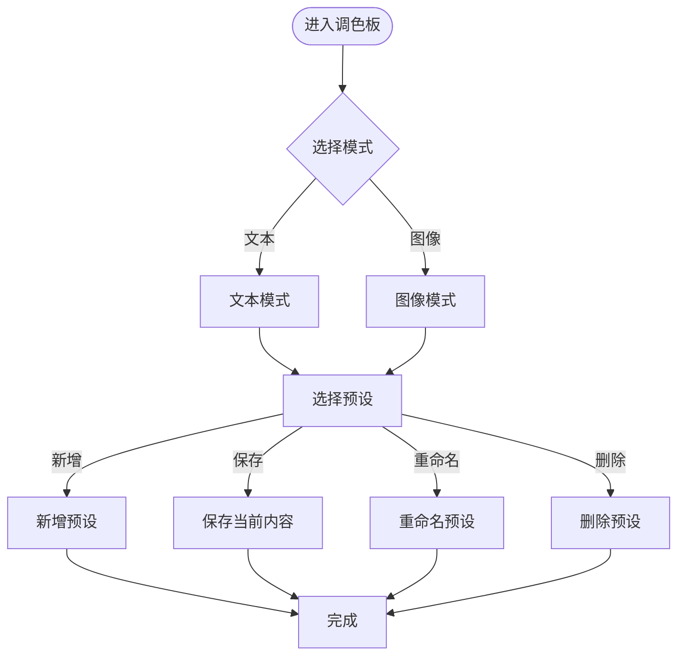
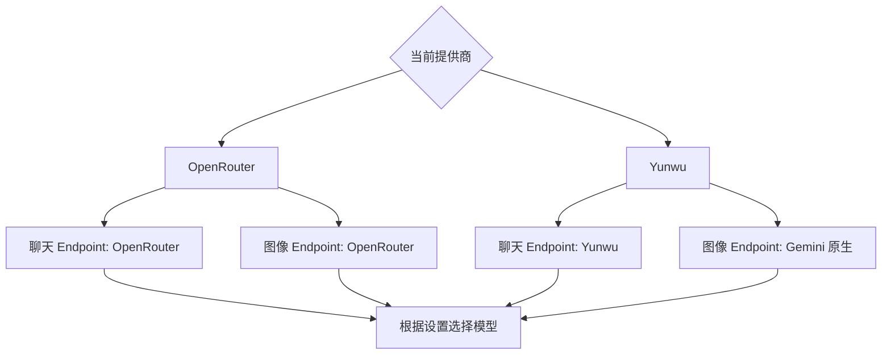

# 配置与设置

<cite>
**本文引用的文件**
- [main.ts](file://main.ts)
- [api-manager.ts](file://api-manager.ts)
- [types.ts](file://types.ts)
- [manifest.json](file://manifest.json)
- [lang/helpers.ts](file://lang/helpers.ts)
- [lang/locale/zh-cn.ts](file://lang/locale/zh-cn.ts)
- [README.md](file://README.md)
</cite>

## 目录
1. [简介](#简介)
2. [项目结构](#项目结构)
3. [核心组件](#核心组件)
4. [架构总览](#架构总览)
5. [详细组件分析](#详细组件分析)
6. [依赖关系分析](#依赖关系分析)
7. [性能考量](#性能考量)
8. [故障排查指南](#故障排查指南)
9. [结论](#结论)
10. [附录](#附录)

## 简介
本章节面向 Obsidian 用户，系统性梳理 Canvas Banana 插件在 Obsidian 设置中提供的全部配置项与自定义选项，覆盖以下主题：
- API 提供商管理：添加、切换、删除（通过切换提供商实现）
- 模型 ID 自定义：文本与图像模型的下拉与手动输入两种模式
- API Key 的安全存储：强调仅保存在本地
- 提示词预设（Prompt Presets）管理：保存、重命名、删除、调用
- 通用设置：图像输出路径（根目录、当前文件夹、附件文件夹、自定义路径）、默认系统提示词等
- 多语言支持：基于语言映射与键值表的实现方式
- 最佳实践：如何选择合适模型与管理配额

## 项目结构
插件采用 Obsidian 原生插件结构，关键文件职责如下：
- main.ts：插件主入口、设置标签页、浮动调色板、提示词预设管理、设置持久化
- api-manager.ts：API 管理器，封装 OpenRouter/Yunwu 的请求与响应解析
- types.ts：Canvas 类型定义，便于与 Obsidian Canvas API 协作
- manifest.json：插件元数据（版本、最小 App 版本、描述等）
- lang/helpers.ts：本地化辅助函数，按当前语言返回对应文案
- lang/locale/zh-cn.ts：中文本地化键值表
- README.md：功能概览与使用说明

图表来源
- [main.ts](file://main.ts#L1-L120)
- [api-manager.ts](file://api-manager.ts#L1-L120)
- [types.ts](file://types.ts#L1-L60)
- [lang/helpers.ts](file://lang/helpers.ts#L1-L45)
- [lang/locale/zh-cn.ts](file://lang/locale/zh-cn.ts#L1-L81)
- [manifest.json](file://manifest.json#L1-L9)
- [README.md](file://README.md#L1-L101)

章节来源
- [main.ts](file://main.ts#L1-L120)
- [manifest.json](file://manifest.json#L1-L9)

## 核心组件
- CanvasAISettings：插件设置接口，包含 API 提供商、各提供商的 API Key 与基础 URL、文本/图像模型、是否使用自定义模型、图像压缩质量与最大尺寸、默认纵横比/分辨率/聊天温度、调试模式、图像系统提示词、提示词预设等
- CanvasAISettingTab：Obsidian 设置标签页，提供 API 提供商切换、API Key 输入、模型列表刷新、模型选择/手动输入切换、图像优化参数、提示词系统提示词、调试模式、关于信息与连接测试
- FloatingPalette：悬浮调色板，负责文本/图像模式切换、图像选项（纵横比/分辨率）、聊天温度、提示词预设的保存/重命名/删除/调用
- ApiManager：统一的 API 管理器，根据当前提供商动态选择 Endpoint、模型与参数，封装聊天、图像生成、多模态聊天等请求

章节来源
- [main.ts](file://main.ts#L1-L120)
- [main.ts](file://main.ts#L1801-L2269)
- [main.ts](file://main.ts#L200-L420)
- [api-manager.ts](file://api-manager.ts#L1-L120)

## 架构总览
下图展示设置标签页与调色板如何读取/写入设置，并通过 ApiManager 与外部 API 交互。

图表来源
- [main.ts](file://main.ts#L1801-L2269)
- [main.ts](file://main.ts#L914-L1030)
- [api-manager.ts](file://api-manager.ts#L1-L120)

## 详细组件分析

### 设置标签页（CanvasAISettingTab）
- API 提供商管理
  - 支持在 OpenRouter 与 Yunwu 之间切换；切换后会触发模型列表刷新与界面重绘
  - 分别提供 API Key 与基础 URL 的输入框，并内置“测试连接”按钮，用于验证配置有效性
- 模型配置
  - 支持从远端模型列表刷新，自动过滤文本/图像模型
  - 提供“手动输入模型名”开关，可在无可用模型或需要自定义时启用文本输入
  - 文本/图像模型分别独立配置，且与提供商绑定
- 图像优化
  - 图像压缩质量（百分比）、最大尺寸（像素）
- 提示词设置
  - 图像系统提示词（用于图像生成时的系统角色设定）
- 开发者选项
  - 调试模式开关
- 关于
  - 插件描述与数据存储位置说明（本地 data.json）

章节来源
- [main.ts](file://main.ts#L1801-L2269)

### 浮动调色板（FloatingPalette）
- 模式与选项
  - 文本/图像双标签页；图像模式提供纵横比与分辨率选择；聊天模式提供温度调节
- 提示词预设管理
  - 下拉选择、新增、保存、重命名、删除
  - 预设数据保存在设置中，随设置持久化
- 生成流程
  - 生成前检查 API 配置；调用 ApiManager 执行请求；文本模式创建文本节点，图像模式保存图片并替换为图片节点

章节来源
- [main.ts](file://main.ts#L200-L420)
- [main.ts](file://main.ts#L420-L760)

### API 管理器（ApiManager）
- 动态选择提供商与 Endpoint
  - OpenRouter：聊天与图像均走 OpenAI 兼容格式
  - Yunwu：聊天兼容，图像生成使用 Gemini 原生格式与不同 Endpoint
- 请求封装
  - 聊天补全、图像生成（含角色标注参考）、多模态聊天
  - 统一鉴权头、错误处理与响应解析
- 模型选择
  - 根据当前提供商与设置返回对应模型 ID

章节来源
- [api-manager.ts](file://api-manager.ts#L1-L120)
- [api-manager.ts](file://api-manager.ts#L120-L320)
- [api-manager.ts](file://api-manager.ts#L320-L679)

### 多语言支持（lang/helpers.ts 与 zh-cn.ts）
- 语言映射
  - 依据当前 Obsidian 语言环境选择对应字典；若未匹配，默认回退到英文
  - 中文映射包含简体与繁体前缀的兼容
- 键值表
  - zh-cn.ts 提供设置标题、API 配置、模型配置、图像优化、提示词设置、开发者选项、关于等键值
- 使用方式
  - 在设置标签页与调色板中通过 t() 函数获取本地化文案

章节来源
- [lang/helpers.ts](file://lang/helpers.ts#L1-L45)
- [lang/locale/zh-cn.ts](file://lang/locale/zh-cn.ts#L1-L81)

## 依赖关系分析
- 插件主类依赖设置标签页与浮动调色板，二者共享同一份 CanvasAISettings
- ApiManager 依赖 CanvasAISettings 以决定提供商、模型与 Endpoint
- 本地化模块为设置标签页与调色板提供文案支撑
- Canvas 类型定义服务于与 Obsidian Canvas 的交互

图表来源
- [main.ts](file://main.ts#L914-L1030)
- [main.ts](file://main.ts#L1801-L2269)
- [main.ts](file://main.ts#L200-L420)
- [api-manager.ts](file://api-manager.ts#L1-L120)

章节来源
- [main.ts](file://main.ts#L914-L1030)
- [api-manager.ts](file://api-manager.ts#L1-L120)

## 性能考量
- 多任务并发：调色板支持“发射后不管”，可同时发起多个生成任务，减少等待时间
- 模型列表缓存：设置标签页在一次会话内缓存模型列表，避免频繁网络请求
- 图像优化：通过压缩质量与最大尺寸参数控制输出体积，兼顾质量与传输效率

章节来源
- [main.ts](file://main.ts#L1030-L1150)
- [main.ts](file://main.ts#L1801-L2000)

## 故障排查指南
- API Key 未配置
  - 现象：调用生成时报错或无法发起请求
  - 处理：在设置中填写对应提供商的 API Key，并使用“测试连接”验证
- 模型列表为空
  - 现象：模型下拉为空或提示暂无可选模型
  - 处理：点击“刷新模型列表”，或开启“手动输入模型名”后自行填写模型 ID
- 图像生成失败
  - 现象：返回文本而非图像或报错
  - 处理：检查图像系统提示词、纵横比/分辨率设置；确认提供商支持图像输出；查看调试日志
- 预设无法保存/删除
  - 现象：提示未选择预设或保存无效
  - 处理：先在下拉中选择目标预设，再执行保存/删除/重命名操作

章节来源
- [main.ts](file://main.ts#L1801-L2269)
- [api-manager.ts](file://api-manager.ts#L120-L320)

## 结论
本插件在 Obsidian 设置中提供了完善的配置体系：支持多家 API 提供商切换、模型 ID 自定义、本地安全存储 API Key、丰富的图像生成参数、以及直观的提示词预设管理。配合浮动调色板与本地化支持，用户可以高效地在 Canvas 中进行智能对话与图像生成。

## 附录

### Obsidian 设置中的可用配置项清单
- API 配置
  - API 提供商：OpenRouter / Yunwu
  - OpenRouter API Key 与基础 URL
  - Yunwu API Key 与基础 URL
  - 测试连接：验证配置有效性
- 模型配置
  - 文本生成模型：支持下拉选择或手动输入
  - 图像生成模型：支持下拉选择或手动输入
  - 刷新模型列表：从远端获取可用模型
- 图像优化
  - 图像压缩质量（百分比）
  - 图像最大尺寸（像素）
- 提示词设置
  - 图像系统提示词：用于图像生成时的角色设定
- 开发者选项
  - 调试模式：开启后可在调色板中触发调试输出
- 关于
  - 插件描述与数据存储位置说明

章节来源
- [main.ts](file://main.ts#L1801-L2269)

### 提示词预设（Prompt Presets）管理流程

图表来源
- [main.ts](file://main.ts#L200-L420)

### API 提供商与模型选择逻辑

图表来源
- [api-manager.ts](file://api-manager.ts#L120-L320)

### 多语言支持实现要点
- 语言检测：基于当前 Obsidian 语言环境
- 字典映射：en 为源，zh-cn 为中文映射
- 回退策略：未命中时回退到英文键值
- 使用方式：在设置与 UI 中通过 t() 获取本地化文案

章节来源
- [lang/helpers.ts](file://lang/helpers.ts#L1-L45)
- [lang/locale/zh-cn.ts](file://lang/locale/zh-cn.ts#L1-L81)

### 数据存储与安全
- 数据存储位置：.obsidian/plugins/obsidian-canvas-ai/data.json
- API Key 存储：仅保存在本地，插件不会上传至任何服务器
- 隐私提示：对话内容会发送至第三方 API 服务商进行处理

章节来源
- [lang/locale/zh-cn.ts](file://lang/locale/zh-cn.ts#L28-L40)
- [main.ts](file://main.ts#L2126-L2135)

### 图像输出路径与默认系统提示词
- 图像输出路径
  - 插件会在知识库根目录创建“Canvas Images”文件夹，并将生成的图片保存到该目录
- 默认系统提示词
  - 图像系统提示词可在设置中修改，用于图像生成时的角色设定

章节来源
- [main.ts](file://main.ts#L1152-L1207)
- [main.ts](file://main.ts#L2092-L2112)

### 最佳实践建议
- 选择合适的模型
  - 文本生成优先选择支持文本输出的模型；图像生成优先选择同时支持图像输出的模型
  - 若远端模型列表不可用，可开启“手动输入模型名”并填写已知可用模型 ID
- 管理 API 配额
  - 合理设置图像压缩质量与最大尺寸，降低传输与存储成本
  - 使用“测试连接”定期验证配置有效性，避免因密钥失效导致失败
- 提示词预设
  - 将常用提示词保存为预设，提高重复任务的效率
  - 为不同场景维护多套预设，提升一致性与可复用性

章节来源
- [main.ts](file://main.ts#L1801-L2269)
- [README.md](file://README.md#L64-L101)