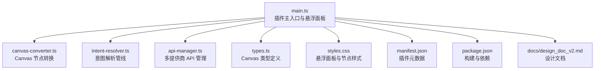
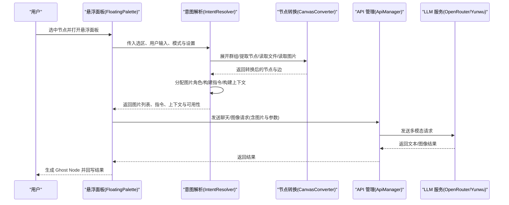
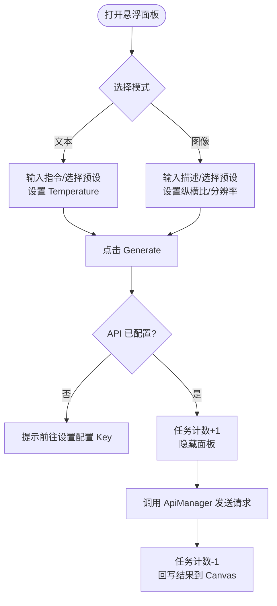
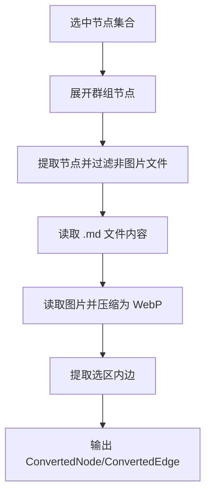
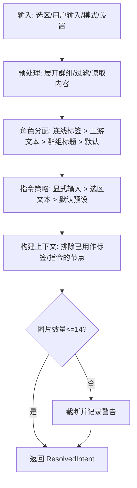
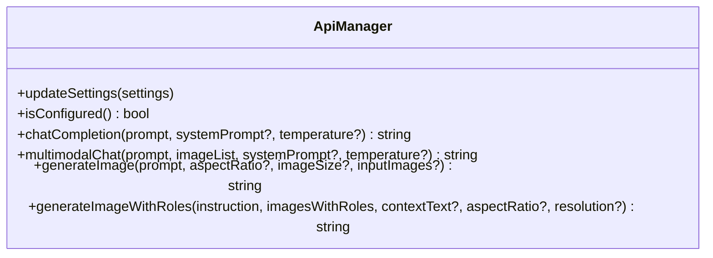
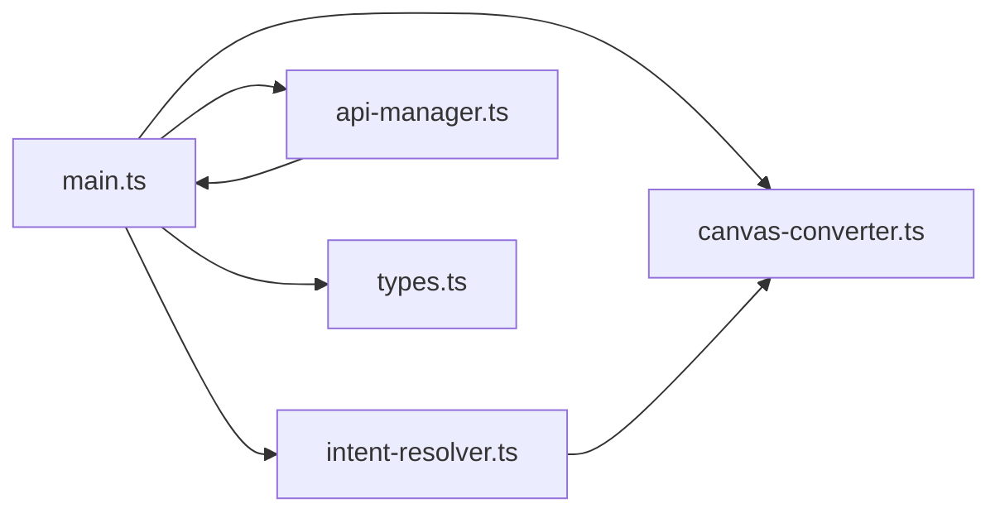

# 项目概述

<cite>
**本文引用的文件**
- [README.md](file://README.md)
- [main.ts](file://main.ts)
- [canvas-converter.ts](file://canvas-converter.ts)
- [intent-resolver.ts](file://intent-resolver.ts)
- [api-manager.ts](file://api-manager.ts)
- [types.ts](file://types.ts)
- [styles.css](file://styles.css)
- [manifest.json](file://manifest.json)
- [package.json](file://package.json)
- [docs/design_doc_v2.md](file://docs/design_doc_v2.md)
</cite>

## 目录
1. [简介](#简介)
2. [项目结构](#项目结构)
3. [核心组件](#核心组件)
4. [架构总览](#架构总览)
5. [详细组件分析](#详细组件分析)
6. [依赖关系分析](#依赖关系分析)
7. [性能考量](#性能考量)
8. [故障排查指南](#故障排查指南)
9. [结论](#结论)
10. [附录](#附录)

## 简介
ObsidianCanvasAI（插件名称：Canvas Banana）是一个专为 Obsidian Canvas（白板）视图打造的 AI 增强插件，深度集成 Gemini 等多模态模型，将“节点感知”的理念贯穿到交互与工作流中。其核心目标是：
- 基于选中节点（文本、图片、文件、链接、群组）构建上下文，实现智能对话、文本生成与图像生成；
- 通过“悬浮面板”提供高效、低摩擦的交互体验；
- 支持多任务并发、提示词预设、多 API 提供商（OpenRouter、Yunwu 等）与灵活的图像生成参数（纵横比、分辨率）。

该插件强调“节点感知”：将 Canvas 的拓扑结构（节点与连线）转化为多模态提示，使 AI 更准确地理解参考关系与用途，从而提升生成质量与一致性。

面向用户
- 知识工作者：快速从笔记与图谱中提炼要点、生成摘要与报告；
- 创意人员：基于参考素材进行风格迁移、组合与变体生成；
- 白板建模者：通过连线表达语义关系，指导 AI 的角色标注与指令策略。

## 项目结构
项目采用模块化组织，围绕 Canvas 视图扩展、节点转换、意图解析与 API 管理四大模块构建，配合样式与本地化资源，形成完整的插件生态。

图表来源
- [main.ts](file://main.ts#L1-L120)
- [canvas-converter.ts](file://canvas-converter.ts#L1-L60)
- [intent-resolver.ts](file://intent-resolver.ts#L1-L40)
- [api-manager.ts](file://api-manager.ts#L1-L60)
- [types.ts](file://types.ts#L1-L40)
- [styles.css](file://styles.css#L1-L40)
- [manifest.json](file://manifest.json#L1-L9)
- [package.json](file://package.json#L1-L29)
- [docs/design_doc_v2.md](file://docs/design_doc_v2.md#L1-L40)

章节来源
- [main.ts](file://main.ts#L1-L120)
- [manifest.json](file://manifest.json#L1-L9)
- [package.json](file://package.json#L1-L29)

## 核心组件
- 悬浮面板（Floating Palette）
  - 提供“文本/图像”双模式切换、提示词预设、温度/纵横比/分辨率等参数控制，支持多任务并发与任务计数反馈。
  - 通过 Obsidian 的键位作用域管理，保证输入框交互不干扰 Canvas 选中状态。
- CanvasConverter
  - 将选中节点转换为 Markdown 与 Mermaid 格式，支持图片压缩与 Base64 转换、文件内容读取、群组展开与边提取。
- IntentResolver
  - 基于图谱的角色分配（连线标签、上游文本、群组标题）、指令回退策略（显式输入 > 选区文本 > 默认预设）、上下文文本构建与安全上限（最多 14 张参考图）。
- ApiManager
  - 统一管理 OpenRouter 与 Yunwu（Gemini）等多提供商的聊天与图像生成请求，支持多模态消息体、图像配置与响应解析。
- 类型与样式
  - types.ts 定义 Canvas 节点、边、视图等接口；styles.css 提供悬浮面板、Ghost Node 动画与调试样式。

章节来源
- [main.ts](file://main.ts#L200-L420)
- [canvas-converter.ts](file://canvas-converter.ts#L1-L120)
- [intent-resolver.ts](file://intent-resolver.ts#L1-L120)
- [api-manager.ts](file://api-manager.ts#L1-L120)
- [types.ts](file://types.ts#L1-L120)
- [styles.css](file://styles.css#L1-L120)

## 架构总览
下图展示了从 Canvas 选区到 AI 生成的端到端流程，包括节点转换、意图解析与 API 请求的关键环节。

图表来源
- [main.ts](file://main.ts#L760-L860)
- [intent-resolver.ts](file://intent-resolver.ts#L60-L130)
- [canvas-converter.ts](file://canvas-converter.ts#L465-L516)
- [api-manager.ts](file://api-manager.ts#L140-L275)

## 详细组件分析

### 悬浮面板（Floating Palette）
- 功能要点
  - 双模式切换：文本模式（聊天/总结/翻译等）与图像模式（生成/编辑/混合）。
  - 提示词预设：新增/保存/删除/重命名，支持按模式分类存储。
  - 参数控制：图像模式支持纵横比与分辨率；文本模式支持 Temperature。
  - 多任务并发：任务计数实时更新，按钮状态随任务数变化，支持“发射后不管”。
  - 上下文预览：显示选中节点数量与类型统计，帮助用户确认输入上下文。
- 交互细节
  - 输入框聚焦时推入键位作用域，失焦时弹出，避免影响 Canvas 编辑。
  - 阻止面板点击与键盘事件冒泡，确保 Canvas 选中状态不丢失。
  - 生成按钮在任务进行中显示“生成中”状态与任务数，便于用户感知后台并发。

图表来源
- [main.ts](file://main.ts#L760-L860)
- [main.ts](file://main.ts#L316-L420)

章节来源
- [main.ts](file://main.ts#L200-L420)
- [main.ts](file://main.ts#L760-L860)
- [styles.css](file://styles.css#L300-L360)

### CanvasConverter（节点转换）
- 职责
  - 将 Canvas 选中节点转换为多模态可用的数据结构：ConvertedNode/ConvertedEdge。
  - 支持图片压缩与 Base64 转换、.md 文件内容读取、群组展开与边提取。
  - 输出 Markdown 与 Mermaid 两种格式，便于系统提示与可视化。
- 关键能力
  - 群组展开：根据群组包围盒自动包含其内部节点，标记“是否为群组成员”。
  - 图片读取：二进制读取后压缩为 WebP，限制尺寸与质量，降低传输成本。
  - 边提取：仅保留两端均在选区内的边，形成局部图谱。

图表来源
- [canvas-converter.ts](file://canvas-converter.ts#L465-L516)
- [canvas-converter.ts](file://canvas-converter.ts#L323-L382)

章节来源
- [canvas-converter.ts](file://canvas-converter.ts#L1-L120)
- [canvas-converter.ts](file://canvas-converter.ts#L183-L291)
- [canvas-converter.ts](file://canvas-converter.ts#L293-L356)
- [canvas-converter.ts](file://canvas-converter.ts#L357-L464)

### IntentResolver（意图解析）
- 设计思想
  - 将 Canvas 的拓扑结构翻译为多模态提示：图片角色（Role）优先级由“显式连线标签”“上游文本”“群组标题”决定，最后回退到默认角色。
  - 指令策略三段回退：显式输入 > 未被用作标签的选区文本 > 默认预设。
  - 上下文文本构建：排除已用作标签或指令的节点，避免冗余与重复。
  - 安全上限：最多 14 张参考图，超出自动截断并提示。
- 数据结构
  - ResolvedIntent：返回图片列表（含角色）、最终指令、上下文文本与可用性标志。

图表来源
- [intent-resolver.ts](file://intent-resolver.ts#L60-L130)
- [intent-resolver.ts](file://intent-resolver.ts#L132-L200)
- [intent-resolver.ts](file://intent-resolver.ts#L201-L320)
- [intent-resolver.ts](file://intent-resolver.ts#L321-L378)

章节来源
- [intent-resolver.ts](file://intent-resolver.ts#L1-L120)
- [intent-resolver.ts](file://intent-resolver.ts#L132-L200)
- [intent-resolver.ts](file://intent-resolver.ts#L201-L320)
- [intent-resolver.ts](file://intent-resolver.ts#L321-L378)

### ApiManager（多提供商 API 管理）
- 支持
  - OpenRouter：兼容 OpenAI 格式，支持聊天与图像生成，支持 image_config（纵横比/分辨率）。
  - Yunwu（Gemini）：使用 Gemini 原生参数命名（aspectRatio、imageSize），支持 inlineData 与 file_data。
- 能力
  - 统一聊天与多模态聊天接口，支持 Temperature 控制。
  - 图像生成接口支持角色标注的参考图列表与上下文文本拼接。
  - 错误处理：HTTP 错误与 API 返回错误统一抛出，便于上层捕获与提示。

图表来源
- [api-manager.ts](file://api-manager.ts#L70-L140)
- [api-manager.ts](file://api-manager.ts#L140-L275)
- [api-manager.ts](file://api-manager.ts#L277-L495)
- [api-manager.ts](file://api-manager.ts#L497-L679)

章节来源
- [api-manager.ts](file://api-manager.ts#L1-L120)
- [api-manager.ts](file://api-manager.ts#L140-L275)
- [api-manager.ts](file://api-manager.ts#L277-L495)
- [api-manager.ts](file://api-manager.ts#L497-L679)

### 类型与样式
- 类型定义
  - CanvasNode/CanvasEdge/Canvas/CanvasView 等接口，覆盖 Obsidian Canvas 的节点属性、边属性与视图行为。
- 样式
  - 悬浮面板布局、标签页、下拉选择、输入框与按钮状态；
  - Ghost Node 加载动画与脉冲边框、错误态样式；
  - 设置页输入宽度与测试按钮样式。

章节来源
- [types.ts](file://types.ts#L1-L120)
- [styles.css](file://styles.css#L1-L120)
- [styles.css](file://styles.css#L448-L541)

## 依赖关系分析
- 模块耦合
  - main.ts 作为中枢，依赖 CanvasConverter、IntentResolver、ApiManager 与 types.ts，负责 UI 交互与任务调度。
  - IntentResolver 依赖 CanvasConverter 与 types.ts，负责图谱解析与指令策略。
  - ApiManager 与外部服务解耦，通过统一接口适配不同提供商。
- 外部依赖
  - Obsidian 核心 API（App、ItemView、requestUrl 等）；
  - 构建工具链（esbuild、TypeScript）与本地化辅助（lang/helpers.ts）。

图表来源
- [main.ts](file://main.ts#L1-L40)
- [canvas-converter.ts](file://canvas-converter.ts#L1-L40)
- [intent-resolver.ts](file://intent-resolver.ts#L1-L40)
- [api-manager.ts](file://api-manager.ts#L1-L40)

章节来源
- [main.ts](file://main.ts#L1-L40)
- [package.json](file://package.json#L1-L29)

## 性能考量
- 图片压缩与尺寸限制
  - 在转换阶段对图片进行压缩与尺寸限制，降低 Base64 体积与 API 调用时间，提高成功率。
- 多任务并发
  - 任务计数与按钮状态联动，避免 UI 阻塞；用户可同时发起多个任务，提升效率。
- 选区预处理
  - 展开群组、过滤非图片文件、读取必要内容后再进入解析与请求阶段，减少无效传输。
- 安全上限
  - 图片数量限制与循环检测，防止请求膨胀与死循环。

章节来源
- [canvas-converter.ts](file://canvas-converter.ts#L357-L464)
- [intent-resolver.ts](file://intent-resolver.ts#L132-L200)
- [intent-resolver.ts](file://intent-resolver.ts#L201-L320)
- [main.ts](file://main.ts#L732-L800)

## 故障排查指南
- API Key 未配置
  - 现象：点击 Generate 后无响应或报错。
  - 处理：在设置中配置 OpenRouter/Yunwu 的 API Key 与模型。
- 生成失败（安全拦截/模型拒绝）
  - 现象：Ghost Node 变为错误态，点击显示拦截提示。
  - 处理：修改提示词或参考图，避开敏感内容。
- 图片过多或过大
  - 现象：面板提示“超出参考图数量限制”或生成缓慢。
  - 处理：减少选中图片数量或降低分辨率；插件会自动压缩与截断。
- 输入为空
  - 现象：指令回退策略使用默认预设；若仍为空，建议补充选区文本或手动输入。
- 并发任务冲突
  - 现象：生成按钮显示“生成中 X 任务”。
  - 处理：等待任务完成或继续发起新任务，插件支持“发射后不管”。

章节来源
- [api-manager.ts](file://api-manager.ts#L140-L275)
- [intent-resolver.ts](file://intent-resolver.ts#L132-L200)
- [main.ts](file://main.ts#L732-L800)

## 结论
ObsidianCanvasAI 将“节点感知”理念与多模态 AI 能力深度融合，借助 Canvas 的拓扑结构与悬浮面板的高效交互，实现了从上下文构建到结果回写的完整工作流。其设计文档明确了“图谱驱动的意图解析”“智能指令回退”“安全上限与防呆设计”等关键原则，确保在复杂场景下仍能稳定产出高质量结果。对于知识工作者与创意人员而言，该插件提供了在 Canvas 中进行智能创作与协作的新范式。

## 附录
- 目标用户
  - 知识工作者：快速总结与提炼 Canvas 中的多模态内容。
  - 创意人员：基于参考素材进行风格迁移与组合生成。
  - 白板建模者：通过连线表达语义，指导 AI 的角色标注与指令策略。
- 核心价值
  - 多任务并发：提升创作效率，无需等待上一个任务完成。
  - 提示词预设：内置预设管理，支持保存、重命名与快速调用。
  - 多 API 支持：OpenRouter 与 Yunwu（Gemini）双通道，支持自定义模型 ID。
  - 节点感知：将 Canvas 的节点与连线转化为多模态提示，提升生成质量与一致性。

章节来源
- [README.md](file://README.md#L10-L40)
- [README.md](file://README.md#L23-L40)
- [README.md](file://README.md#L41-L101)
- [docs/design_doc_v2.md](file://docs/design_doc_v2.md#L1-L40)
- [docs/design_doc_v2.md](file://docs/design_doc_v2.md#L300-L366)