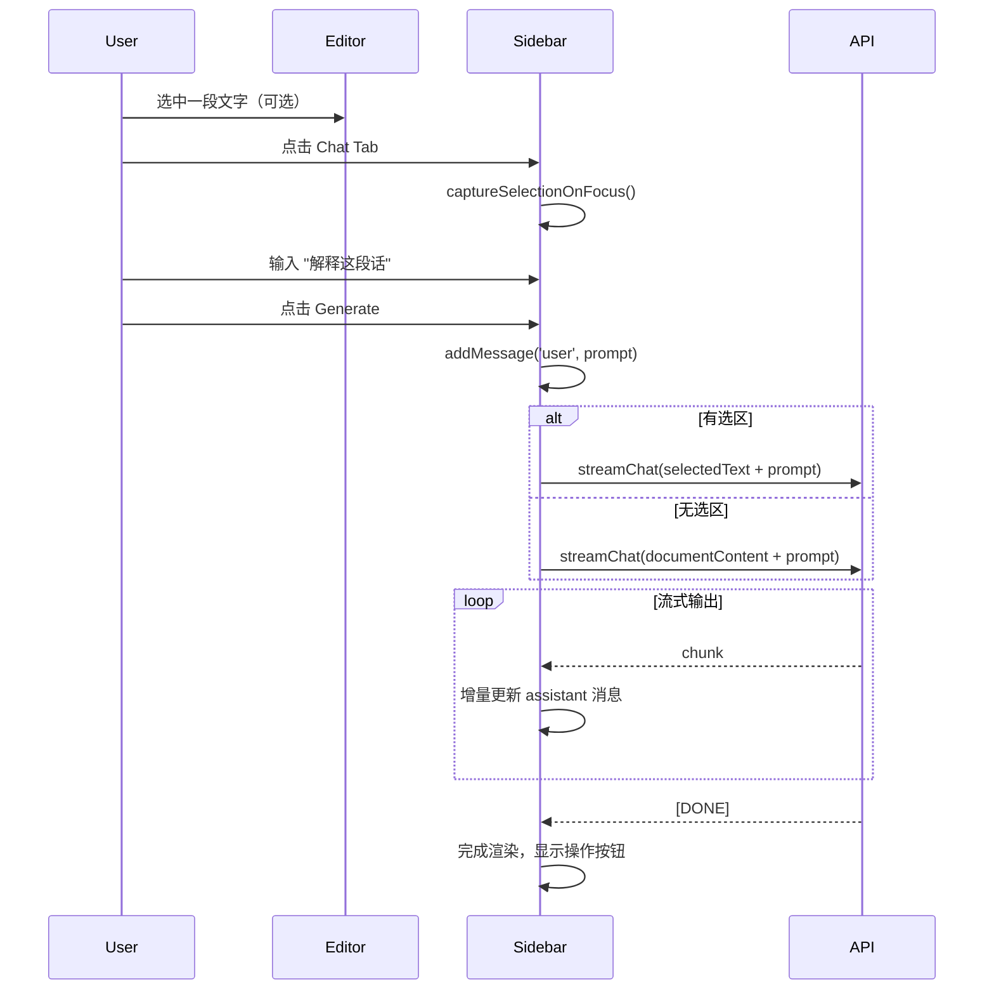

# Chat Mode 设计文档

## 1. 目标 (Goal)

在 Note 侧栏新增 **Chat** 标签页，与现有 Edit/Image 并列，提供纯对话式 AI 交互，不直接修改文档内容。

---

## 2. 需求列表

### 2.1 Chat Tab 基础功能

| 功能 | 描述 | 优先级 |
|------|------|--------|
| Chat 标签页 | 与 Edit/Image 并列，三 Tab 切换 | P0 |
| 流式显示回答 | AI 回复逐字/逐块流式输出 | P0 |
| 选区作为 Context | 有选中文字/图片时自动作为对话上下文 | P0 | < 跟editmode选区行为一致，ai知道选区和全文
| 无选区时使用全文 | 默认将当前文档内容作为背景 | P0 |

**并发与资源共享**：
- **不阻塞其他模式**：Chat 不修改文档，因此 Edit/Image 生成任务进行中时，Chat 仍可正常生成
- **共用 Preset/Model**：Chat 与 Edit 共用 prompt preset 和 AI model 选择（无需单独配置）

### 2.2 消息操作功能

| 功能 | 描述 | 优先级 |
|------|------|--------|
| 删除单条历史 | hover 显示删除按钮，删除单条对话 | P0 |
| 复制单条消息 | hover 显示复制按钮，正确复制 Markdown 格式 | P0 |
| 插入到光标位置 | hover 显示插入按钮，将消息插入文档当前光标处 | P0 |
| 复制所有对话 | 一键复制完整对话历史 | P2 |

### 2.3 非必须 (P2)

| 功能 | 描述 |
|------|------|
| Thinking 处理 | 适配不同 API provider 的 thinking token 格式 |
| 对话导出 | 导出为 Markdown 文件 |

---

## 3. 用例

1. **总结当前文档** - 无选区，询问 "总结这篇文档的主要观点"
2. **基于文档回答问题** - 无选区，询问 "这篇文章中提到的三个关键概念是什么？"
3. **讨论选中内容** - 选中一段文字，询问 "帮我解释这段话的含义"
4. **图片上下文对话** - 选中包含图片的段落，询问 "描述这张图片"

---

## 4. 可复用功能分析 (来自现有 Edit 模式)

### 4.1 已完全实现可直接复用 ✅

| 功能模块 | 所在文件 | 可复用方法/组件 |
|----------|----------|-----------------|
| 选区上下文捕获 | `sidebar-copilot-view.ts` | `captureSelectionOnFocus()`, `capturedContext` |
| 选区高亮保持 | `notes-selection-handler.ts` | `captureSelectionHighlight()`, `clearHighlightForSidebar()` |
| 消息历史管理 | `sidebar-copilot-view.ts` | `ChatMessage` 接口, `chatHistory[]`, `addMessage()` |
| 消息渲染 | `sidebar-copilot-view.ts` | `renderMessage()` |
| Tab 切换机制 | `shared-ui-builder.ts` | `createTabs()`, `TabsElements` |
| 模型选择 | `shared-ui-builder.ts` | `createModelSelectRow()`, `updateModelSelect()` |
| Preset 管理 | `ui/preset-manager.ts` | `PresetManager` 完整实现 |
| API 调用 | `api/api-manager.ts` | `chatCompletion()`, `multimodalChat()` |
| 图片提取 | `utils/image-utils.ts` | `extractDocumentImages()` |
| 键盘隔离 | `shared-ui-builder.ts` | `setupKeyboardIsolation()` |
| 悬浮图标状态同步 | `notes-selection-handler.ts` | `setFloatingButtonGenerating(true/false)` |
| 光标位置插入 | `notes-selection-handler.ts` | Image 模式已实现 `handleImageGeneration()` 中的插入逻辑 |


### 4.2 需要扩展 🔧

| 功能 | 现状 | Chat Mode 需要 |
|------|------|---------------|
| `ModeController` | 支持 `'edit' \| 'image'` 两种模式 | 扩展为 `'edit' \| 'image' \| 'chat'` |
| `createTabs()` | 创建两个 Tab 按钮 | 创建三个 Tab 按钮 |
| `renderMessage()` | 纯文本渲染 | 支持 Markdown 渲染 + 操作按钮 |
| `handleGenerate()` | 返回 JSON 结构化结果 | 返回纯文本对话内容 |
| 流式输出 | 不支持 | 需要流式 API 调用 + 增量渲染 |

### 4.3 需要新增 ➕

| 新功能 | 说明 |
|--------|------|
| `handleChatGenerate()` | Chat 模式专用生成处理，不解析 JSON，直接显示 AI 回复 |
| `streamChatCompletion()` | 流式 API 调用方法 |
| 消息操作按钮组 | 删除/复制/插入三个操作按钮 |
| `insertToDocument()` | 将消息内容插入到文档光标位置（复用 Image 模式 `handleImageGeneration()` 中的实现）|
| `copyAsMarkdown()` | 正确保留 Markdown 格式的复制功能 |

---

## 5. 技术实现

### 5.1 文件修改清单

#### [MODIFY] [mode-controller.ts](file:///f:/CodeProjects/ObsidianCanvasArt/src/notes/mode-controller.ts)
- `PaletteMode` 类型扩展为 `'edit' | 'image' | 'chat'`
- 新增 Chat Tab 切换逻辑

#### [MODIFY] [shared-ui-builder.ts](file:///f:/CodeProjects/ObsidianCanvasAI/src/notes/shared-ui-builder.ts)
- `createTabs()` 支持三 Tab 模式
- `TabsElements` 接口新增 `chatBtn`

#### [MODIFY] [sidebar-copilot-view.ts](file:///f:/CodeProjects/ObsidianCanvasAI/src/notes/sidebar-copilot-view.ts)
- 新增 `handleChatGenerate()` 方法
- 扩展 `renderMessage()` 支持 Markdown + 操作按钮
- 新增消息操作方法：`deleteMessage()`, `copyMessage()`, `insertMessage()`
- 接入流式 API

#### [MODIFY] [api-manager.ts](file:///f:/CodeProjects/ObsidianCanvasAI/src/api/api-manager.ts)
- 新增 `streamChatCompletion()` 流式调用方法
- 或封装回调式流式 API

#### [MODIFY] [en.json](file:///f:/CodeProjects/ObsidianCanvasAI/lang/locale/en.json) / [zh-cn.json](file:///f:/CodeProjects/ObsidianCanvasAI/lang/locale/zh-cn.json)
- 新增 Chat 相关文案

---

### 5.2 Chat 模式流程



---

### 5.3 消息 DOM 结构

```html
<div class="sidebar-chat-message assistant">
  <span class="sidebar-message-role">AI</span>
  <div class="sidebar-message-content markdown-preview">
    <!-- Markdown 渲染内容 -->
  </div>
  <div class="sidebar-message-actions">
    <button class="action-btn" data-action="copy" title="复制">📋</button>
    <button class="action-btn" data-action="insert" title="插入到光标">📝</button>
    <button class="action-btn" data-action="delete" title="删除">🗑️</button>
  </div>
</div>
```

---

## 6. 验证计划

### 6.1 手动验证

1. **Tab 切换**
   - 点击 Chat Tab → 验证 UI 切换正确
   - 验证 Edit/Image/Chat 三 Tab 互斥

2. **基础对话**
   - 无选区，输入 "你好" → 验证 AI 正常回复
   - 验证回复流式显示

3. **选区上下文**
   - 选中一段文字 → 点击 Chat Tab → 输入 "解释这段话"
   - 验证 AI 回复基于选中内容

4. **消息操作**
   - hover 到消息上 → 验证操作按钮显示
   - 点击复制 → 验证剪贴板内容为 Markdown 格式
   - 点击插入 → 验证内容插入到文档光标位置
   - 点击删除 → 验证消息从历史中移除

5. **构建验证**
   ```bash
   npm run build
   npm run lint
   ```

---

## 7. 任务拆分

- [ ] 5.1.1 扩展 `PaletteMode` 类型 + `ModeController` 三 Tab 支持
- [ ] 5.1.2 修改 `createTabs()` 支持三 Tab UI
- [ ] 5.1.3 实现 `handleChatGenerate()` 基础版（无流式）
- [ ] 5.1.4 流式 API 接口 `streamChatCompletion()`
- [ ] 5.1.5 流式渲染 + 增量更新消息
- [ ] 5.1.6 消息操作按钮 + hover 显示逻辑
- [ ] 5.1.7 `copyMessage()` - Markdown 格式复制
- [ ] 5.1.8 `insertMessage()` - 插入到文档光标
- [ ] 5.1.9 `deleteMessage()` - 删除单条消息
- [ ] 5.1.10 i18n 文案补充
- [ ] 5.1.11 构建 + lint 验证