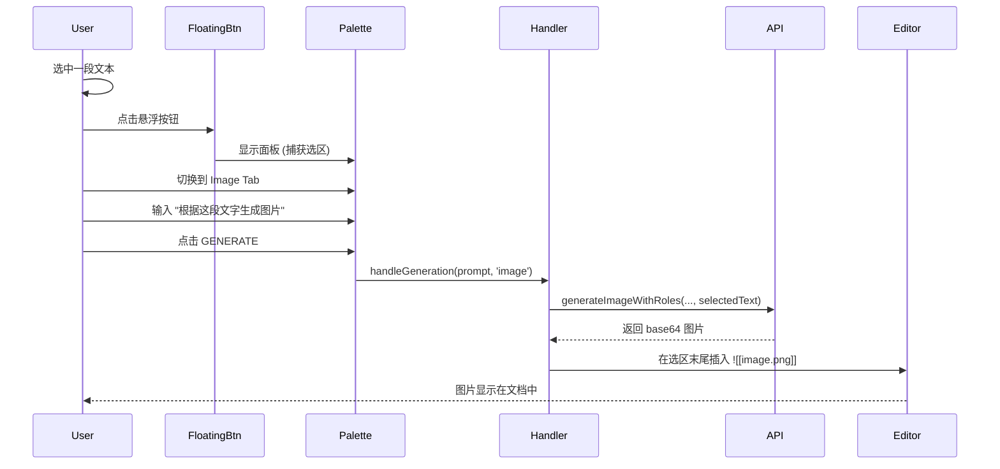
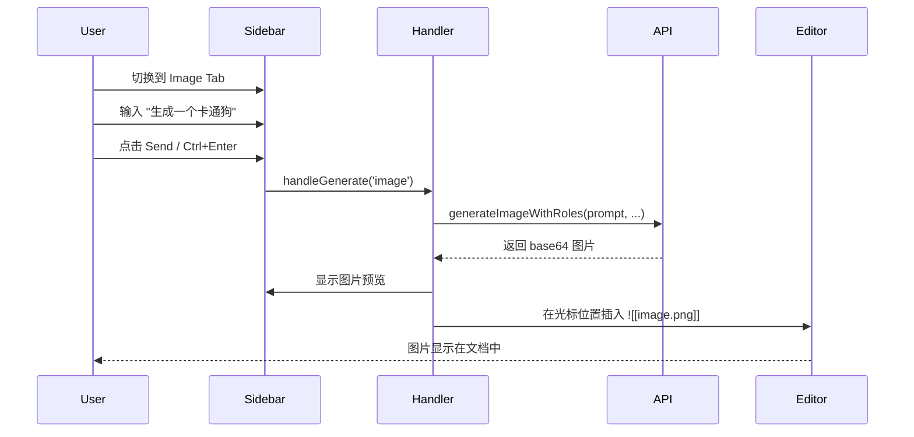

# Note 模式图片生成设计

## 1. 目标 (Goal)

在 Obsidian Notes 编辑器中支持 AI 图片生成功能。用户可以：
1. **悬浮面板模式**：选中文本后，使用选中文本作为上下文，通过 prompt 生成图片并插入到选区末尾。
2. **侧边栏模式**：在侧边栏对话中生成图片，并插入到当前光标位置。


---

## 2. UI 变更

### 2.1 Tab 结构调整

#### 悬浮面板 (NotesEditPalette)
**当前**: 无 Tab，仅 Edit Mode。

**目标**: 增加 2 个 Tab：
- `Edit` (现有功能，AI 编辑选中文本)
- `Image` (新增，AI 图片生成)

```
┌────────────────────────────────────┐
│  [ Edit ]  [ Image ]          [×]  │
├────────────────────────────────────┤
│  Select prompt preset       [+ - ] │
├────────────────────────────────────┤
│  ┌──────────────────────────────┐  │
│  │ Describe the image...       │  │
│  │                              │  │
│  └──────────────────────────────┘  │
├────────────────────────────────────┤
│  (Image Mode Only)                 │
│  Resolution [1K ▼]  Ratio [16:9 ▼] │
│  Model [gemini-pro-image ▼]        │
├────────────────────────────────────┤
│        [ GENERATE ]                │
└────────────────────────────────────┘
```

#### 侧边栏 (SideBarCoPilotView)
**当前**: 无 Tab，仅 Chat 功能。

**目标**: 增加 2 个 Tab：
- `Edit` (对话式文档编辑)
- `Image` (图片生成)

---

### 2.2 Image Mode 控件

| 控件 | 选项 | 默认值 |
|------|------|--------|
| Resolution | 1K / 2K / 4K | 1K |
| Ratio | 1:1, 2:3, 3:2, 3:4, 4:3, 4:5, 5:4, 9:16, 16:9, 21:9 | 16:9 |
| Model | Quick Switch Image Models | 首个配置的模型 |

---

## 3. 交互流程

### 3.1 悬浮面板 - 选中文本生成图片



**关键点**：
1. 选中文本作为 **contextText** 传入 API。
2. 用户 prompt 作为 **instruction** 传入 API。
3. 图片保存到 vault（与 Canvas 模式一致）。
4. 插入位置：选区结束位置之后，新起一行。

---

### 3.2 侧边栏 - 对话式图片生成



**关键点**：
1. 当前文档内容 (可选) 可作为 contextText。
2. 图片插入到 **当前光标位置**。
3. 如果无活跃编辑器，提示错误。

---

## 4. 技术实现

### 4.1 文件修改清单

#### [MODIFY] [notes-edit-palette.ts](file:///f:/CodeProjects/ObsidianCanvasAI/src/notes/notes-edit-palette.ts)
- 添加 Tab 结构 (`edit` / `image`)
- 增加 `currentMode: 'edit' | 'image'` 状态
- Image Mode 时显示 Resolution / Ratio / Model 控件
- 修改 `handleGenerate()` 传递 mode 参数

#### [MODIFY] [sidebar-copilot-view.ts](file:///f:/CodeProjects/ObsidianCanvasAI/src/notes/sidebar-copilot-view.ts)
- 添加 Tab 结构 (`edit` / `image`)
- 增加 `currentMode: 'edit' | 'image'` 状态
- Image Mode 时显示 Resolution / Ratio / Model 控件
- 新增 `handleImageGeneration()` 方法

#### [MODIFY] [notes-selection-handler.ts](file:///f:/CodeProjects/ObsidianCanvasAI/src/notes/notes-selection-handler.ts)
- 修改 `handleGeneration(prompt, mode)` 支持 `'image'` 模式
- 增加 `handleImageGeneration()` 方法，调用 API 并插入图片
- 图片插入逻辑：`editor.replaceRange('\n\n', endPos)`

#### [MODIFY] [settings.ts](file:///f:/CodeProjects/ObsidianCanvasAI/src/settings/settings.ts)
- 增加 `noteImagePresets: PromptPreset[]` (Note 模式 Image Tab 专用预设)
- 增加 `noteImageResolution: string` 和 `noteImageAspectRatio: string`

#### [MODIFY] [styles.css](file:///f:/CodeProjects/ObsidianCanvasAI/styles.css)
- 复用现有 `.canvas-ai-tabs` `.canvas-ai-tab` 样式
- Note 面板特定样式调整 (如更窄的宽度)

---

### 4.2 核心代码逻辑

#### 4.2.1 图片生成流程 (handleImageGeneration)

```typescript
async handleImageGeneration(prompt: string): Promise<void> {
    const { editor, file } = this.lastContext;
    if (!editor || !file) {
        new Notice(t('No active editor'));
        return;
    }

    // 1. 获取选中文本作为 context (如果有)
    const selectedText = editor.getSelection() || '';
    
    // 2. 调用 API
    const options = this.palette.getImageOptions();
    const aspectRatio = this.normalizeAspectRatio(options.aspectRatio);
    const resolution = options.resolution;
    
    const result = await this.apiManager.generateImageWithRoles(
        prompt,                // instruction
        [],                    // inputImages (可扩展：支持 ![[image]] 作为输入)
        selectedText,          // contextText
        aspectRatio,
        resolution
    );
    
    // 3. 保存图片到 vault
    const imagePath = await this.saveImageToVault(result, file);
    
    // 4. 插入到选区末尾
    const endPos = editor.getCursor('to');
    const insertText = `\n![[${imagePath}]]\n`;
    editor.replaceRange(insertText, endPos);
}
```

#### 4.2.2 图片保存逻辑 (复用 Canvas 逻辑)

```typescript
async saveImageToVault(base64DataUrl: string, currentFile: TFile): Promise<string> {
    const timestamp = Date.now();
    const fileName = `ai-generated-${timestamp}.png`;
    
    // 保存到与当前文件相同目录
    const folder = currentFile.parent?.path || '';
    const filePath = folder ? `${folder}/${fileName}` : fileName;
    
    // 转换 base64 并写入
    const base64 = base64DataUrl.replace(/^data:image\/\w+;base64,/, '');
    const binary = atob(base64);
    const bytes = new Uint8Array(binary.length);
    for (let i = 0; i < binary.length; i++) {
        bytes[i] = binary.charCodeAt(i);
    }
    
    await this.app.vault.createBinary(filePath, bytes);
    return fileName;  // 返回相对路径供 ![[]] 使用
}
```

---

### 4.3 选中文本作为 Context

当用户在悬浮面板中使用 Image Mode 时：

| 场景 | Context | Prompt | 结果 |
|------|---------|--------|------|
| 选中 "一只猫在屋顶上" | "一只猫在屋顶上" | "生成图片" | API 收到 context + instruction |
| 选中文字，prompt 为空 | "一只猫在屋顶上" | (默认) "根据上下文生成图片" | 使用选中文字生成 |
| 无选中，直接输入 prompt | (空) | "画一只猫" | 仅使用 prompt |

---

## 5. Settings 扩展

```typescript
interface CanvasAISettings {
    // ... 现有设置 ...
    
    // Note Image Generation
    noteImagePresets: PromptPreset[];      // Image Mode 预设
    noteImageResolution: string;           // 默认 '1K'
    noteImageAspectRatio: string;          // 默认 '16:9'
    noteSelectedImageModel: string;        // Quick Switch 选中的模型
}
```

---

## 6. 限制与边界

1. **仅支持 Markdown 文件**：非 .md 文件不支持图片插入。
2. **图片格式**：统一保存为 PNG。
3. **侧边栏无选区**：侧边栏生成图片时不捕获编辑器选区，仅使用 prompt。
4. **API 超时**：使用 `imageGenerationTimeout` 设置（默认 120s）。

---

## 7. 验证计划

### 7.1 手动验证

1. **悬浮面板 Image Tab**
   - 打开任意 .md 文件
   - 选中一段文字（如 "一只可爱的小狗"）
   - 点击悬浮按钮，切换到 Image Tab
   - 输入 "将这段描述转换为图片"，点击 GENERATE
   - 验证：图片插入到选区末尾

2. **侧边栏 Image Tab**
   - 打开侧边栏，切换到 Image Tab
   - 将光标放在文档中某位置
   - 输入 "生成一只卡通猫"，点击发送
   - 验证：图片插入到光标位置

3. **无选区/无光标测试**
   - 在没有打开任何文件时尝试生成
   - 验证：显示错误提示

4. **构建验证**
   ```bash
   npm run build
   npm run lint
   ```

---

## 8. 未来扩展 (Out of Scope)

- [ ] 支持文档内嵌图片 `![[image.png]]` 作为图片生成的输入参考
- [ ] 图片编辑 (Image-to-Image)
- [ ] 批量生成多张图片
