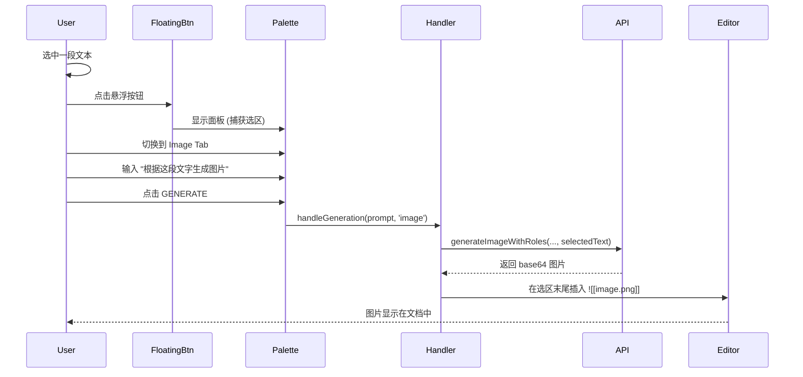
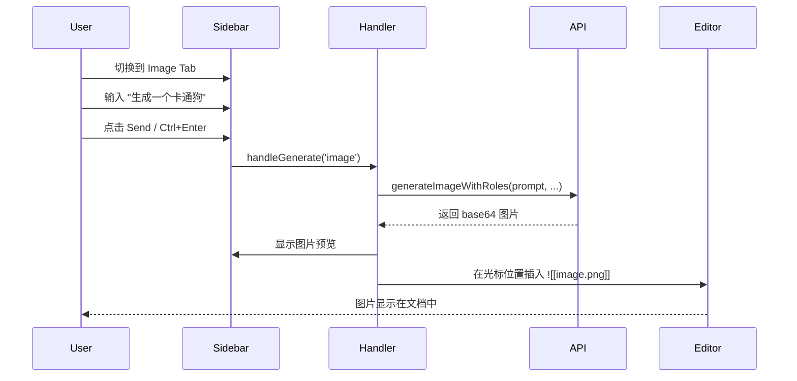
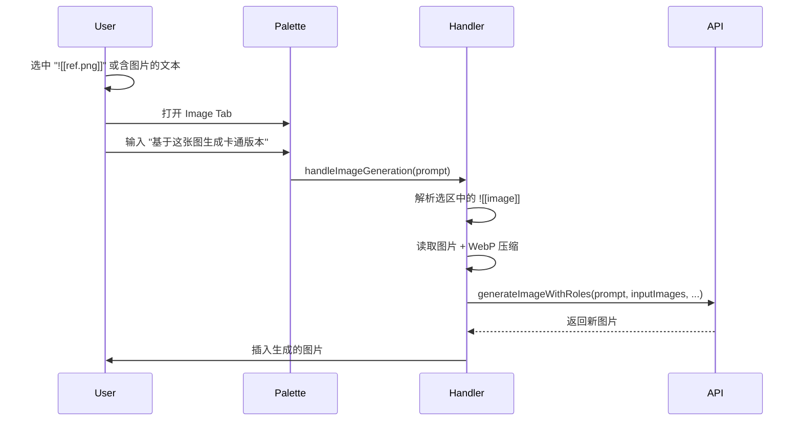
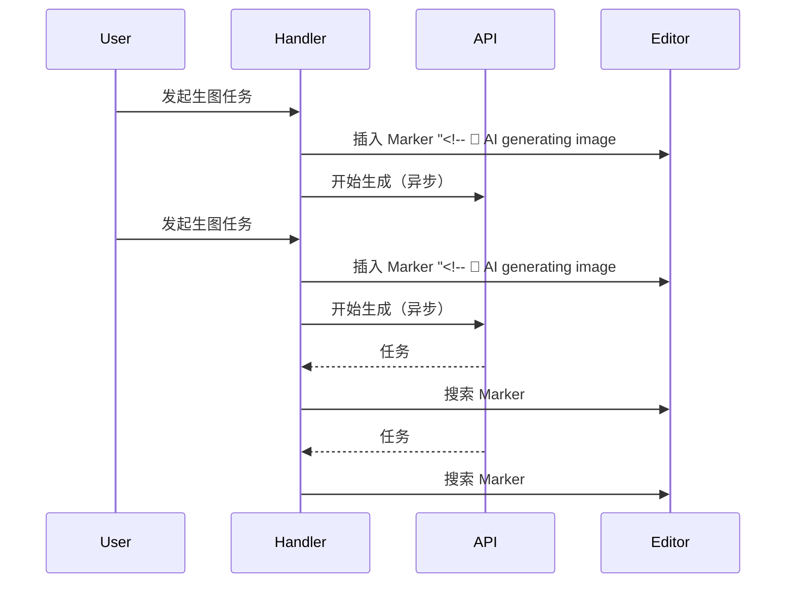

# Note 模式图片生成设计

## 1. 目标 (Goal)

在 Obsidian Notes 编辑器中支持 AI 图片生成功能。用户可以：
1. **悬浮面板模式**：选中文本后，使用选中文本作为上下文，通过 prompt 生成图片并插入到选区末尾。
2. **侧边栏模式**：在侧边栏对话中生成图片，并插入到当前光标位置。


---

## 2. UI 变更

### 2.1 Tab 结构调整

#### 悬浮面板 (NotesEditPalette)
**当前**: 无 Tab，仅 Edit Mode。

**目标**: 增加 2 个 Tab：
- `Edit` (现有功能，AI 编辑选中文本)
- `Image` (新增，AI 图片生成)

```
┌────────────────────────────────────┐
│  [ Edit ]  [ Image ]          [×]  │
├────────────────────────────────────┤
│  Select prompt preset       [+ - ] │
├────────────────────────────────────┤
│  ┌──────────────────────────────┐  │
│  │ Describe the image...       │  │
│  │                              │  │
│  └──────────────────────────────┘  │
├────────────────────────────────────┤
│  (Image Mode Only)                 │
│  Resolution [1K ▼]  Ratio [16:9 ▼] │
│  Model [gemini-pro-image ▼]        │
├────────────────────────────────────┤
│        [ GENERATE ]                │
└────────────────────────────────────┘
```

#### 侧边栏 (SideBarCoPilotView)
**当前**: 无 Tab，仅 Chat 功能。

**目标**: 增加 2 个 Tab：
- `Edit` (对话式文档编辑)
- `Image` (图片生成)

---

### 2.2 Image Mode 控件

| 控件 | 选项 | 默认值 |
|------|------|--------|
| Resolution | 1K / 2K / 4K | 1K |
| Ratio | 1:1, 2:3, 3:2, 3:4, 4:3, 4:5, 5:4, 9:16, 16:9, 21:9 | 16:9 |
| Model | Quick Switch Image Models | 首个配置的模型 |

---

## 3. 交互流程

### 3.1 悬浮面板 - 选中文本生成图片



**关键点**：
1. 选中文本作为 **contextText** 传入 API。
2. 用户 prompt 作为 **instruction** 传入 API。
3. 图片保存到 vault（与 Canvas 模式一致）。
4. 插入位置：选区结束位置之后，新起一行。

---

### 3.2 侧边栏 - 对话式图片生成



**关键点**：
1. 当前文档内容 (可选) 可作为 contextText。
2. 图片插入到 **当前光标位置**。
3. 如果无活跃编辑器，提示错误。

---

## 4. 技术实现

### 4.1 文件修改清单

#### [MODIFY] [notes-edit-palette.ts](file:///f:/CodeProjects/ObsidianCanvasAI/src/notes/notes-edit-palette.ts)
- 添加 Tab 结构 (`edit` / `image`)
- 增加 `currentMode: 'edit' | 'image'` 状态
- Image Mode 时显示 Resolution / Ratio / Model 控件
- 修改 `handleGenerate()` 传递 mode 参数

#### [MODIFY] [sidebar-copilot-view.ts](file:///f:/CodeProjects/ObsidianCanvasAI/src/notes/sidebar-copilot-view.ts)
- 添加 Tab 结构 (`edit` / `image`)
- 增加 `currentMode: 'edit' | 'image'` 状态
- Image Mode 时显示 Resolution / Ratio / Model 控件
- 新增 `handleImageGeneration()` 方法

#### [MODIFY] [notes-selection-handler.ts](file:///f:/CodeProjects/ObsidianCanvasAI/src/notes/notes-selection-handler.ts)
- 修改 `handleGeneration(prompt, mode)` 支持 `'image'` 模式
- 增加 `handleImageGeneration()` 方法，调用 API 并插入图片
- 图片插入逻辑：`editor.replaceRange('\n\n', endPos)`

#### [MODIFY] [settings.ts](file:///f:/CodeProjects/ObsidianCanvasAI/src/settings/settings.ts)
- 增加 `noteImagePresets: PromptPreset[]` (Note 模式 Image Tab 专用预设)
- 增加 `noteImageResolution: string` 和 `noteImageAspectRatio: string`

#### [MODIFY] [styles.css](file:///f:/CodeProjects/ObsidianCanvasAI/styles.css)
- 复用现有 `.canvas-ai-tabs` `.canvas-ai-tab` 样式
- Note 面板特定样式调整 (如更窄的宽度)

---

### 4.2 核心代码逻辑

#### 4.2.1 图片生成流程 (handleImageGeneration)

```typescript
async handleImageGeneration(prompt: string): Promise<void> {
    const { editor, file } = this.lastContext;
    if (!editor || !file) {
        new Notice(t('No active editor'));
        return;
    }

    // 1. 获取选中文本作为 context (如果有)
    const selectedText = editor.getSelection() || '';
    
    // 2. 调用 API
    const options = this.palette.getImageOptions();
    const aspectRatio = this.normalizeAspectRatio(options.aspectRatio);
    const resolution = options.resolution;
    
    const result = await this.apiManager.generateImageWithRoles(
        prompt,                // instruction
        [],                    // inputImages (可扩展：支持 ![[image]] 作为输入)
        selectedText,          // contextText
        aspectRatio,
        resolution
    );
    
    // 3. 保存图片到 vault
    const imagePath = await this.saveImageToVault(result, file);
    
    // 4. 插入到选区末尾
    const endPos = editor.getCursor('to');
    const insertText = `\n![[${imagePath}]]\n`;
    editor.replaceRange(insertText, endPos);
}
```

#### 4.2.2 图片保存逻辑 (复用 Canvas 逻辑)

```typescript
async saveImageToVault(base64DataUrl: string, currentFile: TFile): Promise<string> {
    const timestamp = Date.now();
    const fileName = `ai-generated-${timestamp}.png`;
    
    // 保存到与当前文件相同目录
    const folder = currentFile.parent?.path || '';
    const filePath = folder ? `${folder}/${fileName}` : fileName;
    
    // 转换 base64 并写入
    const base64 = base64DataUrl.replace(/^data:image\/\w+;base64,/, '');
    const binary = atob(base64);
    const bytes = new Uint8Array(binary.length);
    for (let i = 0; i < binary.length; i++) {
        bytes[i] = binary.charCodeAt(i);
    }
    
    await this.app.vault.createBinary(filePath, bytes);
    return fileName;  // 返回相对路径供 ![[]] 使用
}
```

---

### 4.3 选中文本作为 Context

当用户在悬浮面板中使用 Image Mode 时：

| 场景 | Context | Prompt | 结果 |
|------|---------|--------|------|
| 选中 "一只猫在屋顶上" | "一只猫在屋顶上" | "生成图片" | API 收到 context + instruction |
| 选中文字，prompt 为空 | "一只猫在屋顶上" | (默认) "根据上下文生成图片" | 使用选中文字生成 |
| 无选中，直接输入 prompt | (空) | "画一只猫" | 仅使用 prompt |

---

## 5. Settings 说明

> [!NOTE]
> Note 模式的图片生成 **统一复用 Canvas 配置**，无需新增独立设置项。

复用的配置项：

| 配置项 | 说明 |
|--------|------|
| `imagePresets` | Image Mode 预设（共享） |
| `defaultResolution` | 默认分辨率 '1K' |
| `defaultAspectRatio` | 默认宽高比 '1:1' |
| `paletteImageModel` | Quick Switch 选中的 Image 模型 |
| `quickSwitchImageModels` | 可选的 Image 模型列表 |

---

## 6. 限制与边界

1. **仅支持 Markdown 文件**：非 .md 文件不支持图片插入。
2. **图片格式**：统一保存为 PNG。
3. **侧边栏无选区**：侧边栏生成图片时不捕获编辑器选区，仅使用 prompt。
4. **API 超时**：使用 `imageGenerationTimeout` 设置（默认 120s）。

---

## 7. 验证计划

### 7.1 手动验证

1. **悬浮面板 Image Tab**
   - 打开任意 .md 文件
   - 选中一段文字（如 "一只可爱的小狗"）
   - 点击悬浮按钮，切换到 Image Tab
   - 输入 "将这段描述转换为图片"，点击 GENERATE
   - 验证：图片插入到选区末尾

2. **侧边栏 Image Tab**
   - 打开侧边栏，切换到 Image Tab
   - 将光标放在文档中某位置
   - 输入 "生成一只卡通猫"，点击发送
   - 验证：图片插入到光标位置

3. **无选区/无光标测试**
   - 在没有打开任何文件时尝试生成
   - 验证：显示错误提示

4. **构建验证**
   ```bash
   npm run build
   npm run lint
   ```

---

## 8. 未来扩展

### 8.1 [x] 图片输入参考 (Image-to-Image Context)

**目标**：支持选中文档内嵌图片 `![[image.png]]` 作为图片生成的输入参考，实现类似 Canvas 图生图的功能。

#### 交互流程



#### 技术实现

```typescript
// notes-selection-handler.ts - handleImageGeneration 增强
private async handleImageGeneration(prompt: string): Promise<void> {
    // 1. 解析选中文本中的内嵌图片
    const embeddedImages = this.extractEmbeddedImages(selectedText);
    
    // 2. 读取并压缩图片（复用 Canvas 机制）
    const inputImages: ImageContext[] = [];
    for (const imgPath of embeddedImages) {
        const resolved = this.resolveImagePath(file.path, imgPath);
        if (resolved) {
            const imgData = await CanvasConverter.readSingleImageFile(
                this.app,
                resolved,
                settings.imageCompressionQuality,  // WebP 压缩质量
                settings.imageMaxSize               // 最大尺寸限制
            );
            if (imgData) {
                inputImages.push({
                    base64: imgData.base64,
                    mimeType: imgData.mimeType,
                    type: 'image'
                });
            }
        }
    }
    
    // 3. 调用 API（inputImages 作为参考图）
    const result = await localApiManager.generateImageWithRoles(
        instruction,
        inputImages,      // 参考图片
        contextText,       // 文本上下文
        aspectRatio,
        resolution
    );
}

// 提取内嵌图片语法
private extractEmbeddedImages(text: string): string[] {
    const regex = /!\[\[([^\]]+\.(png|jpg|jpeg|gif|webp|bmp))\]\]/gi;
    const matches: string[] = [];
    let match;
    while ((match = regex.exec(text)) !== null) {
        matches.push(match[1]);
    }
    return matches;
}
```

#### 复用模块

| 模块 | 来源 | 功能 |
|------|------|------|
| `CanvasConverter.readSingleImageFile` | `canvas-converter.ts` | 读取图片 + WebP 压缩 |
| `resolveImagePath` | 已在 handler 中实现 | 解析相对/绝对路径 |
| `generateImageWithRoles` | `api-manager.ts` | 支持 inputImages 参数 |

#### 验证计划

1. 选中 `![[photo.png]]` → 输入 "转成水彩风格" → 验证生成的图片基于参考图
2. 选中 "一只猫 ![[cat.jpg]]" → 输入 "生成类似的狗" → 验证同时使用文本和图片上下文
3. 选中多张图片 → 验证最多处理 MAX_IMAGES (14) 张

---


### 8.2 [ ] 生成多张图片（并发任务支持）

#### 目标

支持多个生图任务并发执行。用户可以在文档不同位置发起生图任务，无需等待前一个任务完成。

#### 核心机制：Marker 占位符

**问题**：多个生图任务并发时，任务 A 完成插入图片会改变行号，导致任务 B 无法定位原插入位置。

**解决方案**：启动任务时立即在文档中插入可见的 Marker 占位符，任务完成后搜索 Marker 并替换为图片。

```
Marker 格式：<!-- 🍌 AI generating image #01... -->
```

**流程**：


#### 任务互斥规则

| 当前状态 | 允许操作 | 原因 |
|----------|----------|------|
| 无任何任务 | ✅ Edit / ✅ Image | 正常状态 |
| 生图任务进行中 | ❌ Edit / ✅ Image | Edit 会大幅改动文档，破坏 Marker 位置 |
| AI Edit 进行中 | ❌ Edit / ❌ Image | 避免混合状态冲突 |

#### 超时处理

复用 Canvas 配置项 `imageGenerationTimeout`（默认 120s）。

超时时：
1. 弹出 `Notice` 提示：`图片生成超时，请重试`
2. 从文档中删除对应 Marker
3. 从任务队列中移除该任务

#### 任务上限

新增配置项 `maxParallelImageTasks`（默认 3）。

超过上限时：
- 弹出 `Notice` 提示：`已达到最大并行任务数 (3)，请等待当前任务完成`
- 不启动新任务

#### 悬浮面板状态

| 场景 | 悬浮按钮 | 面板可展开 | Image Tab | Edit Tab | Generate 按钮 |
|------|----------|------------|-----------|----------|---------------|
| 无任务 | 可见 | ✅ | ✅ 可用 | ✅ 可用 | 正常 |
| 生图任务进行中 | 可见 | ✅ | ✅ 可用 | ❌ 禁用 | 显示任务数 badge（如 `2`） |
| AI Edit 进行中 | 生成动画 | ✅ | ❌ 禁用 | ❌ 禁用 | 禁用 |

#### 技术实现

```typescript
interface ImageTask {
    id: string;                    // 唯一 ID，如 '01', '02'
    markerId: string;              // Marker 文本标识
    status: 'generating' | 'completed' | 'failed' | 'timeout';
    startTime: number;
    abortController: AbortController;
}

class NoteImageTaskManager {
    private tasks: Map<string, ImageTask> = new Map();
    private taskCounter = 0;
    
    canStartImageTask(): boolean {
        const max = this.settings.maxParallelImageTasks || 3;
        return this.tasks.size < max && !this.isEditInProgress;
    }
    
    async startTask(editor: Editor, insertPos: EditorPosition, prompt: string): Promise<void> {
        if (!this.canStartImageTask()) {
            new Notice(t('Max parallel tasks reached'));
            return;
        }
        
        // 1. 生成 Marker
        const taskNum = String(++this.taskCounter).padStart(2, '0');
        const markerId = `<!-- 🍌 AI generating image #${taskNum}... -->`;
        const task: ImageTask = {
            id: taskNum,
            markerId,
            status: 'generating',
            startTime: Date.now(),
            abortController: new AbortController()
        };
        this.tasks.set(taskNum, task);
        
        // 2. 插入 Marker 到文档
        editor.replaceRange(`\n${markerId}\n`, insertPos);
        
        // 3. 设置超时
        const timeoutMs = (this.settings.imageGenerationTimeout || 120) * 1000;
        const timeoutId = setTimeout(() => this.handleTimeout(task, editor), timeoutMs);
        
        try {
            // 4. 调用 API
            const result = await this.generateImage(prompt, task.abortController.signal);
            clearTimeout(timeoutId);
            
            // 5. 替换 Marker 为图片
            await this.replaceMarkerWithImage(editor, markerId, result);
            task.status = 'completed';
        } catch (e) {
            clearTimeout(timeoutId);
            if (e.name !== 'AbortError') {
                task.status = 'failed';
                this.removeMarker(editor, markerId);
                new Notice(t('Image generation failed'));
            }
        } finally {
            this.tasks.delete(taskNum);
        }
    }
    
    private replaceMarkerWithImage(editor: Editor, markerId: string, imagePath: string): void {
        const content = editor.getValue();
        const markerIndex = content.indexOf(markerId);
        if (markerIndex === -1) {
            // Marker 被用户删除，放弃插入
            console.warn('Marker not found, skipping image insertion');
            return;
        }
        
        // 计算 Marker 位置并替换
        const beforeMarker = content.substring(0, markerIndex);
        const line = beforeMarker.split('\n').length - 1;
        const startPos = { line, ch: 0 };
        const endPos = { line, ch: markerId.length };
        
        editor.replaceRange(`![[${imagePath}]]`, startPos, endPos);
    }
    
    private handleTimeout(task: ImageTask, editor: Editor): void {
        task.abortController.abort();
        task.status = 'timeout';
        this.removeMarker(editor, task.markerId);
        this.tasks.delete(task.id);
        new Notice(t('Image generation timed out'));
    }
    
    private removeMarker(editor: Editor, markerId: string): void {
        const content = editor.getValue();
        const newContent = content.replace(`\n${markerId}\n`, '\n');
        if (content !== newContent) {
            editor.setValue(newContent);
        }
    }
}
```

#### 复用配置项

| 配置项 | 说明 | 复用来源 |
|--------|------|----------|
| `imageGenerationTimeout` | 生图超时时间（秒） | Canvas 配置 |
| `maxParallelImageTasks` | 最大并行任务数 | **新增**，默认 3 |

#### 验证计划

1. **并发生成测试**
   - 在文档位置 A 发起生图任务 #01
   - 立即在位置 B 发起生图任务 #02
   - 验证两个 Marker 正确显示
   - 验证图片分别插入到正确位置

2. **任务互斥测试**
   - 生图任务进行中，尝试使用 Edit 功能
   - 验证 Edit Tab 显示禁用状态

3. **超时测试**
   - 模拟 API 超时（或设置极短超时时间）
   - 验证超时 Notice 弹出
   - 验证 Marker 被正确删除

4. **上限测试**
   - 连续发起 4 个生图任务（上限 3）
   - 验证第 4 个任务被拒绝并显示提示
