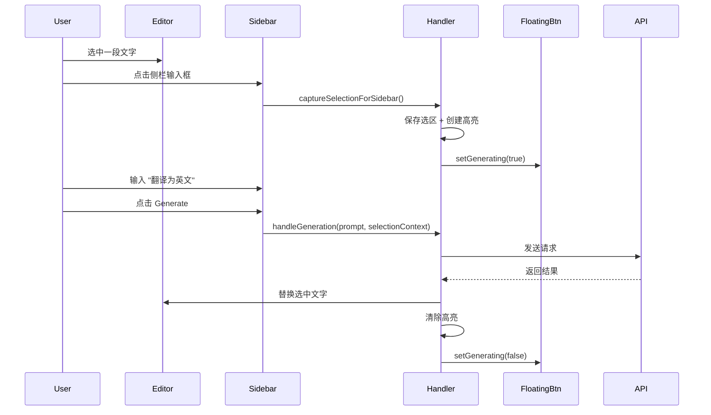

# Note 侧栏与悬浮图标功能增强设计

## 1. 目标 (Goal)

当用户不希望在 Note 中使用悬浮图标时，仅使用侧栏也能实现与悬浮面板完全一致的功能体验。

---

## 2. 需求列表

### 2.1 悬浮图标开关设置

**现状**：悬浮图标始终启用，无法关闭。

**目标**：在设置中增加开关，允许用户选择是否启用 Note Edit 的悬浮图标。

| 配置项 | 类型 | 默认值 | 说明 |
|--------|------|--------|------|
| `noteFloatingIconEnabled` | `boolean` | `true` | 是否启用 Note 编辑悬浮图标 |

**影响文件**：
- [settings.ts](file:///f:/CodeProjects/ObsidianCanvasAI/src/settings/settings.ts) - 新增配置项
- [SettingsTab](待定) - 新增 Toggle UI
- [notes-selection-handler.ts](file:///f:/CodeProjects/ObsidianCanvasAI/src/notes/notes-selection-handler.ts) - 根据设置控制悬浮按钮显示

---

### 2.2 侧栏感知文字选区

**现状**：侧栏 Edit/Image 生成时不感知编辑器选区，仅使用全文内容或当前光标位置。

**目标**：侧栏需要能感知文字选区，与悬浮图标呼出的插件面板行为一致：
- **有选区时**：使用选中文字作为 context 进行编辑/生图
- **无选区时**：行为与目前一致（全文编辑 / 光标位置插入）

**具体场景**：
| 模式 | 有选区 | 无选区 |
|------|--------|--------|
| Edit | 选中文字作为编辑目标 | 全文编辑 |
| Image | 选中文字作为图片生成上下文 | 仅使用 prompt |

**复用逻辑**：
- 悬浮面板已实现 `handleGeneration(prompt, mode)` 和 `handleImageGeneration(prompt)`
- 侧栏可复用 `NotesSelectionHandler` 中的逻辑

---

### 2.3 侧栏选区高亮保持

**现状**：选择文字后点击侧栏，文字选区会消失（编辑器失去焦点）。

**目标**：侧栏需要与悬浮按钮一样的高亮保持功能：
- 点击侧栏时捕获并保持选区高亮
- 使用 `captureSelectionHighlight()` 相同的机制
- 生成完成后清除高亮

**影响文件**：
- [notes-selection-handler.ts](file:///f:/CodeProjects/ObsidianCanvasAI/src/notes/notes-selection-handler.ts) - 扩展高亮捕获逻辑
- [sidebar-copilot-view.ts](file:///f:/CodeProjects/ObsidianCanvasAI/src/notes/sidebar-copilot-view.ts) - 点击时触发高亮捕获

---

### 2.4 侧栏生成任务同步悬浮图标状态

**现状**：仅悬浮面板触发的生成任务会让悬浮图标显示绿香蕉动画。

**目标**：当悬浮图标启用时，侧栏中 Edit/Image 生成任务也需要显示绿香蕉状态：
- 侧栏触发生成 → 悬浮图标显示 `generating` 状态
- 生成完成 → 悬浮图标恢复正常

**实现方式**：
- 侧栏生成时调用 `NotesSelectionHandler.setFloatingButtonGenerating(true)`
- 生成完成时调用 `NotesSelectionHandler.setFloatingButtonGenerating(false)`

---

## 3. 技术实现

### 3.1 文件修改清单

#### [MODIFY] [settings.ts](file:///f:/CodeProjects/ObsidianCanvasAI/src/settings/settings.ts)
- 新增 `noteFloatingIconEnabled: boolean` 配置项
- 默认值 `true`

#### [MODIFY] [settings-tab.ts](file:///f:/CodeProjects/ObsidianCanvasAI/src/settings/settings-tab.ts)
- 新增 "Enable floating icon in notes" Toggle

#### [MODIFY] [notes-selection-handler.ts](file:///f:/CodeProjects/ObsidianCanvasAI/src/notes/notes-selection-handler.ts)
- `showButtonNearSelection()` 增加 `noteFloatingIconEnabled` 判断
- 新增 `setFloatingButtonGenerating(generating: boolean)` 公开方法
- 新增 `captureSelectionForSidebar()` 供侧栏调用

#### [MODIFY] [sidebar-copilot-view.ts](file:///f:/CodeProjects/ObsidianCanvasAI/src/notes/sidebar-copilot-view.ts)
- `handleEditGenerate()` / `handleImageGenerate()` 增加选区感知
- 生成前通知 `NotesSelectionHandler` 悬浮图标状态
- 点击输入框时触发选区捕获

### 3.2 选区感知流程



---

## 4. 补充需求（已确认）

### 4.1 ✅ 侧栏快捷键

新增独立快捷键 "Focus sidebar with selection"：
- 快捷键触发时自动捕获当前选区
- 打开/聚焦侧栏并准备生成

**影响文件**：
- [main.ts](file:///f:/CodeProjects/ObsidianCanvasAI/main.ts) - 注册快捷键
- [notes-selection-handler.ts](file:///f:/CodeProjects/ObsidianCanvasAI/src/notes/notes-selection-handler.ts) - 快捷键处理逻辑

### 4.2 ❌ 侧栏自动展开

当侧栏处于折叠状态时，**不自动展开**，由用户主动打开。

### 4.3 ✅ Tab 同步（已实现）

悬浮面板和侧栏的 Tab 已通过 `NotesSelectionHandler` 实现双向同步，无需额外工作。

### 4.4 ✅ Image 模式图生图

侧栏 Image 模式选中包含 `![[image.png]]` 的文字时，提取图片作为参考：
- 复用 `extractDocumentImages()` 逻辑（已在悬浮面板实现）

---

## 5. 验证计划

### 5.1 手动验证

1. **悬浮图标开关**
   - 关闭开关 → 验证悬浮图标不再显示
   - 开启开关 → 悬浮图标恢复正常

2. **侧栏选区感知 - Edit 模式**
   - 选中一段文字 → 点击侧栏 → 输入 "翻译为英文" → Generate
   - 验证：仅翻译选中的文字，非全文

3. **侧栏选区感知 - Image 模式**
   - 选中 "一只可爱的猫" → 切换到 Image Tab → Generate
   - 验证：图片基于选中文字生成

4. **侧栏选区高亮保持**
   - 选中文字 → 点击侧栏
   - 验证：选区高亮保持可见

5. **悬浮图标状态同步**
   - 在侧栏触发 Edit 生成
   - 验证：悬浮图标显示绿香蕉动画

6. **构建验证**
   ```bash
   npm run build
   npm run lint
   ```

---

## 6. 任务拆分

- [x] 2.1 悬浮图标开关设置 ✅ (已在之前的 commit 完成)
  - [x] `settings.ts` 新增配置项
  - [x] `settings-tab.ts` 新增 Toggle UI
  - [x] `notes-selection-handler.ts` 增加判断逻辑
- [x] 2.2 侧栏感知文字选区 ✅
  - [x] 侧栏获取当前编辑器选区
  - [x] Edit 模式使用选区作为编辑目标
  - [x] Image 模式使用选区作为上下文
  - [x] Image 模式提取选区中的图片（复用 `extractDocumentImages()`）
- [x] 2.3 侧栏选区高亮保持 ✅
  - [x] 点击侧栏时捕获选区
  - [x] 创建持久高亮
  - [x] 生成完成后清除高亮
  - [x] 点击编辑器时清除高亮
- [x] 2.4 侧栏生成任务同步悬浮图标状态 ✅ (已在之前的 commit 完成)
  - [x] 生成开始时设置悬浮图标 generating 状态
  - [x] 生成完成时恢复悬浮图标状态
- [ ] 4.1 侧栏快捷键
  - [ ] `main.ts` 注册快捷键 "Focus sidebar with selection"
  - [ ] 快捷键处理：捕获选区 + 打开侧栏

